# Hermes Setup Install — Step-by-Step

> **Purpose:** Replicate Panomete's Hermes setup on any Windows computer — a new machine (old one broke) or a friend's machine.
> **Target spec:** Hermes desktop app + OpenRouter as main model + **local** searxng (Docker) + `oralita-book-sum-obs` skill + main soul + educator profile.
> **Handoff source:** GitHub repo `github.com/oat431/oralita_md` (public — skills live in `workflow/`, souls in `soul-collection/`). USB copy is the offline fallback.
> **Target paths:** `%LOCALAPPDATA%\hermes` (HERMES_HOME on Windows).

```mermaid
flowchart LR
    A[Step 0: Push repo<br/>on your machine] --> B[Step 1: Install Hermes<br/>PowerShell one-liner]
    B --> C[Step 2: OpenRouter<br/>provider + model]
    C --> D[Step 3: Docker + local searxng]
    D --> E[Step 4: Wire searxng into Hermes]
    E --> F[Step 5: oralita skill<br/>from GitHub]
    F --> G[Step 6: Main soul<br/>from repo]
    G --> H[Step 7: Educator profile]
    H --> I[Step 8: Desktop + verify]
```



---

## Step 0 — Push the repo (on YOUR machine, before going)

The whole handoff is the GitHub repo. Make sure it's current:

```bash
cd 'F:/obsidian_note/oralita_md'
git add -A
git commit -m "chore: update skills/souls/guides"
git push
```

- What lives where: `workflow/oralita-book-sum-obs/` (the skill), `soul-collection/hermes-main-soul.md` (the main soul), `workflow/bok-essential-documents/` (dependency skill).
- ⚠️ Repo is **public** + Unlicense — anything you push is world-readable. Keep personal keys/memories out.
- **Offline fallback (USB):** zip the repo (`git clone` then zip, or copy `workflow/` + `soul-collection/` folders) — steps 5–7 then read from the USB instead of the internet.

---

## Step 1 — Install Hermes (on the target)

Open **PowerShell** (Win+X → Terminal) and run:

```powershell
iex (irm https://hermes-agent.nousresearch.com/install.ps1)
```

What the installer does (no admin needed):
- Installs uv, Python 3.11, Node.js, ripgrep, ffmpeg, and a **portable Git Bash** (MinGit unpacked to `%LOCALAPPDATA%\hermes\git` — isolated from any system Git)
- Everything lands in `%LOCALAPPDATA%\hermes`

Verify:

```powershell
hermes --version
```

> ⚠️ **Windows Defender / antivirus flags `uv.exe`?** False positive on Astral's uv (unsigned Rust binary). Whitelist the folder, not the hash: PowerShell as Admin → `Add-MpPreference -ExclusionPath "$env:LOCALAPPDATA\hermes\bin"`.

---

## Step 2 — OpenRouter as main model

**2.1** Owner creates an OpenRouter account + API key at openrouter.ai → Settings → Keys. **Their key, their responsibility** — never yours, never in a shared file.

**2.2** Run the setup wizard:

```powershell
hermes setup
```

- Pick **OpenRouter** as provider → paste the API key → pick a model (see ladder below).
- Or do it manually:
  ```powershell
  hermes config set model.provider openrouter
  hermes config set model.default <model-id>
  # key goes into %LOCALAPPDATA%\hermes\.env as:
  # OPENROUTER_API_KEY=sk-or-...
  ```
- `hermes model` re-runs the interactive picker anytime.

**2.3 Model ladder** (real OpenRouter prices, fetched 2026-08-06 — re-check at openrouter.ai/models, prices move):

| Tier | Who | Model ID | ≈ price in/out per 1M tokens |
|---|---|---|---|
| Frontier | rich / wants max quality | `anthropic/claude-opus-4.8` | $5 / $25 |
| Frontier | rich / wants max quality | `anthropic/claude-sonnet-5` | $2 / $10 |
| Frontier | rich / wants max quality | `google/gemini-2.5-pro` | $1 / $10 |
| Like me 🎯 | normal budget, Chinese LLM | `deepseek/deepseek-v4-pro` | ~$0 / ~$1 |
| Like me 🎯 | normal budget, Chinese LLM | `qwen/qwen3.7-plus` | ~$1 / ~$1 |
| Like me 🎯 | normal budget, Chinese LLM | `z-ai/glm-4.7-flash` | ≈ $0 |
| Like me 🎯 | normal budget, Chinese LLM | `moonshotai/kimi-k2.5` | $1 / $3 |
| Budget | students / light use | `deepseek/deepseek-v4-flash` | ≈ $0 |
| Budget | students / light use | `qwen/qwen3.7-flash` | ≈ $0 |
| Budget | students / light use | `google/gemini-2.5-flash-lite` | ≈ $0 |

> Real-world reference: your own educator profile runs `z-ai/glm-5.2` on OpenRouter. The `~`-prefixed IDs (e.g. `~anthropic/claude-opus-latest`) track "latest" automatically.

---

## Step 3 — Docker Desktop + local searxng

**3.1 Install Docker Desktop** (free, WSL2 backend):

```powershell
winget install --id Docker.DockerDesktop
```

- Reboot if asked; start Docker Desktop and wait for the whale icon to go steady.
- No WSL2 yet? Docker Desktop offers to install it during first run.

**3.2 Create the searxng folder** (`C:\searxng` — or anywhere):

```powershell
mkdir C:\searxng\core-config
```

**3.3 `C:\searxng\docker-compose.yml`** (official template, `:Z` mount flag removed — that's SELinux-only and breaks on Windows):

```yaml
name: searxng

services:
  core:
    container_name: searxng-core
    image: docker.io/searxng/searxng:${SEARXNG_VERSION:-latest}
    restart: always
    ports:
      - ${SEARXNG_HOST:+${SEARXNG_HOST}:}${SEARXNG_PORT:-7004}:${SEARXNG_PORT:-7004}
    env_file: ./.env
    volumes:
      - ./core-config/:/etc/searxng/
      - core-data:/var/cache/searxng/

  valkey:
    container_name: searxng-valkey
    image: docker.io/valkey/valkey:9-alpine
    command: valkey-server --save 30 1 --loglevel warning
    restart: always
    volumes:
      - valkey-data:/data/

volumes:
  core-data:
  valkey-data:
```

**3.4 `C:\searxng\.env`**:

```ini
SEARXNG_PORT=7004
```

> Port 7004 matches your homelab instance — but this is fully **local**, so it works even if the homelab is dead.

**3.5 `C:\searxng\core-config\settings.yml`** — the **JSON format is required by Hermes**. Minimal override (searxng deep-merges it over defaults):

```yaml
server:
  secret_key: "paste-any-long-random-string-here"

search:
  formats:
    - html
    - json
```

**3.6 Start it:**

```powershell
cd C:\searxng
docker compose up -d
```

**3.7 Verify the JSON API works:**

```powershell
curl "http://127.0.0.1:7004/search?q=test&format=json"
```

Expect a JSON response with `results`. (A 400 `invalid format` = settings.yml not picked up — restart with `docker compose restart`.)

---

## Step 4 — Wire searxng into Hermes

```powershell
hermes config set web.backend searxng
```

Then add to `%LOCALAPPDATA%\hermes\.env`:

```ini
SEARXNG_URL=http://127.0.0.1:7004
```

Verify — ask Hermes: *"search the web for 'what is hermes agent'"* — it should return live results. (No key needed: searxng is the keyless search backend; `web_extract` still needs a keyed provider like tavily/firecrawl.)

---

## Step 5 — Install the oralita-book-sum-obs skill (from GitHub)

Two ways — both install the same skill:

**A) Tap (recommended)** — register the repo as a skill source, then install by name:
```powershell
hermes skills tap add oat431/oralita_md
hermes skills install oralita-book-sum-obs
```

**B) Direct URL** — one-liner, no tap:
```powershell
hermes skills install "https://raw.githubusercontent.com/oat431/oralita_md/main/skills/oralita-book-sum-obs/SKILL.md"
```
> The published copy lives in `skills/`; `workflow/` is the canonical dev copy. Keep them in sync on updates.

Dependency skills (`obsidian`, `bok-essential-documents`, `ocr-and-documents`) ship with Hermes by default — verify they're present; if not, install them the same way from `workflow/`:

```powershell
hermes skills install "https://raw.githubusercontent.com/oat431/oralita_md/main/workflow/bok-essential-documents/SKILL.md"
```

Verify:

```powershell
hermes skills list
```

`oralita-book-sum-obs` must appear. Offline fallback: copy the folder from the USB into `%LOCALAPPDATA%\hermes\skills\<category>\` (folder copy *is* the install).

---

## Step 6 — Install the main soul (from repo)

```powershell
# back up the fresh default first
Copy-Item $env:LOCALAPPDATA\hermes\SOUL.md $env:LOCALAPPDATA\hermes\SOUL.md.default
Invoke-WebRequest "https://raw.githubusercontent.com/oat431/oralita_md/main/soul-collection/hermes-main-soul.md" -OutFile $env:LOCALAPPDATA\hermes\SOUL.md
```

This replaces the default persona with OraMesLita (the router + general helper). Restart Hermes to load it.

---

## Step 7 — Install the educator profile

The educator profile (soul + memories + config) is **not in the repo yet** — two options:

**A) From USB** (if you carry the lean copy):
```powershell
mkdir -Force $env:LOCALAPPDATA\hermes\profiles\educator
Copy-Item D:\hermes-handoff\educator\SOUL.md $env:LOCALAPPDATA\hermes\profiles\educator\
Copy-Item -Recurse D:\hermes-handoff\educator\memories $env:LOCALAPPDATA\hermes\profiles\educator\
Copy-Item D:\hermes-handoff\educator\config.yaml $env:LOCALAPPDATA\hermes\profiles\educator\
```

**B) From repo** (once `profiles/educator/` exists in `oralita_md`):
```powershell
mkdir -Force $env:LOCALAPPDATA\hermes\profiles\educator
Copy-Item -Recurse <clone-or-usb>\profiles\educator\* $env:LOCALAPPDATA\hermes\profiles\educator\
```
> ⚠️ The repo's `config.yaml` is **sanitized** (model block only). MCP servers (GitHub token, local postgres, drawio) are machine-local — set them up per-machine, never commit live credentials.

Make educator the sticky profile (or skip to keep main as default and switch per session):

```powershell
hermes profile use educator
```

Check: `hermes profile list`. Full-fidelity alternative: `hermes profile import <educator.tar.gz>`.

---

## Step 8 — Desktop app + final verification

```powershell
hermes desktop
```

Checklist (in order):

- [ ] `hermes --version` works
- [ ] `hermes doctor` — no red flags
- [ ] Chat test: *"hello"* — responds via OpenRouter (model from Step 2)
- [ ] Search test: *"search the web for X"* — searxng returns live results
- [ ] `hermes skills list` — `oralita-book-sum-obs` present
- [ ] `hermes profile list` — educator present
- [ ] Docker: `docker ps` shows `searxng-core` + `searxng-valkey` running

---

## Troubleshooting

| Symptom | Fix |
|---|---|
| Antivirus flags `uv.exe` | False positive — whitelist `%LOCALAPPDATA%\hermes\bin` folder (see Step 1) |
| `hermes skills install` fails | Check branch is `main` in the URL; check network; retry |
| Push blocked: "Push cannot contain secrets" | A `config.yaml` in the push has live credentials (MCP server env). Sanitize it — keep the model block, strip `mcp_servers` env secrets (see `profiles/educator/config.yaml` for the sanitized pattern) |
| searxng returns `invalid format` | `settings.yml` missing `formats: [html, json]` or not mounted → `docker compose restart` |
| Port 7004 already in use | Change `SEARXNG_PORT` in `.env` **and** `SEARXNG_URL` in Hermes `.env` |
| `docker compose up` fails on WSL | Run Docker Desktop first, wait for engine; `wsl --update` |
| Search works but web page fetch fails | Expected: `web_extract` needs a keyed provider (tavily/firecrawl/exa) — searxng only does search |
| Model responds slow | Switch to a cheaper/faster model from the Step 2 ladder via `hermes model` |

## Maintenance & backup notes

- **The repo IS the backup.** `git push` after any soul/skill/guide change = offsite backup. Update habit: `git add -A && git commit && git push` weekly (or when something changes).
- **Keys are the owner's responsibility.** `OPENROUTER_API_KEY` lives only in `%LOCALAPPDATA%\hermes\.env`. Never share it in chats, logs, or the repo.
- Update Hermes: `hermes update`.
- **Publishing skills:** skills in `workflow/` are already installable from the repo (Step 5). To make them *discoverable* (Vercel-skills style), see the publishing note in the chat thread — `hermes skills publish --to github --repo oat431/oralita_md <skill_path>` is the native command.
