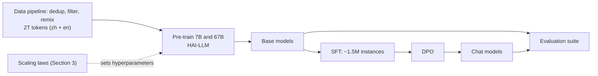

# DeepSeek LLM: Scaling Open-Source Language Models with Longtermism

> *Paper: DeepSeek-AI. "DeepSeek LLM: Scaling Open-Source Language Models with Longtermism." arXiv:2401.02954v1 [cs.CL], 5 Jan 2024. 48 pp. All page numbers below are PDF pages (printed page = PDF page for this source). Main body pp. 1–23; references pp. 23–29; appendix pp. 30–48.*

## TL;DR

This is a technical report that does two things in one: it revisits the scaling laws that decide how a training budget gets spent, then uses those laws to build an open-source model family (7B and 67B) that competes with LLaMA-2 and GPT-3.5. The paper's framing of "longtermism" is its long-term perspective: treat scaling research as a continuing investment so open models keep improving predictably instead of by trial and error (pp. 3, 7, 23).

Three findings carry the paper. First, batch size and learning rate follow their own power laws in the compute budget, so any budget can get near-optimal hyperparameters without a grid search (pp. 8–9). Second, replacing model parameters with non-embedding FLOPs per token (`M`) makes the optimal model/data split fit cleanly, and small-scale experiments predict the loss of models trained at 1000× the compute (pp. 10–12). Third, the optimal split depends on data quality: better data pushes more of the budget into model scale, which plausibly explains why earlier scaling laws disagreed (p. 12).

The models follow: 2T bilingual pre-training tokens, SFT on ~1.5M instances, DPO for conversation. DeepSeek 67B beats LLaMA-2 70B on code, math, reasoning, and Chinese benchmarks; the chat model lands near or above GPT-3.5 on open-ended evaluations (pp. 1, 12–18). The report is also unusually candid: it ran an experiment where multiple-choice data inflated benchmark scores without improving real capability, then refused those gains (pp. 21–22).

## Why This Paper Matters

After LLaMA became the de facto open-model baseline, the community mostly trained fixed sizes (7B to 70B) and left scaling-law research to a few labs. Meanwhile, earlier scaling work (Kaplan et al.; Chinchilla) disagreed on how to split compute between model and data, and neither fully documented the hyperparameters behind its runs, so it was unclear whether the compared models had even been trained near their optimum (pp. 3, 7). This paper argues that reliable scaling science is what lets open models improve continuously, a long-term bet rather than a one-off release (pp. 3, 7, 23).

What makes it worth keeping on the shelf:

- **It calibrates the laws, not just the models.** The three scaling findings (hyperparameters, model/data allocation, data quality) are meant to be reusable methodology, and the paper explicitly frames them as groundwork for future open-source scaling (pp. 3, 8).
- **It documents the trade-offs.** 80/10/10 learning-rate stages, two-stage SFT, DPO with little benchmark movement: the reasoning behind each choice is in the text, not hidden in an appendix.
- **It draws a line on benchmarks.** The multiple-choice experiment (pp. 21–22) is a rare worked example of resisting benchmark inflation, and the conclusion states the stance plainly: "We avoid benchmark decoration and dark secrets in all training stages." (p. 23).

## The Paper at a Glance

| Section | pp. | What it delivers |
|---|---|---|
| §1 Introduction | 3–4 | Motivation, contributions, roadmap |
| §2 Pre-training | 4–7 | Data pipeline, tokenizer, architecture, hyperparameters, infrastructure |
| §3 Scaling laws | 7–12 | The core science: hyperparameter formulas, optimal model/data split, data-quality effect |
| §4 Alignment | 12–13 | SFT and DPO recipe |
| §5 Evaluation | 13–22 | Public benchmarks, open-ended, held-out, safety, and the MC-data discussion |
| §6 Conclusion | 23 | Recap, honest limitations, next steps |
| Appendix | 30–48 | Scale-representation analysis, metric curves, code/math comparisons, DPO table, evaluation prompt formats |

## Pre-Training Essentials

**Data pipeline (pp. 4–5).** Three stages: deduplication, filtering, remixing. Deduplication is aggressive: removing duplicates across all 91 Common Crawl dumps eliminates 89.8% of documents, roughly four times more than a single-dump pass (22.2%, Table 1, p. 4). Filtering scores documents on linguistic and semantic quality to raise information density; remixing rebalances underrepresented domains. The tokenizer is byte-level BPE trained on ~24 GB of multilingual text: 100,000 conventional tokens plus 15 special tokens (100,015 total), with the model vocabulary padded to 102,400 for training efficiency. Numbers are split into individual digits, and pre-tokenization prevents merges across character classes.

**Architecture (p. 5).** Both models follow the LLaMA micro-design: pre-norm with RMSNorm, SwiGLU FFN, Rotary Embedding. The 67B uses Grouped-Query Attention to cut inference cost, and was made deeper (95 layers) rather than wider.

| Spec | 7B | 67B |
|---|---|---|
| Layers | 30 | 95 |
| d_model | 4,096 | 8,192 |
| Heads / KV heads | 32 / 32 | 64 / 8 |
| Context length | 4,096 | 4,096 |
| Sequence batch size | 2,304 | 4,608 |
| Learning rate | 4.2e-4 | 3.2e-4 |
| Pre-training tokens | 2.0T | 2.0T |

**Hyperparameters (pp. 5–6).** Init std 0.006; AdamW with β1 = 0.9, β2 = 0.95, weight decay 0.1; gradient clipping 1.0. The notable choice is a multi-step learning rate schedule instead of cosine: peak LR after 2,000 warmup steps, then down to 31.6% of peak at 80% of tokens, and 10% at 90%. Final quality matches a cosine schedule, but the staged shape lets a first phase be reused when extending training, which the team valued for continued pre-training.

**Infrastructure (pp. 6–7).** HAI-LLM (High-flyer) handles training with data, tensor, sequence, and 1F1B pipeline parallelism, plus flash attention and ZeRO-1; computation and communication are overlapped, bf16 compute is paired with fp32 gradient accumulation, and checkpoints are saved asynchronously every 5 minutes. Training can resume on a different parallel layout. Evaluation uses vLLM for generative tasks.

## Scaling Laws: The Core Contribution

Section 3 is the scientific center of the paper: it re-derives how to spend compute so that every training run lands near its optimum (p. 7).

### Hyperparameter scaling (pp. 8–9)

The authors first fix hyperparameters, because earlier scaling studies left it unclear whether compared models were optimally tuned. Batch size and learning rate matter most, so both were fitted as power laws in compute budget `C`:

- `η_opt = 0.3118 · C^-0.1250` (learning rate)
- `B_opt = 0.2920 · C^0.3271` (batch size)

The procedure: grid search at 1e17 compute; parameters within 0.25% of the minimum generalization error count as near-optimal (the paper leans on the wide redundant band around the optimum); runs from 1e17 to 2e19 reuse the multi-step schedule's first stage; the fitted formulas are then validated at 1e20. Trend: optimal batch size rises with compute, optimal learning rate falls, and the near-optimal region stays wide, so tuning is forgiving. Stated caveat: only `C` was modeled, and the optimum shifts slightly with the model/data allocation at fixed budget.

### Optimal model and data scaling (pp. 9–12)

To split budget between model and data, a cleaner scale representation was needed. With parameters as the scale (non-embedding `N1` from Kaplan-style work, or complete `N2` from Chinchilla-style work), the compute approximation `C ≈ 6ND` misstates cost, with errors reaching 50% at small scales (Table 3, p. 10). The paper instead defines model scale as non-embedding FLOPs per token:

`M = 72 · n_layer · d_model² + 12 · n_layer · d_model · l_seq`

which counts attention overhead but not vocabulary computation, giving the exact relation `C = M · D`. Then, using IsoFLOP profiles (the fitting approach from Chinchilla), 8 compute budgets from 1e17 to 3e20, roughly 10 model/data allocations per budget, and a 100M-token validation set, the optimal allocation exponents come out as:

- `M_opt = 0.1715 · C^0.5243` (model scaling exponent a = 0.5243)
- `D_opt = 5.8316 · C^0.4757` (data scaling exponent b = 0.4757)

For context, refitting under this scheme puts Chinchilla's exponents at 0.49/0.51, close to these numbers. The payoff: the loss curve fitted on small runs predicts the 7B and 67B models (a 1000× jump in compute) accurately (pp. 11–12), so a training schedule can be trusted before it is paid for.

### Data quality moves the target (p. 12)

Fitting the same procedure on three different datasets (early in-house data, current in-house data, OpenWebText2, in increasing order of quality) shifts the exponents systematically:

| Dataset | Model exponent a | Data exponent b |
|---|---|---|
| OpenAI (OpenWebText2) | 0.73 | 0.27 |
| Chinchilla (MassiveText) | 0.49 | 0.51 |
| Ours (early in-house data) | 0.450 | 0.550 |
| Ours (current in-house data) | 0.524 | 0.476 |
| Ours (OpenWebText2) | 0.578 | 0.422 |

As data quality improves, `a` rises and `b` falls: new compute should go to the model more than to the data. This is the paper's explanation for why earlier studies disagreed (0.73/0.27 vs 0.49/0.51): their datasets differed. The authors also suggest the allocation fit doubles as an indirect data-quality probe, and speculate that high-quality data (logical clarity, less predictive difficulty) leaves model capacity as the bottleneck.

## Alignment: SFT and DPO

**Data (p. 12).** ~1.5M instruction instances in English and Chinese: 1.2M helpful instances (31.2% general language, 46.6% math, 22.2% coding) plus 300K safety instances.

**SFT (pp. 12–13, 16–17).** 4 epochs for 7B, 2 for 67B (the larger model overfits faster). The team watched a repetition ratio on 3,868 prompts: it grows with the share of math SFT data, because weaker models struggle to imitate reasoning patterns. Fix: two-stage fine-tuning, where stage 1 uses all data and stage 2 uses conversational data only. For 7B this held benchmark scores, cut repetition from 2.0% to 1.4%, and raised IFEval (instruction following) from 38.0 to 41.2. The 67B was already below 1% repetition after stage 1, so it stayed single-stage.

**DPO (p. 13).** Preference pairs for helpfulness and harmlessness; 1 epoch, LR 5e-6, batch 512. DPO strengthens open-ended generation quality while leaving standard benchmarks essentially unchanged (reinforced by the DPO comparison table in Appendix A.5, p. 32).

## Evaluation Highlights

Setup: roughly thirty public benchmarks spanning English and Chinese (knowledge, reasoning, math, code, reading comprehension); multiple-choice sets are scored by perplexity, generative sets by greedy decoding (pp. 13–14).

**Base models vs LLaMA-2 (Table 5, p. 15; accuracy, higher is better except Pile-test):**

| Benchmark | LLaMA-2 7B | DeepSeek 7B | LLaMA-2 70B | DeepSeek 67B |
|---|---|---|---|---|
| MMLU (5-shot) | 45.8 | 48.2 | 69.0 | 71.3 |
| GSM8K (8-shot) | 15.5 | 17.4 | 58.4 | 63.4 |
| MATH (4-shot) | 2.5 | 6.0 | 13.5 | 18.7 |
| HumanEval (0-shot) | 14.6 | 26.2 | 28.7 | 42.7 |
| MBPP (3-shot) | 21.8 | 39.0 | 45.6 | 57.4 |
| BBH (3-shot) | 38.5 | 39.5 | 62.9 | 68.7 |
| CHID (0-shot) | 37.9 | 89.3 | 55.5 | 92.1 |
| C-Eval (5-shot) | 33.9 | 45.0 | 51.4 | 66.1 |
| CMMLU (5-shot) | 32.6 | 47.2 | 53.1 | 70.8 |
| Pile-test (BPB, lower better) | 0.741 | 0.725 | 0.649 | 0.642 |

English understanding stays comparable to LLaMA-2 despite the bilingual corpus; the large gaps are code, math, reasoning, and Chinese (p. 14). Two observations worth keeping: the 67B's edge over LLaMA-2 70B is bigger than the 7B's edge over LLaMA-2 7B, which the paper attributes to language conflict hitting smaller models harder; and math reasoning transfers across languages (LLaMA-2 does fine on CMath) while idiom-heavy tasks like CHID require actually training on Chinese tokens.

**Chat models.** SFT moves code and math hard: for 67B, HumanEval 42.7 → 73.8 and GSM8K 63.4 → 84.1 (pp. 15–16). Open-ended evaluations: MT-Bench average 8.35, rising to 8.76 after DPO (GPT-3.5-turbo 8.39, GPT-4 9.26), and AlignBench (Chinese, GPT-4 judged) 6.69 for the DPO model, above GPT-3.5 (6.08) and below GPT-4 (8.01) (pp. 17–18).

**Held-out tasks (Table 9, p. 19):**

| Model | LeetCode (pass) | Hungarian exam | IFEval |
|---|---|---|---|
| DeepSeek 7B Chat | 4.7 | 28.5 | 41.2 |
| DeepSeek 67B Chat | 17.5 | 58 | 55.5 |
| Qwen 72B Chat | 12.7 | 52 | 50.8 |
| GPT-4 | 48.4 | 68 | 79.3 |

The point of the held-out section: newer testsets expose small models that look strong on standard benchmarks (ChatGLM3 scores 52.4 on MBPP and 72.3 on GSM8K, then collapses on the new tasks), and total compute shows up clearly in instruction following (p. 19).

**Safety (pp. 19–21).** A 20-person expert team built 2,400 adversarial questions covering discrimination, legal rights, trade secrets, illegal behavior, and other sensitive areas; DeepSeek 67B Chat answered safely in the vast majority (e.g., 486/500, 473/500, 767/800 per category; Table 10). On the Do-Not-Answer dataset it scores 97.8, above ChatGPT (97.7) and GPT-4 (96.5), below Claude (98.3) and LLaMA-2-7B-Chat (99.4) (Table 11).

**The discussion section is the most quotable part (pp. 20–22).**

- **Multiple-choice data is benchmark decoration.** Adding 20M Chinese MCQ instances raised MMLU 49.4 → 60.9, C-Eval 47.0 → 71.3, and CMMLU 49.7 → 73.8, while generative evaluations did not move (TriviaQA flat at 57.9, in-house ChineseQA 75.0 → 74.4). The team excluded MCQ data from both pre-training and fine-tuning, on the grounds that it overfits benchmarks without contributing capability (p. 22).
- **Instruction data in pre-training is mostly a timing choice.** 5M instruction examples added in the last 10% of pre-training improved base benchmarks, but final outcomes matched injecting the same data at SFT; given their no-MCQ stance, they skipped it (p. 22).
- **System prompts scale with model size.** The same system prompt slightly hurt 7B (MT-Bench 7.15 → 7.11) but helped 67B (8.35 → 8.58): the larger model better understands the prompt's intent, the smaller one suffers from train/test mismatch (Table 14, p. 22).

## Limitations and Future Work

The paper's own list (p. 23): no ongoing knowledge updates after pre-training; risk of non-factual output and hallucination; the initial Chinese dataset is not exhaustive, so some Chinese-specific topics suffer; and beyond Chinese and English, language proficiency is "delicate" and should be used with caution. To its credit, the benchmark caveats from Section 5.5 are treated as limitations, not footnotes.

Stated next steps: technical reports on code intelligence and Mixture-of-Experts models; a larger, improved dataset for the next version; and alignment research on reinforcement learning for complex reasoning.

## Practitioner Takeaways (synthesis)

1. **Pick hyperparameters from the budget, not habit.** The two formulas (η_opt, B_opt as functions of C) replace grid searches, and the near-optimal band is wide (pp. 8–9).
2. **Measure model scale in FLOPs per token.** Parameter-based compute estimates (6ND) misstate cost by up to 50% at small scales, which distorts any fitted law (pp. 9–10).
3. **Scaling laws do not transfer across datasets.** Refit on your own data; if your exponents look unusual, suspect data quality before suspecting methodology (p. 12).
4. **Watch what benchmarks reward.** The MCQ experiment is a ready-made case study in eval hygiene: points gained there did not translate to generative quality (pp. 21–22).
5. **Two-stage SFT is cheap insurance for small models.** A conversational-data second stage recovered instruction following and reduced repetition without sacrificing code and math (pp. 16–17).
6. **System prompts are a big-model tool.** Test before shipping: the same prompt helped 67B and slightly hurt 7B (p. 22).
7. **The multi-step LR schedule buys optionality.** Same final quality as cosine, but phase reuse makes continued pre-training cheaper (pp. 5–6).

## Memorable Quotes

> "However, the scaling laws described in previous literature presents varying conclusions, which casts a dark cloud over scaling LLMs." (p. 1)

> "The higher the data quality, the more the increased compute budget should be allocated to model scaling." (p. 8)

> "The results indicate that using small-scale experiments can accurately predict the performance of models with 1000× compute budget." (pp. 11–12)

> "We avoid benchmark decoration and dark secrets in all training stages." (p. 23)

## Related

- Source PDF: `F:/papers/DeepSeek LLM Scaling Open source Language Models with Longtermism.pdf`
- arXiv: https://arxiv.org/abs/2401.02954
- Related vault material: `F:/obsidian_note/ai-knowledge/03_Foundation_Models_and_LLMs/` (transformers, pretraining and alignment, open vs closed model ecosystem)

---

*Summary written 2026-09-20 from arXiv:2401.02954v1, the version matching the source PDF. Page numbers are PDF pages; quotes are verbatim and page-cited; everything else is own-words paraphrase. Section page map verified against the PDF table of contents and page footers.*
