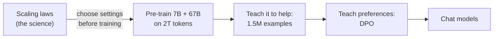

# DeepSeek LLM: Scaling Open-Source Language Models with Longtermism

> *Paper: DeepSeek-AI. "DeepSeek LLM: Scaling Open-Source Language Models with Longtermism." arXiv:2401.02954v1 [cs.CL], 5 Jan 2024. 48 pp. Page numbers below are PDF pages (printed page = PDF page for this source). Main body pp. 1-23; references pp. 23-29; appendix pp. 30-48. Plain-language body first; the dense detail (formulas, tables, quotes) lives in the Appendix at the end.*

## What Is This Paper, In Plain Words

DeepSeek (a Chinese AI lab) wanted to build strong open-source language models, the kind anyone can download, like LLaMA. But instead of just training a model and hoping for the best, they first did the science: they worked out **rules for how to spend a training budget well**, and then used those rules to build their models.

Think of training a big AI model like building a house with a fixed amount of money. You have to decide: how big should the house be (model size), and how much material do you buy (training data)? Spend wrong and you get a worse house for the same money. "Scaling laws" are the formulas that tell you the best split. This paper improves those formulas, and then proves they work by building two models (7 billion and 67 billion parameters) that beat Meta's LLaMA-2 of the same sizes on most tests, especially code, math, and Chinese.

The word "longtermism" in the title is the lab's philosophy: treat this research as a long-term investment. Do the careful science now, publish it, and future models keep getting better in a predictable way instead of by trial and error (pp. 3, 7, 23).

## The Three Ideas That Matter

### Idea 1: The best settings can be calculated, not searched

Training a model involves knobs: how big each batch of data is, how fast the model learns per step (the "learning rate"). Usually people try many settings and keep the best, which wastes a lot of compute. DeepSeek ran careful experiments and found that **the best knob settings follow simple formulas based on your budget**: bigger budget means bigger batches and a slower learning rate, in a smooth, predictable way (pp. 8-9). So before you train, you can just compute good settings. Bonus finding: the "good enough" zone around the best setting is wide, so you don't need to be exact.

### Idea 2: Small experiments can predict huge models

The core question of scaling laws: given a fixed budget, how do you split it between model size and data amount? To answer it cleanly, the paper first fixes a measuring problem. The usual shortcut for estimating a model's compute cost (the "6ND formula") can be off by up to 50% for small models, which corrupts any law you fit with it (pp. 9-10). They propose a better yardstick that counts actual computation per word, and with it the split becomes clean and predictable.

The payoff is the most useful result in the paper: **they fitted the law on small, cheap experiments, and it accurately predicted how models trained with 1000 times more compute would perform** (pp. 11-12). That means a lab can plan a huge training run on paper first, and trust the plan.

### Idea 3: Better data changes the answer

Here is the subtle, clever finding. The "best split" between model size and data is not one universal number. It depends on **how good your data is**. With high-quality data, you should put more of your budget into a bigger model; with messy data, more budget should go into showing the model more tokens (p. 12).

This also explains a famous disagreement in the field: two earlier landmark papers (Kaplan et al. at OpenAI, and Chinchilla at DeepMind) published conflicting splits. DeepSeek shows both were right *for the data they used*. Their datasets had different quality, so they got different optimal splits.

## The Models They Built

Using those rules, they trained two models on 2 trillion tokens of Chinese and English text: a 7B (small) and a 67B (large). Then they taught the models to chat in two steps: first "supervised fine-tuning" (showing the model ~1.5 million examples of good question-answer pairs), then DPO, a technique that teaches the model which of two answers humans prefer.

Results in one line each:

- **DeepSeek 67B beats LLaMA-2 70B** on code, math, reasoning, and Chinese tasks, with slightly fewer parameters (p. 15).
- **DeepSeek 7B beats LLaMA-2 7B** on the same categories, while staying comparable on general English (p. 14).
- **The chat model lands near GPT-3.5** on open-ended judge-scored evaluations, and above it on the Chinese equivalent (pp. 17-18).

```mermaid
flowchart LR
  SL["Scaling laws<br/>(the science)"] -->|"choose settings<br/>before training"| PT["Pre-train 7B + 67B<br/>on 2T tokens"]
  PT --> SFT["Teach it to help:<br/>1.5M examples"]
  SFT --> DPO["Teach preferences:<br/>DPO"]
  DPO --> CHAT["Chat models"]
```

## The Honesty Experiment (my favorite part)

Near the end, the paper describes a tempting trick they **refused** to use (pp. 21-22). Many benchmark tests are multiple choice. If you mix lots of multiple-choice questions into training data, your benchmark scores jump dramatically. They tried it: scores on three big benchmarks shot up by 10 to 25 points. But when they checked tests that require the model to actually *write* answers, nothing improved. The points were fake: the model got better at recognizing benchmark answers, not at knowing things.

So they excluded multiple-choice data from training entirely, and their published scores are lower than they could have been. Their conclusion states the stance plainly: they avoid "benchmark decoration and dark secrets" (p. 23). This section is a rare, documented case of a lab choosing a worse-looking number that is more honest.

## Why You Should Care

1. **If you ever train or fine-tune models:** the hyperparameter formulas and the "small predicts big" method are directly reusable; they turn training from guesswork into planning.
2. **If you read model announcements:** this paper teaches you to ask "compared to what, on whose tests?" The multiple-choice experiment shows how easily a leaderboard number can be inflated without real capability.
3. **If you follow open-source AI:** this is DeepSeek's foundation paper, the one that established their reputation for careful scaling science before the later MoE and reasoning models.

---

# Appendix: The Dense Details

> *Everything below is the reference layer: exact numbers, formulas, tables, and quotes, all page-cited to the PDF. Read the body above first.*

## A. Paper Map

| Section | pp. | What it delivers |
|---|---|---|
| 1 Introduction | 3-4 | Motivation, contributions, roadmap |
| 2 Pre-training | 4-7 | Data pipeline, tokenizer, architecture, hyperparameters, infrastructure |
| 3 Scaling laws | 7-12 | The core science: hyperparameter formulas, optimal model/data split, data-quality effect |
| 4 Alignment | 12-13 | SFT and DPO recipe |
| 5 Evaluation | 13-22 | Public benchmarks, open-ended, held-out, safety, and the MC-data discussion |
| 6 Conclusion | 23 | Recap, honest limitations, next steps |
| Appendix | 30-48 | Scale-representation analysis, metric curves, code/math comparisons, DPO table, evaluation prompt formats |

## B. Scaling Law Formulas (Section 3)

**Hyperparameter scaling (pp. 8-9).** Batch size and learning rate fitted as power laws in compute budget `C`:

- `eta_opt = 0.3118 * C^-0.1250` (learning rate)
- `B_opt = 0.2920 * C^0.3271` (batch size)

Procedure: grid search at 1e17 compute; parameters within 0.25% of the minimum generalization error count as near-optimal (the near-optimal band is wide); runs from 1e17 to 2e19 reuse the multi-step schedule's first stage; formulas validated at 1e20. Caveat stated by the authors: only `C` was modeled, and the optimum shifts slightly with the model/data allocation at fixed budget.

**Model scale representation (pp. 9-10).** Parameter-based compute approximation `C = 6ND` misstates cost with errors up to 50% at small scales (Table 3, p. 10). The paper defines model scale as non-embedding FLOPs per token:

`M = 72 * n_layer * d_model^2 + 12 * n_layer * d_model * l_seq`

which counts attention overhead but not vocabulary computation, giving the exact relation `C = M * D`.

**Optimal allocation (pp. 10-12).** IsoFLOP profiles (Chinchilla's fitting approach), 8 compute budgets from 1e17 to 3e20, roughly 10 model/data allocations per budget, 100M-token validation set:

- `M_opt = 0.1715 * C^0.5243` (model exponent a = 0.5243)
- `D_opt = 5.8316 * C^0.4757` (data exponent b = 0.4757)

Refitting Chinchilla under this scheme puts its exponents at 0.49/0.51, close to these numbers. The fitted loss curve predicts the 7B and 67B models (1000x compute jump) accurately (pp. 11-12).

**Data quality shifts the exponents (p. 12).** Same procedure, three datasets:

| Dataset | Model exponent a | Data exponent b |
|---|---|---|
| OpenAI (OpenWebText2) | 0.73 | 0.27 |
| Chinchilla (MassiveText) | 0.49 | 0.51 |
| Ours (early in-house data) | 0.450 | 0.550 |
| Ours (current in-house data) | 0.524 | 0.476 |
| Ours (OpenWebText2) | 0.578 | 0.422 |

As data quality improves, `a` rises and `b` falls: new compute should go to the model more than to the data. This explains the Kaplan-vs-Chinchilla disagreement (0.73/0.27 vs 0.49/0.51): their datasets differed. The allocation fit doubles as an indirect data-quality probe; the authors speculate that high-quality data (logical clarity, less predictive difficulty) leaves model capacity as the bottleneck.

## C. Pre-Training Specifics (Section 2)

**Data pipeline (pp. 4-5).** Deduplication, filtering, remixing. Deduplication across all 91 Common Crawl dumps eliminates 89.8% of documents, roughly four times more than a single-dump pass (22.2%, Table 1, p. 4). Filtering scores linguistic and semantic quality; remixing rebalances underrepresented domains.

**Tokenizer (p. 5).** Byte-level BPE trained on ~24 GB of multilingual text: 100,000 conventional tokens plus 15 special tokens (100,015 total), vocabulary padded to 102,400 for training efficiency. Numbers split into individual digits; pre-tokenization prevents merges across character classes.

**Architecture (p. 5).** LLaMA micro-design: pre-norm with RMSNorm, SwiGLU FFN, Rotary Embedding. The 67B uses Grouped-Query Attention to cut inference cost and was made deeper (95 layers) rather than wider.

| Spec | 7B | 67B |
|---|---|---|
| Layers | 30 | 95 |
| d_model | 4,096 | 8,192 |
| Heads / KV heads | 32 / 32 | 64 / 8 |
| Context length | 4,096 | 4,096 |
| Sequence batch size | 2,304 | 4,608 |
| Learning rate | 4.2e-4 | 3.2e-4 |
| Pre-training tokens | 2.0T | 2.0T |

**Hyperparameters (pp. 5-6).** Init std 0.006; AdamW with beta1 = 0.9, beta2 = 0.95, weight decay 0.1; gradient clipping 1.0. Multi-step learning rate schedule instead of cosine: peak LR after 2,000 warmup steps, then down to 31.6% of peak at 80% of tokens, and 10% at 90%. Final quality matches cosine, but the staged shape lets a first phase be reused when extending training (valued for continued pre-training).

**Infrastructure (pp. 6-7).** HAI-LLM (High-flyer): data, tensor, sequence, and 1F1B pipeline parallelism, flash attention, ZeRO-1; computation/communication overlap; bf16 compute with fp32 gradient accumulation; asynchronous checkpoints every 5 minutes; training can resume on a different parallel layout. Evaluation uses vLLM for generative tasks.

## D. Alignment Recipe (Section 4)

**Data (p. 12).** ~1.5M instruction instances, English and Chinese: 1.2M helpful (31.2% general language, 46.6% math, 22.2% coding) plus 300K safety instances.

**SFT (pp. 12-13, 16-17).** 4 epochs for 7B, 2 for 67B (larger model overfits faster). Repetition ratio watched on 3,868 prompts; it grows with the share of math SFT data because weaker models struggle to imitate reasoning patterns. Fix: two-stage fine-tuning (stage 1 all data, stage 2 conversational only). For 7B: benchmarks held, repetition cut from 2.0% to 1.4%, IFEval raised from 38.0 to 41.2. The 67B was already below 1% repetition after stage 1, so it stayed single-stage.

**DPO (p. 13).** Preference pairs for helpfulness and harmlessness; 1 epoch, LR 5e-6, batch 512. Strengthens open-ended generation while standard benchmarks stay essentially unchanged (DPO comparison table: Appendix A.5, p. 32).

## E. Evaluation Numbers (Section 5)

Setup: roughly thirty public benchmarks, English and Chinese (knowledge, reasoning, math, code, reading comprehension); multiple-choice scored by perplexity, generative by greedy decoding (pp. 13-14).

**Base models vs LLaMA-2 (Table 5, p. 15; accuracy, higher better except Pile-test):**

| Benchmark | LLaMA-2 7B | DeepSeek 7B | LLaMA-2 70B | DeepSeek 67B |
|---|---|---|---|---|
| MMLU (5-shot) | 45.8 | 48.2 | 69.0 | 71.3 |
| GSM8K (8-shot) | 15.5 | 17.4 | 58.4 | 63.4 |
| MATH (4-shot) | 2.5 | 6.0 | 13.5 | 18.7 |
| HumanEval (0-shot) | 14.6 | 26.2 | 28.7 | 42.7 |
| MBPP (3-shot) | 21.8 | 39.0 | 45.6 | 57.4 |
| BBH (3-shot) | 38.5 | 39.5 | 62.9 | 68.7 |
| CHID (0-shot) | 37.9 | 89.3 | 55.5 | 92.1 |
| C-Eval (5-shot) | 33.9 | 45.0 | 51.4 | 66.1 |
| CMMLU (5-shot) | 32.6 | 47.2 | 53.1 | 70.8 |
| Pile-test (BPB, lower better) | 0.741 | 0.725 | 0.649 | 0.642 |

English understanding stays comparable to LLaMA-2 despite the bilingual corpus; big gaps are code, math, reasoning, Chinese (p. 14). Two observations: the 67B's edge over LLaMA-2 70B is bigger than the 7B's edge over LLaMA-2 7B (language conflict hits smaller models harder), and math reasoning transfers across languages while idiom-heavy tasks like CHID require training on Chinese tokens.

**Chat models (pp. 15-18).** SFT moves code and math hard: 67B HumanEval 42.7 to 73.8, GSM8K 63.4 to 84.1. Open-ended: MT-Bench average 8.35, rising to 8.76 after DPO (GPT-3.5-turbo 8.39, GPT-4 9.26); AlignBench (Chinese, GPT-4 judged) 6.69 for the DPO model, above GPT-3.5 (6.08), below GPT-4 (8.01).

**Held-out tasks (Table 9, p. 19):**

| Model | LeetCode (pass) | Hungarian exam | IFEval |
|---|---|---|---|
| DeepSeek 7B Chat | 4.7 | 28.5 | 41.2 |
| DeepSeek 67B Chat | 17.5 | 58 | 55.5 |
| Qwen 72B Chat | 12.7 | 52 | 50.8 |
| GPT-4 | 48.4 | 68 | 79.3 |

Point of the held-out section: newer testsets expose small models that look strong on standard benchmarks (ChatGLM3 scores 52.4 on MBPP and 72.3 on GSM8K, then collapses on the new tasks), and total compute shows up clearly in instruction following (p. 19).

**Safety (pp. 19-21).** A 20-person expert team built 2,400 adversarial questions covering discrimination, legal rights, trade secrets, illegal behavior, and other sensitive areas; DeepSeek 67B Chat answered safely in the vast majority (e.g., 486/500, 473/500, 767/800 per category; Table 10). Do-Not-Answer dataset: 97.8, above ChatGPT (97.7) and GPT-4 (96.5), below Claude (98.3) and LLaMA-2-7B-Chat (99.4) (Table 11).

**Discussion findings (pp. 20-22), the numbers behind the body's honesty story:**

- **Multiple-choice data is benchmark decoration.** Adding 20M Chinese MCQ instances raised MMLU 49.4 to 60.9, C-Eval 47.0 to 71.3, CMMLU 49.7 to 73.8, while generative evaluations did not move (TriviaQA flat at 57.9, in-house ChineseQA 75.0 to 74.4). MCQ data excluded from both pre-training and fine-tuning (p. 22).
- **Instruction data in pre-training is mostly a timing choice.** 5M instruction examples added in the last 10% of pre-training improved base benchmarks, but final outcomes matched injecting the same data at SFT; given the no-MCQ stance, skipped (p. 22).
- **System prompts scale with model size.** The same system prompt slightly hurt 7B (MT-Bench 7.15 to 7.11) but helped 67B (8.35 to 8.58): the larger model better understands the prompt's intent, the smaller suffers train/test mismatch (Table 14, p. 22).

## F. Limitations and Future Work (p. 23)

The paper's own list: no ongoing knowledge updates after pre-training; risk of non-factual output and hallucination; the initial Chinese dataset is not exhaustive, so some Chinese-specific topics suffer; beyond Chinese and English, language proficiency is "delicate" and should be used with caution. Stated next steps: technical reports on code intelligence and Mixture-of-Experts models; a larger, improved dataset for the next version; alignment research on reinforcement learning for complex reasoning.

## G. Practitioner Takeaways

1. **Pick hyperparameters from the budget, not habit.** The two formulas (eta_opt, B_opt as functions of C) replace grid searches, and the near-optimal band is wide (pp. 8-9).
2. **Measure model scale in FLOPs per token.** Parameter-based compute estimates (6ND) misstate cost by up to 50% at small scales, which distorts any fitted law (pp. 9-10).
3. **Scaling laws do not transfer across datasets.** Refit on your own data; if your exponents look unusual, suspect data quality before suspecting methodology (p. 12).
4. **Watch what benchmarks reward.** The MCQ experiment is a ready-made case study in eval hygiene: points gained there did not translate to generative quality (pp. 21-22).
5. **Two-stage SFT is cheap insurance for small models.** A conversational second stage recovered instruction following and reduced repetition without sacrificing code and math (pp. 16-17).
6. **System prompts are a big-model tool.** Test before shipping: the same prompt helped 67B and slightly hurt 7B (p. 22).
7. **The multi-step LR schedule buys optionality.** Same final quality as cosine, but phase reuse makes continued pre-training cheaper (pp. 5-6).

## H. Memorable Quotes

> "However, the scaling laws described in previous literature presents varying conclusions, which casts a dark cloud over scaling LLMs." (p. 1)

> "The higher the data quality, the more the increased compute budget should be allocated to model scaling." (p. 8)

> "The results indicate that using small-scale experiments can accurately predict the performance of models with 1000x compute budget." (pp. 11-12)

> "We avoid benchmark decoration and dark secrets in all training stages." (p. 23)

## Related

- Source PDF: `F:/papers/DeepSeek LLM Scaling Open source Language Models with Longtermism.pdf`
- arXiv: https://arxiv.org/abs/2401.02954
- Related vault material: `F:/obsidian_note/ai-knowledge/03_Foundation_Models_and_LLMs/` (transformers, pretraining and alignment, open vs closed model ecosystem)

---

*Summary written 2026-09-20, restructured 2026-09-23 into plain-language body + appendix format. From arXiv:2401.02954v1, the version matching the source PDF. Page numbers are PDF pages; quotes are verbatim and page-cited; everything else is own-words paraphrase. Section page map verified against the PDF table of contents and page footers.*
