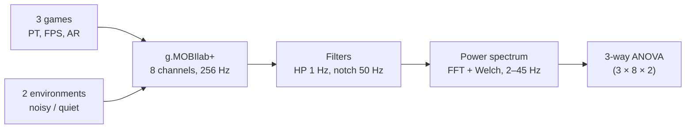

# Examining Brain Activity While Playing Computer Games

> *Paper: Anastasios G. Bakaoukas, Florin Coada, Fotis Liarokapis. "Examining brain activity while playing computer games." Journal on Multimodal User Interfaces (2016) 10:13–29, DOI 10.1007/s12193-015-0205-4. Open access (CC BY 4.0); received 7 July 2014, accepted 20 October 2015, published online 24 November 2015. Page numbers below are the journal's printed pages (13–29); PDF page = printed page − 12.*

## TL;DR

Before consumer headsets made EEG-for-games routine, this study tested a concrete hypothesis with lab-grade equipment: different computer game genres produce different, reproducible brain activity patterns. Twenty one gamers played three genre-distinct games (Minesweeper = puzzle, Quake3 Arena = first-person shooter, Trackmania = arcade racing) while a g.MOBIlab+ recorded EEG from 8 channels at 256 Hz, in two environments (a noisy open-access lab and a quiet controlled one). After artefact cleaning and Welch power-spectrum analysis of the Alpha (relaxation) and Beta (concentration) rhythms, a 3-way ANOVA (environment × sensor × game) showed all three factors significant. Two findings stand out: Quake3 produced both the highest Beta and the highest Alpha (concentration and relaxation rising together), and noisy environments consistently raised Beta across games (pp. 20–27).

## Why This Paper Matters

- **Genre is visible in EEG.** The study provides early empirical support for the claim that game categories map to distinguishable brain activity, an assumption that later BCI-games work builds on (pp. 13, 27).
- **Environment as a factor, not a nuisance.** The noisy-vs-quiet comparison is the most transferable insight: background noise changes measurable brain states, and the paper argues BCI devices will face real environments, so the effect should be studied rather than filtered away and ignored (pp. 26–27).
- **A reusable experiment template.** The design (three games, two environments, eight sensors, fixed filters, ANOVA with interactions) is simple enough to replicate, and the paper is open access, which makes the full procedure checkable (pp. 15–20).
- **Honest about limits.** The authors state plainly that they cannot pinpoint which game properties cause the patterns, and call for one-parameter-at-a-time studies as the next step (pp. 27–28).

## Background in Brief

The paper frames BCI devices in two classes: assistive devices (ADs), such as g.tec's IntendiX spelling system, and entertainment and research devices (ERDs), aimed at gaming and research expansion (p. 14). Related work at the time included: EEG pattern recognition for serious games without controllers; a self-paced BCI virtual-world study where roughly half of untrained participants could control the application with real foot movements and a quarter with imagined ones; a rat's prefrontal recordings driving a web game; a 3D BCI game for ADHD attention training; a tennis game controlled by brain signals; the Affective Pacman frustration study; an SSVEP-based World of Warcraft avatar controller; the BrainHex player-archetype model (a survey of more than 50,000 players); and EEG studies of Mario Power Tennis play (pp. 14–15). The field's honest verdict at the time: BCIs are slower and less accurate than traditional input and often require training, but players find the novel interaction engaging (p. 15).

## The Experiment

### Equipment: g.MOBIlab+ and BCI2000

The recording device was the g.MOBIlab+, an 8-channel EEG system (sensors O1, O2, T7, P3, Cz, P4, T8, Pz in the 10–20 placement system) with low-noise amplifiers and a 16-bit A/D converter sampling at 256 Hz (pp. 15–16). The paper compares it with alternatives: the Emotiv headset (14 channels, but a 30–60 minute profile-creation routine before each trial), MindSet and MindWave (more limited), and Enobio (better wireless signal-to-noise options). The BCI2000 software package, free for non-profit research and used by more than 600 laboratories, handled recording and stimulus detection (pp. 16–17).

The recording chain: high-pass filter with 1 Hz cut-off, notch filter at 50 Hz to reject mains hum, anti-aliasing, digitised at 256 Hz; each recorded epoch spans 66.684 seconds with 17,464 frames (p. 17).

### Three Games, Three Genres

The three games were chosen to be maximally different in genre, audience, visual stimulus, and interaction (pp. 15–16):

| Game | Genre | What it demands |
|---|---|---|
| Minesweeper | Puzzle type (PT) | Educated guesses plus logical steps; widest audience; highest cognitive workload of the three (by the authors' estimate) |
| Quake3 Arena | First-person shooter (FPS) | Constant awareness of enemies, traps, and ammunition; fastest pace and highest visual stimulus |
| Trackmania | Arcade racing (AR) | Active steering and obstacle avoidance to beat lap times |

One deliberate design contrast: Minesweeper and Trackmania require awareness of the whole surrounding environment, while Quake3 rewards focusing tightly on the location of AI-controlled bots (p. 16).

### Two Environments, Deliberately

Recordings happened in a noisy environment (a typical open-access university computer lab) and a quiet one (a controlled-access lab, Coventry University's Games Lab). The purpose was validation: if similar game-specific brain patterns appear under different environmental conditions, the patterns are more credible (p. 17).

### Participants and Procedure

Twenty one participants, twenty male, aged 19–26; ten recorded in the quiet environment and eleven in the noisy one. All were experienced gamers, and each had a few minutes to familiarise with a game before playing (p. 19). Recording sessions started with connectivity checks: participants relaxed, then winked (high-amplitude artefacts near eye channels), then bit their teeth, so poor sensor contact could be caught before data collection (pp. 18–19).

Analysis pipeline: all 8 channels used; epochs fragmented offline into 66.684-second segments; ophthalmic and muscular artefacts removed by visual inspection (cut-offs placed near zero crossings with matching slopes); heavily contaminated epochs rejected, leaving three epochs per user, one per game, per environment, for a final dataset of sixty three logged signals. Processing ran in custom MATLAB software (verified in parallel with EEGLAB) through a low-pass elliptic filter (order 10, pass frequency 50 Hz, stop frequency 60 Hz, stop-band attenuation 60 dB), then an FFT-based power spectrum using the Welch technique with a Hamming window and no phase shift, resolving power density from 2–45 Hz at 1 Hz resolution, averaged across channels per environment and per game (pp. 19–20).

## Results

### Beta: concentration follows game intensity

Beta rhythm (13–30 Hz), associated with active attention and concentration, showed a clear ordering across games: Quake3 highest, then Trackmania, then Minesweeper (pp. 20–24). The interpretation: Quake3 forces constant context awareness to survive (traps, enemies, ammunition); Trackmania demands careful steering around obstacles; Minesweeper is the simplest interaction. Beta magnitudes were also consistently higher in the noisy environment: participants apparently pushed harder to focus on the game and ignore external disturbance. The T7 sensor showed the largest noisy-quiet gap (for Minesweeper, power values ran from about 38 up to 40 units), which the authors read as users eventually giving up trying to concentrate under sustained noise (pp. 20–23).

### Alpha: relaxation contradicts expectations

The Alpha rhythm is a relaxation indicator, and its result is the paper's most interesting surprise: the highest Alpha magnitudes came from Quake3, then Trackmania, then Minesweeper (pp. 20, 23–24). Alpha peaks sat around 10 Hz across signals. This contradicts the initial prediction that the simplest game (Minesweeper) would be the most relaxing: players concentrated hardest on Quake3 yet reported through their EEG the highest relaxation levels as well, which the authors treat as evidence of a distinct engaged state rather than a tension-relaxation trade-off. The cross-environment comparison adds robustness: magnitude levels differ between noisy and quiet recordings, but the signal peaks follow similar distribution patterns, suggesting general game-specific patterns (p. 21).

### The ANOVA: all three factors matter

The formal test was a 3-way ANOVA (3 games × 8 sensors × 2 environments), with significance threshold p = 0.05 (Table 2, p. 27). All three main effects were strongly significant (p printed as 0 in the table): environment F = 58.9, sensor F = 45.95, game F = 40.21. Among interactions, only environment × game was significant (p = 0.0056); environment × sensor (p = 0.2737), sensor × game (p = 0.6879), and the three-way interaction (p = 0.9506) were not. The significant game effect is the hypothesis test the paper set out to run: the three genres genuinely differ in the recorded rhythms, beyond what environment and channel variation explain.

## Discussion and Conclusions

The discussion argues that environmental noise should be treated as a meaningful experimental factor rather than something to sterilise away, since any practical plug-and-play BCI device will operate in noisy rooms (pp. 26–27). It also claims that even this deliberately simple arrangement (three games, a small group of participants) yields useful and accurate results when conditions and analysis are controlled properly, and points to commercial cross-platform games as a future direction (pp. 25–27).

The conclusions confirm the hypothesis: BCI techniques can differentiate brain signals produced while engaging with different computer games. Quake3 produced the highest Beta magnitudes (extra concentration to navigate, avoid hazards, and survive), and the ANOVA confirms the differences (pp. 27–28). But the paper ends with an explicit boundary: signal analysis proves the differences exist, yet it cannot pinpoint what causes them. Candidates include the interaction procedure, the overall game-play, the surrounding environment, and the presence of opponents. The authors' prescription: future studies must vary one parameter at a time (pp. 27–28).

## Limitations

The authors acknowledge: only three games and a modest, male-dominated sample (21 participants, 20 male); single-sensor interpretations carry "a considerably large error window" (p. 22); artefact removal was manual visual inspection, and they note automated artefact-removal algorithms would be needed for more accurate results (p. 19); the causal origin of the game-specific patterns remains unidentified (p. 28).

## Researcher Takeaways (synthesis)

1. **Genre is a real experimental variable.** If you design a BCI-games study, game type belongs in the analysis as a main factor, not as background context.
2. **Relaxation and concentration are not opposites.** The Quake3 result (highest Beta and Alpha together) warns against simple arousal-valence assumptions when interpreting EEG rhythms during play.
3. **Measure the room.** Environment was a significant factor; if you filter it away, you lose information about how real-world conditions shape brain states.
4. **The pipeline is a template.** 8 channels, 256 Hz, 1 Hz high-pass and 50 Hz notch, 66.684-second epochs, manual artefact rejection, Welch FFT, averaging, then a factorial ANOVA with interactions: a complete, replicable recipe for small BCI studies.
5. **Small, clean, and honest beats big and sloppy.** 63 signals and 21 participants were enough for significant main effects because the design and the analysis were disciplined, and the authors said exactly what they could not explain.

## Memorable Quotes

> "The major contribution of the analysis presented is the confirmation of the hypothesis that there is a connection between activities in the brain and the different categories of computer games." (p. 13)

> "if indeed brain activity is different between different computer game genres, must be at the same time similar between different users engaged with the same type of computer game" (p. 14)

> "In summary, evidence strongly suggesting that brain activity follows a different pattern for different categorised computer games was provided." (p. 27)

> "Signal analysis confirms the existence of differences in the brain activity during engagement with different categories of games." (p. 28)

## Related

- Source PDF: `F:/papers/examining-brain-activity-while-playing-computer-games-2016.pdf`
- DOI: https://doi.org/10.1007/s12193-015-0205-4

---

*Summary written 2026-09-21 from the open-access Springer PDF (CC BY 4.0). Page numbers are the journal's printed pages (13–29); PDF page = printed page − 12. Quotes are verbatim and page-cited; everything else is own-words paraphrase.*
