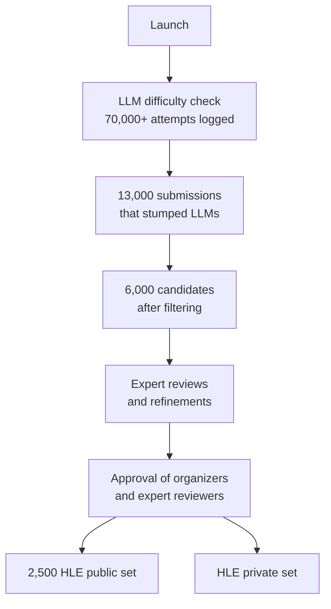

# A benchmark of expert-level academic questions to assess AI capabilities

> *Paper: Center for AI Safety, Scale AI & HLE Contributors Consortium (first author Long Phan; corresponding authors Long Phan and Dan Hendrycks). "A benchmark of expert-level academic questions to assess AI capabilities." Nature, Vol 649, 29 January 2026, pp. 1139–1146 (open access; received 7 May 2025, accepted 25 November 2025, published online 28 January 2026). DOI: 10.1038/s41586-025-09962-4. This is the official publication of Humanity's Last Exam (HLE). Article-body pages are footer-verified; the Methods and Extended Data pages carry no printed folio in this PDF and are cited by section name.*

## TL;DR

Humanity's Last Exam (HLE) is the response to a measurement crisis: state-of-the-art LLMs now score above 90% on popular benchmarks like MMLU, which once marked the frontier, so those benchmarks can no longer distinguish model capabilities. HLE is a multi-modal benchmark of 2,500 expert-level, closed-ended academic questions across over a hundred subjects, written and reviewed globally by nearly 1,000 subject-matter experts from more than 500 institutions. Every question is pre-tested against frontier LLMs and rejected if models can solve it. The result: at release, frontier models scored between 2.7% (GPT-4o) and 8.5% (DeepSeek R1) with RMS calibration errors of 73–89%; later post-release models reached 21.6% (Gemini 2.5 Pro) and 25.3% (GPT-5). The paper is also a benchmark-design treatise: it documents the review pipeline, a private held-out set against gaming, an LLM judge, an estimated 15.4% expert disagreement rate, and a rolling fork (HLE-Rolling) planned for when models saturate this benchmark too.

## Why This Paper Matters

- **It is the current gold standard for measuring expert-level LLM capability**, and the numbers are the ones everyone quotes when arguing about how far models are from human expertise.
- **It solves the saturation problem explicitly.** The benchmark is built adversarially: questions are filtered against frontier models before inclusion, so the dataset measures a moving frontier rather than a fixed one.
- **It is careful about what high scores would mean.** The authors state plainly that high HLE accuracy would show expert-level closed-ended question answering, not autonomous research or AGI.
- **It is a worked example of benchmark engineering**: crowdsourced expert contributions, multi-stage review, private test set, LLM judge with structured output, calibration measurement, and contamination auditing. The pipeline is directly reusable for anyone building evals.
- **It updates your existing notes.** Your `deepseek-llm-scaling-with-longtermism` summary covers DeepSeek's training philosophy; DeepSeek R1's 8.5% on HLE here is the measurement side of that story.

## What HLE Is

- **2,500 questions** across **over a hundred subjects**, grouped into eight high-level categories (Fig. 2, p. 1140):

| Category | Share |
|---|---|
| Math | 41% |
| Biology / Medicine | 11% |
| Computer Science / Artificial Intelligence | 10% |
| Physics | 9% |
| Other | 9% |
| Humanities / Social Science | 9% |
| Chemistry | 7% |
| Engineering | 4% |

- **Two formats:** exact-match questions (model outputs an exact string) and multiple-choice questions (five or more options). 24% are multiple-choice; the remainder are exact-match.
- **Multi-modal:** around 14% of questions require both text and an image (p. 1140).
- **Provenance:** nearly 1,000 subject-expert contributors (mostly professors, researchers, and graduate degree holders) from more than 500 institutions across 50 countries; each question carries the contributor's name and affiliation for accountability.
- **Design criteria:** questions must be precise, unambiguous, solvable, non-searchable, original or non-trivial syntheses, graduate-level or highly specific, with short, verifiable answers. Open-ended, subjective, and weapons-of-mass-destruction content is prohibited (pp. 1139–1140).

## How HLE Was Built

1. **Prize pool.** USD $500,000 total: $5,000 for each of the top 50 questions, $500 for each of the next 500, plus paper co-authorship for anyone with an accepted question (p. 1140).
2. **LLM difficulty check.** Every submission is tested against frontier LLMs first: exact-match questions must stump all models, multiple-choice questions must stump all but one (to absorb lucky guesses). More than 70,000 attempts were logged; about 13,000 questions stumped the models and moved forward (p. 1140).
3. **Two-round expert review.** Round one is iterative refinement by graduate-level reviewers (one to three reviews per question); round two is approval by organizers and expert reviewers (pp. 1139–1140).
4. **Public and private split.** 2,500 questions are released publicly; a private held-out set is kept to assess overfitting and gaming on the public benchmark.

## How Frontier Models Did

**Accuracy (Table 1, p. 1142):**

| Model | Accuracy (%) | Calibration error (%) |
|---|---|---|
| GPT-4o | 2.7 ± 0.6 | 89 |
| Claude 3.5 Sonnet | 4.1 ± 0.8 | 84 |
| Gemini 1.5 Pro | 4.6 ± 0.8 | 88 |
| o1 | 8.0 ± 1.1 | 83 |
| DeepSeek R1 (text-only subset) | 8.5 ± 1.2 | 73 |
| *Post-release:* Claude 4 Sonnet | 7.8 ± 1.1 | 75 |
| *Post-release:* Gemini 2.5 Pro | 21.6 ± 1.6 | 72 |
| *Post-release:* GPT-5 | 25.3 ± 1.7 | 50 |

Three things matter here beyond the low scores:

- **Calibration is broken.** Most models show RMS calibration error above 70%: they answer wrong with high confidence instead of recognizing their own limits. "Models frequently provide incorrect answers with high confidence on HLE, failing to recognize when questions exceed their capabilities." (p. 1142)
- **The non-zero scores are partly noise.** Inference randomness lets models occasionally guess right (or worse than random on multiple-choice); the authors deliberately left these questions in rather than adversarially filtering further, and warn that "small inflections close to zero accuracy are not strongly indicative of progress" (p. 1142).
- **More thinking is not always better.** Accuracy scales log-linearly with output tokens across reasoning models, but the trend reverses after 2^14 tokens: "this trend reverses after 214 tokens, highlighting that a larger reasoning budget is not always optimal" (p. 1142). Future models need raw accuracy *and* computational efficiency.

## What HLE Does Not Measure

- High accuracy would demonstrate expert-level performance on closed-ended, verifiable questions with unambiguous answers, but "would not alone suggest autonomous research capabilities or artificial general intelligence" (p. 1143).
- HLE tests structured academic problems, not open-ended research or creative problem-solving, and is weighted toward math and STEM (Fig. 2).
- The authors intend HLE as a stepping stone toward a new class of benchmarks for dynamic, open-ended AI capabilities, not as the final word (p. 1143).

## Methods Highlights (for the practitioner)

- **Evaluation protocol.** A standardized system prompt asks models for an Explanation, an Answer, and a Confidence score; an LLM judge (o3-mini with structured decoding) verifies the extracted final answer against the correct answer, accounting for equivalent formats such as decimals versus fractions (Methods).
- **Searchability audit.** Questions a search-tool-equipped model could answer but a searchless model could not were manually audited and removed; removing them did not change frontier performance materially (Methods).
- **Expert disagreement.** Two audit rounds of 200-question samples, with student auditors from top universities, produced an estimated 15.4% expert disagreement rate for the public set, in line with other well-known benchmarks. Disagreement is higher in health and medicine (about 18% on a biology, chemistry, and health subset; a single-reviewer methodology would raise that to 25%). The authors explicitly acknowledge that reviewers were not expected to fully verify every solution rationale (Methods).
- **Community feedback loop.** A post-release bug bounty program handles label errors and question-statement errors, each report manually verified with the original author when appropriate (Methods).
- **HLE-Rolling.** A dynamic fork of the dataset will be updated regularly with community feedback and new questions, giving researchers a migration path once frontier models hit the noise ceiling of the original HLE (Methods).
- **Artifacts.** Dataset on Hugging Face (`huggingface.co/datasets/cais/hle`); inference script at `github.com/centerforaisafety/hle`; updates at `lastexam.ai`.

## Takeaways (benchmark design lessons)

1. **Filter against the thing you measure.** Pre-testing questions against frontier models is what keeps HLE from being saturated on day one; it also means the benchmark is a moving target by construction.
2. **Keep a private set.** A public benchmark invites training on it; the held-out set is the honest signal for overfitting and gaming.
3. **Measure calibration, not just accuracy.** A model at 4% accuracy that says "95% confident" is a different risk profile than one that says "I don't know"; the paper's paired reporting of accuracy and RMS calibration error is the template to copy.
4. **LLM judges need structure.** Forcing the judge into structured decoding with explicit fields (extracted answer, reasoning, correctness) makes automated grading auditable at scale.
5. **Report your disagreement rate.** The 15.4% estimate (and its domain variance) is exactly the honesty that most benchmark papers skip, and it calibrates how much to trust any single question.
6. **Plan for your own obsolescence.** HLE-Rolling assumes saturation will come; a benchmark that has a scheduled successor is more useful than one that claims permanence.

## Memorable Quotes

> "Benchmarks are important tools for tracking the rapid advancements in large language model (LLM) capabilities. However, benchmarks are not keeping pace in difficulty" (p. 1139)

> "The stated confidence of a well-calibrated model should match its actual accuracy, for example, achieving 50% accuracy on questions, in which it claims 50% confidence." (p. 1142)

> "Models frequently provide incorrect answers with high confidence on HLE, failing to recognize when questions exceed their capabilities." (p. 1142)

> "High accuracy on HLE would demonstrate expert-level performance on closed-ended, verifiable questions and cutting-edge scientific knowledge, but it would not alone suggest autonomous research capabilities or artificial general intelligence" (p. 1143)

## Related

- Source PDF: `F:/papers/A Benchmark of expert level academic questions to assess AI capabilities.pdf`
- Benchmark site: https://lastexam.ai | DOI: 10.1038/s41586-025-09962-4

---

*Summary written 2026-09-22. Article-body page numbers (1139–1146) are footer-verified against the PDF; Methods and Extended Data are cited by section name because those pages carry no printed folio in this PDF. Quotes are verbatim; everything else is own-words paraphrase. Note: the official journal title is "A benchmark of expert-level academic questions to assess AI capabilities"; the benchmark is commonly known as Humanity's Last Exam (HLE).*
