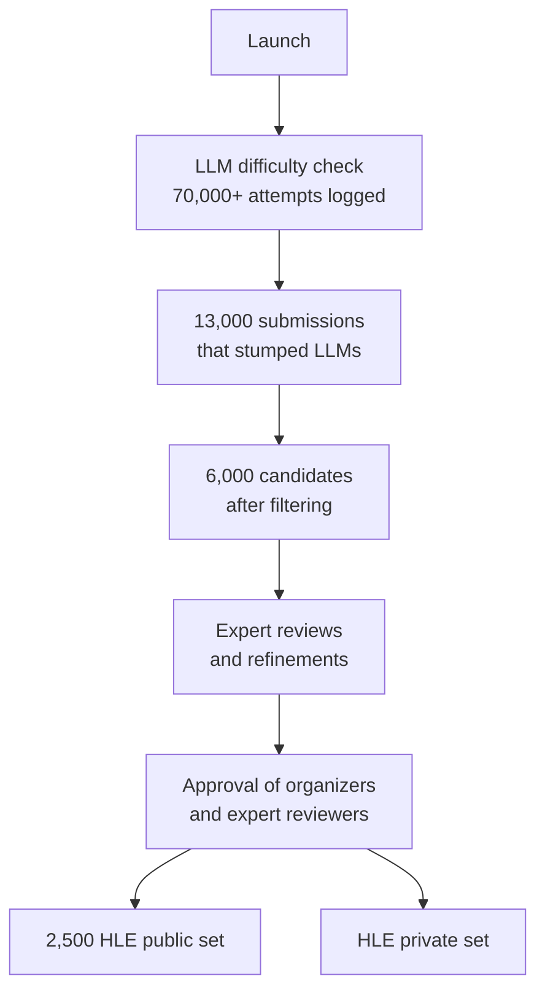

# A benchmark of expert-level academic questions to assess AI capabilities

> *Paper: Center for AI Safety, Scale AI & HLE Contributors Consortium (first author Long Phan; corresponding authors Long Phan and Dan Hendrycks). "A benchmark of expert-level academic questions to assess AI capabilities." Nature, Vol 649, 29 January 2026, pp. 1139–1146 (open access; received 7 May 2025, accepted 25 November 2025, published online 28 January 2026). DOI: 10.1038/s41586-025-09962-4. This is the official publication of Humanity's Last Exam (HLE). Article-body pages are footer-verified; the Methods and Extended Data pages carry no printed folio in this PDF and are cited by section name.*

## What Is This Paper, In Plain Words

Imagine you want to know how smart an AI really is, but every test you have is too easy. That was the situation by 2025. The best models were scoring above 90% on the standard exams the field used to rank them, tests like MMLU that had been genuinely challenging just a few years earlier. When everyone aces the test, the test tells you nothing: you cannot say which model is better, and you cannot say how much room is left before machines match human experts.

Humanity's Last Exam is the answer to that problem, and the name says it all: the deliberately "last exam" for AI. Nearly 1,000 subject-matter experts from more than 500 institutions in 50 countries, mostly professors, researchers, and graduate degree holders, each contributed questions from their own field. In the end, 2,500 questions survived review, spread across over a hundred academic subjects: mathematics, physics, chemistry, biology, medicine, computer science, engineering, the humanities, the social sciences. Every question is closed-ended with a short, checkable answer, and every one was pre-tested against the strongest AI models available and thrown out if a model could solve it. The design goal was brutal simplicity: keep only the questions that stump the best machines but that human experts in their own fields can still answer.

Why build such an exam? Because it gives you a clean measuring stick for the gap between today's AI and real human expertise, and that gap turned out to be enormous. At release, GPT-4o scored 2.7%. The strongest models of early 2025 hovered in single digits; DeepSeek R1 reached 8.5% on the text-only subset. The best machines were answering roughly one question in twelve correctly on problems written specifically so that experts, not machines, could solve them.

Three findings from the paper are worth carrying around:

**First, the scores are climbing fast, but from a tiny base.** The paper tracked models released after the benchmark: Claude 4 Sonnet at 7.8%, Gemini 2.5 Pro at 21.6%, and GPT-5 at 25.3%. That is nearly a tenfold jump from GPT-4o in about a year, yet three quarters of the exam still defeats the best model tested. Progress is real and rapid, and the finish line is still far away. Good measurement lets you say both things at once.

**Second, more thinking is not always better.** Accuracy rises steadily as reasoning models are allowed to produce more tokens, but the trend reverses past a threshold around 2^14 tokens: beyond that, longer chains of thought actually hurt. A bigger reasoning budget is not automatically a better one, which is a genuine surprise and a design constraint for future models. They will need raw accuracy and computational efficiency together.

**Third, the models do not know what they do not know.** Every model on HLE is badly miscalibrated: they attach high confidence to wrong answers instead of recognizing when a question exceeds their capabilities. The paper reports RMS calibration errors of 50% to 89% alongside accuracy, and the pairing is the point. A model that is wrong and confidently so is a different kind of risk than one that is wrong and admits it. Relatedly, even the human experts who reviewed the questions disagreed with each other about 15.4% of the time, a candid admission that puts a floor on how precisely any single score can be interpreted.

The authors are also scrupulous about what the exam does not prove. Their framing is explicitly no-AGI: high accuracy on HLE would demonstrate expert-level performance on closed-ended, verifiable questions, but it "would not alone suggest autonomous research capabilities or artificial general intelligence." HLE measures a real and important capability, and the paper refuses to oversell it.

There is a quieter contribution here too, one practitioners should notice: this is a full worked example of benchmark engineering. It documents the $500,000 prize pool that recruited contributors, the model-based difficulty filter (more than 70,000 logged attempts whittled to about 13,000 submissions that stumped the models, then 6,000 candidates, then the final 2,500), two rounds of human review, a private held-out question set kept back to detect overfitting and gaming, an LLM judge with structured output for automated grading, and a bug bounty for label errors. It even plans for its own obsolescence: a rolling fork called HLE-Rolling will refresh the questions once frontier models saturate this version too. If you ever build an eval, this pipeline is the template to copy.

## Why You Should Care

- **These are the numbers everyone quotes.** When people argue about how close AI is to human expertise, "25.3% on Humanity's Last Exam" is the measurement they are fighting over. Now you know what is behind it: 2,500 expert-written questions that frontier models provably could not solve at submission time, with calibration reported alongside accuracy.
- **It fixes benchmark saturation by construction.** Because every question was filtered against the best models before inclusion, HLE measures a moving frontier rather than a fixed one. That single design choice is why it stayed informative while MMLU became a participation trophy.
- **It models intellectual honesty about what scores mean.** The authors refuse the AGI framing, quantify their own reviewer disagreement (15.4%), and warn that tiny score changes near zero accuracy are mostly noise. That is how capability claims should be made, and how you should read them.
- **It updates the story in your other notes.** Your `deepseek-llm-scaling-with-longtermism` summary covers DeepSeek's training philosophy; DeepSeek R1's 8.5% here is the measurement side of that same story, and R1's 73% calibration error was the best of any model at release.
- **The design lessons transfer.** Pre-filter against the thing you measure, keep a private set, measure calibration not just accuracy, structure your LLM judge, report disagreement, and plan for obsolescence. Those six lessons apply to any eval you will ever build, in any domain.

---

# Appendix: The Dense Details

## What HLE Is

- **2,500 questions** across **over a hundred subjects**, grouped into eight high-level categories (Fig. 2, p. 1140):

| Category | Share |
|---|---|
| Math | 41% |
| Biology / Medicine | 11% |
| Computer Science / Artificial Intelligence | 10% |
| Physics | 9% |
| Other | 9% |
| Humanities / Social Science | 9% |
| Chemistry | 7% |
| Engineering | 4% |

- **Two formats:** exact-match questions (model outputs an exact string) and multiple-choice questions (five or more options). 24% are multiple-choice; the remainder are exact-match.
- **Multi-modal:** around 14% of questions require both text and an image (p. 1140).
- **Provenance:** nearly 1,000 subject-expert contributors (mostly professors, researchers, and graduate degree holders) from more than 500 institutions across 50 countries; each question carries the contributor's name and affiliation for accountability.
- **Design criteria:** questions must be precise, unambiguous, solvable, non-searchable, original or non-trivial syntheses, graduate-level or highly specific, with short, verifiable answers. Open-ended, subjective, and weapons-of-mass-destruction content is prohibited (pp. 1139–1140).

## How HLE Was Built

1. **Prize pool.** USD $500,000 total: $5,000 for each of the top 50 questions, $500 for each of the next 500, plus paper co-authorship for anyone with an accepted question (p. 1140).
2. **LLM difficulty check.** Every submission is tested against frontier LLMs first: exact-match questions must stump all models, multiple-choice questions must stump all but one (to absorb lucky guesses). More than 70,000 attempts were logged; about 13,000 questions stumped the models and moved forward (p. 1140).
3. **Two-round expert review.** Round one is iterative refinement by graduate-level reviewers (one to three reviews per question); round two is approval by organizers and expert reviewers (pp. 1139–1140).
4. **Public and private split.** 2,500 questions are released publicly; a private held-out set is kept to assess overfitting and gaming on the public benchmark.

```mermaid
flowchart TD
  L["Launch"] --> A["LLM difficulty check<br/>70,000+ attempts logged"]
  A --> S["13,000 submissions<br/>that stumped LLMs"]
  S --> C["6,000 candidates<br/>after filtering"]
  C --> R["Expert reviews<br/>and refinements"]
  R --> AP["Approval of organizers<br/>and expert reviewers"]
  AP --> PUB["2,500 HLE public set"]
  AP --> PRIV["HLE private set"]
```

## How Frontier Models Did

**Accuracy (Table 1, p. 1142):**

| Model | Accuracy (%) | Calibration error (%) |
|---|---|---|
| GPT-4o | 2.7 ± 0.6 | 89 |
| Claude 3.5 Sonnet | 4.1 ± 0.8 | 84 |
| Gemini 1.5 Pro | 4.6 ± 0.8 | 88 |
| o1 | 8.0 ± 1.1 | 83 |
| DeepSeek R1 (text-only subset) | 8.5 ± 1.2 | 73 |
| *Post-release:* Claude 4 Sonnet | 7.8 ± 1.1 | 75 |
| *Post-release:* Gemini 2.5 Pro | 21.6 ± 1.6 | 72 |
| *Post-release:* GPT-5 | 25.3 ± 1.7 | 50 |

Three things matter here beyond the low scores:

- **Calibration is broken.** Most models show RMS calibration error above 70%: they answer wrong with high confidence instead of recognizing their own limits. "Models frequently provide incorrect answers with high confidence on HLE, failing to recognize when questions exceed their capabilities." (p. 1142)
- **The non-zero scores are partly noise.** Inference randomness lets models occasionally guess right (or worse than random on multiple-choice); the authors deliberately left these questions in rather than adversarially filtering further, and warn that "small inflections close to zero accuracy are not strongly indicative of progress" (p. 1142).
- **More thinking is not always better.** Accuracy scales log-linearly with output tokens across reasoning models, but the trend reverses after 2^14 tokens: "this trend reverses after 214 tokens, highlighting that a larger reasoning budget is not always optimal" (p. 1142). Future models need raw accuracy *and* computational efficiency.

## What HLE Does Not Measure

- High accuracy would demonstrate expert-level performance on closed-ended, verifiable questions with unambiguous answers, but "would not alone suggest autonomous research capabilities or artificial general intelligence" (p. 1143).
- HLE tests structured academic problems, not open-ended research or creative problem-solving, and is weighted toward math and STEM (Fig. 2).
- The authors intend HLE as a stepping stone toward a new class of benchmarks for dynamic, open-ended AI capabilities, not as the final word (p. 1143).

## Methods Highlights (for the practitioner)

- **Evaluation protocol.** A standardized system prompt asks models for an Explanation, an Answer, and a Confidence score; an LLM judge (o3-mini with structured decoding) verifies the extracted final answer against the correct answer, accounting for equivalent formats such as decimals versus fractions (Methods).
- **Searchability audit.** Questions a search-tool-equipped model could answer but a searchless model could not were manually audited and removed; removing them did not change frontier performance materially (Methods).
- **Expert disagreement.** Two audit rounds of 200-question samples, with student auditors from top universities, produced an estimated 15.4% expert disagreement rate for the public set, in line with other well-known benchmarks. Disagreement is higher in health and medicine (about 18% on a biology, chemistry, and health subset; a single-reviewer methodology would raise that to 25%). The authors explicitly acknowledge that reviewers were not expected to fully verify every solution rationale (Methods).
- **Community feedback loop.** A post-release bug bounty program handles label errors and question-statement errors, each report manually verified with the original author when appropriate (Methods).
- **HLE-Rolling.** A dynamic fork of the dataset will be updated regularly with community feedback and new questions, giving researchers a migration path once frontier models hit the noise ceiling of the original HLE (Methods).
- **Artifacts.** Dataset on Hugging Face (`huggingface.co/datasets/cais/hle`); inference script at `github.com/centerforaisafety/hle`; updates at `lastexam.ai`.

## Takeaways (benchmark design lessons)

1. **Filter against the thing you measure.** Pre-testing questions against frontier models is what keeps HLE from being saturated on day one; it also means the benchmark is a moving target by construction.
2. **Keep a private set.** A public benchmark invites training on it; the held-out set is the honest signal for overfitting and gaming.
3. **Measure calibration, not just accuracy.** A model at 4% accuracy that says "95% confident" is a different risk profile than one that says "I don't know"; the paper's paired reporting of accuracy and RMS calibration error is the template to copy.
4. **LLM judges need structure.** Forcing the judge into structured decoding with explicit fields (extracted answer, reasoning, correctness) makes automated grading auditable at scale.
5. **Report your disagreement rate.** The 15.4% estimate (and its domain variance) is exactly the honesty that most benchmark papers skip, and it calibrates how much to trust any single question.
6. **Plan for your own obsolescence.** HLE-Rolling assumes saturation will come; a benchmark that has a scheduled successor is more useful than one that claims permanence.

## Memorable Quotes

> "Benchmarks are important tools for tracking the rapid advancements in large language model (LLM) capabilities. However, benchmarks are not keeping pace in difficulty" (p. 1139)

> "The stated confidence of a well-calibrated model should match its actual accuracy, for example, achieving 50% accuracy on questions, in which it claims 50% confidence." (p. 1142)

> "Models frequently provide incorrect answers with high confidence on HLE, failing to recognize when questions exceed their capabilities." (p. 1142)

> "High accuracy on HLE would demonstrate expert-level performance on closed-ended, verifiable questions and cutting-edge scientific knowledge, but it would not alone suggest autonomous research capabilities or artificial general intelligence" (p. 1143)

## Related

- Source PDF: `F:/papers/A Benchmark of expert level academic questions to assess AI capabilities.pdf`
- Benchmark site: https://lastexam.ai | DOI: 10.1038/s41586-025-09962-4

---

*Summary written 2026-09-22; restructured into plain-language body plus dense appendix on 2026-09-23. Article-body page numbers (1139–1146) are footer-verified against the PDF; Methods and Extended Data are cited by section name because those pages carry no printed folio in this PDF. Quotes are verbatim; everything else is own-words paraphrase. Note: the official journal title is "A benchmark of expert-level academic questions to assess AI capabilities"; the benchmark is commonly known as Humanity's Last Exam (HLE).*
