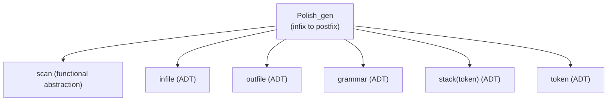

# Programming with Abstract Data Types

> *Paper: Barbara Liskov (MIT Project MAC) and Stephen Zilles (IBM Cambridge Systems Group). "Programming with abstract data types." ACM SIGPLAN Notices 9(4), April 1974 (Proceedings of the ACM SIGPLAN Symposium on Very High Level Languages), pp. 50–59, DOI 10.1145/942572.807045. Page numbers below are the journal's printed pages (50–59); PDF page = printed page − 49. The source PDF is an old scan with an imperfect OCR text layer; quotes were verified modulo OCR artifacts.*

## TL;DR

This is the paper that introduced the term and the concept of the abstract data type. The argument: a language designer cannot foresee every abstraction its users will need, so instead of a bigger built-in vocabulary, the language should provide a mechanism for programmers to define their own. The paper's answer has two halves: a definition (an abstract data type is a class of objects completely characterized by the operations available on them) and a construct (the operation cluster, which packages a hidden representation with the create code and the operations that act on it). Strong typing does the enforcement: users of the type cannot touch its representation. The running example is Polish_gen, an infix-to-postfix translator built from five data abstractions and one functional abstraction, including a stack with type parameters, stack(token), which is parametric polymorphism in 1974. The language described here is a simplified version of the MIT structured programming language that grew into CLU (context, p. 52).

## Why This Paper Matters

- **It names the core abstraction of modern programming.** The interface/implementation split, private fields, module systems, and the rule "program to an interface" all descend from this definition: a type is what its operations do, never how it is represented (p. 51).
- **Enforcement, not advice.** The novel claim is not that hiding details is good (Parnas's information-distribution work appears in the reference list), but that the language should make the representation inaccessible. "the way in which the abstraction is implemented is irrelevant" becomes a compiler-enforced fact (p. 51).
- **Types as parameters in 1974.** The stack cluster takes element_type: type as a parameter, and the operation push carries a type-consistency rule across its arguments. This is parametric polymorphism decades before generics were common, with the paper explicitly discussing type generators and polymorphic operations (pp. 54, 57).
- **The efficiency argument is still the modern one.** The paper separates a program's logical structure from its physical structure and assigns the compiler the job of mapping one to the other, including inline expansion of operations. That is the zero-cost abstraction argument, stated in 1974 (p. 57).
- **It is the seed of CLU.** The simplified language described here is the ancestor of Liskov's CLU, which carried clusters, iterators, and exceptions into the mainstream of language design (context, p. 52).

## The Core Concept

Structured programming asks the programmer to solve a problem by running it on an abstract machine that provides exactly the right data objects and operations. Very-high-level languages try to pre-build those abstractions; the paper's position is that a language should instead let the programmer build them. Procedures already capture part of abstraction (use is relevant, algorithm is irrelevant), but they cannot represent abstract data objects. This leads to the definition:

- An abstract data type defines "a class of abstract objects which is completely characterized by the operations available on those objects" (p. 51).
- Abstract types are meant to behave like built-in types: the user of integer cares about operations, not bit layout, and the language protects him from misuses such as adding an integer to a character (p. 51).
- The difference from a built-in type: an abstract type's realization does not come automatically from the compiler; it is written as an operation cluster, and the language processor links uses to definitions and enforces the type-as-operations view "by a very strong form of data typing" (pp. 51–52).

Operations that do not belong to any type's characterizing set are called functional abstractions and are implemented as ordinary procedures, for example a sine routine expressed in terms of the characterizing operations of the type real (p. 52).

## The Language (a CLU Preview)

The language is a simplified version of the structured programming language then under development at MIT, derived primarily from PASCAL (p. 52). Its design points:

- Two module forms: procedures for functional abstractions and operation clusters for abstract data types; each module compiles independently.
- No free variables in the conventional sense: the only externally defined names are other module names, bound at translation time through a programmer-built directory.
- Only structured control: concatenation, selection (if, case), iteration (while); no gotos or labels. A structured error-handling mechanism is under development, represented only by the reserved word error (p. 52).

## Using Abstract Data Types: the Polish_gen Example

The example problem: write Polish_gen, a general-purpose translator from an infix language with an operator-precedence grammar to Polish postfix (p. 52). The program takes three abstract arguments: input of type infile, output of type outfile, and g of type grammar, and uses local variables of types stack and token, plus the single functional abstraction scan (pp. 52–53).

Three language points worth noting:

- **Declaration syntax separates naming from creation**: `t : token` names a variable with no object created, while `s : stack(token)` creates a stack whose element type is the parameter token, in the same spirit as an array declaration (pp. 52–53).
- **Operation calls are compound names**: `grammar$eof(g)`, `stack$push(s, t)`, `token$is_op(t)`. The type name comes first, and an operation call always has at least one parameter of the type to which the operation belongs. The paper gives three reasons for the prefix: disambiguation when several parameters have different abstract types, freedom for different types to reuse operation names without clashes, and readability (pp. 53–54).
- **The power of the abstractions**: Polish_gen knows nothing about input or output devices, when I/O happens, or how characters are represented. For output it knows only outfile$out_str and outfile$close; for input, infile$get, infile$peek, and infile$eof (p. 54).

## Defining Abstract Data Types: the Cluster

A cluster definition has an interface and a body. The stack cluster's interface is (p. 54):

`stack: cluster(element_type: type) is push, pop, top, erasetop, empty`

The body has three parts (pp. 54–55):

1. **The rep**: a representation type, visible only inside the cluster. The stack's rep is a record with three components: tp (index of the top element), e_type (the element type, stored for type checking), and stk (an unbounded array of elements). Rep parameters allow part of the representation to stay unspecified until an object is created.
2. **The create code**: runs when an object of the type is created. The cluster is viewed as a procedure whose body is the create code; cluster parameters are its parameters, so any parameter information to be retained must be explicitly stored in the rep.
3. **The operation definitions**: like ordinary procedures, but with access to the rep so they can decompose objects. Operations are not modules themselves: the translator accepts them only inside a cluster. Each operation has at least one parameter of type rep, which identifies the object being operated on; across the boundary, that parameter's type changes between the abstract type and rep (p. 55).

Strong typing does real work here: the type of a value pushed onto a stack must match the stack's e_type, and the translator can generate code to verify the match at run time and raise an error if it fails (p. 55).

## Controlling the Use of Information

The token type exists specifically to control access to implementation details. Polish_gen could have been written to accept strings from scan, store strings on the stack, and compare strings via grammar$prec_rel. That would be inefficient: the precedence matrix can be indexed by the positions of operators in the grammar's reserved word table, so an efficient implementation looks up a character string once and uses the index afterward. But doing that exposes the grammar's representation, and if Polish_gen or another module relies on that index, normal maintenance of the grammar cluster can introduce errors that are difficult to track down (p. 55).

With token, a redefinition of the grammar cluster can affect only the token cluster, which makes no assumptions about the index it receives; a precedence-lookup error can only originate in the token or grammar cluster (p. 55). The choice of token representation (integer versus character string) can also be delayed until the token cluster is defined, letting the programmer follow one of Dijkstra's principles: build the program one decision at a time (p. 55).

There is also a proof benefit: the proof of a program splits into a proof that the cluster correctly implements the type, and a proof that the program using the type is correct. Only the former needs implementation details; the latter relies only on abstract properties expressed as relations among the characterizing operations (p. 55).

## Relationship to Previous Work

The paper positions clusters against three strands (pp. 56–57):

- **Extensible languages** define representations (modes) rather than abstractions. Their mode mechanisms correspond to the rep facilities, but the characterizing operations cannot all be defined inside the mode definition; they must be written as separate procedures or macros, so the definition is scattered, two mechanisms must be learned, and access to the representation cannot be restricted to the type's own operations (p. 56).
- **Standard abstract operations** (the work of Mealy, Balzer, and Earley) propose a fixed set of abstract operators, such as create, access, modify, and destroy. The paper's objection: it is unreasonable to expect a predetermined set of operations to suffice for every abstract object. "leaving the selection of the operations to the creator of the type, as is done with operation clusters, provides a more closely tailored abstraction" (p. 56).
- **SIMULA 67 classes** are closest in form, but the philosophical difference matters: class attributes and functions are accessible in the block where the class is defined, so the representation is always known to the user. The rep of a cluster is not accessible outside the cluster; operations are the only way in (p. 57).

## Implementation Considerations

- **Description units**: each module's interface, parameter types, and list of users are recorded in a description unit, addressable through a directory of module names. This supports top-down design (a unit can exist before its module), recursion, delayed definitions, consistency checking at definition time, and even stub simulation for debugging; the directory and file system sit in a MULTICS-like tree-structured file system (pp. 56–57).
- **Type checking**: strong checking is enforced across separately compiled modules. When an object of the cluster's abstract type is passed to one of its operations, its type changes to rep for that cluster: the type checker controls exactly where the representation is visible. User-defined type generators such as stack make some operations polymorphic, with consistency rules like "if the stack is stack of T, the pushed value must be of type T". The design relies on run-time type checking, augmented by as much compile-time checking as possible, and cites Morris's protection technique (from operating-systems work) and the anticipation of Reynolds's complete compile-time checking (pp. 57–58).
- **Retention and efficiency**: activations use a stack discipline; objects live in a heap; all retained or shared information is stored in a rep. Efficiency follows from the separation of logical and physical structure: the compiler's business is to map the good logical structure into a good physical one, replacing operation calls with inline code where profitable. Inline expansion enables standard optimizations (compile-time evaluation, common subexpression elimination) and can eliminate checks such as the stack's empty-check when the surrounding program makes them redundant; the description unit's list of uses enables automatic recompilation when a module changes (pp. 57–58).

## Conclusions

The paper ends by defining its own contribution: a new kind of abstraction, the abstract data type, and a new linguistic construct, the operation cluster, which gives it programming language support. The user needs only the behavior of an abstract object, which is exactly the information needed to write the program; irrelevant implementation detail is hidden and, in fact, unusable, so "programs will be more modular, and easier to understand, modify, maintain, and prove correct" (p. 58). The final claim: a language can never teach a programmer what constitutes a well-designed program, but it can guide him into thinking about the right things, and no language, no matter how high-level, contains all the abstractions any person working in it would require (pp. 58–59).

## Context (external)

The MIT structured programming language described here grew into CLU (Liskov et al., 1977), where the cluster became CLU's central abstraction, with iterators and typed exceptions added. The paper is also the conceptual starting point for much of Liskov's later work on abstraction and substitutability. This context is not in the 1974 text itself.

## Practitioner Takeaways (synthesis)

1. **The 1974 definition is still the best one.** An ADT is its operations; when documentation, a test plan, or an interface spec diverges from that framing, it is usually a warning sign.
2. **Boundaries must be enforced, not requested.** The cluster's contribution over earlier work is that the representation is unusable from outside: this is the ancestor of private fields, module seals, and interface-only dependencies.
3. **Information hiding pays off as change localization.** The token example is a miniature of every "hide the representation behind a type" decision since: change ripples stop at the one cluster that touches the representation.
4. **Types as parameters are old, not new.** If your generic type has a consistency rule across arguments, the stack/push example from 1974 is the pattern in its original form.
5. **Logical and physical structure are different jobs.** Design for understandability; let the compiler and its inline expansion chase efficiency. Profile first, inline second.

## Memorable Quotes

> "What we desire from an abstraction is a mechanism which permits the expression of relevant details and the suppression of irrelevant details." (p. 51)

> "An abstract data type defines a class of abstract objects which is completely characterized by the operations available on those objects." (p. 51)

> "We believe it is the business of the compiler to map good logical structure into good physical structure." (p. 57)

> "Although a language can never teach a programmer what constitutes a well-designed program, it can guide him into thinking about the right things." (p. 58)

> "It is unlikely that any language, no matter how high-level, contains all the abstractions which any person working in it would require." (p. 59)

## Related

- Source PDF: `F:/papers/Programming with Abgstract Data Types.pdf`
- DOI: https://doi.org/10.1145/942572.807045

---

*Summary written 2026-09-21. Page numbers are the journal's printed pages (50–59), footer-verified against the scan. Venue, year, and DOI verified against the ACM Digital Library record. Quotes are verbatim modulo the scan's OCR artifacts (spacing and hyphenation); everything else is own-words paraphrase. The "Context (external)" section is supplemental, not source-derived.*
