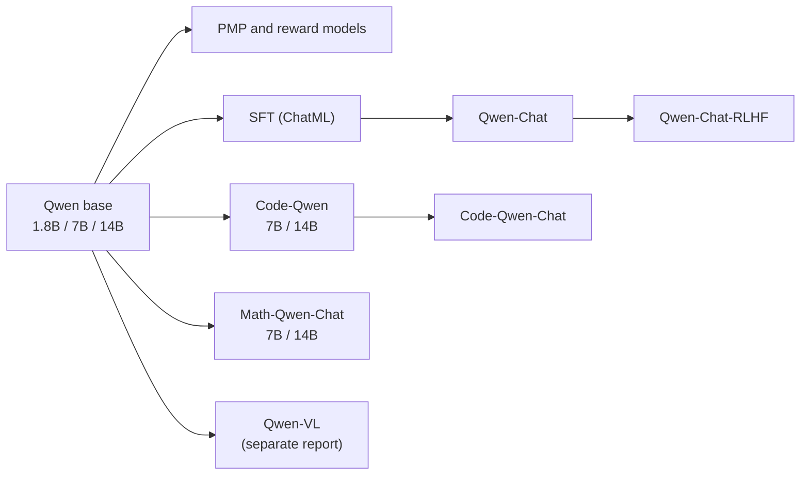

# Qwen Technical Report: Overview

> *Source: "QWEN Technical Report", Qwen Team, Alibaba Group, arXiv:2309.16609v1 [cs.CL], 28 Sep 2023. 59 pp. Page numbers are PDF pages (they match printed pages in this source). This set was split into five notes: content files 01–03, tests file 04, and this overview.*

## What Is This Report?

The first installment of Alibaba's Qwen series (September 2023): base language models at 1.8B, 7B, and 14B parameters, chat models trained with SFT and RLHF, plus domain specialists for code and math. "QWEN" is a moniker from the Chinese Qianwen, meaning "thousands of prompts" and, in the report's phrasing, "the notion of embracing a wide range of inquiries" (p. 3). The pitch: competitive with open-source models and with some proprietary ones, trained from scratch on up to 3 trillion tokens, and unusually complete in engineering detail: data pipeline, hyperparameters, agent benchmarks, and a human-evaluation case gallery. Section 6 (Related Work) is a literature survey that sits outside this summary set, as do the references.

## Model Lineup

| Line | Sizes | What it is |
|---|---|---|
| QWEN (base) | 1.8B / 7B / 14B | Pretrained on up to 3 trillion tokens of Chinese, English, and code |
| QWEN-CHAT (+ RLHF) | same sizes | SFT then RLHF; the 7B and 14B base and chat models were officially released |
| Code-Qwen (+ Chat) | 7B / 14B | Continued code pretraining (about 90 billion tokens) plus multi-stage SFT |
| Math-Qwen-Chat | 7B / 14B | Math instruction tuning |
| Qwen-VL (+ Chat) | - | Multimodal line, released separately (Bai et al., 2023) per p. 4 |

## Headline Numbers

- Up to **3 trillion** pretraining tokens, multilingual with heavy Chinese and English, with an approximately **152K** tokenizer vocabulary (pp. 4–6).
- Base **QWEN-14B beats the previous 13B state of the art on all seven reported benchmarks**, and beats LLaMA2-70B on C-Eval, MATH, and HumanEval (pp. 8–9).
- Chat models: of the compared models, only ChatGPT and LLaMA2-Chat-70B stay ahead on classic benchmarks; human evaluators ranked the RLHF model above both SFT versions yet below GPT-4 overall (pp. 11–13).
- Agents: tool selection 98 versus GPT-4's 95; code-interpreter executability 81.7%; Hugging Face Agent chat mode essentially matching GPT-4 at 14B (pp. 13–15).
- Code: HumanEval 66.4 (Code-Qwen-Chat-14B); Math: GSM8K 69.8, Math401 85.0, Math23K 78.4 (Math-Qwen-Chat-14B); both still behind GPT-4 (pp. 16–20).

## How to Read This Set

| File | What is inside |
|---|---|
| [[01_Pretraining]] | Data pipeline, tokenizer, architecture, training, context extension, base benchmark table |
| [[02_Alignment_and_Agents]] | SFT, RLHF (PMP, reward model, PPO), aligned-model benchmarks, human evaluation, tool use and agents |
| [[03_Specialized_Models]] | Code-Qwen and Math-Qwen: methods and results |
| [[04_Evaluation]] | The tests file: appendix benchmark tables, human-eval case gallery, code-interpreter case study |

Reading paths:

- **Fast orientation**: [[01_Pretraining]] then [[02_Alignment_and_Agents]]
- **Assistant and agent engineering**: [[02_Alignment_and_Agents]] then [[04_Evaluation]]
- **Evaluation-minded**: [[04_Evaluation]], then whichever family file owns each number
- **Source order**: 01 → 02 → 03 → 04

## Core Ideas

1. **Multilingual first**: data and tokenizer designed around Chinese without hurting English or code (pp. 4–6).
2. **A LLaMA-style base with surgical changes**: untied embeddings, FP32 RoPE frequencies, QKV bias for extrapolation, plus inference-time context extension to 8K and beyond without retraining (pp. 6–9).
3. **A fully documented alignment pipeline**: ChatML SFT, preference-model pretraining, reward model, and PPO with alignment-tax mitigation (pp. 9–11).
4. **Agentic ability as a product feature**: ReAct tool use, a Python code interpreter, and Hugging Face agents are trained and benchmarked as first-class goals (pp. 13–16).
5. **Specialization without losing the generalist core**: domain models continue from the generalist base on purpose (pp. 16–20).
6. **Evaluation honesty**: human evaluation with case studies, explicit acknowledgment that classic benchmarks under-measure chat models, and cases where Qwen loses published next to ones where it wins (pp. 12–13, 40–59).

## Memorable Quotes

> "QWEN is a comprehensive language model series that encompasses distinct models with varying parameter counts." (p. 3)

> "QWEN is a moniker that derives from the Chinese phrase Qianwen, which translates to "thousands of prompts" and conveys the notion of embracing a wide range of inquiries." (p. 3)

## Related

- Set files: [[01_Pretraining]], [[02_Alignment_and_Agents]], [[03_Specialized_Models]], [[04_Evaluation]]
- Sibling summary: [[deepseek-llm-scaling-with-longtermism]] (DeepSeek LLM scaling-laws paper)
- Source PDF: `F:/papers/Qwen Technical Report.pdf`; official code and weights: `https://github.com/QwenLM/Qwen` (released with the report, p. 4)

---

*Summary written 2026-09-20 from arXiv:2309.16609v1, the version matching the source PDF. Page numbers are PDF pages; quotes are verbatim and page-cited; everything else is own-words paraphrase.*
