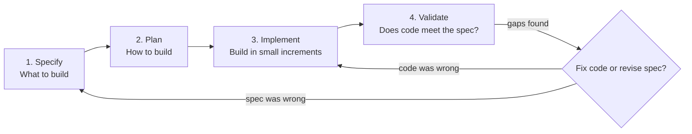

# Spec-Driven Development: From Code to Contract in the Age of AI Coding Assistants

> *Paper: Deepak Babu Piskala (Seattle, USA). "Spec-Driven Development: From Code to Contract in the Age of AI Coding Assistants." Technical report, arXiv:2602.00180v1 [cs.SE], 30 Jan 2026. 8 pp. Page numbers are PDF pages (they match printed pages in this source).*

## TL;DR

Spec-driven development flips the classic order: specifications become the source of truth, and code becomes a generated or verified secondary artifact. This is a practitioner's guide, not an empirical study, and its value is in the structure it gives a fuzzy topic: three rigor levels (spec-first, spec-anchored, spec-as-source), a four-phase workflow (specify, plan, implement, validate), and the current tool landscape (BDD/Cucumber, OpenAPI, Pact/Specmatic, GitHub Spec Kit, Amazon Kiro, Tessl, Simulink). The AI angle is the headline: LLMs are strong at pattern completion and bad at mind reading, so a precise spec is the difference between generated code that matches intent and "vibe coding". Cited studies report error reductions of up to 50% from human-refined specs, and three case studies show the pattern in production: API microservices (75% faster integration cycles), enterprise BDD, and ISO 26262-certified embedded code. The paper is also candid: use the minimum rigor that removes ambiguity, and watch for drift, bureaucracy, and false confidence.

## Why This Paper Matters

The paper opens from a familiar frustration: "code has been the king of software development" (p. 1), requirements documents drift, design diagrams rot, and tests arrive after the fact, so whatever the code does becomes the de facto truth. SDD responds by making the spec authoritative and deriving code from it. The AI twist is what makes this timely: when an AI can generate code from specifications faster than humans can type, "the bottleneck shifts to specification quality" (p. 8). If you work with coding agents, that reframing alone is worth the read.

The guide also places SDD honestly among its ancestors (TDD, BDD, Design by Contract, API-first), citing Thoughtworks' Technology Radar and Martin Fowler's exploration notes in its references, and it keeps a skeptic's line in view. As Bryan Finster is quoted: "SDD is not a revolution... it's just BDD with branding." (p. 7). The branding serves a purpose though: it reminds practitioners that specs should be authoritative, not advisory, and that modern tooling can enforce what used to rely on human discipline.

## The Specification Spectrum

Not all spec-driven approaches are equal. The paper defines three levels of rigor, increasing in both specification authority and the discipline required to maintain alignment (Figure 1, pp. 2–3):

| Level | The idea | The spec's fate | Best for |
|---|---|---|---|
| **Spec-First** | A spec is written before coding to guide the initial implementation | May be abandoned or left to drift once code works | AI-assisted initial features, prototypes, one-offs |
| **Spec-Anchored** | Spec is maintained alongside code for the system's whole life; changes update both | A living document, kept in sync; tests fail when spec and code diverge | Most production systems, the paper's "sweet spot" (p. 2) |
| **Spec-as-Source** | The spec is the only artifact humans edit; code is regenerated, never hand-edited | The spec IS the source code, one abstraction level up | Domains with mature, trusted generation tooling (API stubs, certified embedded code) |

- **Spec-first** is the entry point: the payoff is the initial clarity, especially with AI assistants, and it carries the lowest maintenance burden. It does not protect against long-term drift.
- **Spec-anchored** treats spec and code as equal partners, with automated checks enforcing alignment. BDD frameworks like Cucumber exemplify this, as do OpenAPI specs paired with contract testing (Specmatic) in API development (pp. 2–3).
- **Spec-as-source** draws on Design by Contract principles and is already standard where generation is trustworthy: OpenAPI server stubs, and automotive practice where engineers build Simulink models, verify behavior in simulation, and generate certified C code "that nobody hand-edits" (p. 2). Emerging AI tooling like Tessl aims to extend the approach to general software.

## The SDD Workflow

Four phases, each producing an artifact that constrains the next, forming what the paper calls a chain of accountability from intent to implementation (Figure 2, p. 3):

- **Specify**: answer "what should the software do" without prescribing implementation. Output: behavior, requirements, and acceptance criteria (user stories, Given/When/Then, explicit business rules, edge cases found upfront). Good specs are behavior-focused, testable, unambiguous, and complete enough without over-specifying. Practitioner's tip: write at the level of detail needed to remove ambiguity; if there is only one reasonable interpretation, stop.
- **Plan**: answer "how should we build it". Output: architecture, data models, interfaces, technology choices, and non-functional constraints ("use PostgreSQL", "all endpoints require authentication"). For AI assistants this phase is crucial context: without it, a perfect spec can still yield code that violates architectural decisions (p. 3).
- **Implement**: build in small, validated increments so humans can verify alignment frequently; specs act as "super-prompts" that break complex problems into modular pieces aligned with agents' context windows. AI may automate much of this phase, but oversight stays human (pp. 3–4).
- **Validate**: run unit, integration, and acceptance tests, execute BDD scenarios, check non-functional requirements, and involve stakeholders. If gaps appear, the team either fixes the code or revises the spec. Either way, the spec remains the authority (p. 4).

## How SDD Boosts AI Coding Agents

- **Specs as super-prompts**: structured, context-rich input that decomposes complex problems into modular components matching a model's context window, with self-verification against requirement checklists (p. 4).
- **Measured effect**: empirical studies are still nascent, but the paper cites controlled studies showing error reductions of up to 50% when specs are human-refined (p. 4).
- **Parallelism**: specs let teams partition work into non-overlapping tasks, so multiple agents implement components simultaneously with orchestration for dependencies (p. 4).
- **Non-determinism**: LLMs vary even with structured specs; property-based testing verifies that spec invariants hold regardless of implementation variation. In safety-critical domains, SDD pairs generation with formal verification for standards like ISO 26262 (p. 4).
- **Self-spec pattern**: an LLM drafts a spec from a high-level prompt, humans review and refine it, then the same or another agent implements against it. Planning and execution stay separated, catching misunderstandings before code exists (p. 4).
- **Brownfield**: legacy constraints encoded as specs give agents the context that legacy code usually hides (p. 4).

## Tools and Frameworks

Table I (p. 5) maps the landscape:

| Category | Examples | Role in SDD |
|---|---|---|
| BDD frameworks | Cucumber, SpecFlow, Behave | Executable specs in plain language (Gherkin) |
| TDD frameworks | RSpec, JUnit, pytest | Specs encoded as unit tests |
| API specification | OpenAPI/Swagger, GraphQL SDL, Protocol Buffers | Contracts that generate code and tests |
| Contract testing | Pact, Specmatic | Verify implementations match specs |
| AI-assisted SDD | GitHub Spec Kit, Amazon Kiro, Tessl | Structured AI workflows from spec to code |
| Model-based design | Simulink, SCADE | Visual specs that generate embedded code |

- **BDD**: Gherkin's Given/When/Then scenarios are specifications and tests at once. The practitioner's tip: write them before implementation, involve stakeholders, treat them as the authoritative description of behavior (p. 4).
- **API specification**: design-first has been standard practice for years; once the spec is agreed, frontend and backend work in parallel, and "any implementation that matches the spec is valid by definition" (p. 5). Pact and Specmatic automate the verification.
- **AI-assisted tools**: GitHub Spec Kit runs a four-phase flow (`/specify`, `/plan`, `/tasks`, then implementation) with human review at every phase; Amazon Kiro stages requirements, design, and tasks before any generation; Tessl goes all the way to spec-as-source (p. 5). Their shared insight: separating planning from implementation reduces the non-determinism of loosely-prompted AI coding.

## Case Studies

| Case | Domain | Pattern | Outcome |
|---|---|---|---|
| API-first microservices | Financial services | Spec-anchored (OpenAPI + Specmatic) | Spec review replaced "integration hell"; **75% reduction in integration cycle time** (p. 5) |
| BDD enterprise features | Project management software | Spec-anchored (Cucumber) | "Done" defined as scenarios passing; stakeholder-verifiable requirements; disputes resolved by the spec as authority (pp. 5–6) |
| Model-based embedded | Automotive engine control | Spec-as-source (Simulink) | Control logic verified at model level; ISO 26262-certified code generation; engineers never edit the generated C (p. 6) |

## When to Use SDD (and When Not)

The decision framework (Figure 3, p. 6) walks three questions: is there AI assistance or complex requirements (else ad-hoc is fine)? Is the system long-lived with multiple maintainers (else spec-first)? Is code generation viable and trusted (yes means spec-as-source, otherwise spec-anchored)?

SDD adds value for: AI-assisted development, complex requirements stakeholders must validate, systems with multiple maintainers, integration-heavy systems, regulated domains that mandate traceability, and legacy modernization where extracting a spec enables clean reimplementation (pp. 6–7).

SDD is overkill for: throwaway prototypes, solo short-lived projects, exploratory coding where premature specification constrains learning, and simple CRUD with obvious requirements (p. 7).

The paper's Golden Rule:

> "Use the minimum level of specification rigor that removes ambiguity for your context." (p. 7)

## Common Pitfalls

1. **Over-specification**: specs so detailed they become pseudo-code, defeating the what/how separation. "If your spec reads like code, you've gone too far" (p. 7).
2. **Specification rot**: specs not updated as code changes lose trust; the fix is automated enforcement, making drift "visible and painful rather than silent and accumulating" (p. 7).
3. **Specification as bureaucracy**: specs as forms to fill rather than tools for clarity. Teams will game or abandon the process.
4. **Tooling complexity**: drowning in generated plans and task lists; start simple, add tooling only when it demonstrably helps.
5. **False confidence**: a passing spec test proves the code matches the spec, not that the software is correct. "If the spec is wrong, the code will faithfully implement the wrong thing." (p. 7) Specs need the same review as code.

## SDD vs Traditional Design Documents

Traditional engineering already produced spec-like artifacts: SRS documents, high-level and low-level designs, interface specifications. The problem was never the absence of specs, it is that they drift: "By Sprint 3, the HLD is outdated. By release 2, the SRS no longer matches the product." (p. 7). The difference is not what is written but how it is used: traditional documents are advisory (developers read them, then write code that hopefully matches), while SDD specs are enforced (tests fail on divergence; in spec-as-source, code is regenerated).

Three things SDD adds (p. 7): executable specifications (BDD scenarios, contract tests, model simulations that can fail a build), CI/CD integration (every commit checked against the spec), and AI consumption (specs structured for agents to generate and verify against, instead of guessing from vague prompts). The paper frames this as evolution, not revolution: the core idea is decades old agile wisdom; what is new is tooling, CI/CD maturity, and AI as a spec consumer.

## Relationship to Existing Practices

- **TDD**: SDD at the unit level; SDD extends the same "specify first" discipline to features, systems, and architectures (pp. 7–8).
- **BDD**: the most direct ancestor; Gherkin scenarios are executable specs, and AI-assisted SDD adds generation from them (p. 8).
- **DDD**: aligns through ubiquitous language; specs written in domain terms both developers and stakeholders understand (p. 8).
- **Agile**: user stories with acceptance criteria are specs, and the Definition of Done is a form of spec; SDD makes them authoritative and enforced rather than advisory (p. 8).

## Practitioner Takeaways (synthesis)

1. **Match rigor to need.** The golden rule is a filter, not a slogan: not every project deserves spec-anchored discipline, almost nothing small deserves spec-as-source.
2. **Write specs for an AI reader.** Ambiguity is the bug; the paper's photo-sharing example (a vague prompt versus a spec with formats, size limits, storage keys, and permissions) is the pattern to copy.
3. **Enforcement is the whole difference.** Specs that are not wired into CI rot like the design docs before them; contract tests and BDD scenarios are what make them stay true.
4. **A wrong spec scales your mistakes.** Generation amplifies fidelity to the spec, correct or not; review specs with the same care as code.
5. **Legacy modernization starts with extraction.** Encoding existing behavior as a spec before changing anything turns archaeology into a checklist.
6. **Beware the five pitfalls**, especially bureaucracy and false confidence, the two that quietly kill adoption.

## Memorable Quotes

> "AI models are excellent at pattern completion but poor at mind reading." (p. 1)

> "The spec declares intent; the code realizes it." (p. 1)

> "Use the minimum level of specification rigor that removes ambiguity for your context." (p. 7)

> "If the spec is wrong, the code will faithfully implement the wrong thing." (p. 7)

## Related

- Source PDF: `F:/papers/Spec-Driven Development From Code to Contract in the Age of AI Conding Assistants.pdf`
- arXiv: https://arxiv.org/abs/2602.00180
- Companion paper: [[understanding-specification-driven-code-generation-with-llms]] (Rosa et al., SANER 2026), the empirical companion to this practitioner guide.
- Cross-vault: agent-driven development checklist at `F:/obsidian_note/swe-knowledge/checklist/ai-checklist/general-agents-driven.md` (contracts such as openapi.yaml feeding generated types).

---

*Summary written 2026-09-20 from arXiv:2602.00180v1, the version matching the source PDF. Page numbers are PDF pages; quotes are verbatim and page-cited; everything else is own-words paraphrase.*
