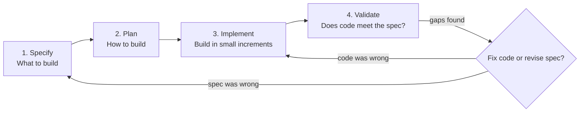

# Spec-Driven Development: From Code to Contract in the Age of AI Coding Assistants

> *Paper: Deepak Babu Piskala (Seattle, USA). "Spec-Driven Development: From Code to Contract in the Age of AI Coding Assistants." Technical report, arXiv:2602.00180v1 [cs.SE], 30 Jan 2026. 8 pp. Page numbers are PDF pages (they match printed pages in this source). Plain-language body first; the dense detail (rigor levels, workflow, tools, case studies, quotes) lives in the Appendix at the end.*

## What Is This Paper, In Plain Words

This is a practitioner's guide, not an experiment. In eight pages, Deepak Babu Piskala organizes a fuzzy, trendy topic, spec-driven development (SDD), into something you can apply on Monday morning. The core inversion is simple. For decades code has been the king: requirements documents drift, design diagrams rot, tests arrive late, and whatever the code actually does becomes the de facto truth. SDD flips that around: the specification becomes the source of truth, and code becomes a generated or verified secondary artifact. Or as the paper puts it: "The spec declares intent; the code realizes it." (p. 1)

Why now? Because of AI. Coding assistants are, in the paper's phrase, "excellent at pattern completion but poor at mind reading" (p. 1). Tell an agent "Add photo sharing to my app." and it has to guess: what formats, what permissions model, what size limits, cloud or local storage? You get plausible-looking code built on dozens of unstated assumptions, many of them wrong. That guessing game is what practitioners call "vibe coding". The alternative this paper champions: write the specification first and treat it as the contract the AI implements. Compare the vague prompt with a real spec: "Users can upload JPEG or PNG photos up to 10MB. Photos are stored in S3 with user-ID-prefixed keys. Only the uploader can delete their photos. Photos are resized to 1024px max dimension on upload." (p. 1) Now the agent has enough information to generate code that matches intent.

### The three levels, in everyday terms

The paper's most useful contribution is a ladder of rigor. Think of it like cooking from a recipe:

- **Spec-first** is writing the recipe before you cook, then letting it drift or tossing it once the dish works. You get upfront clarity (which is exactly what an AI assistant needs), at the lowest maintenance cost, but no protection against the recipe and the dish diverging later. Good for prototypes and one-off features.
- **Spec-anchored** keeps the recipe alive: whenever the dish changes, the recipe is updated too, and a smoke alarm (automated tests derived from the spec) goes off if the two disagree. The paper calls this the "sweet spot" for most production systems (p. 2). Cucumber BDD scenarios and OpenAPI specs with contract testing live here.
- **Spec-as-source** means the recipe is the only thing you ever edit; the dish is re-made from the recipe every time, and nobody touches the finished plate. It sounds radical, but it is already standard practice where generation tooling is mature and trusted: automotive engineers model control logic in Simulink, verify behavior in simulation, and generate certified C code "that nobody hand-edits" (p. 2).

### The workflow in one breath

Four phases, each producing an artifact that constrains the next: **specify** (what should the software do, as behavior and acceptance criteria, not implementation), **plan** (how should we build it: architecture, data models, choices like "use PostgreSQL for persistence"), **implement** (in small validated increments, possibly AI-driven, still human-supervised), and **validate** (does the code meet the spec; if gaps appear, fix the code or revise the spec, but the spec stays the authority) (pp. 3-4).

### The rest of the argument

- When AI can generate code from specifications faster than humans can type, "the bottleneck shifts to specification quality" (p. 8). That single reframing is the paper's thesis.
- Specs act as "super-prompts": structured, context-rich input that breaks a complex problem into modular pieces matching an agent's context window, and lets teams run several agents in parallel on non-overlapping tasks (p. 4).
- The Golden Rule keeps it honest: "Use the minimum level of specification rigor that removes ambiguity for your context." (p. 7)
- The failure modes are named plainly: over-specification (the spec turns into pseudo-code), specification rot, bureaucracy, tooling overload, and false confidence, because "If the spec is wrong, the code will faithfully implement the wrong thing." (p. 7)
- And the paper admits the idea is old. As Bryan Finster is quoted: "SDD is not a revolution... it's just BDD with branding." (p. 7) The branding earns its keep by reminding you that specs should be authoritative, not advisory, and that modern tooling can enforce what used to rely on human discipline.

## Why You Should Care

You work as a spec-driven full-stack engineer, and this paper is effectively a field manual for the discipline you already practice. It gives your habits names, a decision framework, and evidence.

1. **It structures your workflow.** The three-level ladder answers a question every spec-driven team faces: how much specification does *this* project deserve? An OpenAPI-first service with contract tests in CI is spec-anchored; a weekend prototype only needs spec-first. The Golden Rule turns that from taste into a filter.
2. **The flagship case study is your world.** A financial services company drowning in "integration hell" mandated OpenAPI specs reviewed by consumer teams before any coding, used Specmatic to generate mock servers and to fail CI builds on any spec deviation, and reported a 75% reduction in integration cycle time (p. 5). That is frontend and backend developed in parallel against a shared contract: the full-stack pattern, measured.
3. **It is a manual for driving coding agents.** Specs as super-prompts, the plan phase as architectural context the agent would otherwise violate, the "self-spec" pattern (an agent drafts the spec, a human refines it, then an agent implements against it), parallel agents on partitioned tasks, and property-based testing as the answer to LLM non-determinism (p. 4).
4. **Enforcement is the whole difference from the design docs of old.** Advisory documents rot: "By Sprint 3, the HLD is outdated. By release 2, the SRS no longer matches the product." (p. 7) SDD specs are wired into CI so drift fails the build instead of accumulating silently. If your specs are not executable, this paper will push you to make them so.
5. **It tells you when to stop.** Throwaway prototypes, solo short-lived projects, exploratory coding, obvious CRUD: skip the ceremony (p. 7). Specification should be an investment, not a tax.
6. **It pairs with hard numbers.** The companion empirical study on specification-driven code generation with LLMs (the CURRANTE study, linked in Related below) tests whether spec-driven prompting actually improves LLM output; this guide supplies the practice, that paper supplies the measurements. Read them together.

---

# Appendix: The Dense Details

> *Everything below is the reference layer: the guide's full structure, tables, case studies, and verbatim quotes, all page-cited to the PDF. Read the plain-language body above first. Page numbers are PDF pages; they match the printed pages in this source.*

## A. Dense Summary

Spec-driven development flips the classic order: specifications become the source of truth, and code becomes a generated or verified secondary artifact. This is a practitioner's guide, not an empirical study, and its value is in the structure it gives a fuzzy topic: three rigor levels (spec-first, spec-anchored, spec-as-source), a four-phase workflow (specify, plan, implement, validate), and the current tool landscape (BDD/Cucumber, OpenAPI, Pact/Specmatic, GitHub Spec Kit, Amazon Kiro, Tessl, Simulink). The AI angle is the headline: LLMs are strong at pattern completion and bad at mind reading, so a precise spec is the difference between generated code that matches intent and "vibe coding". Cited studies report error reductions of up to 50% from human-refined specs, and three case studies show the pattern in production: API microservices (75% faster integration cycles), enterprise BDD, and ISO 26262-certified embedded code. The paper is also candid: use the minimum rigor that removes ambiguity, and watch for drift, bureaucracy, and false confidence.

## B. Paper Map

| Section | pp. | What it delivers |
|---|---|---|
| I. Introduction | 1 | Code-as-king problem, the AI catalyst, vibe coding vs specs, core principle |
| II. The Specification Spectrum | 2-3 | Three rigor levels (Figure 1) |
| III. The SDD Workflow | 3-4 | Four phases (Figure 2), practitioner's tips |
| IV. How SDD Boosts AI Coding Agents | 4 | Super-prompts, 50% error reduction, parallelism, PBT, self-spec |
| V. Tools and Frameworks | 4-5 | BDD, API specification, AI-assisted SDD tools (Table I) |
| VI. Case Studies | 5-6 | API-first microservices, enterprise BDD, model-based embedded |
| VII. The Redefinition of Developer Work | 6 | Greenfield architects, brownfield spec extraction |
| VIII. When to Use SDD | 6-7 | Decision framework (Figure 3), Golden Rule |
| IX. Common Pitfalls | 7 | Five failure modes |
| X. SDD vs Traditional Design Documents | 7 | Advisory vs enforced; what SDD adds |
| XI. Relationship to Existing Practices | 7-8 | TDD, BDD, DDD, Agile |
| XII. Conclusion | 8 | Bottleneck shifts to specification quality |

## C. The Specification Spectrum

The paper opens from a familiar frustration: "code has been the king of software development" (p. 1), requirements documents drift, design diagrams rot, and tests arrive after the fact, so whatever the code does becomes the de facto truth. SDD responds by making the spec authoritative and deriving code from it. Three levels of rigor, increasing in both specification authority and the discipline required to maintain alignment (Figure 1, pp. 2-3):

| Level | The idea | The spec's fate | Best for |
|---|---|---|---|
| **Spec-First** | A spec is written before coding to guide the initial implementation | May be abandoned or left to drift once code works | AI-assisted initial features, prototypes, one-offs |
| **Spec-Anchored** | Spec is maintained alongside code for the system's whole life; changes update both | A living document, kept in sync; tests fail when spec and code diverge | Most production systems, the paper's "sweet spot" (p. 2) |
| **Spec-as-Source** | The spec is the only artifact humans edit; code is regenerated, never hand-edited | The spec IS the source code, one abstraction level up | Domains with mature, trusted generation tooling (API stubs, certified embedded code) |

- **Spec-first** is the entry point: the payoff is the initial clarity, especially with AI assistants, and it carries the lowest maintenance burden. It does not protect against long-term drift.
- **Spec-anchored** treats spec and code as equal partners, with automated checks enforcing alignment. BDD frameworks like Cucumber exemplify this, as do OpenAPI specs paired with contract testing (Specmatic) in API development (pp. 2-3).
- **Spec-as-source** draws on Design by Contract principles and is already standard where generation is trustworthy: OpenAPI server stubs, and automotive practice where engineers build Simulink models, verify behavior in simulation, and generate certified C code "that nobody hand-edits" (p. 2). Emerging AI tooling like Tessl aims to extend the approach to general software, representing a future where specifications become "the new source code".

## D. The SDD Workflow

Four phases, each producing an artifact that constrains the next, forming what the paper calls a chain of accountability from intent to implementation (Figure 2, p. 3):

```mermaid
flowchart LR
  S["1. Specify<br/>What to build"] --> P["2. Plan<br/>How to build"]
  P --> I["3. Implement<br/>Build in small increments"]
  I --> V["4. Validate<br/>Does code meet the spec?"]
  V -->|"gaps found"| F{"Fix code or revise spec?"}
  F -->|"spec was wrong"| S
  F -->|"code was wrong"| I
```

- **Specify**: answer "What should the software do?" without prescribing implementation. Output: behavior, requirements, and acceptance criteria (user stories, Given/When/Then, explicit business rules, edge cases found upfront). Good specs are behavior-focused, testable, unambiguous, and complete enough without over-specifying. Practitioner's tip (p. 3): write at the level of detail needed to remove ambiguity; if there is only one reasonable interpretation, stop, because excessive detail constrains implementation unnecessarily.
- **Plan**: answer "How should we build it?". Output: architecture, data models, interfaces, technology choices, and non-functional constraints ("use PostgreSQL for persistence", "all API endpoints require authentication"). For AI assistants this phase is crucial context: without it, a perfect spec can still yield code that violates architectural decisions (p. 3).
- **Implement**: build in small, validated increments so humans can verify alignment frequently; specs act as "super-prompts" that break complex problems into modular pieces aligned with agents' context windows. AI may automate much of this phase, but oversight stays human (pp. 3-4).
- **Validate**: run unit, integration, and acceptance tests, execute BDD scenarios, check non-functional requirements, and involve stakeholders. If gaps appear, the team either fixes the code or revises the spec. Either way, the spec remains the authority (p. 4).

## E. How SDD Boosts AI Coding Agents

- **Specs as super-prompts**: structured, context-rich input that decomposes complex problems into modular components matching a model's context window, with self-verification against requirement checklists (p. 4).
- **Measured effect**: empirical studies are still nascent, but the paper cites controlled studies showing error reductions of up to 50% when specs are human-refined (p. 4).
- **Parallelism**: specs let teams partition work into non-overlapping tasks, so multiple agents implement components simultaneously with orchestration for dependencies (p. 4).
- **Non-determinism**: LLMs vary even with structured specs; property-based testing verifies that spec invariants hold regardless of implementation variation. In safety-critical domains, SDD pairs generation with formal verification for standards like ISO 26262 (p. 4).
- **Self-spec pattern**: an LLM drafts a spec from a high-level prompt, humans review and refine it, then the same or another agent implements against it. Planning and execution stay separated, catching misunderstandings before code exists (p. 4).
- **Brownfield**: legacy constraints encoded as specs give agents the context that legacy code usually hides; extracting specs from legacy code lets teams verify modernization preserves required functionality (pp. 4, 6).

## F. Tools and Frameworks

Table I (p. 5) maps the landscape:

| Category | Examples | Role in SDD |
|---|---|---|
| BDD frameworks | Cucumber, SpecFlow, Behave | Executable specs in plain language (Gherkin) |
| TDD frameworks | RSpec, JUnit, pytest | Specs encoded as unit tests |
| API specification | OpenAPI/Swagger, GraphQL SDL, Protocol Buffers | Contracts that generate code and tests |
| Contract testing | Pact, Specmatic | Verify implementations match specs |
| AI-assisted SDD | GitHub Spec Kit, Amazon Kiro, Tessl | Structured AI workflows from spec to code |
| Model-based design | Simulink, SCADE | Visual specs that generate embedded code |

- **BDD**: Gherkin's Given/When/Then scenarios are specifications and tests at once. The practitioner's tip: write them before implementation, involve stakeholders, treat them as the authoritative description of behavior (p. 4).
- **API specification**: design-first has been standard practice for years; once the spec is agreed, frontend and backend work in parallel, and "any implementation that matches the spec is valid by definition" (p. 5). GraphQL SDL, AsyncAPI, Protocol Buffers, and gRPC extend the same contract pattern to schemas, events, and typed service interfaces. Pact and Specmatic automate the verification.
- **AI-assisted tools**: GitHub Spec Kit runs a four-phase flow (`/specify`, `/plan`, `/tasks`, then implementation) with human review at every phase; Amazon Kiro stages requirements, design, and tasks before any generation; Tessl goes all the way to spec-as-source (p. 5). Their shared insight: separating planning from implementation reduces the non-determinism of loosely-prompted AI coding.

## G. Case Studies

| Case | Domain | Pattern | Outcome |
|---|---|---|---|
| API-first microservices | Financial services | Spec-anchored (OpenAPI + Specmatic) | Spec review replaced "integration hell"; **75% reduction in integration cycle time** (p. 5) |
| BDD enterprise features | Project management software | Spec-anchored (Cucumber) | "Done" defined as scenarios passing; stakeholder-verifiable requirements; disputes resolved by the spec as authority (pp. 5-6) |
| Model-based embedded | Automotive engine control | Spec-as-source (Simulink) | Control logic verified at model level; ISO 26262-certified code generation; engineers never edit the generated C (p. 6) |

Detail worth keeping:

- **Case 1 (p. 5)**: consumer teams reviewed OpenAPI specs before any coding began, front-loading integration discussions; Specmatic generated mock servers so frontend work proceeded in parallel with backend, and validated implemented services against their specs in CI, failing the build on any deviation so drift could not accumulate.
- **Case 2 (pp. 5-6)**: product managers wrote Gherkin scenarios; developers implemented step definitions; a feature was "done" only when all its scenarios passed. When disputes arose, the scenario was the authority: if the scenario was wrong it was updated with explicit stakeholder agreement, if the code was wrong developers fixed it.
- **Case 3 (p. 6)**: the Simulink model was the specification; behavior was verified in simulation before any code existed; code was auto-generated by a certified generator, itself certified, so the generated C was guaranteed to behave as the model specified. Changing control logic meant changing the model and regenerating, keeping verified model and deployed code aligned by construction.

## H. When to Use SDD (and When Not)

The decision framework (Figure 3, p. 6) walks three questions: is there AI assistance or complex requirements (else ad-hoc is fine)? Is the system long-lived with multiple maintainers (else spec-first)? Is code generation viable and trusted (yes means spec-as-source, otherwise spec-anchored)?

SDD adds value for: AI-assisted development, complex requirements stakeholders must validate, systems with multiple maintainers, integration-heavy systems, regulated domains that mandate traceability, and legacy modernization where extracting a spec enables clean reimplementation (pp. 6-7).

SDD is overkill for: throwaway prototypes, solo short-lived projects, exploratory coding where premature specification constrains learning, and simple CRUD with obvious requirements (p. 7).

The paper's Golden Rule:

> "Use the minimum level of specification rigor that removes ambiguity for your context." (p. 7)

## I. Common Pitfalls

1. **Over-specification**: specs so detailed they become pseudo-code, defeating the what/how separation. "If your spec reads like code, you've gone too far" (p. 7).
2. **Specification rot**: specs not updated as code changes lose trust; the fix is automated enforcement, making drift "visible and painful rather than silent and accumulating" (p. 7).
3. **Specification as bureaucracy**: specs as forms to fill rather than tools for clarity. Teams will game or abandon the process.
4. **Tooling complexity**: drowning in generated plans and task lists; start simple, add tooling only when it demonstrably helps, and avoid cargo-culting elaborate workflows.
5. **False confidence**: a passing spec test proves the code matches the spec, not that the software is correct. "If the spec is wrong, the code will faithfully implement the wrong thing." (p. 7) Specs need the same review as code.

## J. SDD vs Traditional Design Documents

Traditional engineering already produced spec-like artifacts: SRS documents, high-level and low-level designs, interface specifications. The problem was never the absence of specs, it is that they drift: "By Sprint 3, the HLD is outdated. By release 2, the SRS no longer matches the product." (p. 7). The difference is not what is written but how it is used: traditional documents are advisory (developers read them, then write code that hopefully matches), while SDD specs are enforced (tests fail on divergence; in spec-as-source, code is regenerated).

Three things SDD adds (p. 7): executable specifications (BDD scenarios, contract tests, model simulations that can fail a build), CI/CD integration (every commit checked against the spec), and AI consumption (specs structured for agents to generate and verify against, instead of guessing from vague prompts). The paper frames this as evolution, not revolution: the core idea is decades old agile wisdom; what is new is tooling, CI/CD maturity, and AI as a spec consumer.

## K. Relationship to Existing Practices

- **TDD**: SDD at the unit level; SDD extends the same "specify first" discipline to features, systems, and architectures (pp. 7-8).
- **BDD**: the most direct ancestor; Gherkin scenarios are executable specs, and AI-assisted SDD adds generation from them (p. 8).
- **DDD**: aligns through ubiquitous language; specs written in domain terms both developers and stakeholders understand (p. 8).
- **Agile**: user stories with acceptance criteria are specs, and the Definition of Done is a form of spec; SDD makes them authoritative and enforced rather than advisory (p. 8).

## L. The Redefinition of Developer Work

Section VII (p. 6) argues SDD reshapes the role: developers shift from manual coding to orchestrating specifications, reviewing AI outputs, and focusing on high-level design. In greenfield projects, developers become architects who design systems through specifications, focusing on requirements elicitation, constraint definition, and acceptance criteria, while AI agents handle translation from spec to implementation and humans remain responsible for specs capturing actual requirements. In brownfield projects, the work is encoding existing behavior as specifications before making changes, so the spec becomes the bridge between old and new implementations. In each case the developer's role shifts from code producer to spec author and AI orchestrator.

## M. Practitioner Takeaways (synthesis)

1. **Match rigor to need.** The golden rule is a filter, not a slogan: not every project deserves spec-anchored discipline, almost nothing small deserves spec-as-source.
2. **Write specs for an AI reader.** Ambiguity is the bug; the paper's photo-sharing example (a vague prompt versus a spec with formats, size limits, storage keys, and permissions) is the pattern to copy.
3. **Enforcement is the whole difference.** Specs that are not wired into CI rot like the design docs before them; contract tests and BDD scenarios are what make them stay true.
4. **A wrong spec scales your mistakes.** Generation amplifies fidelity to the spec, correct or not; review specs with the same care as code.
5. **Legacy modernization starts with extraction.** Encoding existing behavior as a spec before changing anything turns archaeology into a checklist.
6. **Beware the five pitfalls**, especially bureaucracy and false confidence, the two that quietly kill adoption.

## N. Memorable Quotes

> "AI models are excellent at pattern completion but poor at mind reading." (p. 1)

> "The spec declares intent; the code realizes it." (p. 1)

> "Use the minimum level of specification rigor that removes ambiguity for your context." (p. 7)

> "If the spec is wrong, the code will faithfully implement the wrong thing." (p. 7)

> "when an AI can generate code from specifications faster than humans can type, the bottleneck shifts to specification quality." (p. 8)

## Related

- Source PDF: `F:/papers/Spec-Driven Development From Code to Contract in the Age of AI Conding Assistants.pdf`
- arXiv: https://arxiv.org/abs/2602.00180
- Companion paper: [[understanding-specification-driven-code-generation-with-llms]] (Rosa et al., SANER 2026), the empirical companion to this practitioner guide.
- Cross-vault: agent-driven development checklist at `F:/obsidian_note/swe-knowledge/checklist/ai-checklist/general-agents-driven.md` (contracts such as openapi.yaml feeding generated types).

---

*Summary written 2026-09-20 from arXiv:2602.00180v1, the version matching the source PDF; restructured into plain-language body + appendix format. Page numbers are PDF pages; quotes are verbatim and page-cited; everything else is own-words paraphrase.*
