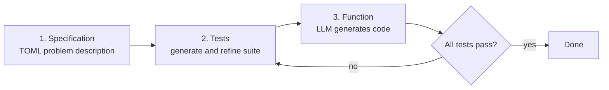

# Understanding Specification-Driven Code Generation with LLMs: An Empirical Study Design

> *Paper: Rosa, Moreno-Lumbreras, Robles, González-Barahona (Universidad Rey Juan Carlos, Spain). "Understanding Specification-Driven Code Generation with LLMs: An Empirical Study Design." Stage 1 Registered Report; protocol peer reviewed and accepted at SANER 2026 with a Continuity Acceptance score for Stage 2. arXiv:2601.03878v1 [cs.SE], 7 Jan 2026. 7 pp. Page numbers are PDF pages (they match printed pages in this source).*

## TL;DR

This is a study design, not a study result. The team built CURRANTE, a VS Code extension that walks a developer through three stages: write the specification (TOML), generate and refine a test suite, then let the LLM generate the function against those tests. The human owns the spec and the tests; the machine owns the final code. They will run a controlled experiment with real developers solving medium-difficulty LiveCodeBench problems, logging everything (pass rate, time-to-pass, test edits, regenerations, tokens), and asking two research questions: can the workflow generate correct code from the user's specification, and how well can users express their intent through tests? Because it is a registered report, every "we will" is a promise, not a finding: the value here is the protocol, the telemetry schema, and the threats-to-validity discipline.

## Why This Paper Matters

- **It is the empirical companion to the practitioner guide.** Where [[spec-driven-development-from-code-to-contract]] describes SDD's levels, tools, and case studies, this paper operationalizes one specific claim, that test-first specifications improve LLM code generation, into a measurable, peer-reviewed experiment.
- **Registered report discipline.** The protocol and analysis plan were peer reviewed and accepted at SANER 2026 before data collection, with a Continuity Acceptance score for Stage 2. This format fights publication bias, and it defines how to read the paper: every "we will measure" is a hypothesis to be tested, not a result to cite. (Your reading-method note [[how-to-read-a-research-paper]] uses this very paper as its running example.)
- **The design is borrowable.** The three-stage UX, the telemetry taxonomy, and the metric definitions (PassAll, TimeToPass, and friends) are reusable for anyone evaluating LLM coding workflows.

## The CURRANTE Tool

CURRANTE is a VS Code extension implementing a TDD-style workflow where the test suite becomes the specification. The GUI has three areas (pp. 1–2):

1. **Problem description (area 1)**: a structured natural language specification in TOML format, capturing the user's intent, the function signature, and constraints. It seeds the process and guides the LLM.
2. **Test cases (area 2)**: an LLM generates an initial test suite from the TOML spec; the user refines it by requesting explanations for individual tests, deleting irrelevant ones, or regenerating single tests or the whole suite. The suite is the formal specification that drives code generation.
3. **Code generation (area 3)**: the LLM produces the function from the refined tests; the suite executes; per-test results and the aggregate pass rate are displayed. The user can regenerate after further test refinement.

One design choice is the whole hypothesis in miniature: the final code is generated entirely by the LLM, and the human never writes code directly. The human's leverage is the specification and the tests.

## Research Questions

> **RQ1:** "To what extent is CURRANTE able to generate code based on the specification provided by the user?" (p. 2)

> **RQ2:** "To what extent does CURRANTE allow the user to express their intent through a test suite specification?" (p. 2)

RQ1 is about the tool's capability (does the pipeline produce correct code from a given specification); RQ2 is about the human's expressiveness (can users encode intent in tests effectively). Together they cover the two halves of the human-in-the-loop claim: the machine must be capable, and the human must be able to steer it.

## The Experiment Design

**Participants (p. 3).** A diverse pool of junior and senior developers, CS students, and industry professionals. Sessions are individual, on a single-monitor workstation with a fixed VS Code version, fixed LLM endpoint, prompts, and parameters. After a brief tutorial and one warm-up example, participants work only inside the IDE, with no external tools or web search. Participation is voluntary under informed consent; data are pseudonymized.

**Tasks (pp. 3–4).** Problems come from LiveCodeBench (release_v5, 880 problems as of January 2025): three easy warm-up problems plus three medium-difficulty evaluation candidates, selected for difficulty, type diversity, length, and contamination avoidance. The experiment runs only on the evaluation problems; each participant solves one, assigned randomly with balanced assignment, and TaskId is used as a blocking factor.

**Variables (pp. 4–5, Table I).** Three groups:

| Group | Variables |
|---|---|
| Independent | TaskId (the problem instance) |
| Dependent, correctness | PassAll (binary), PassRate (fraction) |
| Dependent, suite strength | TestCoverage, TestDiversity (for example Jaccard similarity) |
| Dependent, efficiency | TimeToPass (seconds), IterationsToPass (count) |
| Dependent, process | TestEdits, SuiteRegenerations, AdviceTriggers |
| Confounding | ProgrammingExperienceYears, PythonFamiliarity, PriorTDDExperience, PriorLLMCodeGenUse |

**Metrics (p. 5).** All metrics derive from time-stamped logs and test executions: times run from the first produced test suite; rapid duplicate clicks are filtered; participants who never reach all-pass get TimeToPass set to the full budget. Analysis plans descriptive statistics (medians, IQR, proportions) plus Spearman's ρ for exploratory correlations, with outliers flagged and excluded in sensitivity checks.

## Procedure and Execution Plan

- **Procedure (pp. 4–5).** The design follows the ACM SIGSOFT Empirical Standards for quantitative human-participant studies: tutorial, one warm-up task, then a between-subjects main task. The in-experiment workflow: open the TOML spec, produce the initial test suite, refine it (Explain / Regenerate / Delete, optional full-suite regeneration), generate the function and execute tests, then iterate, either refining tests or regenerating the function guided by auto-generated advice from failures. The task ends when all tests pass or the fixed time budget elapses.
- **Execution plan (pp. 5–6).** Three phases: *Preparation* (freeze the environment: VS Code version, CURRANTE build, prompt templates, LLM parameters; filter the dataset; select three easy training and three medium evaluation tasks; run a pilot with 2–3 participants; finalize consent forms and questionnaires), *Execution* (consent, pre-study questionnaire, training task, evaluation task under a budget of approximately 30–45 minutes, post-study questionnaire on usability and workload), and *Analysis* (descriptive summaries first, then non-parametric comparisons, basic regressions, or survival-style summaries with right-censoring as the data warrants; de-identified logs, scripts, and artifacts archived for replication).
- **The LLM.** A recent, capable open-weight model, selected at execution time; the paper names Qwen3-Coder as a possible option, and prompts are deliberately kept simple with no advanced prompting techniques (p. 4).

## Threats to Validity

The authors separate internal from external threats and, in the registered-report spirit, commit to documenting new ones in the final protocol (p. 6).

**Internal.** Subject heterogeneity is handled by collecting demographics and using them as covariates, with constant instructions and time budget. Task sampling uses one medium task from three candidates with TaskId as a blocking factor. A warm-up and a single evaluation task per participant limit learning and fatigue. Instrumentation risk is mitigated by pilot-validating the logger, hashing artifacts, and fixing the timing boundaries. LLM non-determinism is addressed by fixing prompt templates and key parameters; the authors acknowledge exact reproducibility cannot be guaranteed in human–LLM studies and rely on multiple sessions to average out variation. Researcher effects are controlled with scripted briefings.

**External.** The sample may not represent all developers; the setup is one specific IDE, language, and model; only medium-difficulty benchmark tasks are used; disallowing web search raises internal control but lowers ecological validity; and the modest sample size means descriptive summaries take priority over inference.

## Contributions and Implications

Three contributions (p. 6): a reproducible task protocol on LiveCodeBench, a fine-grained telemetry schema capturing time-stamped actions and process metrics, and a transparent study plan for human-in-the-loop TDD. All materials will be open-sourced. For research, this enables principled comparisons of LLM workflows and test-curation strategies; for practice, the results will inform IDE design for spec-by-tests development; for education, CURRANTE offers scaffolded TDD with tighter feedback cycles.

## Practitioner Takeaways (synthesis)

1. **The spec is executable by design.** The TOML file is the seed, but the test suite is the real specification; the workflow makes "spec" a thing the machine can verify, not just read.
2. **Read it as a protocol.** Every "we will" is a hypothesis. The Stage 2 results are the thing to watch for; the design tells you exactly what will be measured when they land.
3. **Steal the instrument.** The telemetry schema, metric definitions, and validity checklist form a reusable blueprint for evaluating any LLM coding workflow.
4. **Process metrics are first-class.** TestEdits, regenerations, and advice triggers are measured alongside outcomes, because the research question is about the human's contribution, not just the final pass rate.
5. **The mitigations are a checklist.** Fixing model parameters, piloting the logger, hashing artifacts, and reporting demographics is a solid pattern for any human-LLM study.

## Memorable Quotes

> "This paper is a Stage 1 Registered Report. The study protocol and analysis plan were peer reviewed and accepted at SANER 2026 with a Continuity Acceptance (CA) score for Stage 2." (p. 1)

> "a gap in understanding the user's role in guiding the LLM through structured requirements specification and test case definition" (p. 1)

> "The results will provide empirical insights into the design of next-generation development environments that align human reasoning with model-driven code generation." (p. 1)

> "Broadly, our methodology offers a reusable blueprint for evaluating emerging LLM coding tools with a focus on human–AI interaction and realistic constraints." (p. 6)

## Related

- Companion paper: [[spec-driven-development-from-code-to-contract]], the practitioner guide this study empirically tests.
- [[how-to-read-a-research-paper]]: reading-method note that uses this paper as its running example.
- Source PDF: `F:/papers/Understanding Specification-Driven Code Generation with LLMs An Empirical Study Design.pdf`
- arXiv: https://arxiv.org/abs/2601.03878

---

*Summary written 2026-09-20 from arXiv:2601.03878v1, the version matching the source PDF. Page numbers are PDF pages; quotes are verbatim and page-cited; everything else is own-words paraphrase. This is a study protocol: no results exist yet at the time of writing.*
