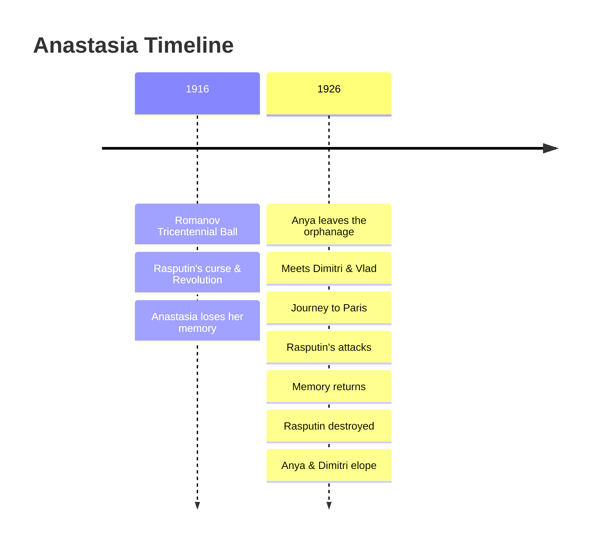

---
tags:
  - overview
  - musical
  - anastasia
---

# Anastasia — Musical Overview
> Song reference guide for English learning notes

---

## About the Musical

| Detail | Info |
|--------|------|
| **Based on** | The legend of Grand Duchess Anastasia Romanov |
| **Film format** | 1997 animated musical film (20th Century Fox) |
| **Stage adaptation** | 2016 Broadway musical |
| **Directors** | Don Bluth, Gary Goldman (1997 film) |
| **Music by** | Stephen Flaherty |
| **Lyrics by** | Lynn Ahrens |
| **Score** | David Newman |
| **Premiere** | November 14, 1997 |
| **Box office** | $140 million worldwide |
| **Awards** | 2 Oscar nominations (Best Original Song, Best Original Score) |

> **Note:** Although often mistaken for a Disney film (due to similar animation style and Disney acquiring 20th Century Fox in 2019), *Anastasia* is **not** part of the Disney Princess lineup.

---

## Story Summary

Set in an alternate **1926**, *Anastasia* follows an amnesiac young woman who may be the surviving Grand Duchess of the Romanov family.

### Act 1 — The Fall of the Romanovs (1916)

At a grand ball in Saint Petersburg celebrating the Romanov dynasty's 300th anniversary, **Dowager Empress Marie** gives her granddaughter **Anastasia** a music box and a necklace inscribed "Together in Paris." The celebration is violently interrupted by **Grigori Rasputin**, a former royal advisor who sold his soul for the power to destroy the Romanovs. His cursed reliquary sparks the Russian Revolution.

Marie and Anastasia flee through a hidden door (helped by a servant boy named **Dimitri**), but Anastasia falls from a moving train, hits her head, and loses her memory. The music box is left behind.

### Act 2 — The Search (1926)

Ten years later, rumors of Anastasia's survival spread. Marie offers **10 million rubles** for her granddaughter's safe return.

A grown-up **Dimitri**, now a conman, and his partner **Vlad** search for an Anastasia look-alike to collect the reward. Meanwhile, the real Anastasia: now called **"Anya"** and living in an orphanage: follows the inscription on her necklace to Paris to discover her past.

Dimitri and Vlad are stunned by Anya's resemblance to the real Anastasia and take her to Paris. Along the way:
- **Rasputin** (still alive in limbo) discovers Anastasia lives and sends demonic forces to kill her
- Dimitri teaches Anya court etiquette and Romanov history
- Dimitri and Anya begin to fall in love
- Anya gradually recovers fragments of her memory

### Act 3 — The Truth

In Paris, Dimitri realizes Anya **is** the real Anastasia. He refuses the reward money and tries to protect her. Anya reunites with her grandmother Marie after the music box triggers her full memory.

In the final confrontation, Rasputin attacks Anya directly. She crushes his reliquary, destroying him forever. Anya chooses to be with Dimitri over reclaiming her royal title, and they elope to Paris.

---

## Complete Song List (1997 Film)

| # | Song | Character(s) | Context |
|---|------|-------------|---------|
| 1 | A Rumor in St. Petersburg | Dimitri, Vlad, Citizens | Opening number: rumors of Anastasia's survival spread through St. Petersburg |
| 2 | Journey to the Past | Anya | Anya leaves the orphanage, determined to find her family (Oscar-nominated) |
| 3 | ⭐ **Once Upon a December** | **Anya** | **Anya wanders the abandoned palace and fragments of her memory return through this waltz** |
| 4 | In the Dark of the Night | Rasputin | Rasputin vows revenge on Anastasia (villain song) |
| 5 | Learn to Do It | Dimitri, Vlad, Anya | Dimitri and Vlad teach Anya how to behave like a princess |
| 6 | Learn to Do It (Waltz Reprise) | Vlad | Short waltz during training |
| 7 | Paris Holds the Key (To Your Heart) | Cast | Paris welcomes the characters |
| 8 | At the Beginning | Richard Marx & Donna Lewis | End credits pop song (not in-story) |

### Score Tracks
| # | Track | Context |
|---|-------|---------|
| 9 | Prologue | Marie gives Anastasia the music box (1916 ball) |
| 10 | Speaking of Sophie | Sophie (Marie's cousin) interviews Anya |
| 11 | The Nightmare | Rasputin's reliquary revives |
| 12 | Kidnap and Reunion | Anya is kidnapped, then reunited with Marie |
| 13 | Reminiscing with Grandma | Anya and Marie recover memories |
| 14 | Finale | Anastasia and Dimitri's happy ending |

---

## ⭐ Songs Studied in This Vault

| Song | Character | Context in Story | Lesson File |
|------|-----------|-----------------|------------|
| **Once Upon a December** | Anya | Anya wanders the abandoned Winter Palace. As she sings, she sees visions of dancing bears, prancing horses, and warm arms holding her: memories of her lost childhood resurface through sensory fragments | [[Once Upon a December - Anastasia]] |

---

## Sources

- Flaherty, S. (Music) & Ahrens, L. (Lyrics). (1997). *Anastasia: Music from the Motion Picture* [Soundtrack]. 20th Century Fox.
- *Anastasia* (1997). Directed by Don Bluth and Gary Goldman. 20th Century Fox Animation.
- Wikipedia contributors. "Anastasia (1997 film)." *Wikipedia*. Retrieved July 24, 2026, from https://en.wikipedia.org/wiki/Anastasia_(1997_film)
- Wikipedia contributors. "Anastasia (soundtrack)." *Wikipedia*. Retrieved July 24, 2026, from https://en.wikipedia.org/wiki/Anastasia_(soundtrack)
