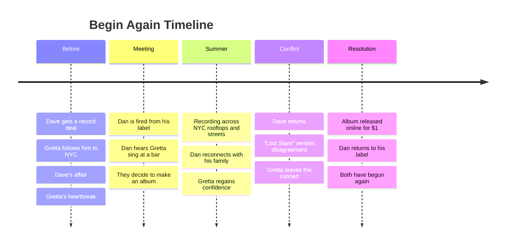

---
tags:
  - overview
  - musical
  - begin-again
---

# Begin Again — Musical Overview
> Song reference guide for English learning notes

---

## About the Musical

| Detail | Info |
|--------|------|
| **Type** | 2013 musical drama film (naturalistic music film, not a traditional musical) |
| **Written & Directed by** | John Carney |
| **Music by** | Gregg Alexander, Danielle Brisebois, Nick Lashley, Glen Hansard |
| **Stars** | Keira Knightley (Gretta), Mark Ruffalo (Dan), Adam Levine (Dave) |
| **Premiere** | September 7, 2013 (Toronto Film Festival) |
| **Box office** | $63.4 million worldwide |
| **Awards** | Oscar nomination for Best Original Song ("Lost Stars") |
| **Style** | Songs are diegetic (characters perform music within the story, not burst-into-song style) |

> **Is it a musical?** Yes, but in a naturalistic style. Characters are musicians who write, rehearse, and record songs as part of the plot. This is the same style director John Carney used in *Once* (2007). It's not a traditional Broadway musical where characters spontaneously sing to express emotions.

---

## Story Summary

Set in **New York City**, *Begin Again* follows two broken people who find healing through making music together.

### The Meeting

**Gretta James** is a young English songwriter who followed her boyfriend **Dave Kohl** to New York when he got a record deal. After Dave cheats on her with a production assistant, Gretta is devastated and ready to go home to England.

**Dan Mulligan** is a once-great record label executive who has lost his way. He is estranged from his wife Miriam and teenage daughter Violet, struggling with alcohol, and has just been fired from his own label.

Dan stumbles into a bar and hears Gretta singing at an open-mic night. Though she sings plainly with just a guitar, Dan's experienced ear hears the potential. He offers to produce an album with her.

### The Album

Dan and Gretta can't get a traditional record deal, so they decide to record an album **live, outdoors, at various locations across New York City** during the summer. They recruit a team of musicians, including Steve (a busker) and even Dan's daughter Violet on guitar.

The recording sessions become a journey of healing: Dan reconnects with his family, Gretta regains her confidence, and both rediscover their love of music.

### The Conflict

Gretta's ex-boyfriend **Dave** returns, promoting his new commercial album. He asks Gretta to hear him play "Lost Stars" (a love ballad she originally wrote for him as a Christmas present). Gretta feels betrayed by his heavily commercialized version of the song.

At the concert, Dave begins playing "her arrangement" of the song. But as the audience cheers at the climactic, commercial version, Gretta realizes that too much has changed between them. She leaves mid-performance, cycling through the city with a sense of closure.

### The Resolution

Gretta decides not to sign with a major label. Instead, she releases her album **online for $1**, distributing it directly to listeners. The album sells 10,000 copies on its first day. Dan gets his job back. Both have "begun again."

---

## Complete Song List

| # | Song | Performed by | Context |
|---|------|-------------|---------|
| 1 | Tell Me If You Wanna Go Home | Gretta (Keira Knightley) | Gretta sings at the open-mic night where Dan discovers her |
| 2 | Coming Up Roses | Gretta | Gretta writes about finding hope in difficult times |
| 3 | Lost Stars (Gretta's version) | Gretta | The original, intimate version: a love ballad |
| 4 | Lost Stars (Dave's version) | Dave (Adam Levine) | The commercialized, stadium version |
| 5 | A Higher Place | Dave | Dave's solo song from his new commercial album |
| 6 | Like a Fool | Gretta | Gretta's angry voicemail song to Dave |
| 7 | Did It Ever Cross Your Mind | Gretta | Gretta reflects on the past relationship |
| 8 | No One Else Like You | Steve (busker) | A sweet song performed during recording |
| 9 | A Step You Can't Take Back | Gretta & Dan | The emotional climax of the album recording |
| 10 | Women of the World (Go on Strike!) | Ensemble | A fun, chaotic recording session |

---

## Themes for English Learning

| Theme | Example |
|-------|---------|
| **Music industry vocabulary** | "record deal," "produce an album," "sell out," "open-mic night" |
| **Past Simple vs. Present Perfect** | "I followed him here" (PS) vs "I've been here for months" (PP) |
| **Conditional (regret)** | "If I had known, I wouldn't have come" |
| **Idioms about relationships** | "sell out," "move on," "begin again," "break up" |
| **Emotional vocabulary** | "heartbroken," "betrayed," "closure," "confidence" |
| **Contractions in natural speech** | Heavy use of contractions in dialogue and songs |

---

## Sources

- Carney, J. (Writer & Director). (2013). *Begin Again* [Film]. The Weinstein Company.
- Alexander, G. et al. (2014). *Begin Again: Music from and Inspired by the Original Motion Picture* [Soundtrack]. ALAS Communications / Columbia Records.
- Wikipedia contributors. "Begin Again (2013 film)." *Wikipedia*. Retrieved July 24, 2026, from https://en.wikipedia.org/wiki/Begin_Again_(2013_film)
