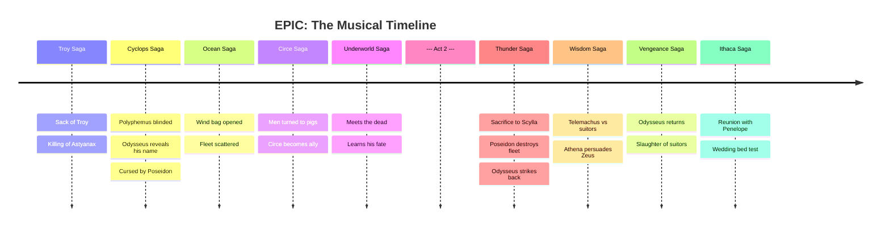

---
tags:
  - overview
  - musical
  - epic-the-musical
---

# EPIC: The Musical — Overview
> Song reference guide for English learning notes

---

## About the Musical

| Detail | Info |
|--------|------|
| **Based on** | *The Odyssey* by Homer (Ancient Greek epic poem) |
| **Created by** | Jorge Rivera-Herrans (music, lyrics, book, production) |
| **Format** | 9-part concept album series ("sagas"), released 2022:2024 |
| **Genre** | Sung-through musical / concept album |
| **Inspiration** | Lin-Manuel Miranda, anime, video games, *Peter and the Wolf* |
| **Status** | Completed December 25, 2024 (all 9 sagas released) |

### Unique Feature: Leitmotif System
Each character has a representative instrument:
- **Odysseus** → Guitar
- **Athena** → Piano
- **Penelope** → Viola
- **Telemachus** → Guitar + Piano (influences from both parents)
- **Poseidon** → Electronic/synthesizer
- **Aeolus** → Choral vocals + flute

> The leitmotif system is **subverted** for foreshadowing: in "Suffering," the singer uses NO viola, hinting she is a siren disguised as Penelope, not the real Penelope.

---

## Story Summary

*EPIC: The Musical* retells Homer's *Odyssey*: the 20-year journey of **King Odysseus of Ithaca** returning home after the Trojan War.

### Act 1 — The Journey Home

Odysseus and his fleet of 600 men leave Troy, but the journey is plagued by gods, monsters, and impossible choices. Key events:

- **The Troy Saga**: Odysseus sacks Troy with the Trojan Horse. Zeus commands him to kill the infant son of Hector (foreshadowing the Trojan prince's future vengeance).
- **The Cyclops Saga**: Odysseus blinds Polyphemus (a Cyclops) but foolishly reveals his name, cursing himself to Poseidon's wrath.
- **The Ocean Saga**: The wind god Aeolus gives Odysseus a bag of storm winds, but his crew opens it, blowing them off course. Poseidon destroys the fleet.
- **The Circe Saga**: The witch Circe turns Odysseus's men into pigs. After Hermes intervenes, Circe becomes an ally.
- **The Underworld Saga**: Odysseus visits the dead, sees his mother, and receives a prophecy that he will return home alone.

### Act 2 — The Monster and the Return

Odysseus, now hardened by loss, makes increasingly ruthless choices:

- **The Thunder Saga**: Odysseus sacrifices 6 men to the monster Scylla. Poseidon appears and destroys the rest of the fleet. Odysseus survives by using the wind bag to strike Poseidon.
- **The Wisdom Saga**: Back on Ithaca, **Telemachus** (Odysseus's son) fights off abusive suitors. **Penelope** waits faithfully. Athena pleads with Zeus to free Odysseus.
- **The Vengeance Saga**: Odysseus returns to Ithaca disguised as a beggar. He faces the suitors, kills them all, and reclaims his home.
- **The Ithaca Saga**: The emotional finale. Odysseus reunites with Penelope, who tests him with the wedding bed secret to prove his identity.

---

## Complete Song List

### Act 1

#### The Troy Saga
| # | Song | Character(s) |
|---|------|-------------|
| 1 | The Horse and the Infant | Odysseus, Zeus |
| 2 | Just a Man | Odysseus, Cast |
| 3 | Full Speed Ahead | Odysseus, Polites, Eurylochus |
| 4 | Open Arms | Odysseus, Polites |
| 5 | Warrior of the Mind | Odysseus, Athena |

#### The Cyclops Saga
| # | Song | Character(s) |
|---|------|-------------|
| 6 | Polyphemus | Odysseus, Polyphemus |
| 7 | Survive | Odysseus, Polites, Cast |
| 8 | Remember Them | Odysseus, Eurylochus, Athena |
| 9 | My Goodbye | Odysseus, Athena |

#### The Ocean Saga
| # | Song | Character(s) |
|---|------|-------------|
| 10 | Storm | Odysseus, Eurylochus |
| 11 | Luck Runs Out | Odysseus, Eurylochus |
| 12 | Keep Your Friends Close | Odysseus, Aeolus, Poseidon |
| 13 | Ruthlessness | Poseidon, Cast |

#### The Circe Saga
| # | Song | Character(s) |
|---|------|-------------|
| 14 | Puppeteer | Odysseus, Eurylochus, Circe |
| 15 | Wouldn't You Like | Odysseus, Hermes |
| 16 | Done For | Odysseus, Circe |
| 17 | There Are Other Ways | Odysseus, Circe |

#### The Underworld Saga
| # | Song | Character(s) |
|---|------|-------------|
| 18 | The Underworld | Odysseus, Polites, Cast |
| 19 | No Longer You | Tiresias |
| 20 | Monster | Odysseus |

### Act 2

#### The Thunder Saga
| # | Song | Character(s) |
|---|------|-------------|
| 21 | Suffering | Odysseus, Siren (disguised as Penelope) |
| 22 | Different Beast | Odysseus, Siren, Cast |
| 23 | Scylla | Odysseus, Scylla, Eurylochus |
| 24 | Mutiny | Odysseus, Eurylochus, Crew |
| 25 | Thunder Bringer | Odysseus, Zeus, Poseidon, Crew |

#### The Wisdom Saga
| # | Song | Character(s) |
|---|------|-------------|
| 26 | Legendary | Telemachus, Suitors |
| 27 | Little Wolf | Telemachus, Antinous, Athena |
| 28 | We'll Be Fine | Telemachus, Athena |
| 29 | Love in Paradise | Odysseus, Calypso, Cast (flashback) |
| 30 | God Games | Athena, Zeus, Cast |

#### The Vengeance Saga
| # | Song | Character(s) |
|---|------|-------------|
| 31 | Not Sorry for Loving You | Odysseus, Calypso |
| 32 | Dangerous | Odysseus |
| 33 | Charybdis | Odysseus |
| 34 | Get in the Water | Odysseus, Poseidon |
| 35 | Six Hundred Strike | Odysseus, Poseidon |

#### The Ithaca Saga
| # | Song | Character(s) |
|---|------|-------------|
| 36 | The Challenge | Penelope, Suitors |
| 37 | Hold Them Down | Antinous, Suitors |
| 38 | Odysseus | Odysseus, Telemachus, Suitors |
| 39 | I Can't Help but Wonder | Odysseus, Telemachus, Athena |
| 40 | ⭐ **Would You Fall in Love with Me Again** | **Odysseus, Penelope** |

---

## ⭐ Songs Studied in This Vault

| Song | Character | Context in Story | Lesson File |
|------|-----------|-----------------|------------|
| **Would You Fall in Love with Me Again** | Odysseus, Penelope | The final song. After 20 years apart, Odysseus reunites with Penelope. He confesses his sins; she tests his identity with the wedding bed secret, then declares she will love him forever (Ithaca Saga, Act 2 finale) | [[Would you fall in love with me again - Epic the Musical]] |

---

## Sources

- Rivera-Herrans, J. (2022:2024). *EPIC: The Musical* [9 concept albums].
- Homer. *The Odyssey* (Ancient Greek epic poem, c. 8th century BCE).
- Wikipedia contributors. "Epic: The Musical." *Wikipedia*. Retrieved July 24, 2026, from https://en.wikipedia.org/wiki/Epic:_The_Musical
