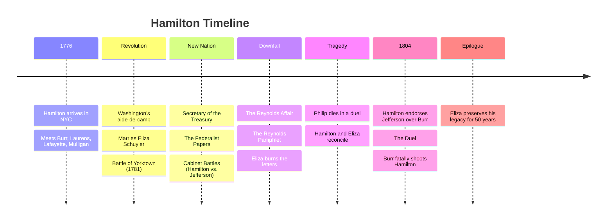

---
tags:
  - overview
  - musical
  - hamilton
---

# Hamilton — Musical Overview
> Song reference guide for English learning notes

---

## About the Musical

| Detail | Info |
|--------|------|
| **Based on** | *Alexander Hamilton* (2004 biography by Ron Chernow) |
| **Music, Lyrics & Book by** | Lin-Manuel Miranda |
| **Type** | Sung-through musical (almost entirely sung/rapped, very little spoken dialogue) |
| **Premiere** | January 20, 2015 (Off-Broadway) / July 13, 2015 (Broadway) |
| **Stars (Original Cast)** | Lin-Manuel Miranda (Hamilton), Leslie Odom Jr. (Burr), Phillipa Soo (Eliza), Renée Elise Goldsberry (Angelica), Daveed Diggs (Lafayette/Jefferson) |
| **Awards** | 11 Tony Awards (including Best Musical), Pulitzer Prize for Drama, Grammy for Best Musical Theater Album |
| **Style** | Hip-hop, R&B, pop, traditional Broadway show tunes |
| **Film** | *Hamilton* (2020, filmed stage production on Disney+) |

> **Is it a musical?** YES. Absolutely, unambiguously. It is one of the most successful musicals of the 21st century. It just uses **hip-hop and rap** instead of traditional musical theater songs, which was revolutionary.

---

## Story Summary

*Hamilton* tells the life story of **Alexander Hamilton**: one of America's Founding Fathers, from his arrival in New York as an immigrant orphan to his death in a duel with **Aaron Burr**.

### Act 1 — The Revolution (1776:1789)

Alexander Hamilton arrives in New York as a brilliant, ambitious immigrant from the Caribbean. He meets **Aaron Burr**, who advises him: "Talk less, smile more, don't let them know what you're against or what you're for."

Hamilton joins the **American Revolution**, becoming George Washington's right-hand man. Along the way, he marries **Eliza Schuyler**, while her sister **Angelica** secretly suppresses her love for him.

At the **Battle of Yorktown** (1781), Hamilton leads a crucial bayonet charge that wins the battle. After the war, Hamilton co-authors *The Federalist Papers* and becomes the first **Secretary of the Treasury**.

### Act 2 — The Legacy (1789:1804)

The second act covers Hamilton's political career, his downfall, and his death:

- **Cabinet Battles**: Hamilton (Secretary of Treasury) vs. Jefferson (Secretary of State) debate in rap battles
- **The Reynolds Affair**: Hamilton has an affair with **Maria Reynolds**. When blackmailed, he publishes the **Reynolds Pamphlet** to prove he's not embezzling: destroying his own reputation to save his political career
- **Eliza's Heartbreak**: Eliza burns all of Hamilton's letters, trying to erase herself from history ("Burn")
- **Philip's Death**: Hamilton's son **Philip** dies in a duel defending his father's honor. Hamilton and Eliza reconcile in grief
- **The Duel**: In the 1800 election, Hamilton endorses Jefferson over Burr. Burr challenges Hamilton to a duel. Hamilton fires his pistol into the air; Burr shoots him fatally

### The Epilogue

The musical ends with **"Who Lives, Who Dies, Who Tells Your Story"**: a reflection on historical legacy. Eliza, who outlived Hamilton by 50 years, sings about how she preserved his memory through 50 years of work.

---

## Complete Song List

### Act I
| # | Song | Character(s) | Context |
|---|------|-------------|---------|
| 1 | Alexander Hamilton | Company | Opening: Hamilton's origins in the Caribbean |
| 2 | Aaron Burr, Sir | Hamilton, Burr, Laurens, Lafayette, Mulligan | Hamilton meets Burr at college |
| 3 | My Shot | Hamilton | Hamilton's defining anthem: "I am not throwing away my shot" |
| 4 | The Story of Tonight | Hamilton, Laurens, Lafayette, Mulligan | The friends pledge to the revolution |
| 5 | The Schuyler Sisters | Angelica, Eliza, Peggy | The three sisters arrive in New York |
| 6 | Farmer Refuted | Seabury, Hamilton | A loyalist argues against revolution |
| 7 | You'll Be Back | King George III | King George threatens the colonies (comic relief) |
| 8 | Right Hand Man | Washington, Hamilton | Washington recruits Hamilton as his aide |
| 9 | A Winter's Ball | Burr, Hamilton | The men attend a ball |
| 10 | Helpless | Eliza, Hamilton, Angelica | Eliza falls in love with Hamilton; he proposes |
| 11 | Satisfied | Angelica | Angelica reveals she loves Hamilton but stepped aside |
| 12 | Wait for It | Burr | Burr's philosophy: patience and caution |
| 13 | Stay Alive | Company | The war continues |
| 14 | Ten Duel Commandments | Company | Rules for conducting a duel |
| 15 | That Would Be Enough | Eliza | Eliza tells Hamilton she's pregnant |
| 16 | Guns and Ships | Lafayette, Washington | France joins the war; Lafayette's rapid-fire rap |
| 17 | History Has Its Eyes on You | Washington | Washington advises Hamilton about legacy |
| 18 | Yorktown (The World Turned Upside Down) | Hamilton, Lafayette | The decisive American victory |
| 19 | What Comes Next? | King George | King George mocks American independence |
| 20 | Dear Theodosia | Hamilton, Burr | Both men sing to their newborn children |
| 21 | Non-Stop | Company | Hamilton writes his way to power; Act 1 closer |

### Act II
| # | Song | Character(s) | Context |
|---|------|-------------|---------|
| 22 | What'd I Miss? | Jefferson | Jefferson returns from France (Act 2 opener) |
| 23 | Cabinet Battle #1 | Hamilton, Jefferson, Washington | Rap battle over financial policy |
| 24 | Take a Break | Eliza, Philip, Angelica | Eliza begs Hamilton to slow down |
| 25 | Say No to This | Hamilton, Maria Reynolds | Hamilton's affair |
| 26 | The Room Where It Happens | Burr | Burr's frustration at being excluded from power |
| 27 | Cabinet Battle #2 | Hamilton, Jefferson, Washington | Debate over French alliance |
| 28 | Washington on Your Side | Jefferson, Madison, Burr | The political enemies unite against Hamilton |
| 29 | One Last Time | Washington, Hamilton | Washington's farewell address |
| 30 | I Know Him | King George | King George mocks John Adams |
| 31 | The Reynolds Pamphlet | Company | Hamilton publicly confesses his affair |
| 32 | Burn | Eliza | Eliza destroys Hamilton's letters in fury |
| 33 | Blow Us All Away | Philip | Philip (age 19) defends his father's honor |
| 34 | Stay Alive (Reprise) | Philip, Hamilton, Eliza | Philip dies from the duel |
| 35 | It's Quiet Uptown | Hamilton, Eliza | Reconciliation after Philip's death |
| 36 | The Election of 1800 | Jefferson, Madison, Burr, Hamilton | Hamilton endorses Jefferson over Burr |
| 37 | Your Obedient Servant | Hamilton, Burr | The exchange of duel challenge letters |
| 38 | Best of Wives and Best of Women | Hamilton | Hamilton reflects on Eliza the night before the duel |
| 39 | The World Was Wide Enough | Hamilton, Burr | The duel: Burr shoots Hamilton |
| 40 | Who Lives, Who Dies, Who Tells Your Story | Company, Eliza | The epilogue: legacy and memory |

---

## Themes for English Learning

| Theme | Example |
|-------|---------|
| **Rhetorical questions** | "How does a bastard, orphan, son of a whore..." |
| **First conditional** | "If you stand for nothing, Burr, what'll you fall for?" |
| **Persuasion language** | "I'm asking you to be my right-hand man" |
| **Political vocabulary** | "treasury," "constitution," "cabinet," "endorse" |
| **Idioms** | "throw away my shot," "the room where it happens," "history has its eyes on you" |
| **Contrast: formal vs. hip-hop register** | The Cabinet Battles use rap for political debate |
| **Narrative perspective** | The entire story is narrated by Burr (Hamilton's killer) |

---

## Sources

- Miranda, L. (2015). *Hamilton* [Musical]..
- Chernow, R. (2004). *Alexander Hamilton* [Biography]. Penguin Press.
- *Hamilton* (2020). [Filmed stage production]. Disney+.
- Wikipedia contributors. "Hamilton (musical)." *Wikipedia*. Retrieved July 24, 2026, from https://en.wikipedia.org/wiki/Hamilton_(musical)
