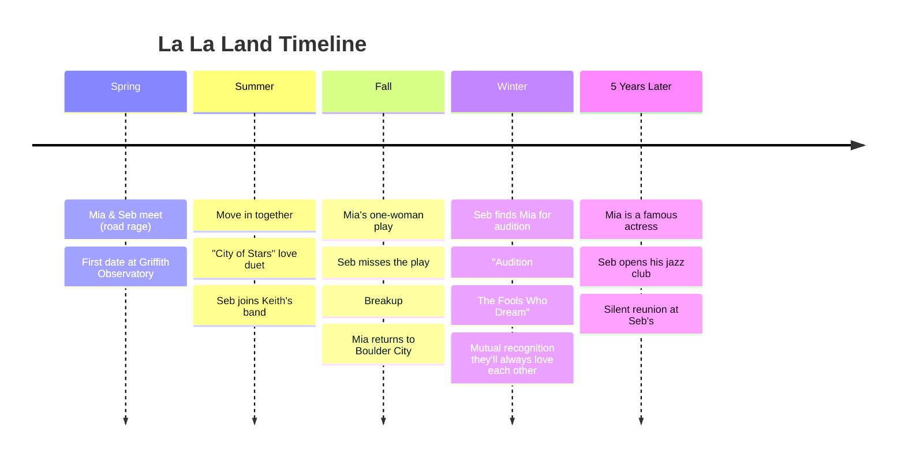

---
tags:
  - overview
  - musical
  - la-la-land
---

# La La Land — Musical Overview
> Song reference guide for English learning notes

---

## About the Musical

| Detail | Info |
|--------|------|
| **Type** | 2016 musical romantic drama film (not a stage musical) |
| **Written & Directed by** | Damien Chazelle |
| **Music by** | Justin Hurwitz |
| **Lyrics by** | Benj Pasek, Justin Paul |
| **Stars** | Ryan Gosling (Sebastian), Emma Stone (Mia) |
| **Premiere** | August 31, 2016 (Venice Film Festival) |
| **Box office** | $447 million worldwide |
| **Awards** | 6 Oscars (from 14 nominations, including Best Director, Best Actress). 7 Golden Globes (record) |
| **Stage adaptation** | In development (announced 2023) |

> **Is it a musical?** Yes. While not a traditional Broadway musical, *La La Land* is widely classified as a modern musical film: it uses songs to advance the story, follows the musical structure of opening number → love duet → reprise → finale, and draws heavy visual inspiration from classic Hollywood musicals like *Singin' in the Rain* and *An American in Paris*.

---

## Story Summary

Set in modern-day **Los Angeles**, *La La Land* follows two dreamers torn between love and ambition.

### Mia & Sebastian

**Mia Dolan** is an aspiring actress working as a barista on a Warner Bros. studio lot, attending endless auditions where no one pays attention. **Sebastian "Seb" Wilder** is a jazz pianist obsessed with classic jazz, dreaming of opening his own jazz club.

They meet through a series of chance encounters: road rage, a party, and a piano improvisation. Despite their initial friction, they fall in love while encouraging each other to chase their dreams.

### The Conflict

Seb joins a pop-jazz band led by his friend **Keith** (John Legend), trading his artistic integrity for a steady income. Mia writes a one-woman play, but on opening night, Seb forgets to attend (due to a photoshoot). The play flops, and Mia overhears audience members mocking her performance.

Heartbroken and humiliated, Mia breaks up with Seb and returns to her hometown of **Boulder City, Nevada**.

### The Resolution

Seb receives a call from a casting director who saw Mia's play and wants her to audition for a major film. He drives to Boulder City to find her. At the audition, Mia sings about her aunt who inspired her to dream ("Audition: The Fools Who Dream").

Both succeed: Mia becomes a famous actress, Seb opens his jazz club ("Seb's"). But their relationship does not survive the years apart.

### The Epilogue

Five years later, a married and successful Mia stumbles into Seb's jazz club with her husband. Seb recognizes her and plays their piano theme. The film erupts into a breathtaking fantasy sequence: what their life together would have looked like if they had stayed together. Then: reality. They share a silent smile of acknowledgment. Love endures, even if the relationship did not.

---

## Song List (Major Numbers)

| # | Song | Character(s) | Context |
|---|------|-------------|---------|
| 1 | Another Day of Sun | Ensemble | Opening number: LA traffic, dreamers chasing success |
| 2 | Someone in the Crowd | Mia's Friends | Mia's roommates urge her to go to a party |
| 3 | Mia & Sebastian's Theme | Sebastian (piano) | The love theme, first played at the restaurant |
| 4 | A Lovely Night | Mia & Seb | They walk home together, denying their chemistry |
| 5 | City of Stars | Sebastian | Seb sings about hope and love by the pier |
| 6 | City of Stars (Duet) | Mia & Seb | They sing together after moving in |
| 7 | Start a Fire | Keith & Seb's Band | Seb's band performs pop-jazz on tour |
| 8 | Audition (The Fools Who Dream) | Mia | Mia's audition song about her aunt who dreamed |
| 9 | Epilogue | Orchestra / Mia & Seb | The fantasy: what their life could have been |
| 10 | The End | Orchestra | Final piano notes |

---

## Themes for English Learning

| Theme | Example |
|-------|---------|
| **Dreams vs. Reality** | "Here's to the ones who dream, foolish as they may seem" |
| **Idioms about ambition** | "make it big," "big break," "sell out" |
| **Conditional / hypothetical** | The entire Epilogue is a "what if" sequence |
| **Present Perfect for life experience** | "I've always wanted to..." |
| **Contractions in speech** | Mia and Seb speak casually with heavy contractions |

---

## Sources

- Chazelle, D. (Writer & Director). (2016). *La La Land* [Film]. Summit Entertainment / Lionsgate.
- Hurwitz, J. (Music) & Pasek, B. and Paul, J. (Lyrics). (2016). *La La Land: The Motion Picture Soundtrack* [Soundtrack]. Interscope Records.
- Wikipedia contributors. "La La Land." *Wikipedia*. Retrieved July 24, 2026, from https://en.wikipedia.org/wiki/La_La_Land
