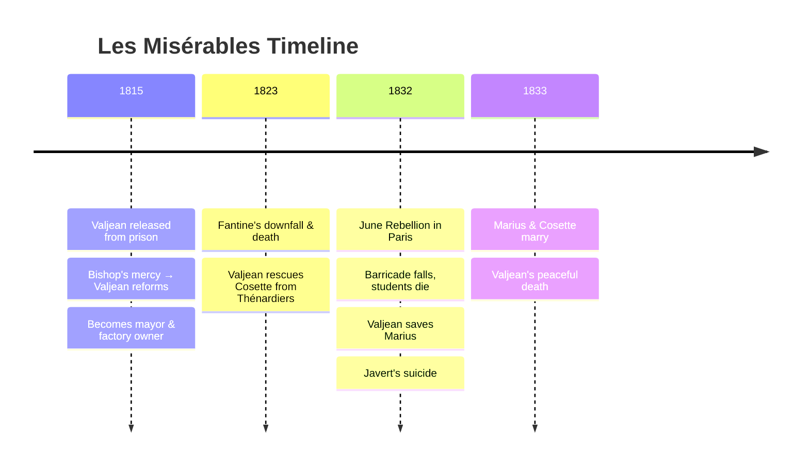

---
tags:
  - overview
  - musical
  - les-miserables
---

# Les Misérables — Musical Overview
> Song reference guide for English learning notes

---

## About the Musical

| Detail                     | Info                                                                |
| -------------------------- | ------------------------------------------------------------------- |
| **Based on**               | *Les Misérables* (1862 novel by Victor Hugo)                        |
| **Music by**               | Claude-Michel Schönberg                                             |
| **Original French lyrics** | Alain Boublil, Jean-Marc Natel                                      |
| **English lyrics**         | Herbert Kretzmer                                                    |
| **Premiere**               | 1980 (Paris, French concept album) / 1985 (London, English version) |
| **Film adaptation**        | 2012 (directed by Tom Hooper)                                       |
| **Status**                 | Longest-running musical in West End history                         |

---

## Story Summary

Set in early 19th-century France (1815:1833), *Les Misérables* follows **Jean Valjean**, a convict imprisoned 19 years for stealing bread. After a bishop's act of mercy inspires him to reform, Valjean breaks parole, changes his identity, and rebuilds his life as a factory owner and mayor.

His path intersects with:
- **Fantine**: A factory worker driven to prostitution, who dies leaving her daughter Cosette in Valjean's care
- **Cosette**: Fantine's daughter, whom Valjean adopts and raises
- **Javert**: A police inspector who hunts Valjean for decades in a single-minded pursuit of "justice"
- **Marius**: A young revolutionary student who falls in love with the adult Cosette
- **Éponine**: A girl from a criminal family, who secretly loves Marius
- **Enjolras**: A charismatic student leader of the June 1832 rebellion
- **The Thénardiers**: Comic-relief innkeepers turned criminals

The story builds to the **June 1832 Paris Rebellion**, where students erect barricades in the streets. Multiple characters die, Valjean rescues Marius, and Javert: unable to reconcile his rigid sense of justice with Valjean's mercy, takes his own life.

---

## Complete Song List

### Prologue
| # | Song | Character(s) |
|---|------|-------------|
| 1 | Work Song (Look Down) | Chain Gang, Valjean, Javert |
| 2 | Valjean Arrested / Valjean Forgiven | Valjean, Bishop |
| 3 | What Have I Done? (Valjean's Soliloquy) | Valjean |

### Act I
| # | Song | Character(s) |
|---|------|-------------|
| 4 | At the End of the Day | Fantine, Workers, Valjean |
| 5 | ⭐ **I Dreamed a Dream** | **Fantine** |
| 6 | Lovely Ladies | Sailors, Prostitutes, Fantine |
| 7 | Fantine's Arrest | Bamatabois, Fantine, Javert, Valjean |
| 8 | Who Am I? | Valjean |
| 9 | Fantine's Death (Come to Me) | Fantine, Valjean |
| 10 | The Confrontation | Valjean, Javert |
| 11 | Castle on a Cloud | Little Cosette |
| 12 | Master of the House | Thénardier, Madame Thénardier |
| 13 | The Bargain / The Waltz of Treachery | Valjean, Cosette, Thénardiers |
| 14 | Look Down | Gavroche, Students |
| 15 | The Robbery | Thénardiers, Marius, Éponine |
| 16 | Stars | Javert |
| 17 | Éponine's Errand | Éponine, Marius |
| 18 | The ABC Café / Red and Black | Enjolras, Marius, Students |
| 19 | Do You Hear the People Sing? | Enjolras, Marius, Students |
| 20 | In My Life / A Heart Full of Love | Cosette, Marius, Éponine |
| 21 | The Attack on Rue Plumet | Thénardiers, Éponine, Valjean |
| 22 | ⭐ **One Day More** | **Full Cast** |

### Act II
| # | Song | Character(s) |
|---|------|-------------|
| 23 | Building the Barricade | Enjolras, Javert, Students |
| 24 | On My Own | Éponine |
| 25 | At the Barricade / Upon These Stones | Enjolras, Students |
| 26 | Javert at the Barricade / Little People | Javert, Gavroche |
| 27 | A Little Fall of Rain | Éponine, Marius |
| 30 | The First Attack | Enjolras, Valjean, Javert |
| 31 | Drink with Me | Grantaire, Students |
| 32 | Bring Him Home | Valjean |
| 33 | Dawn of Anguish | Enjolras, Students |
| 34 | The Second Attack (Death of Gavroche) | Gavroche, Students |
| 35 | The Final Battle | Enjolras, Students |
| 36 | Dog Eats Dog | Thénardier |
| 37 | Javert's Suicide | Javert |
| 38 | Turning | Women |
| 39 | Empty Chairs at Empty Tables | Marius |
| 40 | Every Day / Valjean's Confession | Cosette, Marius, Valjean |
| 41 | Wedding Chorale / Beggars at the Feast | Wedding Guests, Thénardiers |
| 42 | Valjean's Death | Valjean, Fantine, Marius, Cosette |
| 43 | Do You Hear the People Sing? (Epilogue) | Full Cast |

---

## ⭐ Songs Studied in This Vault

| Song | Character | Context in Story | Lesson File |
|------|-----------|-----------------|------------|
| **I Dreamed a Dream** | Fantine | Fantine reflects on her lost youth and dreams after losing her job and being driven to prostitution (Act I) | [[05_I_Dreamed_a_Dream]] |
| **One Day More** | Full Cast | The night before the June Rebellion: every character prepares for what tomorrow brings (End of Act I) | [[22_One_Day_More]] |

---

## Sources

- Boublil, A. & Schönberg, C.-M. (1980/1985). *Les Misérables* [Musical].
- Hugo, V. (1862). *Les Misérables* [Novel].
- Wikipedia contributors. "Les Misérables (musical)." *Wikipedia*. Retrieved July 24, 2026, from https://en.wikipedia.org/wiki/Les_Mis%C3%A9rables_(musical)
- *Les Misérables* (2012 film). Directed by Tom Hooper. Universal Pictures.
