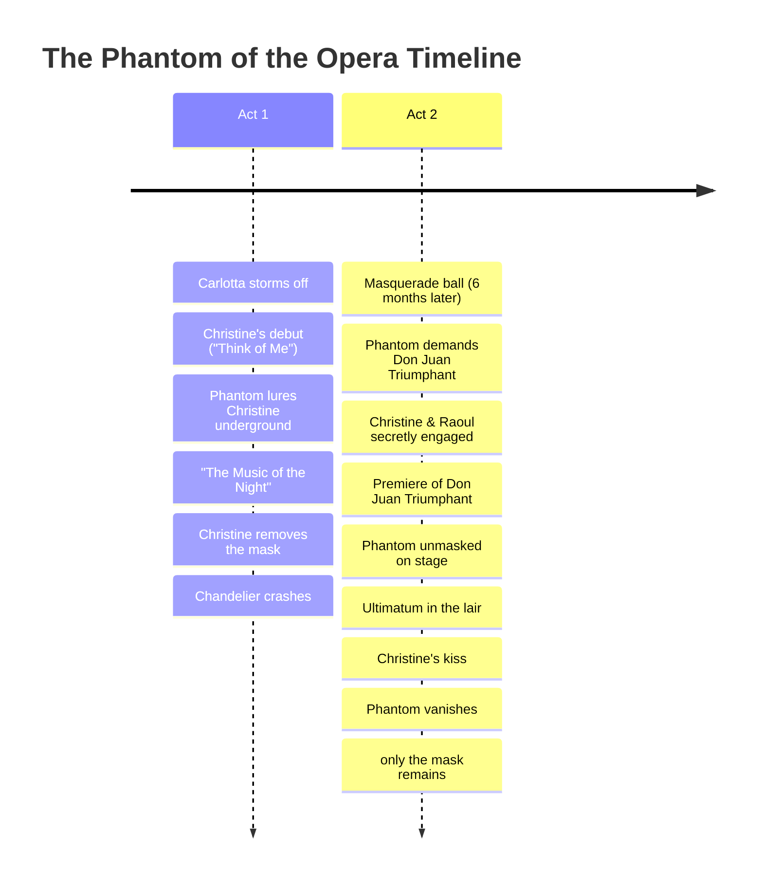

---
tags:
  - overview
  - musical
  - phantom-of-the-opera
---

# The Phantom of the Opera — Musical Overview
> Song reference guide for English learning notes

---

## About the Musical

| Detail | Info |
|--------|------|
| **Based on** | *Le Fantôme de l'Opéra* (1910 novel by Gaston Leroux) |
| **Music by** | Andrew Lloyd Webber |
| **Lyrics by** | Charles Hart (additional lyrics: Richard Stilgoe) |
| **Book by** | Andrew Lloyd Webber, Richard Stilgoe |
| **Premiere** | October 9, 1986 (West End, London) / January 26, 1988 (Broadway) |
| **Original Cast** | Michael Crawford (Phantom), Sarah Brightman (Christine), Steve Barton (Raoul) |
| **Film adaptation** | 2004 (directed by Joel Schumacher, starring Gerard Butler) |
| **Status** | Longest-running show in Broadway history (16,000+ performances before closing April 2023) |
| **Worldwide gross** | Over $6 billion (seen by 140 million people in 183 cities) |

---

## Story Summary

Set in **1881 Paris**, *The Phantom of the Opera* is a gothic romance about obsession, music, and beauty.

### Act 1 — The Angel of Music

The Paris Opera House is haunted by a mysterious figure known as the **Phantom**: a brilliant but disfigured musical genius who lives in the subterranean labyrinth beneath the opera house.

**Christine Daaé** is a young chorus girl who believes she is being taught to sing by the "Angel of Music," sent by her dead father. In reality, it is the Phantom. When the opera's prima donna **Carlotta** storms off, Christine is thrust into the spotlight and triumphs overnight.

**Raoul, Vicomte de Chagny**: Christine's childhood friend: sees her perform and falls in love with her. But the Phantom lures Christine to his underground lair through her mirror, where he reveals himself as her "teacher." Christine is fascinated but terrified, especially when she removes his mask and sees his deformed face.

### Act 2 — Obsession and Tragedy

The Phantom demands Christine star in his original opera, *Don Juan Triumphant*. When the opera managers refuse, a series of violent events escalate: the stagehand Buquet is found hanged, and the chandelier crashes onto the stage.

Christine and Raoul become secretly engaged. The Phantom, overhearing their love duet, is devastated and vows revenge.

At the premiere of *Don Juan Triumphant*, the Phantom replaces the lead tenor on stage. Christine realizes the truth and removes his mask before the horrified audience. The Phantom drags Christine back to his lair.

### The Finale — Choice

In the underground lair, the Phantom captures Raoul in a Punjab lasso. He gives Christine an ultimatum: **stay with him, or Raoul dies**.

Christine kisses the Phantom: the first act of compassion he has ever received. Overwhelmed, the Phantom releases both Christine and Raoul. As the mob closes in, the Phantom vanishes, leaving only his mask behind.

---

## Complete Song List

### Prologue & Act I
| # | Song | Character(s) | Context |
|---|------|-------------|---------|
| 1 | Prologue | Auctioneer, Raoul | 1919 auction: the chandelier rises, flashing back to 1881 |
| 2 | Overture | Orchestra | Iconic organ theme, chandelier ascends |
| 3 | Hannibal Rehearsal | Carlotta, Chorus | Rehearsal of a fictional opera |
| 4 | Think of Me | Christine, Raoul | Christine's triumphant debut; Raoul recognizes her |
| 5 | Angel of Music | Christine, Meg | Christine tells Meg about her unseen teacher |
| 6 | Little Lotte | Christine, Raoul | Childhood memories of Christine's father's stories |
| 7 | The Mirror / Angel of Music (Reprise) | Phantom, Christine | The Phantom appears in Christine's mirror |
| 8 | The Phantom of the Opera | Phantom, Christine | Boat ride across the underground lake to his lair |
| 9 | The Music of the Night | Phantom | The Phantom seduces Christine with music |
| 10 | I Remember | Christine | Christine awakens in the lair, recalls the music box |
| 11 | Stranger Than You Dreamt It | Phantom | The Phantom's vulnerable plea after being unmasked |
| 12 | Magical Lasso | Buquet, Madame Giry | Buquet describes the Phantom's Punjab lasso |
| 13 | Notes | Managers, Carlotta, Raoul, Phantom | Arguments over the Phantom's written demands |
| 14 | Prima Donna | Firmin, André | The managers flatter Carlotta |
| 15 | Poor Fool, He Makes Me Laugh | Carlotta, Phantom | Performance of Il Muto: Buquet's body drops from rafters |
| 16 | Why Have You Brought Me Here? | Christine, Raoul | Christine escapes to the rooftop |
| 17 | All I Ask of You | Raoul, Christine | Raoul promises to love and protect Christine |
| 18 | All I Ask of You (Reprise) | Phantom | The Phantom overhears: heartbroken, swears revenge |

### Act II
| # | Song | Character(s) | Context |
|---|------|-------------|---------|
| 19 | Entr'acte | Orchestra | Instrumental opening of Act 2 |
| 20 | Masquerade | Full Cast | Masquerade ball, 6 months later |
| 21 | Why So Silent? | Phantom | Phantom appears as Red Death, demands his opera |
| 22 | Notes (Reprise) | Managers, Carlotta, Raoul | Planning to trap the Phantom |
| 23 | Twisted Every Way | Christine | Christine torn between love and duty |
| 24 | Wishing You Were Somehow Here Again | Christine | Christine visits her father's grave |
| 25 | Wandering Child | Phantom, Christine | The Phantom tries to lure Christine at the mausoleum |
| 26 | Don Juan Triumphant | Phantom, Christine | The opera-within-an-opera performance |
| 27 | The Point of No Return | Phantom, Christine | Final duet: Christine unmasks the Phantom on stage |
| 28 | Down Once More / Track Down This Murderer | Full Cast | Mob hunts the Phantom underground |
| 29 | Finale | Phantom, Christine, Raoul | The ultimatum, the kiss, the vanishing |

---

## Themes for English Learning

| Theme | Example Songs |
|-------|-------------|
| **Possessive pronouns** ("my", "your") | "All I Ask of You" (my love, your hand) |
| **Imperatives & commands** | "Think of Me," "Wishing You Were..." |
| **Conditionals** | "If you stay with me..." (the ultimatum) |
| **Gothic / dramatic vocabulary** | "subterranean," "labyrinth," "masquerade" |
| **Formal register (Raoul) vs. raw emotion (Phantom)** | Two different English registers for the same woman |

---

## Sources

- Lloyd Webber, A. (1986). *The Phantom of the Opera* [Musical].
- Leroux, G. (1910). *Le Fantôme de l'Opéra* [Novel].
- *The Phantom of the Opera* (2004 film). Directed by Joel Schumacher. Warner Bros.
- Wikipedia contributors. "The Phantom of the Opera (1986 musical)." *Wikipedia*. Retrieved July 24, 2026, from https://en.wikipedia.org/wiki/The_Phantom_of_the_Opera_(1986_musical)
