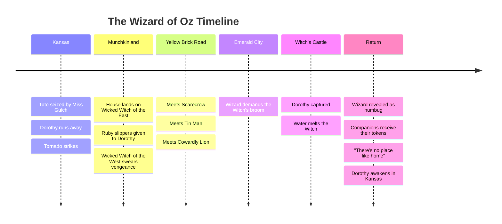

---
tags:
  - overview
  - musical
  - wizard-of-oz
---

# The Wizard of Oz — Musical Overview
> Song reference guide for English learning notes

---

## About the Musical

| Detail | Info |
|--------|------|
| **Based on** | *The Wonderful Wizard of Oz* (1900 novel by L. Frank Baum) |
| **Type** | 1939 musical fantasy film (MGM) |
| **Directors** | Victor Fleming (primary), King Vidor, others |
| **Music by** | Harold Arlen |
| **Lyrics by** | E.Y. "Yip" Harburg |
| **Score** | Herbert Stothart |
| **Stars** | Judy Garland (Dorothy), Ray Bolger (Scarecrow), Jack Haley (Tin Man), Bert Lahr (Cowardly Lion), Margaret Hamilton (Wicked Witch) |
| **Premiere** | August 25, 1939 |
| **Awards** | 2 Oscars (Best Original Song: "Over the Rainbow", Best Original Score). Nominated for Best Picture (lost to *Gone with the Wind*) |

> **Cultural impact:** "Over the Rainbow" was named the #1 greatest movie song of all time by the American Film Institute. The film is one of the most-watched films in history, broadcast annually on television for decades.

---

## Story Summary

Set in rural **Kansas** and the magical **Land of Oz**, this is a classic hero's journey about finding courage, heart, and home.

### Kansas

**Dorothy Gale** lives on a Kansas farm with her Aunt Em and Uncle Henry. Her dog **Toto** is seized by the mean **Miss Gulch**, who has a sheriff's order to take him away. Toto escapes and returns to Dorothy, who runs away to protect him. A kind charlatan fortune teller, **Professor Marvel**, convinces Dorothy that Aunt Em is heartbroken with worry, so she rushes home just as a **tornado** strikes.

Dorothy is knocked unconscious inside the farmhouse. When she awakens, the house has been transported to a magical land.

### Oz

The house lands in **Munchkinland**, crushing the **Wicked Witch of the East**. The grateful **Munchkins** celebrate, and **Glinda the Good Witch** gives Dorothy the witch's enchanted **ruby slippers**. But the **Wicked Witch of the West** (sister of the dead witch) swears vengeance.

Glinda tells Dorothy to **follow the yellow brick road** to the **Emerald City**, where the **Wizard of Oz** might help her get home.

### The Companions

Along the way, Dorothy meets three companions, each seeking something from the Wizard:

| Character | Seeks | Song |
|-----------|-------|------|
| **Scarecrow** | A brain | "If I Only Had a Brain" |
| **Tin Man** | A heart | "If I Only Had a Heart" |
| **Cowardly Lion** | Courage | "If I Only Had the Nerve" |

### The Quest

The Wizard demands they bring him the **Wicked Witch's broomstick** before he'll grant their wishes. The group is captured by the Witch's flying monkeys. Dorothy kills the Witch by accidentally splashing her with water (she melts).

They return to the Wizard, but **Toto pulls back a curtain**, revealing the Wizard is just an ordinary man operating machinery. He is a **"humbug"** (a fraud), but he gives the companions tokens proving they already had what they sought:
- Scarecrow gets a diploma (he was already smart)
- Tin Man gets a testimonial (he was already kind)
- Cowardly Lion gets a medal (he was already brave)

### Home

Glinda reveals that Dorothy always had the power to return home using the **ruby slippers**: she just had to discover it for herself. Dorothy clicks her heels three times and repeats: **"There's no place like home."**

She awakens in her own bed in Kansas. It was all (seemingly) a dream.

---

## Complete Song List (1939 Film)

| # | Song | Character(s) | Context |
|---|------|-------------|---------|
| 1 | Over the Rainbow | Dorothy | Dorothy dreams of a better place "somewhere over the rainbow" |
| 2 | Come Out, Come Out | Glinda, Munchkins | The Munchkins greet Dorothy after the house lands |
| 3 | Ding-Dong! The Witch Is Dead | Munchkins | Celebration of the Wicked Witch of the East's death |
| 4 | Follow the Yellow Brick Road / You're Off to See the Wizard | Munchkins | Dorothy begins her journey |
| 5 | If I Only Had a Brain | Scarecrow | Scarecrow sings about wanting intelligence |
| 6 | We're Off to See the Wizard | Dorothy & Scarecrow | Traveling song (repeated with each new companion) |
| 7 | If I Only Had a Heart | Tin Man | Tin Man sings about wanting emotions |
| 8 | If I Only Had the Nerve | Cowardly Lion | Lion sings about wanting bravery |
| 9 | If I Were King of the Forest | Cowardly Lion | In the Emerald City, Lion fantasizes about being king |
| 10 | The Merry Old Land of Oz | Citizens of Emerald City | The group is pampered in the Wizard's salon |
| 11 | Over the Rainbow (Reprise) | Dorothy | **Deleted from final film.** Dorothy sings in the Witch's castle (too emotionally intense) |

### Deleted Songs
| Song | Status |
|------|--------|
| The Jitterbug | Cut for time. Footage lost, but audio survived |
| Ding-Dong! The Witch Is Dead (Triumph reprise) | Cut. Only stills and audio survive |
| Over the Rainbow (Reprise) | Cut for being too emotional. Audio from rehearsals survived |

---

## Themes for English Learning

| Theme | Example |
|-------|---------|
| **Conditional "If I only had..."** | Scarecrow, Tin Man, Lion each sing this pattern |
| **"There's no place like home"** | One of the most famous English idioms from film |
| **Simple present for storytelling** | The narrator's voice throughout |
| **Metaphor: "Over the Rainbow"** | A place of hope, dreams, and longing |
| **Vocabulary: emotions & qualities** | Brain (intelligence), Heart (compassion), Nerve (courage) |

---

## Sources

- *The Wizard of Oz* (1939). Directed by Victor Fleming. MGM.
- Arlen, H. (Music) & Harburg, E.Y. (Lyrics). (1939). *The Wizard of Oz: Original Motion Picture Soundtrack* [Soundtrack]. MGM Records.
- Baum, L.F. (1900). *The Wonderful Wizard of Oz* [Novel].
- Wikipedia contributors. "The Wizard of Oz (1939 film)." *Wikipedia*. Retrieved July 24, 2026, from https://en.wikipedia.org/wiki/The_Wizard_of_Oz
- Wikipedia contributors. "The Wizard of Oz (soundtrack)." *Wikipedia*. Retrieved July 24, 2026, from https://en.wikipedia.org/wiki/The_Wizard_of_Oz_(soundtrack)
