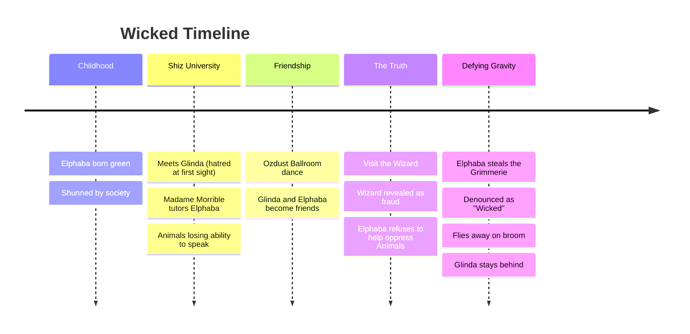

---
tags:
  - overview
  - musical
  - wicked
---

# Wicked — Musical Overview
> Song reference guide for English learning notes

---

## About the Musical

| Detail | Info |
|--------|------|
| **Based on** | *Wicked: The Life and Times of the Wicked Witch of the West* (1995 novel by Gregory Maguire) |
| **Stage format** | Broadway musical (premiered October 30, 2003) |
| **Film format** | *Wicked* (2024 film, Part 1), *Wicked: For Good* (2025 film, Part 2) |
| **Music & Lyrics by** | Stephen Schwartz |
| **Book by** | Winnie Holzman |
| **Stars (Film)** | Cynthia Erivo (Elphaba), Ariana Grande (Glinda), Jonathan Bailey (Fiyero) |
| **Original Broadway Cast** | Idina Menzel (Elphaba), Kristin Chenoweth (Glinda) |
| **Awards** | 3 Tony Awards (including Best Musical nomination), 1 Grammy (Best Musical Show Album) |
| **Status** | 4th longest-running Broadway show in history |

> **Connection to The Wizard of Oz:** *Wicked* is a prequel / parallel story to *The Wizard of Oz* (1939). It tells the story from the Wicked Witch's perspective, reframing her as a misunderstood outsider rather than a villain. The 2024 film covers **Act 1 only**; *Wicked: For Good* (2025) covers Act 2.

---

## Story Summary

Set in the **Land of Oz**, *Wicked* asks the question: "What if the Wicked Witch of the West wasn't actually wicked?"

### The Green Girl

**Elphaba Thropp** is born with bright green skin, the result of her mother's affair with a traveling salesman who gave her a green elixir. Shunned from birth, Elphaba grows up as an outcast. She escorts her younger, paraplegic sister **Nessarose** to **Shiz University**, where Elphaba's explosive magical powers attract the attention of **Madame Morrible**, the Dean of Sorcery.

### The Roommate

Elphaba is forced to share a room with **Galinda Upland** (later "Glinda"), a popular, blonde, image-obsessed girl. The two clash immediately. Their theme of mutual hatred: **"What Is This Feeling?"** (loathing, unadulterated loathing).

But when Galinda plays a cruel prank on Elphaba at a party, then feels guilty and dances with her, the two begin an unlikely friendship. Galinda shortens her name to "Glinda" in solidarity with a professor who kept mispronouncing it.

### The Wizard's Betrayal

Elphaba dreams of meeting the **Wizard of Oz**, believing he will help her fight discrimination against **Animals** (talking animals who are losing their ability to speak). But when Elphaba and Glinda visit the Wizard, Elphaba discovers the terrible truth: the Wizard is a fraud with no real magic, and **he is the one behind the Animals' oppression**. He wants Elphaba to use her magic to further subjugate them.

Elphaba refuses. She steals the **Grimmerie** (a sacred spellbook) and escapes. Madame Morrible denounces her as a "Wicked Witch." Elphaba levitates a broom and flies away, choosing to fight the Wizard alone.

Glinda stays behind, choosing political comfort over rebellion. The two friends share a tearful farewell.

> The 2024 film ends here (Act 1). Act 2 (in *Wicked: For Good*, 2025) continues the story through to the events of *The Wizard of Oz*.

---

## Complete Song List

> The 2024 film includes all of Act 1. Songs below reflect the stage musical's full song list (both acts), as the film adapts the same material.

### Act I (covered in 2024 film)
| # | Song | Character(s) | Context |
|---|------|-------------|---------|
| 1 | No One Mourns the Wicked | Glinda, Citizens | Glinda addresses the crowd after the Witch's death (flash-forward frame) |
| 2 | Dear Old Shiz | Glinda | Glinda reminiscences about Shiz University |
| 3 | The Wizard and I | Elphaba | Elphaba dreams of meeting the Wizard ("I'll be so happy I could melt") |
| 4 | What Is This Feeling? | Elphaba & Glinda | The two declare mutual, unadulterated loathing |
| 5 | Something Bad | Dr. Dillamond, Elphaba | A talking goat professor warns of trouble coming for Animals |
| 6 | Dancing Through Life | Fiyero, Glinda, Boq, Nessarose | The rebellious prince Fiyero's philosophy: don't care about anything |
| 7 | Popular | Glinda | Glinda gives Elphaba a makeover: her mission to make Elphaba "popular" |
| 8 | I'm Not That Girl | Elphaba | Elphaba realizes she loves Fiyero, but he's with Glinda |
| 9 | One Short Day | Elphaba & Glinda | The two arrive in the Emerald City |
| 10 | A Sentimental Man | The Wizard | The Wizard presents himself as a kindly father figure |
| 11 | ⭐ **Defying Gravity** | **Elphaba** | **Elphaba's defining moment: she refuses the Wizard, levitates a broom, and flies away** |

### Act II (covered in 2025 sequel, *Wicked: For Good*)
| # | Song | Character(s) | Context |
|---|------|-------------|---------|
| 12 | Thank Goodness | Glinda, Citizens | Glinda has become a public figure, engaged to Fiyero |
| 13 | The Wicked Witch of the East | Elphaba & Nessarose | Elphaba helps her sister walk (a bittersweet moment) |
| 14 | Wonderful | The Wizard | The Wizard tries to convince Elphaba to join him |
| 15 | I'm Not That Girl (Reprise) | Glinda | Glinda realizes Fiyero loves Elphaba |
| 16 | As Long as You're Mine | Elphaba & Fiyero | Secret love duet between Elphaba and Fiyero |
| 17 | No Good Deed | Elphaba | Elphaba's fury and despair: "No good deed goes unpunished" |
| 18 | March of the Witch Hunters | Boq, Citizens | The citizens hunt for Elphaba |
| 19 | For Good | Elphaba & Glinda | The emotional farewell: how they changed each other's lives |
| 20 | Finale | Full Cast | Resolution: the truth about the "Wicked Witch" is revealed |

---

## Themes for English Learning

| Theme | Example |
|-------|---------|
| **Contrast adjectives** (good/wicked, popular/unpopular) | "What Is This Feeling?", "Popular", "No One Mourns the Wicked" |
| **First conditional** ("If I...) | "If I were to meet the Wizard..." |
| **Idioms** | "defying gravity," "dancing through life," "no good deed goes unpunished" |
| **Narrative perspective and bias** | The whole musical is about who tells the story |
| **Formal vs. casual register** | Glinda (casual, bubbly) vs. Elphaba (formal, earnest) |
| **Subjunctive mood** | "I wish I could be..." / "If I were..." |

---

## Sources

- Schwartz, S. (Music & Lyrics) & Holzman, W. (Book). (2003). *Wicked* [Musical].
- Maguire, G. (1995). *Wicked: The Life and Times of the Wicked Witch of the West* [Novel].
- Chu, J.M. (Director). (2024). *Wicked* [Film]. Universal Pictures.
- Wikipedia contributors. "Wicked (musical)." *Wikipedia*. Retrieved July 24, 2026, from https://en.wikipedia.org/wiki/Wicked_(musical)
- Wikipedia contributors. "Wicked (2024 film)." *Wikipedia*. Retrieved July 24, 2026, from https://en.wikipedia.org/wiki/Wicked_(2024_film)
