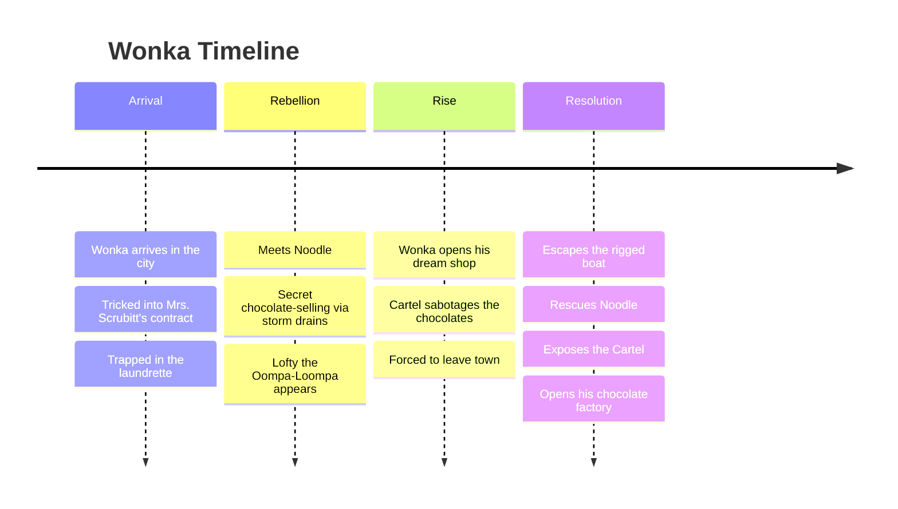

---
tags:
  - overview
  - musical
  - wonka
---

# Wonka — Musical Overview
> Song reference guide for English learning notes

---

## About the Musical

| Detail | Info |
|--------|------|
| **Type** | 2023 musical fantasy film (prequel to *Charlie and the Chocolate Factory*) |
| **Directed by** | Paul King |
| **Music by** | Joby Talbot (score), Neil Hannon (songs) |
| **Stars** | Timothée Chalamet (Wonka), Calah Lane (Noodle), Hugh Grant (Lofty the Oompa-Loompa) |
| **Based on** | Characters created by Roald Dahl |
| **Premiere** | December 15, 2023 |
| **Box office** | $634.5 million worldwide |
| **Context** | Origin story of Willy Wonka, set before the events of *Charlie and the Chocolate Factory* |

---

## Story Summary

Set in an unnamed city in the **early 20th century**, *Wonka* tells the origin story of how a young, optimistic chocolatier became the famous Willy Wonka.

### The Dreamer

Young **Willy Wonka** arrives in the city with nothing but a hatful of dreams, a bag of cocoa beans, and his late mother's chocolate recipes. He dreams of opening a chocolate shop in the Galéries Gourmet, the city's center of chocolate commerce.

But the city is controlled by the **Chocolate Cartel**: three corrupt businessmen (**Slugworth, Fickelgruber, Prodnose**) who monopolize the chocolate trade and bribe the Chief of Police.

### The Trap

Wonka is tricked by **Mrs. Scrubitt**, a laundrette owner who entraps illiterate travelers into indentured servitude through predatory contracts. Wonka finds himself trapped working alongside **Noodle** (a teenage orphan) and four other captives: Abacus Crunch (accountant), Piper Benz (plumber), Larry Chucklesworth (comedian), and Lottie Bell (switchboard operator).

### The Fight

Wonka befriends Noodle, who teaches him to read. Together with the other captives, Wonka starts a secret chocolate-selling operation, using the city's storm drains to evade the police. A tiny **Oompa-Loompa named Lofty** steals Wonka's cocoa beans as retribution for Wonka taking them from Loompaland.

When Wonka finally opens his dream shop, the Cartel sabotages his chocolates, causing customers to become ill. The Cartel forces Wonka to leave town by boat (which they've rigged to explode). Wonka escapes, rescues Noodle, and exposes the Cartel's corruption.

### The Resolution

Wonka and Noodle discover that Noodle is actually Slugworth's niece, abandoned as a baby. They expose the Cartel's crimes, release their chocolate reserves into the city fountain, and reunite Noodle with her mother.

Wonka purchases an abandoned castle and transforms it into his chocolate factory, with Lofty the Oompa-Loompa as his head of tasting.

---

## Complete Song List

| # | Song | Character(s) | Context |
|---|------|-------------|---------|
| 1 | Pure Imagination | Cast | Overture: Wonka's dream of a chocolate world |
| 2 | A Hatful of Dreams | Wonka | Wonka arrives in the city with his dreams |
| 3 | Welcome to Scrubbit's | Mrs. Scrubitt, Bleacher | Scrubitt's deceptive welcome song |
| 4 | You've Never Had Chocolate Like This (Hoverchocs) | Wonka | Wonka introduces his flying chocolates |
| 5 | Scrub Scrub | Mrs. Scrubitt, Laundry Workers | The laundry workers' daily routine |
| 6 | Sweet Tooth | Chief of Police, Cartel | The Cartel bribes the Chief with chocolate |
| 7 | For a Moment | Wonka & Noodle | Wonka and Noodle bond over their dreams |
| 8 | The Letter 'A' | Wonka & Noodle | Noodle teaches Wonka to read the letter A |
| 9 | Oompa Loompa | Lofty | Lofty's revenge song for stolen cocoa beans |
| 10 | A World of Your Own | Wonka | Wonka opens his dream chocolate shop |
| 11 | Sorry, Noodle | Wonka | Wonka apologizes for getting Noodle in trouble |
| 12 | Mamma's Secret | Wonka | Wonka discovers his mother's final message |
| 13 | Pure Imagination (Reprise) | Cast | Finale: Wonka's world becomes reality |
| 14 | Oompa Loompa (Reprise) | Lofty | Post-credits: Lofty narrates the friends' futures |

---

## Themes for English Learning

| Theme | Example |
|-------|---------|
| **Dreams and ambition vocabulary** | "a hatful of dreams," "the world is your imagination" |
| **Imperatives and invitations** | "You've never had chocolate like this!" |
| **Past Simple storytelling** | "She gave me this recipe before she died" |
| **Food and cooking vocabulary** | cocoa, chocolate, ingredients, recipe |
| **Adjectives for description** | "delicious," "magical," "impossible" |

---

## Sources

- King, P. (Director). (2023). *Wonka* [Film]. Warner Bros. Pictures.
- Talbot, J. (Music) & Hannon, N. (Lyrics). (2023). *Wonka: Original Motion Picture Soundtrack* [Soundtrack]. WaterTower Music.
- Dahl, R. (1964). *Charlie and the Chocolate Factory* [Novel].
- Wikipedia contributors. "Wonka (film)." *Wikipedia*. Retrieved July 24, 2026, from https://en.wikipedia.org/wiki/Wonka_(film)
