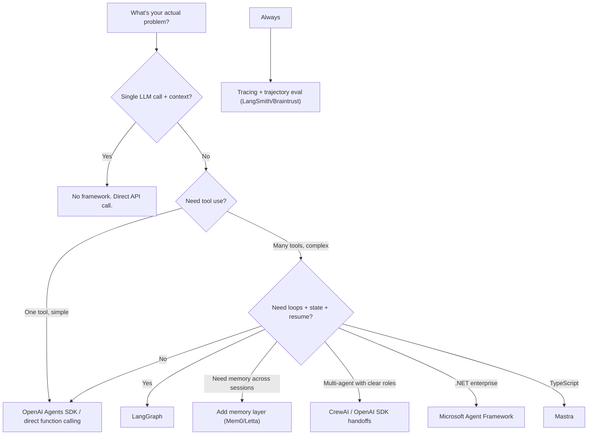
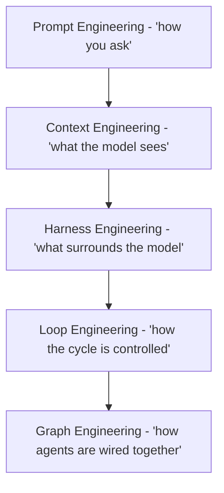

# Agentic AI: Frameworks, Terminology, and Concepts (Q4 2026)

> **Your question:** You found LangChain, LangGraph, etc. while digging into agentic knowledge. Are they agentic frameworks? What's the terminology and landscape?
> **Short answer:** Yes - LangChain/LangGraph are **agent orchestration frameworks**. But they're one category in a larger ecosystem: frameworks, protocols, memory layers, harnesses, and eval tools. This note maps the whole thing.
> **Verification:** All facts web-checked 2026-09-21. Frameworks churn fast - re-verify versions before citing in an ADR.
> **Update:** Added **Part 8** - the "-X engineering" family (prompt -> context -> harness -> loop -> graph), with honest status labels: established vs emerging vs rebrand.
> **Companion:** The tool landscape around this (routers vs harnesses vs assistant platforms) is mapped in [[ai-tools-landscape-2026]].

---

## Part 1: Core Terminology (learn these first, before any framework)

The concepts are stable; the frameworks are not. Learn these and you can evaluate any new framework that appears.

### The Agent Loop (the fundamental unit)

```
Perceive -> Plan -> Act -> Observe -> (repeat)
```

An "agent" is a system where **the model decides what to do next**, in a loop, using tools - as opposed to a fixed pipeline where you decide. Every agent framework is ultimately a way to run this loop reliably.

| Term | Meaning |
|---|---|
| **Agent loop** | The perceive->plan->act->observe cycle. Bounded by iteration/token/time limits in production. |
| **Tool use / Function calling** | The model emits a structured call ("call `search(query='x')`") that your code executes. The agent's hands. |
| **ReAct** | "Reason + Act" - the classic pattern: model writes a thought, takes an action, observes result, repeats. The default loop shape. |
| **ReWOO** | "Reasoning WithOut Observation" - plan all steps first, then execute; cheaper when planning is separable from execution. |
| **Reflection** | Agent critiques its own output and retries. Improves quality; doubles cost - use where quality justifies. |
| **Planning** | Explicitly decomposing a goal into steps before acting (plan-and-execute). Better for long tasks than pure ReAct. |
| **Handoff** | Passing control from one agent (or agent state) to another. The core primitive of multi-agent systems. |
| **Supervisor / Orchestrator** | A pattern where one agent routes work to specialist agents and aggregates results. |
| **Human-in-the-loop (HITL)** | Pausing the agent for human approval before high-risk actions. Non-negotiable for destructive operations. |
| **Checkpointing** | Persisting agent state so it can pause, resume, and survive restarts. The basis of "durable execution." |
| **Durable execution** | Agent runs survive process crashes/restarts and resume from the last checkpoint. |
| **Sandboxing** | Running agent code/tools in an isolated environment (VM/container) to bound blast radius. |
| **Blast radius** | The scope of damage an agent can cause if it misbehaves. Minimized by least-privilege tools + sandboxing. |
| **Context engineering** | Curating what's in the agent's context window (history, tool results, memory) - the real engineering work. |
| **Trajectory** | The full record of an agent run: every step, tool call, and observation. What you evaluate and debug. |
| **Agent harness** | The scaffolding around the model: tools, context management, loop control, permissions. (See Part 6.) |

### Memory terminology

| Term | Meaning |
|---|---|
| **Short-term memory** | Within-session context (the conversation + tool results in the window). |
| **Long-term memory** | Across-session persistence - what the agent remembers about you/your work. |
| **Semantic memory** | Facts ("user is in Bangkok", "project uses Bun"). |
| **Episodic memory** | Events ("last Tuesday we decided X"). |
| **Procedural memory** | How-to knowledge (learned workflows, skills). |
| **Memory lifecycle** | Write -> maintain -> retrieve. Most teams get write right and maintain wrong (stale memories poison retrieval). |

---

## Part 2: The Framework Landscape (2026)

### Category A: Agent Orchestration Frameworks (the "how to run the loop" layer)

| Framework | Language | Paradigm | Best for | Notes (verified 2026-09-21) |
|---|---|---|---|---|
| **LangGraph** | Python, JS | Graph/state machine | Production agents needing loops, branching, checkpointing, HITL | v1.0 released (Oct 2025). Cyclic graphs, durable state. The default for complex production agents. |
| **LangChain** | Python, JS | Chains + component library | LLM app plumbing, integrations | v1.0 released alongside LangGraph. Now more component library + agent abstractions (`langchain.agents`). |
| **CrewAI** | Python | Role-based "crews" | Well-scoped multi-agent workflows where roles are clear | Popular, opinionated. Works in production for well-scoped workflows; less flexible for weird topologies. |
| **Microsoft Agent Framework (MAF)** | Python,.NET | Unified AutoGen + Semantic Kernel | Enterprise.NET/Python shops | 1.0 GA April 2026 - merged AutoGen + Semantic Kernel into one SDK. If you were on AutoGen, this is the successor. |
| **OpenAI Agents SDK** | Python, JS | Lightweight, minimal | Simple multi-agent workflows; handoffs | Deliberately minimal: agents, handoffs, guardrails, tracing. Low abstraction overhead. |
| **Google ADK** | Python, Java | Agent Development Kit | Google Cloud / Gemini-centric stacks | Google's first-party agent framework. |
| **PydanticAI** | Python | Type-safe agents | Teams that want types + validation everywhere | FastAPI-feeling DX for agents. |
| **smolagents** | Python | Code-first (agent writes code as action) | Hugging Face ecosystem; simple agents | "Code agents" - the model writes Python instead of JSON tool calls. |
| **Letta (formerly MemGPT)** | Python | Memory-first agents | Agents whose core problem is long-term memory | Built around the memory hierarchy concept. |
| **Mastra** | TypeScript | TS-native agent framework | TypeScript/Node shops | One of the few serious TS-first options. |

> **Selection heuristic:** Start with the least framework. If you need durable loops/checkpoints/HITL -> LangGraph. If you need minimal multi-agent -> OpenAI Agents SDK. If you're.NET enterprise -> MAF. If your problem is memory -> Letta. **If your problem is "one call + a tool" - skip frameworks entirely.** (Principle #3: simplest solution that works.)

### Category B: Protocol Standards (the "how agents connect" layer)

| Protocol | From | Direction | Purpose |
|---|---|---|---|
| **MCP (Model Context Protocol)** | Anthropic | Agent -> tools/data (vertical) | The standard way an agent connects to tools, resources, prompts. Now broadly adopted. **You already use this** - your Hermes MCP servers (filesystem, postgres, searxng, drawio) are MCP. |
| **A2A (Agent2Agent)** | Google | Agent <-> agent (horizontal) | Agents discover each other's capabilities and delegate work. For cross-vendor agent interop. |
| **ACP (Agent Communication Protocol)** | IBM/BeeAI | Agent <-> agent | Competing/complementary agent messaging standard. |
| **ANP (Agent Network Protocol)** | Community | Agent <-> agent | Open network-layer agent discovery standard. |

> **Practical state 2026:** MCP won the tool-connection layer (it's everywhere). The agent-to-agent layer (A2A vs ACP vs ANP) is still consolidating - don't bet hard yet, but know the names.

### Category C: Memory Layers (the "what the agent remembers" layer)

| Tool | Approach | Notes |
|---|---|---|
| **Mem0** | Memory-as-a-service, extraction + retrieval pipeline | Popular hosted option. |
| **Letta / MemGPT** | Memory hierarchy (core/archival/recall) with agent-managed paging | The research-origin approach. |
| **Zep / Graphiti** | Temporal knowledge graphs | Strong for episodic + time-aware memory. |
| **LangMem** | Memory toolkit in the LangChain ecosystem | If you're already on LangGraph. |
| **Plain vector DB + custom logic** | DIY | Often right for simple cases - don't over-buy memory. |

### Category D: Observability & Evaluation (the "did it work" layer)

| Tool | Purpose |
|---|---|
| **LangSmith** | Tracing + eval in the LangChain ecosystem |
| **Braintrust** | Eval + experiment tracking |
| **Weights & Biases (Weave)** | Tracing + eval from the W&B family |
| **OpenTelemetry (GenAI semconv)** | Vendor-neutral LLM/agent tracing standard |
| **Arize / Phoenix** | Observability + eval platforms |

> Remember: for agents you need **trajectory eval** (every step), not just final-answer eval. See the ai-knowledge vault `04/03_Evaluation_and_Observability`.

---

## Part 3: Agentic Design Patterns (the reusable blueprints)

The four canonical patterns (vendor-neutral, per 2026 consensus):

1. **Reflection**: agent reviews its own output and improves it. Cost: 2x calls. Use when quality matters more than latency.
2. **Tool Use**: agent calls external functions/APIs. The foundation of everything agentic.
3. **Planning**: decompose goal -> steps -> execute. Better than pure ReAct for long-horizon tasks.
4. **Multi-Agent Collaboration**: multiple agents with distinct roles. The most over-used pattern; justify it.

Plus the operational patterns:

| Pattern | What it does |
|---|---|
| **Supervisor / orchestrator-worker** | One router agent delegates to specialists |
| **Handoff** | Control transfer between agents (OpenAI SDK's core primitive) |
| **Pipeline / sequential** | Fixed chain of agents (simplest multi-agent; often enough) |
| **Debate / ensemble** | Multiple agents argue/vote - expensive, niche |
| **Plan-and-execute** | Separate planner from executor agents |
| **Evaluator-optimizer** | One agent generates, another critiques in a loop |

> ⚠️ **The over-engineering trap:** most "multi-agent systems" in production are one agent + tools, or a simple pipeline. Add agents when a single agent's context/tools genuinely can't handle the scope - not because it sounds impressive.

---

## Part 4: Agent Evaluation & Benchmarks (how the field measures itself)

| Benchmark | What it measures | Why you care |
|---|---|---|
| **SWE-bench (Verified)** | Fixing real GitHub issues | The coding-agent gold standard. Read the Verified split. |
| **GAIA** | General assistant tasks requiring tools + reasoning | Measures practical assistant capability. |
| **TAU-bench / Tau2-bench** | Tool-agent-user interactions with policy adherence | Tests whether agents follow rules, not just get answers. |
| **WebArena** | Realistic browser tasks | Web agent capability. |
| **OSWorld** | Computer use (GUI control) | Desktop agent capability. |
| **AgentBench** | Multi-environment agent tasks | Broad agent comparison. |

> **Rule:** never collapse benchmarks into one ranking - they measure different things. And benchmark scores != your workload's performance. Build your own eval set. (Principle #2.)

---

## Part 5: The Frameworks You Should Actually Learn (in order)

For a software engineer entering this space (your profile):

1. **MCP**: you already use it daily via Hermes. Understand the client/server model, tools vs resources vs prompts. This is the connectivity layer you'll use regardless of framework.
2. **LangGraph**: learn it if you'll build production agents. The graph/state-machine mental model is the most transferable skill; checkpointing + HITL are production essentials.
3. **OpenAI Agents SDK**: learn it to see the minimal viable agent abstraction (agents, handoffs, guardrails). Good contrast to LangGraph's heavier model.
4. **One memory tool** (Mem0 or Letta) - when you need cross-session memory, understand the write-maintain-retrieve lifecycle before buying a solution.
5. **One eval/tracing tool** (LangSmith or Braintrust) - agents are unevaluable without traces.

> Skip for now: CrewAI/MAF (unless job requires), A2A/ACP (still consolidating), and any framework whose value prop is "write less code" - the code was never the problem.

---

## Part 6: Agent Harnesses (the concept that explains your daily tools)

This is the most important concept for you personally. **An "agent harness" is the scaffolding around a model that makes it an agent**: tool wiring, context management, loop control, permissions, and UX.

- **Claude Code, Cursor, Codex, OpenCode, Hermes Agent**: all harnesses.
- The 2026 consensus: **the harness matters more than the model.** Same model, different harness = very different capability.
- A harness includes: system prompt/context assembly, tool set + permissions, the loop, checkpointing, sub-agent spawning, and safety rails.

> **Why this matters for you:** When you "use Claude Code" or "use Hermes," you're not using a model - you're using a harness around a model. Evaluating agents means evaluating harnesses. And when you build your own agent, you're building a harness. This connects directly to your `job-hunting-as-loop-engineering.md` note.

---

## Part 7: Decision Guide: What Do You Actually Need?



---

## Part 8: The "-X Engineering" Family (the layered vocabulary of 2026)

You asked about the "buff words": prompt engineering, context engineering, harness engineering, loop engineering, graph engineering. They're not synonyms - they're **layers of the same stack**, each answering a different question. Some are established, some are emerging, one is mostly rebranding. Here's the honest map.

### The stack



### Honest status for each

| Term | Question it answers | Status | Verdict |
|---|---|---|---|
| **Prompt engineering** | How do I phrase the instruction? | ✅ Established (2022-) | Real, but the *smallest* layer - now often treated as a subset of context engineering. Don't build a career on wording alone. |
| **Context engineering** | What goes in the context window, and how is it curated? | ✅ Established (2025-) | The consensus successor frame (Karpathy). The actual daily work of an applied AI engineer. |
| **Harness engineering** | What scaffolding surrounds the model - tools, permissions, context assembly, UX? | 🟢 Emerging, trending hard (2026) | Genuinely useful. "The harness matters more than the model" is the 2026 insight. Systems engineering applied to agents. |
| **Loop engineering** | How is the agent's cycle designed - trigger, action, check, exit, budget? | 🟢 Emerging, trending (2026) | Genuinely useful. "Stop prompting the agent; design the loop that prompts it." The verifier/check step is the bottleneck. |
| **Graph engineering** | How are states, nodes, and transitions wired? | 🟡 Contested / rebrand | The weakest term. State machines are decades-old CS - "the name is new, the machinery is old." Fine as shorthand; don't pay for the rebrand. |

### Failure modes by layer (the diagnostic that makes these words useful)

| Layer broken | Symptom |
|---|---|
| **Prompt** | Model understood the task but did the wrong thing - wording/format problem |
| **Context** | Model never saw the right information - retrieval, budget, or assembly problem |
| **Harness** | Model is fine, system fails - tools mis-scoped, permissions wrong, no checkpointing |
| **Loop** | Agent runs forever, gives up early, or burns budget - no exit condition, no verifier, no budget |
| **Graph** | Multi-agent system deadlocks, loops, or loses state between agents - topology problem |

> **Diagnostic rule:** match the symptom to the layer *before* changing anything. Most teams rewrite the prompt when the real failure is in context, harness, or loop. This is why the words matter: they name distinct failure domains.

### How to use these words (calibrated skepticism)

- **Adopt:** *context engineering* and *harness engineering* - they name real, distinct layers of work. *Loop engineering* is also worth adopting, especially given your own framing in [[job-hunting-as-loop-engineering]].
- **Use with stakeholders:** "prompt engineering" undersells the work; "harness engineering" explains why the same model behaves differently in different tools (Claude Code vs Cursor vs Hermes).
- **In interviews/resumes:** context + harness engineering are current and defensible. "Graph engineering" may get a raised eyebrow - be ready to say "it's state-machine design for agent topologies."
- **The trap:** these words are also used to sell courses and consulting. The test: can the person explain what *fails* when that layer is broken? If not, it's marketing.

---

## Part 9: Thai Speaker Traps (agentic edition)

⚠️ **"Agent"** != ตัวแทน/นายหน้า (business agent) = ระบบ AI ที่ตัดสินใจและลงมือทำเองในลูป
⚠️ **"Harness"** != สายรัด/บังเหียน (literal) = โครงสร้างที่ห่อโมเดลให้เป็นเอเจนต์ (tools + loop + context)
⚠️ **"Handoff"** != การส่งมอบงานแบบ manual = การส่งต่อการควบคุมระหว่างเอเจนต์อัตโนมัติ
⚠️ **"Trajectory"** != วิถีกระสุน (physics) = บันทึกทุก step ของการรันเอเจนต์
⚠️ **"Checkpoint"** != จุดตรวจ (security) = การบันทึก state ของเอเจนต์เพื่อ pause/resume
⚠️ **"Harness engineering"** != การทำสายรัด = การออกแบบโครงสร้างที่ห่อโมเดล (tools + loop + context)
⚠️ **"Loop engineering"** != การเขียนลูป for/while = การออกแบบวงจรเอเจนต์ (trigger -> action -> check -> exit -> budget)

---

## Related Notes

- [[applied-ai-concepts-q4-2026]] - the 7 applied concepts (context engineering, EDD, trajectory eval, bounded agents, routing, structured outputs, injection defense)
- [[ai-buzzword-map-2026]] - the wider buzzword map: agent-* wave, slop family, -washing, -maxxing, security & business terms
- [[ai-engineering-knowledge-vault-proposal]] - the vault structure (agent content lives in pillar 04/01 + 04/07)
- [[job-hunting-as-loop-engineering]] - your own loop-engineering framing
- ai-knowledge vault: `04_Applied_AI_Engineering/07_Multi_Agent_and_Orchestration/` - the deep-dive home for this topic

## Sources (verified 2026-09-21)

- LangChain blog - LangChain & LangGraph 1.0 release
- Spheron - LangGraph vs CrewAI vs AutoGen 2026
- LangChain resources - AI agent frameworks comparison 2026
- veprompts - AI Agent Framework Comparison 2026 (27 frameworks)
- Medium (python.plainenglish.io) - Agentic AI in Python; Microsoft Agent Framework 1.0 GA (April 2026)
- OpenAI - openai-agents-python (GitHub)
- whatisanaiagent.com - AI Agent Glossary 2026
- inventivehq - MCP vs A2A vs ACP; atlan - Agent Interoperability Protocols 2026
- aibuilderclub / aipromptshub / NirDiamant - Agent memory systems 2026 (Mem0, Letta/MemGPT, Zep, LangMem)
- decodethefuture / rapidclaw / benchmarkingagents - Agent benchmarks 2026
- augmentcode / iqraa.tech - Agentic design patterns 2026 (Reflection, Tool Use, Planning, Multi-Agent)
- freeCodeCamp - What Is an Agent Harness? (Claude Code, DeepSeek Harness, Hermes Agent); Cursor harness analysis
- Atlan - Prompt vs Context vs Harness Engineering: Key Differences (three disciplines, three failure modes)
- devops.dev / Medium (Vishal Mysore) / LinkedIn - Harness Engineering guides, 2026
- shaam.blog / AI Builder Club / LinkedIn - Loop Engineering guides, 2026 ("design the loop that prompts the agent")
- getrealpha / AI Builder Club - Graph Engineering, 2026 ("the name is new, the machinery is old")
- codegeeks.solutions / levelop.dev - Context vs Prompt Engineering, 2026

---

*Authored by LLMOps 🦙, 2026-09-21. Framework landscape web-verified on date shown. Re-verify versions before citing in any ADR - this layer churns monthly.*
