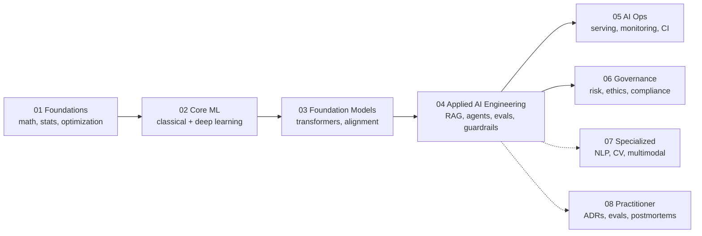

# AI Engineering Knowledge Vault — Proposed Structure

> **Goal:** A dedicated Obsidian vault for AI engineering (fundamental *and* applied) that mirrors the structural conventions of `swe-knowledge/` — numbered files, per-folder `00_overview`, YAML frontmatter, `[[Hyphenated-Wikilinks]]`, Mermaid where it earns its place.
>
> **Design principle:** The discipline has no mature BOK (unlike SWEBOK for SE). So this vault is built in **two layers**: a stable **fundamental** layer (churns slowly — math, ML theory, classic AI) and a volatile **applied** layer (churns fast — LLM patterns, tooling, guardrails). The fundamental layer is sourced from textbooks; the applied layer is sourced from books + web-verified current practice. **Never recommend tooling from stale memory.**

---

## Vault Location & Sibling Relationship

```
F:\obsidian_note\ai-knowledge\          ← NEW dedicated AI vault (proposed)
F:\obsidian_note\swe-knowledge\         ← existing SWE vault (sibling)
```

Two vaults, not one merged, because:
- AI engineering churns faster than SE foundations — keeping it separate lets you re-verify/re-branch the AI half without touching stable SE notes.
- Cross-links still work: `[[swe-knowledge/computing-foundation-note/Artificial_Intelligence/AI Overview]]` is already referenced from the existing `18_Applied_AI_Engineer` career path.
- Matches your monorepo principle: "each sub-project self-contained."

If you prefer a **single vault**, an alternative is a new top-level `ai-knowledge/` folder *inside* `swe-knowledge/` alongside `computing-foundation-note/`. Both work; I recommend a sibling vault for isolation.

---

## Proposed Top-Level Structure

```
ai-knowledge/
├── 00_Vault_Overview.md                 # this file's sibling — vault map, reading order, source list
├── 01_Foundations/                      # the math + CS that ML/AI sits on (SLOW churn)
│   ├── 00_overview.md
│   ├── 01_Mathematics/                  # linear algebra, probability, optimization, calculus
│   ├── 02_Statistics_and_Probability/
│   ├── 03_Optimization/
│   └── 04_Computing_for_ML/             # tensors, autodiff, GPU/memory, data structures for ML
│
├── 02_Core_Machine_Learning/            # classical + deep learning theory (SLOW churn)
│   ├── 00_overview.md
│   ├── 01_ML_Fundamentals/             # supervised/unsupervised, bias-variance, generalization
│   ├── 02_Linear_and_Logistic_Regression/
│   ├── 03_Tree_Based_Models/           # decision trees, RF, GBM, XGBoost
│   ├── 04_Neural_Network_Fundamentals/  # backprop, activations, optimizers, regularization
│   ├── 05_Deep_Learning_Architectures/  # CNN, RNN/Transformer, autoencoder, diffusion
│   ├── 06_Reinforcement_Learning/
│   └── 07_Unsupervised_and_Generative/
│
├── 03_Foundation_Models_and_LLMs/       # the bridge: pretraining → APIs (MEDIUM churn)
│   ├── 00_overview.md
│   ├── 01_Transformer_Architecture/     # attention, scaling laws, MoE, context length
│   ├── 02_Pretraining_and_Alignment/    # pretraining, SFT, RLHF/DPO, constitual methods
│   ├── 03_Tokenization_and_Representations/  # BPE, SentencePiece, embeddings
│   ├── 04_Capabilities_and_Limits/     # what models can/can't do, reasoning, hallucination
│   └── 05_Open_vs_Closed_Weight_Ecosystem/   # Llama/Qwen/DeepSeek vs OpenAI/Anthropic/Google
│
├── 04_Applied_AI_Engineering/           # ← THE APPLIED LAYER (FAST churn — web-verify)
│   ├── 00_overview.md
│   ├── 01_LLM_Application_Patterns/     # RAG, tool use, agents, structured output
│   ├── 02_Context_and_Prompt_Engineering/
│   ├── 03_Evaluation_and_Observability/ # eval suites, LLM-as-judge, regression gates, tracing
│   ├── 04_AI_Security_and_Guardrails/   # injection, leakage, OWASP LLM Top 10, blast radius
│   ├── 05_Model_and_Inference_Operations/  # routing, caching, cost/latency, self-hosting
│   ├── 06_Fine_Tuning_Strategy/         # when (rarely), SFT vs LoRA vs RAG-first
│   └── 07_Multi_Agent_and_Orchestration/  # bounded agents, trajectory eval, vertical agents
│
├── 05_AI_Operations_and_MLOps/          # the infra that runs it (MEDIUM churn)
│   ├── 00_overview.md
│   ├── 01_Data_Pipelines_and_Quality/
│   ├── 02_Serving_Infrastructure/       # vLLM, SGLang, TensorRT-LLM, quantization
│   ├── 03_Experiment_Tracking_and_Model_Registry/
│   ├── 04_Monitoring_and_Drift/
│   └── 05_CI_CD_for_AI_Systems/         # eval gates in CI, model promotion
│
├── 06_Governance_and_Responsible_AI/   # ethics, risk, regulation (SLOW–MEDIUM churn)
│   ├── 00_overview.md
│   ├── 01_AI_Risk_Management/           # NIST AI RMF, ISO 42001
│   ├── 02_Bias_Fairness_and_Evaluation/
│   ├── 03_Transparency_and_Model_Cards/
│   ├── 04_Regulation_and_Compliance/    # EU AI Act, sector rules
│   ├── 05_Privacy_and_Data_Protection/
│   └── 06_AI_ROI_and_Business_Case/
│
├── 07_Specialized_Domains/             # optional depth, add as needed (VARIABLE churn)
│   ├── 00_overview.md
│   ├── 01_NLP_Deep_Dive/
│   ├── 02_Computer_Vision/
│   ├── 03_Speech_and_Audio/
│   ├── 04_Multimodal_Systems/
│   └── 05_AI_for_Code_and_SE/          # coding agents, defect prediction, test generation
│
├── 08_Practitioner_Notes/              # YOUR working notes — case studies, postmortems, ADRs
│   ├── 00_overview.md
│   ├── 01_ADRs/                         # architecture decision records
│   ├── 02_Eval_Suites/                 # actual eval designs + results
│   ├── 03_Postmortems/                 # prod failures, abuse incidents
│   └── 04_Tooling_Reviews/             # current-state reviews (re-verify before citing)
│
├── 09_Reading_List.md                  # curated sources (see separate file)
├── 10_Source_Index.md                  # every source cited, with verification date
└── 11_Glossary.md                      # terms, with cross-links to topic notes
```

**File count estimate:** ~150–180 notes at full build. Start with overviews + tier-1 sources; expand depth as you read. Numbering follows your `swe-knowledge` convention (two-digit prefix, underscore, title-case-hyphenated).

---

## The Four Pillars (conceptual layering)



**Why this order matters:** Each layer depends on the layer below. You cannot reason about why a RAG system fails (#04) without understanding retrieval quality, which is rooted in representations (#03) which are rooted in embeddings, which are rooted in neural fundamentals (#02) which need linear algebra + probability (#01). **Skip a layer and your applied notes become copy-paste, not judgment.** This is the same principle the existing `18_Applied_AI_Engineer` career path uses — it just stops at the applied layer and assumes the foundations exist elsewhere. This vault makes them explicit.

---

## Churn Map — What to Trust, What to Re-Verify

| Layer | Churn rate | Sourcing strategy | Re-verify cadence |
|---|---|---|---|
| 01 Foundations | 🔵 Slow (years) | Textbooks — stable | Rarely |
| 02 Core ML | 🔵 Slow (years) | Textbooks + canonical papers | Yearly |
| 03 Foundation Models | 🟡 Medium (6–12 mo) | Papers + technical reports + docs | Quarterly |
| 04 Applied AI Engineering | 🟠 Fast (1–3 mo) | Books + **web search before citing** | Per-use |
| 05 AI Ops | 🟡 Medium | Docs + benchmarks | Quarterly |
| 06 Governance | 🟡 Medium (regulatory) | Official frameworks (NIST, ISO, EU) | On amendment |
| 07 Specialized | Variable | Domain-specific | Per-domain |
| 08 Practitioner | N/A — your work | First-hand | N/A |

> **Rule of thumb:** Anything in `04_Applied_AI_Engineering/` must be web-verified before you cite it in an ADR or recommend it to a stakeholder. The fundamental layers are safe to recommend from the vault because they're textbook-grounded.

---

## How This Vault Relates to What You Already Have

Your existing `swe-knowledge/` vault already has two AI-adjacent zones:

1. **`computing-foundation-note/Artificial_Intelligence/`** — 14 files covering *classical* AI (search, logic, uncertainty, ML, RL, NLP, ethics) + 5 LLM-era files (10–13). These are **foundation-level** notes, thin and survey-style.
2. **`career-path/18_Applied_AI_Engineer/`** — 43 files across 6 capability areas. These are **applied-level** notes, principle-focused.

**The new `ai-knowledge/` vault does NOT replace either.** Instead:
- The new `01_Foundations/` and `02_Core_Machine_Learning/` **absorb and deepen** the content in `computing-foundation-note/Artificial_Intelligence/` files 01–08 (the classical AI notes). The originals can stay as-is for the SE career path, or you migrate them — your call.
- The new `04_Applied_AI_Engineering/` **deepens and expands** `career-path/18_Applied_AI_Engineer/`. The career-path notes stay as the "what the role is" view; the new vault holds the "what the knowledge is" view.
- Cross-links: the career-path overview already links to `[[computing-foundation-note/Artificial_Intelligence/AI Overview]]`. The new vault's overview should back-link to both.

**One-time migration option:** If you want a clean split, move the 14 files in `Artificial_Intelligence/` into `ai-knowledge/01_Foundations/` and `ai-knowledge/02_Core_Machine_Learning/` as seed content, then redirect the career-path source links. Low effort, clean separation. I'd recommend this but it's your call — see decision box below.

---

## Build Order — What to Build First

Don't build all 8 pillars at once. Build in this order, matching your reading:

| Phase | Build | Why first |
|---|---|---|
| **Phase 1 (now)** | `00_Vault_Overview` + `04_Applied_AI_Engineering/` overviews | You're an applied AI engineer *now* — this is your working surface. Mirror the 6 areas from the career path + add `06_Fine_Tuning_Strategy` and `07_Multi_Agent_and_Orchestration`. |
| **Phase 2 (next)** | `03_Foundation_Models_and_LLMs/` | The bridge layer. Understand what you're actually calling via API. Start with Transformer architecture + alignment. |
| **Phase 3** | `02_Core_Machine_Learning/` | Go deep only when you hit a wall in applied work (e.g., can't reason about embeddings → go to `04_Neural_Network_Fundamentals`). |
| **Phase 4** | `01_Foundations/` | The math. Build as you need it — don't front-load 4 semesters of math you'll forget without application. |
| **Phase 5** | `05_AI_Ops/` + `06_Governance/` | When you're responsible for production systems and compliance. |
| **Phase 6** | `07_Specialized/` + `08_Practitioner_Notes/` | Depth and your own case studies — ongoing. |

> **Anti-pattern:** Building all 8 pillars empty-first. You'll end up with 150 stub files and no content. Build the overview + one pillar deeply, then expand. This is the same "spec first, then build" principle from my execution style.

---

## Decision Points (things you should decide)

> ⚠️ These are real architectural decisions — pick before building, like an ADR.

1. **Sibling vault vs. sub-folder?**
   - Sibling vault (`F:\obsidian_note\ai-knowledge\`) → isolation, clean git history, easy to share independently. **(my recommendation)**
   - Sub-folder (`swe-knowledge/ai-knowledge/`) → single Obsidian graph, fewer vault switches.
   - → If unsure, I recommend sibling. Cross-links still work across vaults if both are in your Obsidian workspace.

2. **Migrate the 14 classical-AI files from `computing-foundation-note/`?**
   - Yes → cleaner single source of truth for AI knowledge.
   - No → leave them as SE-vault foundation notes; the new vault references them via cross-link.
   - → I lean **migrate**, but only if you're willing to fix backlinks in `swe-knowledge`. You have a backlink-fixing precedent (172+ docs mid-session), so you know the cost.

3. **How deep on the math (`01_Foundations/`)?**
   - Shallow (concept + when-to-use) → faster to build, matches "engineer who calls APIs" profile.
   - Deep (proofs + derivations) → matches "I want to understand why attention works" profile.
   - → Start shallow, deepen on demand. You're an applied engineer, not an ML researcher. Deepen only the topics you actually hit walls on.

4. **English-only or bilingual (TH/EN)?**
   - Your existing vaults are English. Your teaching vaults for Thai adults are separate. I'd keep this one English for source fidelity, same as `swe-knowledge`.

---

## Quality Bar for Each Note (matches your existing vault)

Every note in this vault should have:

- **YAML frontmatter** (`title`, `date`, `tags`, `status`, `source`)
- **A one-line positioning callout** (`> **Positioning:** ...`)
- **"Why this matters" section** — what goes wrong if you don't know this
- **Key concepts** — the load-bearing ideas, not a textbook dump
- **Common anti-patterns** — what *not* to do (matches your existing capability-area notes)
- **Cross-links** — `[[Hyphenated-Name]]` to related notes (NEVER spaces — your fixed rule)
- **Sources** — with verification date for fast-churn topics
- **Where to go deeper** — the next note(s) to read

> ⚠️ **Thai Speaker Traps:** where relevant, flag English AI terms that Thai speakers commonly misuse (e.g., "alignment" ≠ การจัดตำแหน่ง in this context = การทำให้โมเดลเชื่อฟัง; "inference" ≠ การอนุมานเชิงตรรกะ = การรันโมเดล). Same convention as your teaching vaults.

---

## Next Step

This file is the **proposal**. Once you approve the structure (or adjust it), the build sequence is:

1. I create the vault root + `00_Vault_Overview.md` (the map + reading order).
2. I scaffold Phase 1: `04_Applied_AI_Engineering/` with 8 sub-folder overviews (mirroring your existing 6 capability areas + 2 new ones).
3. You read tier-1 sources (see `09_Reading_List.md`) and we deepen notes together.

The reading list — the actual books/papers/courses to source from — is in `[[AI-Engineering-Reading-List]]` (separate file, same directory).

---

*Drafted by LLMOps 🦙 — 2026-09-19. Structure grounded in your existing `swe-knowledge/` conventions. Sources web-verified 2026-09-19.*
