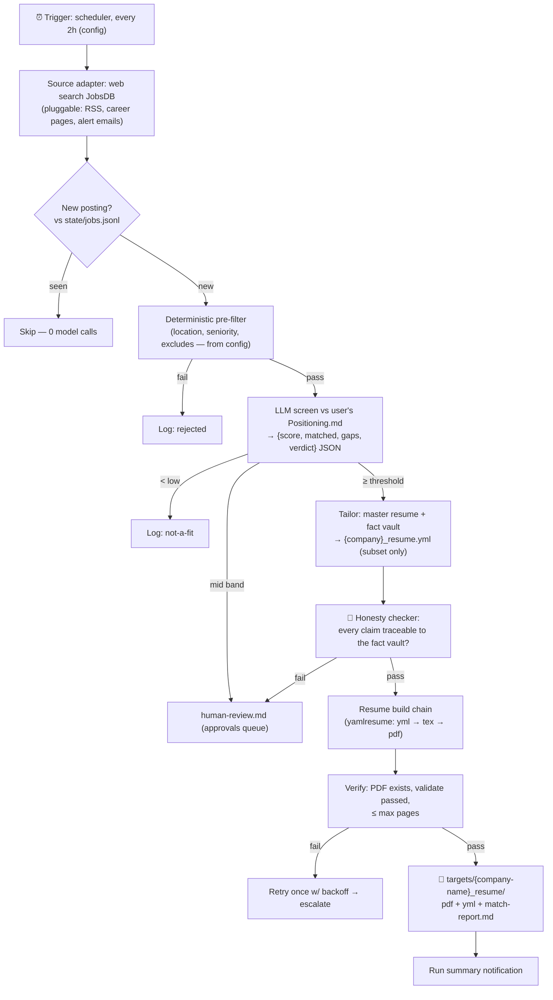

# 🔄 Job-Hunting Loop — A Cloneable Loop-Engineering Template

> **The concept:** a scheduled agent loop that searches job boards, screens postings against *your* positioning, tailors *your* resume per job description, and drops application-ready PDFs into a review folder — with a human gate before anything leaves the loop.
> **The product:** not a resume generator. A **loop-engineering reference implementation** anyone can clone, bring their own story, configure, and start. The resume tailoring is the workload; the machinery around it — bounds, verified state, maker/checker, human gates, frozen anchors — is the point.
> **Design checklists:** [[loop-engineering]] · [[graph-engineering]]

---

## 1. Why This Is Loop Engineering (the thesis)

A loop converges when it has three things: **a verified progress measure, hard bounds, and designed exits.** This project has all three by construction:

| Convergence requirement | In this project |
|---|---|
| **Progress measure (external, verified)** | A validated PDF exists on disk per matched job — not the agent claiming "done" |
| **Bounds** | Cadence, per-run caps, token budget, build retries, kill-switch |
| **Designed exits** | done-and-verified · queued-for-human · nothing-new · budget-exhausted |

And the work inside has the right shape: screening a JD and choosing which achievements to lead with is **genuine model judgment**, while dedup, build, validate, and file layout stay **deterministic code**. Structure everywhere, judgment only where it's needed — the core [[graph-engineering]] principle, instantiated in a single loop.

The honest framing: fetch → screen → build *alone* is a pipeline with model steps. What makes this **loop** engineering is the outer machinery — schedule, queue, dedup state, bounds, verification, human gate, run traces. That machinery is the deliverable; the resumes are the proof it runs.

---

## 2. The Five Design Decisions (locked)

| # | Decision | Choice | Rationale |
|---|---|---|---|
| 1 | **Cadence** | Every **2 hours** (configurable) | Responsive enough for active hunting; 12 runs/day stays cheap because dedup makes empty runs near-zero-cost |
| 2 | **Job source** | **Web search against JobsDB** (default, pluggable) | No API keys, no ToS-violating scraping; source adapters are config, so RSS, career pages, or alert-email intake can be added later |
| 3 | **Screening criteria** | **User-supplied `<firstname>-Positioning.md`** + LLM screen | The loop can't guess what "fit" means — the user defines it once, in their own words; the LLM scores every posting against that document |
| 4 | **Facts & stories** | **User brings their own story before the loop starts** | Onboarding produces the fact vault + master resume; the loop only ever *selects and re-emphasizes* from them, never invents |
| 5 | **Human gate** | **Always in the loop** | The loop writes to `targets/` and stops. No applying, no emailing, no uploading — ever. Review is the terminal human step |

Decisions 3 + 4 are what make this a **template**: everything personal is user-supplied input at onboarding; everything mechanical ships as the engine.

---

## 3. Architecture



### The three roles

| Role | What it is | Who owns it |
|---|---|---|
| **Profile** (`profile/`) | The user's story: fact vault, positioning, stories, master resume YAML | The user — hand-edited, **read-only to the loop** |
| **Engine** (`engine/`) | Fetch, dedup, screen, tailor, check, build, verify, notify | The repo — versioned, config-driven |
| **Output** (`targets/` + `loop/state/`) | Tailored resumes, match reports, run/queue state | The loop writes; the human reviews |

The separation is structural: **the engine has write access to `targets/` and `loop/state/` only.** `profile/` is the frozen anchor — the ground truth the optimizer is forbidden to rewrite ([[graph-engineering]] §12).

---

## 4. Repository Layout (the template)

```text
job-hunting-loop/
├── README.md                     # clone → onboard → configure → run
├── config.yml                    # cadence, sources, thresholds, caps, budgets
├── AGENTS.md                     # engine instructions + red lines (honesty rules live here)
│
├── profile/                      # 👤 USER-SUPPLIED — created at onboarding, loop never writes here
│   ├── _template/                #   blank templates + one filled example profile
│   ├── <firstname>.md            #   master fact vault: identity, roles, projects, metrics
│   ├── <firstname>-Positioning.md#   what "fit" means: target roles, market, must/have/nice
│   ├── <firstname>-Stories.md    #   STAR stories backing each claim (honesty cross-ref)
│   └── resume.yml                #   master resume (yamlresume schema) — the tailoring source
│
├── engine/                       # ⚙️ THE LOOP — deterministic code + prompts (TypeScript, Bun runtime)
│   ├── run.ts                    #   one run: fetch → dedup → filter → screen → tailor → build → verify
│   ├── sources/jobsdb.ts         #   source adapter (web search); interface for new adapters
│   ├── llm.ts                    #   model-call wrapper (screen/tailor/check), budget accounting
│   ├── prompts/screen.md         #   screening prompt (scores vs Positioning.md, JSON out)
│   ├── prompts/tailor.md         #   tailoring prompt: select/reorder/re-emphasize ONLY
│   ├── prompts/check.md          #   honesty checker: claim → vault trace or fail
│   └── build.sh                  #   resume build chain (yamlresume → tex → pdf, reused from reference instance)
│
├── loop/state/                   # 📊 EXTERNAL STATE — survives every run
│   ├── jobs.jsonl                #   every posting seen: hash, status, score, timestamps
│   ├── runs.jsonl                #   every run: trigger, counts, cost, outcome
│   └── human-review.md           #   the approvals queue (mid-band scores, checker failures)
│
└── targets/                      # 📁 OUTPUT — one folder per tailored job
    └── {company-name}_resume/
        ├── {company}_resume.yml  #   the tailored subset
        ├── {company}_resume.pdf  #   the deliverable
        └── match-report.md       #   score, matched keywords, gaps, bullets selected — the artifact trail
```

`profile/_template/` ships with **blank templates + one filled example**, so onboarding is "copy the template, tell your story," not "stare at an empty folder."

---

## 5. Onboarding — Bring Your Own Story (before the loop begins)

The loop refuses to start until onboarding is complete (`engine/run.ts` checks for the `profile/` files — a deterministic gate, not a prompt).

1. **Clone** the repo.
2. **Write your fact vault** — `profile/<firstname>.md`: every role, project, stack, metric, achievement you can *prove*. This is the anchor; everything downstream may only reference it. (An LLM can help *extract* it from your existing resume/LinkedIn export — but you verify every line. It's your name on the PDF.)
3. **Write your positioning** — `profile/<firstname>-Positioning.md`: target roles, market/location, seniority band, must-have vs nice-to-have, deal-breakers. This is the screening criteria; the LLM screen is only as good as this document.
4. **Add your stories** — `profile/<firstname>-Stories.md`: STAR stories backing the big claims, so the honesty checker has evidence to trace to.
5. **Build your master resume** — `profile/resume.yml` in [yamlresume](https://yamlresume.dev/) schema, containing the *full* bullet library (more than fits one page — the tailoring step selects per job).
6. **Configure** — `config.yml`: search keywords, location, cadence (default 2h), score threshold + mid-band, per-run caps, max pages.
7. **Phase 0 manual run** — one real JD, by hand, through screen → tailor → build. If the tailored PDF doesn't beat your generic one, fix the profile before automating (workflow problem, not automation problem).
8. **Start the loop** — register the scheduler (cron / Task Scheduler / Hermes cronjob). First run watched; then unattended.

---

## 6. The Honesty Anchor (the non-negotiable invariant)

> **Tailoring may only select, reorder, and re-emphasize facts that already exist in `profile/`. It may never add a skill, metric, employer, date, or claim that isn't there.**

Enforced structurally, in three layers:

1. **Subset transform** — the tailored YAML keeps `basics` and `work` entries from the master; only headline, summary bullet *selection*, skills ordering, and keyword emphasis change. The tailor prompt's red lines are mirrored in `AGENTS.md`.
2. **Independent checker** — a separate pass (different prompt, ideally different model) diffs every factual claim in `{company}_resume.yml` against the fact vault and stories. Untraceable claim → build fails → item escalates to `human-review.md`. The tailorer never grades its own homework (maker/checker, [[loop-engineering]] §5).
3. **Seed test in CI** — onboarding includes injecting one fake skill into a test YAML and confirming the checker catches it. If it doesn't, the loop doesn't ship.

This is also the user's protection: a resume that embellishes is a liability in the interview, and the fact vault + `match-report.md` gaps section doubles as **interview prep** — you know exactly which JD keywords you *don't* cover before you walk in.

---

## 7. Bounds & Budgets (the convergence clause)

All values live in `config.yml`; defaults below.

| Bound | Default | Notes |
|---|---|---|
| Cadence | every 2h | Empty runs cost ~nothing (dedup skips before any model call) |
| Postings screened / run | ≤ 20 | Caps the cheap-model stage |
| Resumes tailored / run | ≤ 3 | The expensive stage; forces prioritization by score |
| Model budget / run | ~100K tokens | Cheap model for screening; strong model only for tailoring + checking |
| Build retries | 1, then escalate | LaTeX/build failures are usually deterministic — retry storms are the anti-pattern |
| Kill-switch | `config.yml: enabled: false` | Checked first thing every run; loop stops within one cycle |

**Every exit is designed:** nothing new → clean "nothing new" run log. Checker or build failure twice → `human-review.md` with the error. Budget hit → run stops, state stays consistent, next run resumes. There is no path where the loop silently keeps spending.

---

## 8. Observability — the run leaves a trace

- `runs.jsonl` — one line per run: trigger, found / new / screened / tailored / rejected / escalated, tokens, wall-clock, outcome.
- `match-report.md` per tailored job — score, matched keywords, **uncovered keywords (gaps)**, which master bullets were selected and why.
- Run-summary notification — one paragraph: what the loop did and what needs human review.
- Weekly counter-metric: **% of tailored resumes the user would actually send.** If output volume rises while that falls, the loop is Goodharting itself ([[graph-engineering]] §12) — tighten the threshold or the prompts.

---

## 9. Build Roadmap (how we ship it)

| Phase | Deliverable | Effort |
|---|---|---|
| **0. Manual proof** | One real JD through screen → tailor → build, by hand (using the reference profile) | 30 min |
| **1. Engine pipeline** | `run.ts`: one JD file in → tailored resume out (filter, screen, tailor, check, build, verify) | half a day |
| **2. Loop machinery** | `jobs.jsonl` dedup + run logging + caps + `human-review.md`; prove run 2 on unchanged source = 0 new model calls | half a day |
| **3. Template-ize** | `profile/_template/` + filled example + onboarding gate + README + `AGENTS.md` | half a day |
| **4. Scheduler** | Cron / Task Scheduler / Hermes cronjob registration + notification | 15 min |
| **5. Publish** | Public repo, seed-test CI, first external user onboards with their own story | — |

Phase 3 is what turns *a personal automation* into *a template everyone clones*: the reference instance (Sahachan's profile, JobsDB, Thailand market) becomes the filled example in `profile/_template/`, and the repo ships with no personal data in the engine or state.

---

## 10. Success Criteria (definition of done for the template)

- [ ] Fresh clone + blank profile → onboarding guide produces a runnable loop with **zero code edits**
- [ ] Onboarding gate blocks the loop until all `profile/` files exist
- [ ] Loop ran ≥ 5 scheduled runs unattended; every run traced in `runs.jsonl`
- [ ] Dedup verified: run 2 on unchanged sources = 0 new model calls
- [ ] ≥ 3 tailored PDFs built and validated, each ≤ max pages, in `targets/{company-name}_resume/`
- [ ] Honesty checker catches the seeded fake skill (CI test green)
- [ ] Mid-band scores and checker failures land in `human-review.md` — nothing auto-applies
- [ ] Kill-switch stops the loop within one cycle
- [ ] One external user completes onboarding with their own story (the real template test)

---

## 11. What This Demonstrates (the loop-engineering proof)

When someone asks "is this really loop engineering?", the answer is the machinery, not the resumes:

1. **External verified progress measure** — PDFs on disk + validation, never agent self-report
2. **Bounds as termination guarantees** — caps, budgets, kill-switch
3. **State outside the context window** — `jobs.jsonl` / `runs.jsonl` survive every run and every model restart
4. **Maker/checker separation** — tailorer ≠ honesty checker ≠ human
5. **Designed exits** — done / queued-for-human / nothing-new / budget-exhausted
6. **Human gate where consequence concentrates** — before anything leaves the loop
7. **A frozen anchor the loop may not rewrite** — `profile/` as exogenous ground truth
8. **A counter-metric watching the watcher** — "% would actually send" catches self-gaming

Eight checklist sections instantiated in a repo a stranger can clone. That's the template's real product.

---

## Links

- Checklists: [[loop-engineering]] · [[graph-engineering]] · [[general-agents-driven]]
- Reference instance: `F:\projects\sahachan_resume\` (yamlresume chain: `resume.yml` → `build.sh` → `patch_tex.py` → xelatex → PDF) + `F:\obsidian_note\interview-preparation\career\` (the profile that seeds `profile/_template/`'s filled example)
- Tool: [yamlresume.dev](https://yamlresume.dev/) — resume-as-code, YAML → LaTeX/DOCX/HTML/PDF
- Runtime: any scheduler — cron, Windows Task Scheduler, Hermes `cronjob` + `web_search`
