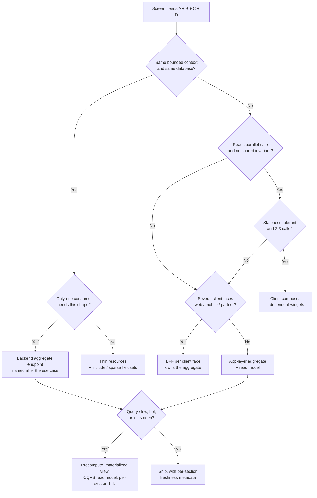

# Compose at the Right Layer: One Fat Endpoint vs Four Thin Ones

> **Created:** 2026-09-30
> **Grew out of:** the swe-knowledge checklist gap — `swe-knowledge/checklist/api-checklist/api.md` §4 "API Design" covers versioning, pagination, caching semantics, deprecation… and says nothing about **response granularity**. A checkbox can't carry the *why*, so the argument gets settled by whoever is loudest in the design meeting.
> **The question:** A complex API needs data A, B, C, D. Team 1 says "one endpoint, join everything, call it a day". Team 2 says "four endpoints, let the frontend combine". Which is right?

## TL;DR

**Both framings are wrong, and the debate is misframed.** The real question is not "fat vs thin" — it is **"who owns the composition, and does that owner own the semantics?"**

My recommendation, in order:

1. **Thin resources always exist** (`/orders/{id}`, `/customers/{id}`) — canonical, cacheable, independently versioned, authorized per resource.
2. **Add one purpose-built read endpoint per screen/use case** — read-only, named after the use case (`/checkout/summary`, never `/orders-full`), owned by the layer that owns the consumer's semantics.
3. **If A, B, C, D live in the same bounded context → stop arguing, aggregate in the backend.** A join in one database is not an architectural problem, it's a query with an index.
4. **If they live in different bounded contexts → do NOT put the god endpoint in a domain service.** That's a read model or a BFF, because cross-context aggregation inside a domain service is a distributed monolith with an HTTP face.
5. **Push the join from request time to write time** when the aggregate is hot (materialized view / CQRS read model). Most "the aggregate is too slow" problems are a precomputation problem wearing an API-design costume.
6. **Client composition is legitimate only for independent, parallel-safe, staleness-tolerant, ≤3-call reads with no shared invariant** — dashboards and widgets, basically.
7. **The frontend composes presentation, never consistency.** Never let the UI be the transaction boundary or the join engine for money.

The decisive technical test is **not latency** (parallel client composition and a backend aggregate tie — see §2). It is: **does the screen need a coherent snapshot, and can the calls actually be issued in parallel?**

## 1. The misframing: "A, B, C, D" is two different problems

The sentence "we have data A, B, C, D" hides the only fact that determines the answer:



- **"A, B, C, D are four tables in one schema"** → the aggregate is a *query*. Joins are what relational databases are for. Cache it if hot, index it if slow, and move on. Arguing about it is bikeshedding.
- **"A, B, C, D are four services owned by four teams"** → the aggregate is an *integration contract*. Now it's a real architectural decision with real org consequences.

Most design-meeting arguments are two people answering different questions. Establish which one you're in first; half the arguments evaporate.

## 2. What each side actually buys and pays (with honest numbers)

I modelled the classic e-commerce product/checkout page. 4G RTT 120 ms, per-endpoint server compute 40 ms, in-datacenter service hop 25 ms, merge 15 ms.

**Latency (p50):**

| Approach | Wall clock | Verdict |
|---|---|---|
| Client, **waterfall** (3 gated deps: need A's id to call B) | **480 ms** | 🔴 Unacceptable |
| Client, **parallel** independent deps (HTTP/2) | **160 ms** | 🟡 Ties the aggregate |
| **Backend aggregate** (parallel fan-out + merge) | **160 ms** | 🟡 Ties the client |
| Backend aggregate, sequential fan-out (bad impl) | 235 ms | 🔴 An implementation bug, not an architecture verdict |

**Read this table twice: for genuinely independent data, client-side parallel composition and a backend aggregate have the same latency.** The usual "one call is faster" argument is folklore. Latency is *not* the deciding factor in the parallel case — which is exactly why the decision must be made on the axes below instead. It becomes decisive only when there's **ID-gating** (you need A to know what B to ask for), because then parallelism is impossible and the client pays N × RTT.

**Concurrency and connection cost** (the argument nobody makes):

| | Client composes (4 calls) | Backend aggregate (1 call) |
|---|---|---|
| Concurrent auth + DB checkouts per screen | 4 | 1 |
| Logging / tracing / framework / rate-limit budget | 4× | 1× |
| At 1,000 screens/s peak | **4,000** concurrent DB checkouts | **1,000** |

That's 4× the connection-pool pressure, and each of those 4 requests does its own token validation and user lookup. "Let the frontend combine" doesn't avoid database load — it multiplies per-request overhead and usually *adds* queries.

**Availability** (99.9% per dependency, 43,800 min/month):

| Hard synchronous deps | Composite availability | Monthly degradation |
|---|---|---|
| 3 | 99.700% | 129 min |
| 4 | 99.601% | 172 min |
| 5 | 99.501% | 216 min |

**This is the single strongest argument against aggregate endpoints — and it's a design obligation, not a veto.** If the aggregate fails hard when any dependency hiccups, you've turned 5 nines-additive services into a 2-nines page. The fix is mandatory **partial rendering**: every section declares its own freshness and can degrade independently.

```json
{
  "data": {
    "product":  { "id": "SKU-1234", "name": "…" },
    "pricing":  { "list": 1290, "currency": "THB" },
    "inventory": null
  },
  "_meta": {
    "sections": {
      "product":   { "source": "catalog-svc",   "asOf": "2026-09-30T10:00:00Z", "ttl": 300, "status": "ok" },
      "pricing":   { "source": "pricing-svc",   "asOf": "2026-09-30T10:00:02Z", "ttl": 60,  "status": "ok" },
      "inventory": { "source": "inventory-svc", "status": "degraded", "reason": "upstream_timeout" }
    }
  }
}
```

The UI renders "check availability at checkout" instead of a 500. With per-section degradation, page availability returns to ~100% and the aggregate becomes strictly better than 4 hard client calls. **An aggregate endpoint without partial-failure design is not done.**

## 3. The five levels — pick per use case, not per company

There is no global answer. There is a point on a spectrum, chosen per read path:

| Level | Pattern | Use when | Example |
|---|---|---|---|
| **L0** | Client composes parallel independent resources | ≤3 calls, truly independent, staleness-tolerant, no cross-resource invariant | Admin dashboard widgets |
| **L1** | Resource + shallow expansion (`?include=`, sparse fieldsets) | One resource plus a bounded, uniform set of related data; many consumers want different slices | `GET /orders/{id}?include=items,customer` |
| **L2** | Purpose-built use-case endpoint | Screen-shaped read, single consumer, coherent snapshot required | `GET /checkout/{cartId}/summary` |
| **L3** | BFF per client face | Multiple clients need *different* aggregates of the same domain | `/bff/web/...` vs `/bff/mobile/...` |
| **L4** | GraphQL / query language | Many unpredictable clients, genuinely unknown shapes | See [[when-not-to-use-graphql]] |

Note what L1 does and does not authorize. `?include=pricing,inventory` is fine. `?include=pricing,inventory,promos&promoScope=user&expandDepth=2&flatten=true` is you **building a query language by accident** — badly, with no schema, no cost analysis, and no depth limit. The moment an aggregate endpoint accumulates conditionals, you've re-derived the case for GraphQL or for fixing your boundaries. Stop and pick one deliberately.

## 4. The two rules that resolve most arguments

**Rule 1 — Composition belongs to whoever owns the invariant.**

Ask: *is there a statement that must be true about the combination?* On a checkout summary, "the displayed total equals price × qty − discount" is an invariant, and a violated invariant is a **wrong charge**. That must be computed in one place, on one snapshot, server-side.

Client composition of invariant-bearing data produces **torn reads**: the UI reads price at t=0 and discount at t=800 ms, renders ฿1,290 with a ฿200 coupon the server would never have applied together, and the customer sees a price you won't honor. The `_meta.asOf` block above exists precisely because a screen with four sections has four different "now"s, and somebody must be accountable for that.

**Rule 2 — Aggregate endpoints are UI contracts; resources are domain contracts. They have different lifecycles, so they belong in different homes.**

| | Resources (`/orders/{id}`) | Aggregate endpoints (`/checkout/summary`) |
|---|---|---|
| Changes | Slowly. Additive. Versioned. | Fast. It's a UI contract — screen redesign changes it. |
| Consumers | Many, including other services | Typically one client face |
| Authz | Per resource, precise | Composite — must be re-derived, easy to over-fetch |
| Cache | Great candidate (ETag, CDN, long TTL) | Poor candidate (auth-scoped, multi-param) |
| Owner | The domain team | The consumer's context / BFF |

Putting a fast-moving UI contract inside a domain service makes that domain team the bottleneck for every screen redesign — and it makes the service's public contract a lie, because `/checkout/summary` isn't part of the checkout domain, it's part of *a screen*. This is the "distributed monolith at the API layer": one service ends up owning a composite contract over four teams' data, and every one of them must coordinate through it.

**Corollary for writes:** do not carry this logic over to mutations. Never bundle "unrelated writes the screen happens to submit" into one endpoint. The transactional boundary follows the **domain invariant** (the DDD aggregate root), not the screen. Read aggregation ≠ write aggregation. This is the most common way a defensible read design turns into a corrupted write model.

## 5. The options the debate forgets

The two-party argument skips the patterns that actually win in practice:

- **Batch / multi-get** — kills collection N+1 without a god endpoint: `GET /inventory?skus=a,b,c` or `POST /pricing:batchGet`. One request, many resources, no composite contract, cacheable per resource.
- **Read models / materialized views** — the aggregate's real problem is usually cost, not shape. Precompute it: a `product_card_view` table, a CQRS projector, an event-driven projection. Then the endpoint is a single indexed read, its availability is its own, and the deep `join join join` no longer happens per request. **This is the "better suggestion" most teams need.**
- **CDC / change streams** for keeping the read model fresh without coupling write paths.
- **Per-section TTLs and CDN edge caching** — the catalog section is cacheable for 5 minutes; inventory for 5 seconds. Fusing them into one payload with one `Cache-Control` header destroys both.
- **Field selection / sparse fieldsets** (`?fields=`) — cuts the 40-field god DTO that every consumer receives 12 fields of (~3.3× wasted bytes per screen).
- **Cursor-based pagination on the aggregate's collections** — never inline an unbounded list into a composite payload.

## 6. Anti-patterns to name out loud

| Anti-pattern | Symptom | Fix |
|---|---|---|
| **God endpoint** | `/api/v2/data?type=&expand=&foo=` — a query language in disguise | Split by use case; or adopt GraphQL properly |
| **Chatty API** | A screen needs 8 calls; mobile feels broken | Aggregate the primary paint into L2 |
| **Frontend as join engine** | FE reimplements pricing/permission rules per platform | Move the rule server-side, behind the invariant owner |
| **Torn-read UI** | Total ≠ sum of displayed parts; stale badge appears randomly | One snapshot server-side, or `asOf` + explicit degradation |
| **Authz leak via aggregate** | Composite endpoint returns D to a caller not entitled to D | Authorize per section inside the aggregate, not per endpoint |
| **Cross-context aggregate in a domain service** | One service's release blocks four teams | BFF or read model |
| **God DTO** | Every client gets 40 fields for a 12-field screen | Field selection or per-use-case DTOs |
| **Hard-fail aggregate** | One slow dependency 500s the whole page | Partial render + per-section status (mandatory) |

## 7. Concrete recommendation for the A/B/C/D case

Assume the realistic version: A = catalog (cacheable, low write), B = pricing (own service/team), C = inventory (high write, needs freshness), D = per-user discount (authenticated). Screen = product detail page.

**Ship this:**

```
GET /products/{id}                      → canonical resource, CDN-cacheable, ETag
GET /products/{id}/detail               → THE primary paint, one call, screen-shaped
    ├─ fan-out to catalog + pricing + discount IN PARALLEL
    ├─ inventory via short-TTL cache (stale-while-revalidate)
    ├─ per-section _meta.asOf / status / degraded
    └─ computed invariants (effective price, discount eligibility) server-side
POST /pricing:batchGet                  → for list pages (kills N+1)
GET  /inventory?skus=a,b,c              → optional freshness refresh, tiny payload
```

**Why not "one giant `/products-full` for everything":** it would fuse a 300 s-TTL cacheable section with a 5 s-TTL volatile one, couple four teams' release cadence to one payload, and return wholesale data to a mobile client rendering 12 fields.

**Why not "four calls from the frontend":** price and discount are one invariant (wrong combination = wrong charge), inventory freshness would be as stale as the slowest call, the client would need to reimplement discount eligibility on web + iOS + Android, and the screen would cost 4× the pool pressure for zero latency gain.

**Why `/products/{id}/detail` and not `/products/{id}?include=everything`:** the endpoint is named after the **use case**, so it is *allowed to change when the screen changes* and it is obvious who owns it. An `?include=` chain that grows to five params becomes an undocumented query language nobody can version.

## 8. The decision checklist (run this in the design meeting)

- [ ] Are A, B, C, D in the same bounded context / database? If yes, aggregate in the backend and stop.
- [ ] Can the reads be issued **in parallel**, or is there ID-gating (waterfall)? Waterfall ⇒ never client composition.
- [ ] Is there an invariant over the combination (money, permissions, totals, state machine)? If yes, backend owns it, one snapshot.
- [ ] How many consumers, and do they need *different* shapes? Different shapes ⇒ BFF, not a fatter shared endpoint.
- [ ] Does each section have a materially different **TTL / write rate**? If yes, never fuse into one cacheable payload.
- [ ] Does each section have a different **audience / role**? Composite authz is where data leaks.
- [ ] Is the aggregate **hot or slow**? ⇒ precompute (read model / materialized view) instead of joining per request.
- [ ] Does the screen survive **one section failing**? If not, design partial render before shipping.
- [ ] Can you name the aggregate after a **use case** rather than after the data? If not, you're building a god endpoint.
- [ ] Is the count of calls for the **primary paint** exactly 1 (L2+), with extras only for lazy/secondary content?

## Key takeaways

- The fat-vs-thin debate is misframed. The deciding fact is whether A, B, C, D share a bounded context — same DB ⇒ aggregate and stop; different teams ⇒ it's an integration contract, so use a BFF or a read model, never a god endpoint in a domain service.
- **Latency is not the argument.** For genuinely independent data, parallel client composition and a backend aggregate both come to ~1 RTT + compute. The real costs are torn reads, 4× connection-pool pressure, duplicated business rules, and composite authorization. Only ID-gating makes latency decisive (3 gated calls = 480 ms vs 160 ms).
- Aggregate endpoints are **UI contracts** (fast-moving, single-consumer, poorly cacheable); resources are **domain contracts** (stable, shared, cacheable). Different lifecycles ⇒ different owners ⇒ different versioning.
- **Partial failure is mandatory, not optional.** Four hard synchronous dependencies at 99.9% yield 99.60% — 172 minutes/month. Per-section `asOf`/`status`/degraded rendering buys the availability back and makes the aggregate strictly better than four client calls.
- Composition belongs to whoever owns the **invariant**. The frontend composes presentation, never consistency — and never the transaction boundary. Read aggregation ≠ write aggregation: writes follow the domain aggregate, not the screen.
- The forgotten winners: **batch/multi-get** for collection N+1, **materialized views / CQRS read models** so the join moves from request time to write time, **per-section TTLs**, and **field selection** for god DTOs.
- Every parameter you add to an aggregate endpoint is a step toward re-inventing GraphQL badly — no schema, no cost analysis, no depth limits. Past ~2 params or any conditional, choose deliberately: fix the boundaries, add a BFF, or adopt GraphQL ([[when-not-to-use-graphql]]).

## Links

- Checklist gap this explains: `swe-knowledge/checklist/api-checklist/api.md` §4 "API Design" (swe-knowledge vault) — covers versioning, caching, pagination; says nothing about response granularity
- Related: `swe-knowledge/checklist/microservice-checklist/api-gateway.md` — gateway-level aggregation and KrakenD as a BFF option (§ "KrakenD")
- Related decision note: [[when-not-to-use-graphql]] — the same axis (predictable shapes ⇒ thin/typed endpoints; unpredictable shapes ⇒ client-driven queries)
- Related decision note: [[monolith-first-decision]] — same pattern: cross-context composition inside one deployable/service is a distributed monolith, whatever the transport
