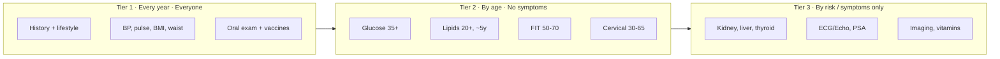

# Human Health Awareness Checklist

> **v2** (2026-10-04), revised after review by a Thai physician and nurse. Renamed from "Human Full-Body Checklist" per their feedback: this is a **health awareness checklist**, not a fixed annual screening protocol.
> Thai guidelines (กรมการแพทย์ / กรมควบคุมโรค / สถาบันมะเร็งแห่งชาติ) screen by **age and risk**, not by a blanket yearly lab panel. Unnecessary testing in healthy people causes false positives, follow-up costs, and anxiety.
> Three tiers: **Tier 1** (every year, everyone) · **Tier 2** (by age, asymptomatic) · **Tier 3** (by risk or symptoms only).
> ⚠️ Educational checklist, not medical advice. Lab values are **reference points, not pass/fail gates** (see Part E). Emergency in Thailand: **1669**.

---

## 0. The Three Tiers

| Tier | Who / when | Belongs here | Does NOT belong here |
|------|-----------|--------------|----------------------|
| **1** | Every adult, every year | History, lifestyle, BP, pulse, BMI, waist, oral exam, vaccines | Lab panels ordered "because annual checkup" |
| **2** | Asymptomatic, by age | Glucose 35+, lipids 20+ (~5y), FIT 50-70, cervical 30-65, eyes/ears/bone by age and risk | Tests promoted by health-check packages |
| **3** | Risk factors or symptoms present | CBC recheck, kidney, liver, thyroid, vitamins, ECG/Echo, PSA, spirometry, imaging | Self-ordering without an indication |

---

## Part A · Know Your Own Body (ongoing)
> Three different jobs, deliberately separated: **(1)** notice your own signals, **(2)** know your normal so changes stand out, **(3)** know the warning signs that need care. This is awareness, not diagnosis.

### A1. Body signals baseline
- [ ] **Sleep** **[Ongoing]**: 7-9 h typical. Persistent insomnia, loud snoring with gasping, or daytime sleepiness = tell the doctor (sleep apnea screen).
- [ ] **Energy level**: unexplained persistent fatigue is a symptom worth reporting, not a personality trait.
- [ ] **Stool & urine patterns**: know your normal rhythm; report persistent change, blood (any color), or black tarry stool.
- [ ] **Pain patterns**: where, when, what makes it better/worse. New or progressive pain is information.
- [ ] **Mood check (PHQ-2 style)** **[Every 6 months]**: little interest/pleasure? Feeling down? "Yes" to either = fuller screen with a professional. Anxiety check (GAD-2 style): unstoppable worry, restlessness.
- [ ] **Substance honesty count** **[Monthly]**: alcohol standard drinks/week (≤ 14 M / ≤ 7 F is the ceiling; zero is optimal), caffeine, nicotine, herbs/supplements (report these to your doctor: they interact with drugs).

**Signals record**

| Signal | Your baseline | This round | Date | Notes |
|---|---|---|---|---|
| Sleep hours / quality | 7-9 h |  |  |  |
| Energy level (1-10) | your normal |  |  |  |
| Stool / urine change | none |  |  |  |
| PHQ-2 (0-2 positive) | 0 |  |  |  |
| GAD-2 (0-2 positive) | 0 |  |  |  |

### A2. "Know your normal" (awareness, not a monthly ritual)
- [ ] **Breasts / testes / skin / mouth: know your normal** **[Ongoing]**: texture, appearance, moles. You are not performing a scheduled exam: you are the person most likely to notice change first.
- [ ] **Report changes, don't interpret them**: new lump, skin dimpling, nipple retraction/discharge, testicular size change or heaviness, mole change (ABCDE: **A**symmetry, **B**order, **C**olor, **D**iameter > 6 mm, **E**volving), non-healing sore > 2-3 weeks.
- [ ] **Sun exposure habits** **[Daily]**: SPF 30+ when UV is high. No tanning beds: no safe dose exists.

### A3. Warning-sign awareness (the diseases that matter in Thailand)
- [ ] **Stroke (BE-FAST) memorized**: **B**alance loss, **E**yes/vision loss, **F**ace drooping, **A**rm weakness, **S**peech difficulty, **T**ime: emergency now.
- [ ] **Heart**: chest pressure/tightness, jaw/arm pain, breathlessness at rest, cold sweat. Even "heartburn that feels different" counts.
- [ ] **Tuberculosis**: cough > 2-3 weeks, evening fever, night sweats, weight loss, coughing blood. TB screening is part of Thai primary care: report it early (free treatment program exists).
- [ ] **Cancer warning signs**: unexplained weight loss > 5% in 6-12 months, any persistent lump, bleeding (stool, urine, post-menopausal, post-coital), difficulty swallowing, persistent hoarseness, non-healing sore.

---

## Part B · Tier 1: Annual Check for Everyone
> The whole annual round for a healthy adult lives here. No lab panel is required by default.

### B1. History & lifestyle review
- [ ] **Personal history updated**: new diagnoses, hospitalizations, injuries.
- [ ] **Family history mapped**: first-degree relatives' major diseases and ages (heart attack/stroke, cancers, diabetes, kidney disease, thalassemia). This rewrites Parts C-D priorities.
- [ ] **Medication & herbal supplement review** **[Every visit]**: prescription, OTC, สมุนไพร, supplements. Bring the actual bottles or photos.
- [ ] **Smoking / vaping assessed**: pack-years counted (packs/day × years).
- [ ] **Alcohol counted** (standard drinks/week).
- [ ] **Occupation & exposures reviewed**: dust, chemicals, noise, night shifts, prolonged sitting, PM2.5 exposure.
- [ ] **Diet, exercise, sleep, stress, mental health discussed**: ≥ 150 min/week moderate activity + 2x resistance training is the general target.

### B2. Measurements & vitals (Thai criteria)
- [ ] **Blood pressure** **[Every visit]**: measured after 5 min rest, confirmed on more than one occasion or by home monitoring before any diagnosis.
  - Optimal < 120/80 mmHg
  - **130-139/80-89 = at-risk level** (lifestyle action now; not yet a diagnosis)
  - **Diagnosis of hypertension in a Thai facility: ≥ 140/90**, confirmed on ≥ 2 measurements or with home readings
- [ ] **Resting pulse**: 60-100 bpm typical; consistently outside that range gets checked.
- [ ] **Weight + BMI (Asian cutoffs)**: overweight ≥ 23, obese ≥ 25. A proxy only: waist tells more.
- [ ] **Waist circumference**: ≤ 90 cm (men), ≤ 80 cm (women). Central obesity drives metabolic disease.

**Vitals record**

| Check | Reference (context-dependent) | Actual | Date | Notes |
|---|---|---|---|---|
| Blood pressure | < 120/80 optimal; dx ≥ 140/90 confirmed ×2 |  |  | home vs clinic? |
| Resting pulse | 60-100 bpm |  |  |  |
| Weight / BMI | BMI 18.5-22.9 (Asian) |  |  |  |
| Waist | ≤ 90 cm (M) / ≤ 80 cm (F) |  |  |  |

### B3. Oral & dental
- [ ] **Dental exam + cleaning** **[Every 6-12 months]**: gum disease links to heart disease and diabetes; the mouth is a systemic health window.
- [ ] **Oral cavity checked**: white/red patches, ulcers > 2 weeks, lumps, numbness. Higher risk with smoking, alcohol, betel/areca chewing: ask for an oral cancer screen.

### B4. Vaccines
- [ ] **Tetanus (Td/Tdap)** **[Every 10 years]**
- [ ] **Influenza** **[Yearly]**
- [ ] **COVID-19** **[Per current national guidance]**
- [ ] **Pneumococcal / shingles** **[Age 50+, or earlier with chronic disease]**
- [ ] **Hepatitis B / HPV / measles immunity** **[Once if unknown]**: HPV vaccination benefit extends to age 45 (discuss).
- [ ] **HIV & STI screening** **[At least once; regularly with new partners]**: routine, not shameful.

**Vaccination record**

| Vaccine | Given (date) | Next due | Notes |
|---|---|---|---|
| Tetanus Td/Tdap |  | +10 years |  |
| Influenza |  | next season |  |
| COVID-19 |  | per guidance |  |
| Pneumococcal / shingles |  | (50+ / risk) |  |

---

## Part C · Tier 2: Age-Triggered Screening (no symptoms)
> Screened by **age**, per Thai programs. Everything here is evidence-backed for asymptomatic people. Note the Thai ages: they differ from US guidelines.

### C1. Diabetes & hypertension screening
- [ ] **Fasting glucose or HbA1c** **[From age 35, per กรมควบคุมโรค]**: the Thai target group is adults 35+. Recheck interval set by result and risk (yearly with pre-diabetes, obesity, family history).
- [ ] **BP at every contact** (Part B2) plus risk assessment.

### C2. Lipids
- [ ] **Lipid panel** **[From age 20, about every 5 years]**: earlier/oftener with diabetes, hypertension, smoking, family history, existing cardiovascular disease. Not a yearly test for low-risk adults.
- [ ] **Cardiovascular risk scored with the Thai CV Risk Score** **[From age 40, or earlier with risk]**: NOT ASCVD/Framingham, which can misestimate Thai people. LDL targets are set by this score (see Part E), not by a fixed number.

### C3. Colorectal cancer (Thai program)
- [ ] **FIT (fecal immunochemical test)** **[Age 50-70, per สถาบันมะเร็งแห่งชาติ program]**: the entry test for everyone in this age band.
- [ ] **Colonoscopy only when indicated**: FIT positive, or high risk (family history: start ~10 years before the affected relative's age; personal IBD/polyp history). Routine colonoscopy for everyone at 45-50 is NOT the Thai approach.

### C4. Cervical cancer
- [ ] **HPV test every 5 years OR Pap smear every 3 years** **[Women 30-65]**: adjusted by history of results; continue after menopause per your doctor until 65 if history is clean.

### C5. Breast cancer (individualized)
- [ ] **Screening plan decided case by case**: age, first-degree family history, breast density, previous results, and the guideline of your service (สถาบันมะเร็งแห่งชาติ CPG). There is no single mammogram schedule fitting every woman: agree on yours with a doctor.
- [ ] **Report changes promptly** (Part A2): a new finding between screenings matters more than the schedule.

### C6. Eyes, hearing, bones, elderly assessment
- [ ] **Vision / eye pressure** **[By risk and age]**: diabetes, hypertension, family glaucoma, symptoms. Routine "annual eye pressure for all at 40" is risk-based, not automatic.
- [ ] **Hearing** **[Age 60+, or noise exposure / symptoms]**: needing repeats is data.
- [ ] **Bone density (DEXA)** **[By risk, not age alone]**: post-menopausal women with risk factors, long-term steroid use, early menopause, fragility fracture history, low body weight. Assessed with your doctor.
- [ ] **CBC at least once in life 19-60** (per Thai guideline): repeats only when indicated (Part D). At 60+: repeat per health status.
- [ ] **Comprehensive elderly assessment** **[Age 60+]**: falls risk, frailty (chair-stand, gait speed), cognition if changes noticed, vision/hearing, medication review, advance care planning.

**Booking log**

| Screening | Age gate / trigger | Booked (date) | Done (date) | Result / next due |
|---|---|---|---|---|
| Glucose / HbA1c | 35+ |  |  |  |
| Lipid panel | 20+, ~5y |  |  |  |
| FIT | 50-70 |  |  |  |
| Cervical (HPV/Pap) | 30-65 (F) |  |  |  |
| Breast plan | individualized (F) |  |  |  |
| Vision / hearing | risk / 60+ |  |  |  |

---

## Part D · Tier 3: Only When Risk or Symptoms Say So
> **These are NOT routine annual tests for healthy people.** กรมการแพทย์ explicitly states that yearly uric acid, liver enzymes, BUN, and chest X-ray have no evidence supporting screening of normal adults. Kidney tests target risk groups. Ordering these without indication invites false positives and cascades of follow-up.

| Test | Do it when | Note |
|------|-----------|------|
| **CBC (recheck)** | Anemia symptoms, heavy menstruation, bleeding, chronic disease, age ≥ 60, abnormal prior result | One baseline in 19-60 is enough for healthy people |
| **Creatinine / eGFR + urine** | Age ≥ 60, diabetes, hypertension, heart disease, family kidney disease, nephrotoxic drugs (e.g. long-term NSAIDs) | Not routine for working-age healthy adults |
| **Liver enzymes (ALT/AST/GGT)** | Central obesity, alcohol use, risky medications, hepatitis B/C, symptoms, abnormal other tests | No evidence for yearly screening in healthy people |
| **Uric acid** | Suspected gout, kidney stones, kidney disease, clinical indication | No evidence for routine screening |
| **TSH (thyroid)** | Symptoms, goiter, thyroid history, pregnancy / planning pregnancy, risk groups | Not standard screening for everyone |
| **Vitamin D** | Osteoporosis, fracture, malabsorption, kidney/liver disease, clinical suspicion | "Indoor lifestyle" alone is not an indication |
| **Vitamin B12** | Vegan/vegetarian, long-term metformin/PPI, neuropathy symptoms, anemia | |
| **Ferritin / iron** | Heavy menstruation, anemia, unusual fatigue, pregnancy, abnormal CBC | Not every menstruating woman, every year |
| **ECG / Echocardiogram** | Chest pain, palpitations, fainting, heart murmur, known heart disease, pre-heavy-exercise assessment by a physician | Not a baseline for asymptomatic low-risk adults at 40 |
| **PSA (prostate)** | Shared decision with a doctor, per individual (age, family history, symptoms, life expectancy) | Never automatic yearly screening. PSA < 4 does NOT rule out cancer; elevation can be BPH/inflammation |
| **Spirometry** | Chronic cough, dyspnea, smoking history, occupational exposure | |
| **Lung imaging / low-dose CT** | Assessed by a physician: age, pack-years, years since quitting, ability to complete follow-up | Foreign LDCT criteria are not self-order checklists |
| **SpO2** | Lung disease, breathlessness, respiratory infection, physician advice | Not a routine screen for healthy people |
| **Chest X-ray, BUN** | Specific clinical indication only | Explicitly not supported for routine screening |

**Tests-done log**

| Test | Indication that justified it | Date | Result | Doctor's interpretation |
|---|---|---|---|---|
|  |  |  |  |  |

---

## Part E · Reading Results in Context
> A single number never earns a ✅ or ⚠️ by itself. Interpretation needs context: symptoms, history, repeat measurements, and the lab's own reference range. Bring results to a doctor instead of self-labeling.

- [ ] **LDL target depends on cardiovascular risk** (Thai CV Risk Score), not a universal < 100 mg/dL.
- [ ] **eGFR 60-89 is not kidney disease** without proteinuria or persistence ≥ 3 months. CKD requires evidence over time.
- [ ] **Creatinine depends on sex, age, muscle mass, and the lab method.** Compare against that lab's range.
- [ ] **HbA1c can mislead** with anemia, blood loss, kidney disease, or hemoglobin variants (common in SEA: HbE/thalassemia traits). Confirm with glucose-based tests when in doubt.
- [ ] **PSA < 4 ng/mL does not exclude cancer**; PSA > 4 can be prostatitis/BPH. Trends and free PSA matter more than one cutoff.
- [ ] **ALT, AST, TSH, ferritin, vitamins: use the reference range of the testing lab.** Ranges differ between labs and methods.
- [ ] **SpO2 must be read with symptoms, known lung disease, device quality, and signal quality.** A number from a cheap finger sensor alone proves little.
- [ ] **Home BP readings count**: diagnosis prefers repeated measurements or home monitoring, not one clinic reading.

**Lab record (bring this to your doctor)**

| Marker | Lab's own reference range | Your value | Date | Context to mention |
|---|---|---|---|---|
|  |  |  |  |  |

---

## Part F · Red Flags
> Two different clocks. Do not blur them.

### Emergency NOW: call 1669 / go to the ER immediately
- [ ] **Do not wait a day, do not drive yourself:**
  - Chest pain / pressure, or breathlessness at rest
  - Stroke signs (BE-FAST, Part A3): every minute loses brain cells
  - Sudden severe headache ("worst ever")
  - Sudden vision loss
  - Heavy or uncontrolled bleeding
  - Suicidal thoughts, self-harm urges, or acute psychiatric crisis

### See a doctor within days (not "next annual check")
- [ ] Unexplained weight loss > 5% in 6-12 months
- [ ] Any new lump persisting > 2 weeks
- [ ] Non-healing sore > 2-3 weeks; changing mole (ABCDE)
- [ ] Blood in stool or urine (any amount); black tarry stool
- [ ] Cough > 2-3 weeks (TB screen); coughing blood = emergency class
- [ ] Bleeding after menopause or after intercourse (women)
- [ ] Painless testicular lump (men)
- [ ] New persistent pain, progressive weakness, or night pain waking you

**Incident log**

| Signal noticed | Date | Action taken (1669 / ER / clinic) | Outcome / follow-up |
|---|---|---|---|
|  |  |  |  |

---

## Part G · Age-Triggered Schedule (Thai-aligned)

| Age | Tier 1 (every year) | Add from Tier 2 |
|-----|--------------------|-----------------|
| **20-29** | History, lifestyle, BP, pulse, BMI, waist, oral, vaccines | Lipid baseline (then ~5y), one CBC (19-60), STI screen if sexually active |
| **30-39** | same | Glucose/HbA1c from 35 (repeat per result/risk), cervical screening starts (30-65) |
| **40-49** | same | Thai CV Risk Score, breast screening plan discussion (individualized) |
| **50-59** | same | FIT 50-70, prostate discussion (individualized, not automatic PSA), lung assessment if smoker (by physician) |
| **60-69** | same | Elderly assessment: falls/frailty, vision, hearing, medication review, CBC recheck per status |
| **70+** | same | Frailty & mobility, de-prescribing, advance care planning, cancer screening per life expectancy & preference |

---

## How to Use

1. **Annual round = Part B only.** For a healthy adult, that is the whole appointment: history, lifestyle, vitals, oral, vaccines.
2. **Each birthday: check Part G** for age-triggered screenings and book within 3 months.
3. **Tier 3 (Part D) only with an indication.** If a health-check package offers a "full panel," ask which item is justified for you and why.
4. **Family history re-prioritizes everything**: fill in relatives' diseases and ages, then adjust Parts C-D with your doctor.
5. **Log with dates and context**: `- [x] BP (2026-10-03: 118/76, home monitor)`. Trends + context are the health record, not single numbers.

## Key Takeaways

- **Awareness ≠ screening ≠ diagnosis.** Part A is noticing, Part C is evidence-backed screening of healthy people, Part D is diagnostic testing when something points there.
- Thai guidelines screen by **age and risk**: a healthy adult's annual round is history + lifestyle + vitals + oral + vaccines, not a yearly lab panel.
- BP diagnosis in Thailand: **≥ 140/90 confirmed**; 130-139/80-89 is the action zone. Cardiovascular risk: **Thai CV Risk Score**.
- Colorectal screening enters at **FIT, age 50-70**; colonoscopy follows indication. Breast and prostate screening are **individual decisions**, not fixed schedules.
- Emergencies (chest pain, stroke, sudden blindness, heavy bleeding, suicidal thoughts) → **1669 immediately**, never "wait a week."

## References & Credits

- กรมการแพทย์. (2565). *แนวทางการตรวจสุขภาพที่จำเป็นและเหมาะสมในสถานบริการปฐมภูมิ*. [Clinical Practice Guideline, cpg.dms.go.th](https://cpg.dms.go.th/th/ebooks/%E0%B9%81%E0%B8%99%E0%B8%A7%E0%B8%97%E0%B8%B2%E0%B8%87%E0%B8%81%E0%B8%B2%E0%B8%A3%E0%B8%95%E0%B8%A3%E0%B8%A7%E0%B8%88%E0%B8%AA%E0%B8%B8%E0%82%E0%B8%A0%E0%B8%B2%E0%B8%9E%E0%B8%97%E0%B8%B5%E0%B9%88%E0%B8%88%E0%B8%B3%E0%B9%80%E0%B8%9B%E0%B9%87%E0%B8%99%E0%B9%81%E0%B8%AB%E0%B8%A5%E0%B9%88%E0%B8%AB%E0%B8%A1%E0%B8%B2%E0%B9%81%E0%B8%AB%E0%B8%A1%E0%B8%B0%E0%B8%AA%E0%B8%A1-%E0%B8%89%E0%B8%9A%E0%B8%B1%E0%B8%9A%E0%B8%9B%E0%B8%A3%E0%B8%B1%E0%B8%9A%E0%B8%9B%E0%B8%A3%E0%B8%B8%E0%B8%87-2565/download/4d7a4532) (primary basis for Tier 1/2/3 structure and "tests without evidence" list).
- กรมควบคุมโรค. (n.d.). *การคัดกรองเบาหวานและความดันโลหิตสูงในผู้มีอายุ 35 ปีขึ้นไป*. [ddc.moph.go.th](https://www.ddc.moph.go.th/brc/news.php?deptcode=brc&news=32939).
- สถาบันมะเร็งแห่งชาติ. (n.d.). *Clinical Practice Guideline: มะเร็งเต้านม*. [nci.go.th/CPG_Breast](https://nci.go.th/CPG_Breast).
- สถาบันมะเร็งแห่งชาติ. (n.d.). *คู่มือ แนวทางการดำเนินงานและข้อมูลมะเร็งลำไส้ใหญ่และไส้ตรง*. [nci.go.th](https://www.nci.go.th/) (FIT-first screening for ages 50-70).

**Version history:** v1 (2026-10-03) drafted as "Human Full-Body Checklist" (US-guideline based). v2 (2026-10-04) restructured into 3 tiers, Thai criteria applied, routine over-testing removed, red-flag timing corrected, per review by a Thai physician and nurse.
