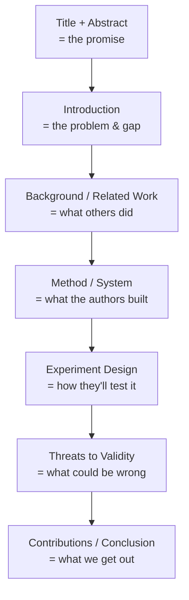
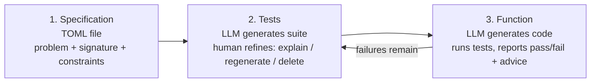

# How to Read a Research Paper — Structured Method

> **Created:** 2026-09-20
> **Running example:** *Understanding Specification-Driven Code Generation with LLMs: An Empirical Study Design* (Rosa et al., SANER 2026 — arXiv:2601.03878v1)
> **Why this note exists:** The "how do I actually read a paper" question bugged me for a long time. This is the structured answer, grounded in one real paper sitting at `F:\papers\`.

## TL;DR

Research papers follow a predictable skeleton. You don't read them front-to-back like a novel — you read them in **three passes of increasing depth**, and you stop when you have enough. The fastest useful read is Pass 1 (~5 min): Title → Abstract → last paragraph of Intro → section headings → Conclusion. Most of the value is in Pass 2 (~30 min): grab the artifact, the research questions, the variables, and the dataset. Pass 3 (hours) is only for reproducing or reviewing.

Two sections beginners skip but shouldn't: **Related Work** (who else matters in this field) and **Threats to Validity** (what the authors *don't trust* about their own work).

---

## 1. Thesis vs. paper vs. registered report

| | Thesis | Conference Paper | Journal Paper | Registered Report (this one) |
|---|---|---|---|---|
| Purpose | Degree requirement | Share findings at a venue | Archive a complete study | Pre-register a study plan *before* running it |
| Length | 50-500 pages | 8-12 pages | 15-40 pages | 8-12 pages (plan), results come later |
| Review | Exam committee | Anonymous peer reviewers | 2-5 rounds of peer review | **Stage 1** protocol review + **Stage 2** results review |
| Tense signal | past | past/present mix | past | **future** ("we will…", "we plan to…") |

**This specific paper** is a **Stage 1 Registered Report** accepted at SANER 2026 with a Continuity Acceptance score for Stage 2. Translation: the protocol was peer-reviewed *before* the experiment ran. When you read it, you're reading a **study design + tool description**, not empirical results. The journal commits to publishing the results later regardless of outcome — this format exists to fight publication bias (the tendency for only "good" results to get published).

**Reading implication:** every "we will measure X" is a *promise*, not a finding. You gain a methodology to potentially reuse, not a result to cite.

---

## 2. The components of a research paper

| Section | In this paper | Purpose |
|---|---|---|
| **Abstract** | "…empirical study design using CURRANTE, a VS Code extension…" | 30-second summary: what + why + how |
| **Index Terms** | Specification-Driven Development, LLMs, TDD, Code Generation, Empirical SE | Keywords for search/discovery |
| **I. Introduction** | TDD + LLMs exist, but the *human factor* is underexplored | States the problem, the gap, and the contribution |
| **II. Background & Related Work** | Codex, TGen, TICODER, AlphaCodium, LLM4TDD, HumanEval | Positions the work against prior art |
| **III. The CURRANTE Plugin** | 3-phase GUI: Specification → Tests → Function | The artifact/tool the authors built |
| **IV. Experiment Goal & RQs** | RQ1: effectiveness; RQ2: user intent expression | The research questions driving the study |
| **V. Experimental Procedure** | Between-subjects design, LiveCodeBench, variable taxonomy | The methodology |
| **VI. Execution Plan** | Preparation → Execution → Analysis phases | Logistics of running the study |
| **VII. Threats to Validity** | Internal (participants, LLM non-determinism) / External (generalizability) | Honest limits — *read this carefully* |
| **VIII. Contributions & Implications** | Protocol, telemetry schema, study plan | The payoff / takeaways |
| **References** | 17 citations | The conversation this paper joins |

---

## 3. The three-pass method (Keshav)

### Pass 1 — "What is this about?" (~5 min)

Read only: **Title → Abstract → Introduction (last paragraph) → Section headings → Conclusion**. Skim the rest. Decide if the paper is worth more time.

**Applied to the example paper:**
- Title → "Specification-Driven Code Generation with LLMs: Empirical Study *Design*"
- The word **"Design"** is the tell — this is a protocol, not results.
- Abstract → CURRANTE plugin, 3-stage TDD workflow, LiveCodeBench, logs metrics.
- Last paragraph of Intro → "expected outcome is twofold: empirical evidence + inform future IDE design."
- Headings → Background, CURRANTE, RQs, Procedure, Threats, Contributions.

**After Pass 1 you should be able to say:** *"This is a study protocol for a VS Code plugin that uses a TDD workflow with LLMs. No results yet."*

### Pass 2 — "What's the contribution and is it sound?" (~30 min)

Read the whole paper but skip proofs/deep detail. Mark unknown terms and references. Grab four things:

1. **The artifact** — CURRANTE = VS Code extension, 3 phases: Specification (TOML) → Tests (human-refined) → Function (LLM-generated).
2. **The RQs** — RQ1: can CURRANTE generate correct code from user specs? RQ2: can users express intent through the test suite?
3. **The variables (Table I)** — PassAll, PassRate, TimeToPass, TestEdits, etc. This table is the heart of the methodology.
4. **The dataset** — LiveCodeBench v5, 3 warmup (easy) + 3 evaluation (medium) problems.

### Pass 3 — "Could I reproduce this?" (1-5 hours, rarely needed)

Virtually re-implement the study. Question every design choice. For this paper: *Why LiveCodeBench and not HumanEval? Why between-subjects? Why 30-45 min budget? Why Qwen3-Coder? Why TOML?*

You only need Pass 3 if you're reviewing the paper, reproducing it, or directly building on it.

---

## 4. The CURRANTE workflow in detail (Pass 2 depth)

**Key design choices worth noting:**
- **TOML** is the specification format — human-readable, easy to edit, captures user intent formally.
- **The test suite IS the specification** — not a side artifact. The tests formally describe the requirements; the LLM uses them to generate the function.
- **Human-in-the-loop only at the test stage** — code generation is fully delegated to the LLM. This is the "spec-driven" shift: the human's job is *specifying*, not *coding*.
- **Advice mechanism** — when tests fail, CURRANTE auto-generates advice from the failure messages to guide regeneration.

---

## 5. The variable taxonomy (Table I) — a reusable template

This is one of the most directly reusable parts of the paper for any empirical work:

| Variable type | Examples from paper | What it captures |
|---|---|---|
| **Independent** | TaskId | What you manipulate / set as context |
| **Dependent** | PassAll, PassRate, TimeToPass, IterationsToPass, TestEdits, SuiteRegenerations, AdviceTriggers, TestCoverage, TestDiversity | What you measure as outcomes |
| **Confounding** | ProgrammingExperienceYears, PythonFamiliarity, PriorTDDExperience, PriorLLMCodeGenUse | What could distort the result if not controlled |

**Lesson:** always separate what you set (independent), what you measure (dependent), and what could bias it (confounding). If your study doesn't name confounders, reviewers will reject it.

---

## 6. What you gain after reading this paper

**Conceptual:**
- **Spec-Driven Development (SDD)** — the shift from writing code to writing *specifications* that LLMs turn into code.
- A concrete **TDD + LLM workflow**: specification → test suite (human-curated) → function (LLM-generated). A usable mental model for how AI coding tools *should* work.
- Why **human test curation matters** — the paper's central hypothesis: human-refined tests produce better LLM code than raw prompts.

**Methodological (transferable to any empirical SE work):**
- How to structure **research questions** (effectiveness RQ + human-factor RQ).
- The **variable taxonomy** above — a clean template.
- **Between-subjects design** with blocking factors (TaskId) — a real experimental design you can copy.
- How to write a **Threats to Validity** section (internal vs external) — most student work omits this entirely.
- Following **ACM SIGSOFT Empirical Standards** — the formal benchmark for this kind of study.

**Practical:**
- Awareness of **CURRANTE** and **LiveCodeBench** as tools/benchmarks you could use yourself.
- A reading list from the 17 references: TGen, TICODER, AlphaCodium, LLM4TDD, Codex/HumanEval.

---

## 7. The "should I read this paper?" decision checklist

For any paper, after Pass 1, ask:

1. **Does the title/abstract match my goal?** (Yes → continue)
2. **Is it a results paper or a protocol/position paper?** (Changes what you can extract — a protocol gives you a method, a results paper gives you a finding)
3. **Is the venue credible?** (SANER is a well-known IEEE conference; arXiv preprints are unreviewed — check if it's published)
4. **Is the Related Work section honest about gaps?** (This one is — it explicitly names the "human factor" gap)
5. **Does the Threats section admit real limits?** (This one does — LLM non-determinism, modest N, ecological validity)

Your example paper passes all five. It's a solid, well-structured protocol paper from a reputable venue.

---

## 8. Common pitfalls when reading papers

- **Reading linearly front-to-back.** You'll drown in Related Work before reaching the point. Use the three-pass method.
- **Treating the abstract as ground truth.** Abstracts are sales pitches. Verify claims against the body.
- **Ignoring Threats to Validity.** This is where authors confess their limits. It's the most honest section.
- **Confusing "protocol" with "results."** Future tense ("we will") = plan. Past tense ("we found") = results.
- **Skipping the references.** The reference list is a curated reading list for the subfield.
- **Not checking the venue.** A preprint on arXiv ≠ a peer-reviewed paper. This one is both: arXiv *and* SANER-accepted.
- **Treating one paper as the final word.** One paper is one data point. Read the Related Work to see the bigger picture.

---

## 9. Quick reference — reading speed guide

| Goal | Pass | Time | What to read |
|---|---|---|---|
| Decide if worth reading | 1 | ~5 min | Title, abstract, intro last para, headings, conclusion |
| Understand contribution | 2 | ~30 min | Whole paper, grab artifact + RQs + variables + dataset |
| Reproduce / review / extend | 3 | 1-5 hr | Virtually re-implement; question every choice |

---

## Knowledge connections

- [[CURRANTE]] — the VS Code extension described in this paper (not yet a separate note; build one if you start using it)
- [[Test-Driven Development]] — the paradigm this workflow builds on
- [[LiveCodeBench]] — the benchmark dataset used
- [[empirical-software-engineering]] — the methodological tradition (ACM SIGSOFT standards)

## Key takeaways

- Papers have a predictable skeleton: Abstract → Intro → Background → Method → Experiment → Threats → Conclusion.
- Use the **three-pass method**: 5 min / 30 min / hours. Stop when you have enough.
- **Future tense = protocol, past tense = results.** This example is a protocol (Stage 1 Registered Report).
- Two underrated sections: **Related Work** and **Threats to Validity**.
- After reading, you should walk away with: one concept, one method, one tool, and a reading list.
