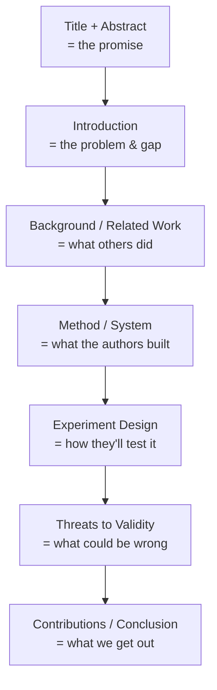
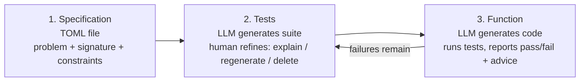
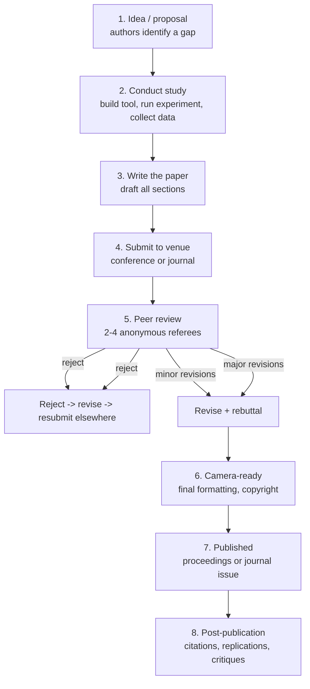
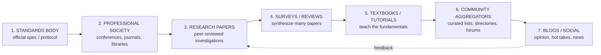
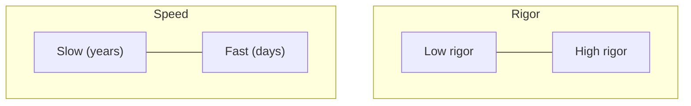
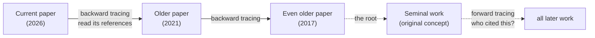

# How to Read a Research Paper: Structured Method

> **Created:** 2026-09-20
> **Running example:** *Understanding Specification-Driven Code Generation with LLMs: An Empirical Study Design* (Rosa et al., SANER 2026; arXiv:2601.03878v1)
> **Why this note exists:** The "how do I actually read a paper" question bugged me for a long time. This is the structured answer, grounded in one real paper sitting at `F:\papers\`.

## TL;DR

Research papers follow a predictable skeleton. You don't read them front-to-back like a novel: you read them in **three passes of increasing depth**, and you stop when you have enough. The fastest useful read is Pass 1 (~5 min): Title -> Abstract -> last paragraph of Intro -> section headings -> Conclusion. Most of the value is in Pass 2 (~30 min): grab the artifact, the research questions, the variables, and the dataset. Pass 3 (hours) is only for reproducing or reviewing.

Two sections beginners skip but shouldn't: **Related Work** (who else matters in this field) and **Threats to Validity** (what the authors *don't trust* about their own work).

---

## 1. Thesis vs. paper vs. registered report

| | Thesis | Conference Paper | Journal Paper | Registered Report (this one) |
|---|---|---|---|---|
| Purpose | Degree requirement | Share findings at a venue | Archive a complete study | Pre-register a study plan *before* running it |
| Length | 50-500 pages | 8-12 pages | 15-40 pages | 8-12 pages (plan), results come later |
| Review | Exam committee | Anonymous peer reviewers | 2-5 rounds of peer review | **Stage 1** protocol review + **Stage 2** results review |
| Tense signal | past | past/present mix | past | **future** ("we will...", "we plan to...") |

**This specific paper** is a **Stage 1 Registered Report** accepted at SANER 2026 with a Continuity Acceptance score for Stage 2. Translation: the protocol was peer-reviewed *before* the experiment ran. When you read it, you're reading a **study design + tool description**, not empirical results. The journal commits to publishing the results later regardless of outcome. This format exists to fight publication bias (the tendency for only "good" results to get published).

**Reading implication:** every "we will measure X" is a *promise*, not a finding. You gain a methodology to potentially reuse, not a result to cite.

---

## 2. The components of a research paper



| Section | In this paper | Purpose |
|---|---|---|
| **Abstract** | "...empirical study design using CURRANTE, a VS Code extension..." | 30-second summary: what + why + how |
| **Index Terms** | Specification-Driven Development, LLMs, TDD, Code Generation, Empirical SE | Keywords for search/discovery |
| **I. Introduction** | TDD + LLMs exist, but the *human factor* is underexplored | States the problem, the gap, and the contribution |
| **II. Background & Related Work** | Codex, TGen, TICODER, AlphaCodium, LLM4TDD, HumanEval | Positions the work against prior art |
| **III. The CURRANTE Plugin** | 3-phase GUI: Specification -> Tests -> Function | The artifact/tool the authors built |
| **IV. Experiment Goal & RQs** | RQ1: effectiveness; RQ2: user intent expression | The research questions driving the study |
| **V. Experimental Procedure** | Between-subjects design, LiveCodeBench, variable taxonomy | The methodology |
| **VI. Execution Plan** | Preparation -> Execution -> Analysis phases | Logistics of running the study |
| **VII. Threats to Validity** | Internal (participants, LLM non-determinism) / External (generalizability) | Honest limits: *read this carefully* |
| **VIII. Contributions & Implications** | Protocol, telemetry schema, study plan | The payoff / takeaways |
| **References** | 17 citations | The conversation this paper joins |

---

## 3. The three-pass method (Keshav)

### Pass 1: "What is this about?" (~5 min)

Read only: **Title -> Abstract -> Introduction (last paragraph) -> Section headings -> Conclusion**. Skim the rest. Decide if the paper is worth more time.

**Applied to the example paper:**
- Title -> "Specification-Driven Code Generation with LLMs: Empirical Study *Design*"
- The word **"Design"** is the tell: this is a protocol, not results.
- Abstract -> CURRANTE plugin, 3-stage TDD workflow, LiveCodeBench, logs metrics.
- Last paragraph of Intro -> "expected outcome is twofold: empirical evidence + inform future IDE design."
- Headings -> Background, CURRANTE, RQs, Procedure, Threats, Contributions.

**After Pass 1 you should be able to say:** *"This is a study protocol for a VS Code plugin that uses a TDD workflow with LLMs. No results yet."*

### Pass 2: "What's the contribution and is it sound?" (~30 min)

Read the whole paper but skip proofs/deep detail. Mark unknown terms and references. Grab four things:

1. **The artifact**: CURRANTE = VS Code extension, 3 phases: Specification (TOML) -> Tests (human-refined) -> Function (LLM-generated).
2. **The RQs**: RQ1: can CURRANTE generate correct code from user specs? RQ2: can users express intent through the test suite?
3. **The variables (Table I)**: PassAll, PassRate, TimeToPass, TestEdits, etc. This table is the heart of the methodology.
4. **The dataset**: LiveCodeBench v5, 3 warmup (easy) + 3 evaluation (medium) problems.

### Pass 3: "Could I reproduce this?" (1-5 hours, rarely needed)

Virtually re-implement the study. Question every design choice. For this paper: *Why LiveCodeBench and not HumanEval? Why between-subjects? Why 30-45 min budget? Why Qwen3-Coder? Why TOML?*

You only need Pass 3 if you're reviewing the paper, reproducing it, or directly building on it.

---

## 4. The CURRANTE workflow in detail (Pass 2 depth)



**Key design choices worth noting:**
- **TOML** is the specification format: human-readable, easy to edit, captures user intent formally.
- **The test suite IS the specification**, not a side artifact. The tests formally describe the requirements; the LLM uses them to generate the function.
- **Human-in-the-loop only at the test stage**: code generation is fully delegated to the LLM. This is the "spec-driven" shift: the human's job is *specifying*, not *coding*.
- **Advice mechanism**: when tests fail, CURRANTE auto-generates advice from the failure messages to guide regeneration.

---

## 5. The variable taxonomy (Table I): a reusable template

This is one of the most directly reusable parts of the paper for any empirical work:

| Variable type | Examples from paper | What it captures |
|---|---|---|
| **Independent** | TaskId | What you manipulate / set as context |
| **Dependent** | PassAll, PassRate, TimeToPass, IterationsToPass, TestEdits, SuiteRegenerations, AdviceTriggers, TestCoverage, TestDiversity | What you measure as outcomes |
| **Confounding** | ProgrammingExperienceYears, PythonFamiliarity, PriorTDDExperience, PriorLLMCodeGenUse | What could distort the result if not controlled |

**Lesson:** always separate what you set (independent), what you measure (dependent), and what could bias it (confounding). If your study doesn't name confounders, reviewers will reject it.

---

## 6. What you gain after reading this paper

**Conceptual:**
- **Spec-Driven Development (SDD)**: the shift from writing code to writing *specifications* that LLMs turn into code.
- A concrete **TDD + LLM workflow**: specification -> test suite (human-curated) -> function (LLM-generated). A usable mental model for how AI coding tools *should* work.
- Why **human test curation matters**: the paper's central hypothesis is that human-refined tests produce better LLM code than raw prompts.

**Methodological (transferable to any empirical SE work):**
- How to structure **research questions** (effectiveness RQ + human-factor RQ).
- The **variable taxonomy** above: a clean template.
- **Between-subjects design** with blocking factors (TaskId), a real experimental design you can copy.
- How to write a **Threats to Validity** section (internal vs external): most student work omits this entirely.
- Following **ACM SIGSOFT Empirical Standards**: the formal benchmark for this kind of study.

**Practical:**
- Awareness of **CURRANTE** and **LiveCodeBench** as tools/benchmarks you could use yourself.
- A reading list from the 17 references: TGen, TICODER, AlphaCodium, LLM4TDD, Codex/HumanEval.

---

## 7. The "should I read this paper?" decision checklist

For any paper, after Pass 1, ask:

1. **Does the title/abstract match my goal?** (Yes -> continue)
2. **Is it a results paper or a protocol/position paper?** (Changes what you can extract: a protocol gives you a method, a results paper gives you a finding)
3. **Is the venue credible?** (SANER is a well-known IEEE conference; arXiv preprints are unreviewed: check if it's published)
4. **Is the Related Work section honest about gaps?** (Yes: it explicitly names the "human factor" gap)
5. **Does the Threats section admit real limits?** (This one does: LLM non-determinism, modest N, ecological validity)

Your example paper passes all five. It's a solid, well-structured protocol paper from a reputable venue.

---

## 8. Common pitfalls when reading papers

- **Reading linearly front-to-back.** You'll drown in Related Work before reaching the point. Use the three-pass method.
- **Treating the abstract as ground truth.** Abstracts are sales pitches. Verify claims against the body.
- **Ignoring Threats to Validity.** This is where authors confess their limits. It's the most honest section.
- **Confusing "protocol" with "results."** Future tense ("we will") = plan. Past tense ("we found") = results.
- **Skipping the references.** The reference list is a curated reading list for the subfield.
- **Not checking the venue.** A preprint on arXiv is not a peer-reviewed paper. This one is both: arXiv *and* SANER-accepted.
- **Treating one paper as the final word.** One paper is one data point. Read the Related Work to see the bigger picture.

---

## 9. Quick reference: reading speed guide

| Goal | Pass | Time | What to read |
|---|---|---|---|
| Decide if worth reading | 1 | ~5 min | Title, abstract, intro last para, headings, conclusion |
| Understand contribution | 2 | ~30 min | Whole paper, grab artifact + RQs + variables + dataset |
| Reproduce / review / extend | 3 | 1-5 hr | Virtually re-implement; question every choice |

---

## 10. How each section is actually written (author's perspective)

This is what goes on *before* you see the paper. Knowing how authors build each section tells you what to trust and what to question in each one.

### Abstract
- **Written last**, even though it appears first.
- Distills the final contribution into 150-250 words: problem -> gap -> method -> key result -> implication.
- **Trust level: medium.** It's a sales pitch: authors frame their work favorably. Verify every claim against the body.

### Index Terms / Keywords
- Chosen for discoverability: what terms should make this paper appear in search results?
- Often mapped to the venue's official ACM Computing Classification or similar taxonomy.
- **Trust level: high.** These are factual labels, not claims.

### I. Introduction
- **The funnel structure**: broad context -> narrowing to the specific problem -> the gap -> the contribution.
- Paragraph 1: "The world is moving toward X."
- Paragraph 2: "Existing work does A, B, C."
- Paragraph 3: "But [gap] remains underexplored."
- Paragraph 4: "In this paper, we [contribution]."
- Last paragraph: roadmap ("The rest of the paper is structured as follows...").
- **Trust level: medium-high.** The gap statement is the author's framing: a reviewer may disagree that the gap is real.

### II. Background & Related Work
- **Written to position, not to survey.** Authors select prior work that makes their contribution look novel and well-grounded.
- Two moves: (1) cite the canon (shows you know the field), (2) cite the direct predecessors (shows what you build on), (3) implicitly or explicitly say "none of these did X."
- **Trust level: medium.** No Related Work is exhaustive. Authors cherry-pick. If a suspiciously obvious prior work is missing, that's a signal: they may be avoiding an unfavorable comparison.

### III. Method / System (the artifact)
- Describes what was built or proposed.
- For tool papers: architecture, components, workflow, often with a figure (like the CURRANTE GUI screenshot in Figure 1).
- For method papers: the algorithm, formal definition, or study protocol.
- **Trust level: high for description, medium for claims of novelty.** The thing exists as described; whether it's truly novel is a separate question.

### IV. Research Questions / Hypotheses
- RQs are framed to be answerable with the data the authors plan to collect.
- Good RQs are specific and falsifiable. Vague RQs ("Is X good?") are a red flag.
- **Trust level: high for the question itself, medium for whether it's the *right* question.** A well-formed RQ can still be the wrong question.

### V. Experimental Procedure / Methodology
- The most scrutinized section in peer review.
- Covers: participants, dataset, variables, procedure, metrics, analysis plan.
- In empirical SE: should reference **ACM SIGSOFT Empirical Standards** (this paper does, ref [16]).
- **Trust level: high if it names confounders and threats; low if it doesn't.** Omission here is the biggest red flag in the whole paper.

### VI. Results (not in this paper: it's a protocol)
- When present: descriptive statistics first, then inferential, then effect sizes.
- **Trust level: medium.** Check whether negative results are reported or buried. Selective reporting is common.

### VII. Threats to Validity
- **The most honest section.** Authors must confess what could be wrong.
- Internal validity = can we trust the causal claim? (confounders, instrumentation, learning effects)
- External validity = can we generalize beyond this sample/setting? (population, task domain, ecological validity)
- **Trust level: high.** A paper without this section, or with a weak one, is a warning sign. A paper that names real threats honestly is more trustworthy, not less.

### VIII. Conclusion / Contributions
- Restates contribution, sometimes adds "future work."
- **Trust level: medium.** "Future work" is often stuff the authors wished they'd done but didn't. Read it as a map of the paper's actual limits.

### References
- A curated conversation. The reference list tells you which community the authors sit in.
- **Trust level: high.** But check: are recent key works cited? Are competitors cited fairly? Missing a direct competitor is a red flag.

---

## 11. The publication lifecycle & the trust question

You asked the right question: *should I trust a paper because it went through a long process?* The honest answer is **trust-but-verify**, and the process is messier than it looks.

### The actual lifecycle



**Key realities the diagram hides:**
- **Peer review is not replication.** Reviewers read the manuscript and check internal consistency, novelty, and soundness: they do **not** re-run your experiment. A reviewer cannot catch fabricated data unless it's internally inconsistent. This is why replication studies matter.
- **Reviewers are unpaid volunteers** with their own deadlines and biases. A 2-week review turnaround on a 30-page paper is not deep scrutiny.
- **Review is biased toward positive/novel results.** This is the publication bias problem: null results get rejected or never submitted. Registered Reports (like this paper) exist specifically to fight this: the plan is reviewed *before* results exist.
- **Conferences vs. journals.** Conferences (like SANER) often have higher prestige in CS/SE than journals, but tighter page limits and faster turnaround: less room for depth. Journals allow revisions and more space but are slower.

### The trust hierarchy (rough, field-dependent)

| Source | Review rigor | Trust baseline |
|---|---|---|
| Top-tier peer-reviewed conference/journal (e.g., ICSE, FSE, TSE) | 2-4 expert reviewers, multiple rounds | **High**, but still verify |
| Lower-tier peer-reviewed venue | 2-3 reviewers, often 1 round | Medium |
| **Registered Report** (this paper) | Protocol reviewed before results; results reviewed after | **High for methodology**, results pending |
| arXiv preprint (unreviewed) | None | **Low**: treat as a draft; check if later published |
| Workshop paper | Light review, often non-archival | Low-medium |
| White paper / industry report | No formal review | Low: read as opinion/benchmark |
| Blog post | None | Lowest: treat as starting point only |

### Should you trust *this* paper?

Yes, conditionally. Here's the reasoning, not just the verdict:

- ✅ **Peer-reviewed venue.** SANER 2026 is a recognized IEEE conference in software analysis/evolution.
- ✅ **Registered Report format.** The protocol passed Stage 1 review *before* results: this is the strongest safeguard against hype and p-hacking available in empirical SE.
- ✅ **Honest Threats section.** It names real limits: LLM non-determinism, modest sample size, ecological validity trade-off.
- ✅ **Follows ACM SIGSOFT Empirical Standards.** This is the community's methodological benchmark.
- ⚠️ **No results yet.** You're trusting a *plan*, not findings. The plan is sound; whether the execution delivers is unknown.
- ⚠️ **Authors are the tool builders.** CURRANTE is their own tool: a potential conflict of interest. They mitigate it with pre-registration, but watch for this when results land.
- ⚠️ **Single tool, single dataset.** Findings from CURRANTE + LiveCodeBench may not generalize to Copilot + real projects.

### The trust-but-verify checklist

For any paper, before citing or building on it:

1. **Check the venue.** Is it peer-reviewed? What tier?
2. **Check the format.** Results paper or protocol? Preprint or published?
3. **Read the Threats section carefully.** Does it name real limits or hand-wave?
4. **Check for replication.** Has anyone reproduced this? (Search OpenScienceFramework, replication reports.)
5. **Check the data.** Is the data/artifacts open? (This paper promises open-sourcing: a good sign.)
6. **Check for conflicts of interest.** Did the authors build the tool they're evaluating?
7. **Check post-publication critique.** Search for replies, retractions, or critical blog posts.
8. **Read 2-3 cited and citing papers.** One paper is one data point. The field's consensus matters more.

**Bottom line:** Peer review raises the floor: it filters out obvious nonsense. It does **not** guarantee truth. A peer-reviewed paper is a *creditable claim*, not a *proven fact*. Trust it enough to use as a building block; verify it before staking your reputation on it.

---

## 12. The knowledge ecosystem: who handles a topic, and where

You noticed something important: `mcpservers.org` and `computer.org` both "handle" computing knowledge, but in completely different ways. There is no single place where a topic lives. A topic is held by an **ecosystem of organizations**, each at a different stage of the knowledge lifecycle.

### The lifecycle of a topic



A new topic (like MCP, the Model Context Protocol) flows left-to-right. It starts as a spec from a standards body, gets studied in papers, synthesized in surveys, taught in tutorials, collected in community directories, and argued about on blogs. The arrows go both ways: blogs surface problems that become new research questions.

### The seven types of knowledge holders

| Type | What they do | Trust level | Example |
|---|---|---|---|
| **1. Standards body** | Publish the official specification. The source of truth for "what the thing IS." | **Highest** for definitions | Anthropic's MCP spec at `modelcontextprotocol.io`; W3C for HTML; RFC editors for internet protocols |
| **2. Professional society** | Run conferences, publish journals, maintain digital libraries, set ethics/code standards | **High**: peer-reviewed, institutional | IEEE Computer Society (`computer.org`), ACM, USENIX |
| **3. Research paper** | One peer-reviewed investigation, one specific question | Medium-high (see Section 11) | The CURRANTE paper at SANER 2026 |
| **4. Survey / review** | Synthesize dozens of papers into "here's what the field knows" | **High** for getting the map | ACM Computing Surveys; systematic literature reviews |
| **5. Textbook / tutorial** | Teach fundamentals for newcomers | Medium: quality varies widely | "Crafting Interpreters"; O'Reilly books; official docs |
| **6. Community aggregator** | Curated directories, awesome-lists, forums | **Low-medium**: curation varies, often self-promotional | `mcpservers.org`, awesome-mcp-servers, Hacker News, Reddit |
| **7. Blog / social** | Opinion, hot takes, news, first-person experience | **Lowest**: treat as starting points only | Substack posts, X/Twitter threads, dev.to |

### Your two sites, decoded

**`computer.org`: IEEE Computer Society (Type 2: Professional society)**
- Founded 1946. ~60,000 members. Publisher of *Computer* magazine, ICSE/FSE conferences, and the CSDL digital library.
- They don't invent topics. They **provide the infrastructure** for the field: peer review, archival publication, conferences, ethics codes.
- They are a **knowledge institution**, not a knowledge creator. The papers they publish are written by researchers, not by IEEE staff.
- Trust: high, but slow. A topic has to be mature enough for researchers to study it before IEEE publishes anything about it.

**`mcpservers.org`: MCP server directory (Type 6: Community aggregator)**
- A curated "awesome-list" of 9,800+ Model Context Protocol servers. Not affiliated with Anthropic (the protocol's creator).
- Aggregates what the community has built. Useful for discovery ("what MCP servers exist?"), but each entry is **self-submitted or community-added**: no peer review, no quality gate.
- Trust: low-medium. Great for finding things; verify each entry before relying on it. The directory is a map, not a recommendation.
- Why it exists: MCP is new (spec published 2024), so the academic pipeline hasn't caught up. Community aggregators fill the gap until surveys and papers arrive.

### Why these two coexist

They serve different stages of the same topic's life. A new technology flows through the ecosystem:

```
Anthropic publishes MCP spec -> developers build servers ->
community catalogs them (mcpservers.org) -> researchers study patterns ->
IEEE/ACM publish papers -> surveys synthesize findings ->
textbooks teach it -> blogs argue about it
```

Right now MCP is at **stages 1 + 6**: the spec exists, and community aggregators are cataloging what's being built. It hasn't yet reached **stage 3 (research papers)** in volume, because the academic cycle is 1-3 years slower than the industry cycle. When it does, you'll see papers in venues like ICSE or FSE, and eventually an IEEE Computer Society special issue.

### How to use each type

| If you want to... | Go to... | ...and do this |
|---|---|---|
| Know the official definition | Standards body (Type 1) | Read the spec, not interpretations |
| Get the map of a field | Survey (Type 4) | Search "systematic literature review + topic" |
| Understand one specific claim | Research paper (Type 3) | Three-pass method (Section 3) |
| Learn from scratch | Textbook/tutorial (Type 5) | Build something with it, don't just read |
| Discover tools/options | Community aggregator (Type 6) | Browse, then verify each on its own merits |
| Get news/opinion | Blog/social (Type 7) | Treat as leads, not facts |

### The two-axis mental model

Every knowledge source sits on two axes:



- **IEEE Computer Society**: high rigor, slow. A paper takes 1-2 years from submission to publication.
- **mcpservers.org**: low rigor, fast. A new server appears in the directory within hours of being built.
- **A research paper**: high rigor, medium speed (months).
- **A blog post**: low rigor, instant.

You can't get high rigor and high speed from the same source. That's why the ecosystem has multiple layers: **each one optimizes for a different trade-off between correctness and currency.**

### Practical reading

When you encounter a new topic, don't just read one type of source. Read across the stack:

1. **Start at the spec** (Type 1) for ground truth.
2. **Check a survey** (Type 4) for the map.
3. **Skim 2-3 recent papers** (Type 3) for current questions.
4. **Browse an aggregator** (Type 6) for what people are actually building.
5. **Read a few blog posts** (Type 7) for opinion and edge cases.

If you only read one layer, you get a distorted picture: only specs = too abstract; only papers = too narrow; only blogs = too opinionated; only aggregators = too shallow.

---

## 13. Misc: Tracing the citation chain back to the root

A research paper's reference list is a thread you can pull. Follow it backward, paper to paper, and you can trace a topic back to where it began. The technique has a name: **backward citation tracing** (or backward reference searching). The opposite direction, finding newer papers that cite an older one, is **forward citation tracing**.



### The word you were looking for: "seminal"

The original work that introduced a concept is called the **seminal paper** (or seminal work). Everything else in the field builds on it. When you trace back far enough, you're hunting for this.

### The twist that makes this interesting

If you trace back far enough, you don't always land on another research paper. You often land on a **book**, a **specification**, or a **standards document**: a different layer of the knowledge ecosystem entirely.

The citation chain for TDD (Test-Driven Development), the concept behind the CURRANTE paper:

```
CURRANTE (2026)
  <- cites TGen, TICODER, AlphaCodium (2024-2025 papers)
    <- these cite LLM4TDD, Codex/HumanEval (2021-2024 papers)
      <- these cite Beck, "Test-Driven Development: By Example" (2003)
        <- THE BOOK, not a paper. This is the seminal work
          <- Beck cites earlier 1990s XP/agile literature
```

The root of TDD is not a paper. It's **Kent Beck's 2003 book**. The research papers came later, studying the concept empirically. This matches Section 12: the knowledge ecosystem has multiple layers, and the root of a topic may sit in a *different layer* than where you started.

### Not every reference is a root

A paper's reference list mixes several kinds of citations, and only some are worth tracing backward:

| Reference type | Why it's cited | Trace it back? |
|---|---|---|
| **Seminal / foundational** | The original concept the paper builds on | **Yes, this is the root** |
| **Direct predecessor** | The immediate prior work being extended | Yes, one step |
| **Method / dataset** | Cited for a tool or benchmark used (e.g., LiveCodeBench) | Maybe, if you want to understand the tool |
| **Canon / context** | Cited to show awareness of the field ("I know X exists") | No: usually just name-dropping |
| **Recent result** | A recent paper cited for a specific finding | Only if that finding matters to you |

A 30-reference list isn't 30 roots: it's usually 2-3 real roots plus 27 supporting citations. Your job is to spot which references are foundational vs. which are context.

### How to spot the seminal reference

- **Heavily cited**: it appears in the reference lists of many papers in the field, not just this one.
- **Older than the rest**: it sits at the early end of the reference list's date range.
- **Treated as defining**: the Introduction refers to it as the origin of the concept, not as a comparison point.
- **Named in the topic sentence**: "Beck introduced TDD..." vs. "Smith et al. found that...".

### Tools for citation tracing

| Tool | Direction | Use |
|---|---|---|
| Paper's own reference list | Backward | Free, always available; one step at a time |
| Google Scholar "Cited by" | Forward | Find all papers that cite a given work; see how influential it is |
| Semantic Scholar | Both | AI-enriched citation context; shows *why* something is cited |
| Connected Papers | Visual | Generates a graph of related papers around one seed paper |

### The practical rule

**Trace backward selectively, not exhaustively.** Pull one thread at a time, following only the foundational references. When you hit a book, a spec, or a standards document: you've likely reached the root. That's where the concept was born, and that's where deep understanding of a topic actually starts.

The chain rarely goes on forever. Most topics in computing trace back to somewhere between 1 and 5 seminal works within the last 30 years. Find those, and you've found the foundation.

---

## Knowledge connections

- [[CURRANTE]]: the VS Code extension described in this paper (not yet a separate note; build one if you start using it)
- [[Test-Driven Development]]: the paradigm this workflow builds on
- [[LiveCodeBench]]: the benchmark dataset used
- [[empirical-software-engineering]]: the methodological tradition (ACM SIGSOFT standards)

## Key takeaways

- Papers have a predictable skeleton: Abstract -> Intro -> Background -> Method -> Experiment -> Threats -> Conclusion.
- Use the **three-pass method**: 5 min / 30 min / hours. Stop when you have enough.
- **Future tense = protocol, past tense = results.** This example is a protocol (Stage 1 Registered Report).
- Two underrated sections: **Related Work** and **Threats to Validity**.
- After reading, you should walk away with: one concept, one method, one tool, and a reading list.
