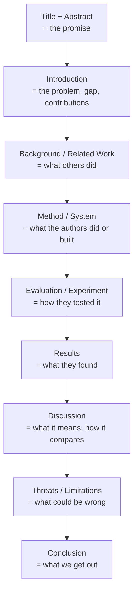
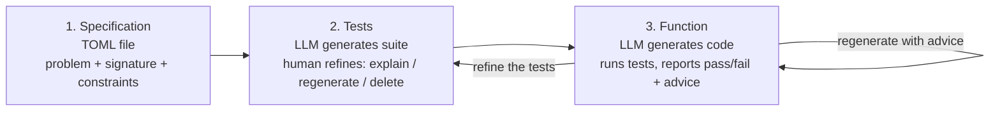
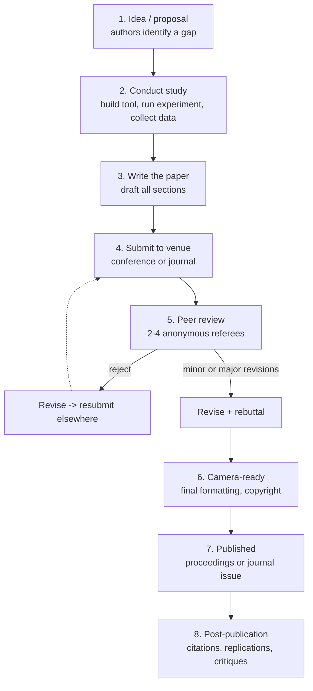
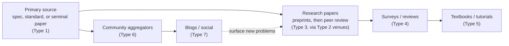
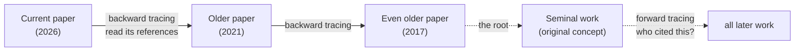

# How to Read a Research Paper: Structured Method

> **Running example:** *Understanding Specification-Driven Code Generation with LLMs: An Empirical Study Design* (Rosa et al., SANER 2026; arXiv:2601.03878v1). The PDF is in `F:\papers\`; the AI summary is [[understanding-specification-driven-code-generation-with-llms]].
> **Why this note exists:** The "how do I actually read a paper" question bugged me for a long time. This is the structured answer, grounded in one real paper.
> **Revised 2026-10-04:** checked against the PDF (removed an invented hypothesis and a made-up citation chain). Added paper types, how to read results, Keshav's five Cs, the four validity types, a paper-note template, and rules for reading with AI.

## TL;DR

Research papers follow a predictable skeleton, so you don't read them front-to-back like a novel. Read them in **three passes of increasing depth** (Keshav), and stop when you have enough:

- **Pass 1 (5-10 min):** title, abstract, introduction, headings, conclusion, and a glance at the references. Exit check: the **five Cs** (Category, Context, Correctness, Contributions, Clarity).
- **Pass 2 (up to 1 hr):** the whole paper minus proofs, with most of your attention on **figures, tables, and results**. Exit check: can you explain the main claim *and its evidence* to someone else?
- **Pass 3 (hours):** virtually re-do the work and hunt for the threats the authors *didn't* list. Only when you're reviewing, reproducing, or building on the paper.

Before Pass 1, work out **what kind of paper** it is (Section 1). A tech report, a benchmark, an experiment, and a 1974 classic need different questions. After reading, **write a paper note** (Section 14). Two sections beginners skip but shouldn't: **Related Work** (who else matters) and **Threats to Validity**. Threats shows what the authors admit could be wrong, and it's your starting point for finding what they didn't admit.

The running example is a registered report with **no results yet**, so Section 3 has a separate part on reading results.

## Start here: the one-screen protocol

Keep this open while reading. Each step points to the section that explains it.

1. **Why am I reading this?** Curiosity: Pass 1. Learning a technique: Pass 2. Citing or building on it: Pass 3. (Section 9)
2. **What is it?** Format: peer-reviewed, preprint, tech report, registered report? Type: empirical study, method, benchmark, tech report, classic? (Section 1)
3. **Pass 1:** answer the five Cs in one line each. Not worth more time? Stop here. (Section 3)
4. **Pass 2:** read every figure and table, and list the main claims with the evidence for each. (Section 3, "Reading results")
5. **Stuck?** Set the paper aside, read background first, or push on. All three are legitimate. (Section 3)
6. **Pass 3 (when it matters):** check conclusion, internal, construct, and external validity, and look for what's missing. (Sections 10-11)
7. **Write the paper note** from the template, in your own words, in `daily-paper/reading-notes/`. (Section 14)
8. **Used an AI to help, including the Hermes summary in `daily-paper/`?** Verify every claim against the PDF before it goes into your notes. (Section 15)

---

## 1. What are you holding? Format and paper type

Ask two questions before reading the body. **How was it published?** That tells you how much review it survived. **What kind of contribution does it make?** That tells you what to extract. Keshav's first C, *Category*, is exactly this.

### Publication format

| | Thesis | Conference Paper | Journal Paper | Registered Report (this one) | Preprint / Tech Report |
|---|---|---|---|---|---|
| Purpose | Degree requirement | Share findings at a venue | Archive a complete study | Pre-register a study plan *before* running it | Share fast, no gatekeeping |
| Length | 50-500 pages | 8-12 pages | 15-40 pages | Short (SANER 2026: 6 pages + 1 of references), results come later | Anything (LLM tech reports: 40-60 pages) |
| Review | Exam committee | Anonymous peer reviewers, usually one round | Peer review, often several revision rounds | **Stage 1** protocol review + **Stage 2** results review | **None** |
| Tense signal | Mostly past | Past/present mix | Past/present mix | **Future** ("we will...", "we plan to...") | Varies |

**This specific paper** is a **Stage 1 Registered Report**. The protocol and analysis plan were peer-reviewed and accepted at SANER 2026 *before* the experiment ran, with Continuity Acceptance (CA) for Stage 2. In SANER's registered-report track, Stage 2 (the full paper with results) goes to the *Empirical Software Engineering* (EMSE) journal. Under Continuity Acceptance, EMSE judges that paper on whether the authors followed the accepted protocol and justified any deviations, not on whether the results came out positive. So when you read it, you're reading a **study design + tool description**, not empirical results. This format exists to fight publication bias (the tendency for only "good" results to get published).

**Reading implication:** every "we will measure X" is a *promise*, not a finding. You gain a methodology to evaluate and perhaps reuse, not a result to cite.

### Contribution type: what to extract, what to distrust

The format tells you how much review a paper survived. The type tells you what Pass 2 should extract. Most of the papers in `F:\papers\` are *not* the running example's type:

| Type | Extract | Distrust / check | In `F:\papers\` |
|---|---|---|---|
| **Empirical study / controlled experiment** | RQs or hypotheses, design, participants or data, variables, metrics, statistics | Confounders, sample size, whether the metrics measure the concept (Section 10) | CURRANTE (protocol only, no results yet) |
| **Method / model paper** | The idea in one sentence, baselines, ablations, where it fails | Weak or outdated baselines, cherry-picked tasks, no variance reported | GLM (ACL 2022) |
| **LLM tech report** | Architecture, data, training recipe (pre-training + post-training), evaluation setup | Not peer-reviewed. Every number is self-reported, on evaluations the vendor chose: compare with independent leaderboards | DeepSeek LLM, Qwen, MiMo-V2.6 |
| **Benchmark / dataset paper** | How tasks were built, how answers are graded, contamination defenses, human baseline, which models were tested | Grading validity, leakage into training data, whether the tasks measure what the name claims | HLE (Nature 2026), DeepSWE (Datacurve, arXiv) |
| **System / tool paper** | The problem, design decisions and their trade-offs, the evaluation workload | Toy workloads, comparisons against straw men | None yet (classics: Raft, MapReduce) |
| **Classic / foundational paper** | The core idea, and the problem it solved *at the time* | Judge it in historical context: read for what it enabled, not for its evaluation | Liskov & Zilles (1974) |
| **Whitepaper / position / overview** | The argument and its assumptions | No review: the argument has to stand on its own | Bitcoin (2008), the SDD technical report (arXiv 2026) |
| **Experience report** | Context, what was tried, lessons learned | Single setting, self-assessed outcomes | Software requirement workshops (2017) |
| **Out-of-field paper** | The question, the headline finding, why it matters | You can't judge the methods: lean on venue, citations, and expert commentary, and stop at Pass 2 | Brain activity in games (2016), 3D necroprinting (Science Advances 2025) |

---

## 2. The anatomy of a research paper

The generic skeleton of a results paper:


```mermaid
flowchart TD
    A["Title + Abstract<br/>= the promise"] --> B["Introduction<br/>= the problem, gap, contributions"]
    B --> C["Background / Related Work<br/>= what others did"]
    C --> D["Method / System<br/>= what the authors did or built"]
    D --> E["Evaluation / Experiment<br/>= how they tested it"]
    E --> F["Results<br/>= what they found"]
    F --> G["Discussion<br/>= what it means, how it compares"]
    G --> H["Threats / Limitations<br/>= what could be wrong"]
    H --> I["Conclusion<br/>= what we get out"]
```

Section names and order vary by field, but the jobs stay the same. ML papers often put Related Work near the end, and LLM tech reports split the method into pre-training, post-training, and evaluation. A registered report like the running example stops after the plan: no Results or Discussion until Stage 2.

| Section | In this paper | Purpose |
|---|---|---|
| **Abstract** | "...empirical study design using CURRANTE, a Visual Studio Code extension..." | 30-second summary: what + why + how |
| **Index Terms** | Specification-Driven Development, LLMs, Code Generation, TDD, Empirical SE | Keywords for search/discovery |
| **I. Introduction** | TDD + LLM workflows exist, but the *human factor* is underexplored | States the problem, the gap, and the contribution |
| **II. Background & Related Work** | Codex/HumanEval, TGen, TICODER, LLM4TDD; human-AI interaction guidelines and IDE assistants | Positions the work against prior art |
| **III. The CURRANTE Plugin** | 3-phase GUI: Specification -> Tests -> Function | The artifact/tool the authors built |
| **IV. Experiment Goal & RQs** | RQ1: effectiveness; RQ2: user intent expression; participants, LiveCodeBench, variables (Table I) | The questions, and the context that will answer them |
| **V. Experimental Procedure** | Between-subjects procedure, data collection, coding tasks, metrics | The methodology |
| **VI. Execution Plan** | Preparation -> Execution -> Analysis phases | Logistics of running the study |
| **VII. Threats to Validity** | Internal (participants, LLM non-determinism) / External (generalizability) | The limits the authors admit: *read carefully, then look for what's missing* |
| **VIII. Contributions & Implications** | Protocol, telemetry schema, study plan | The payoff / takeaways |
| **References** | 17 citations | The conversation this paper joins |

---

## 3. The three-pass method (Keshav)

The method comes from S. Keshav, "How to Read a Paper" (*ACM SIGCOMM Computer Communication Review*, 2007). The original is two pages long; read it once.

### Pass 1: "What is this about?" (5-10 min)

1. Carefully read the **title, abstract, and introduction**. Read the whole introduction: the contributions usually sit in the paragraph(s) just *before* the closing roadmap paragraph.
2. Read the **section and subsection headings**, and nothing else.
3. Glance at any math to see what kind of theory it rests on.
4. Read the **conclusion**.
5. Glance over the **references**, ticking off the ones you already know.

**Exit check: the five Cs.** Answer each in one line:

| C | Question |
|---|---|
| **Category** | What type of paper is it? (Section 1) |
| **Context** | Which papers and theories does it build on? |
| **Correctness** | Do the assumptions look valid? |
| **Contributions** | What are the main contributions? |
| **Clarity** | Is it well written? |

If you can't answer them, or the answers say "not relevant to me," stop. Most papers you come across should end here.

**Applied to the example paper:**
- **Title:** "...An Empirical Study *Design*". The word **"Design"** is the tell: this is a protocol, not results.
- **Abstract:** the CURRANTE plugin, a 3-stage Specification -> Tests -> Function workflow, LiveCodeBench problems, logged metrics.
- **Introduction:** the gap is the *human factor* in TDD-style LLM workflows. The second-to-last paragraph gives the expected outcome ("twofold": empirical evidence + inform future IDE design). The last paragraph is only the roadmap.
- **Headings:** Background, CURRANTE, RQs, Procedure, Execution Plan, Threats, Contributions.
- **Five Cs:**
  - *Category:* a registered-report protocol plus a tool description.
  - *Context:* TDD-for-LLM work (TGen, TICODER, LLM4TDD) and human-AI interaction research.
  - *Correctness:* plausible on a first read (Pass 3 still finds problems; see Section 11).
  - *Contributions:* the CURRANTE tool, a study protocol, and a telemetry schema.
  - *Clarity:* readable, with a number of typos.

**After Pass 1 you should be able to say:** *"This is a study protocol for a VS Code plugin that uses a TDD workflow with LLMs. No results yet."*

### Pass 2: "What's the contribution, and is the evidence there?" (up to 1 hr)

Read the whole paper with care, but skip proofs and fine detail. Jot notes in the margins.

1. **Spend most of the time on figures, tables, and graphs.** Are the axes labeled? Are there error bars or confidence intervals? Do the numbers support what the text claims? (See "Reading results" below.)
2. **Mark unread references** worth following up.
3. **Extract the core** for the paper's type (Section 1). For an empirical study like the running example, that's four things:
   1. **The artifact:** CURRANTE = VS Code extension, 3 phases: Specification (TOML) -> Tests (human-refined) -> Function (LLM-generated).
   2. **The RQs:** RQ1: to what extent can CURRANTE generate code from the user's specification (effectiveness)? RQ2: to what extent can users express their intent through the test suite?
   3. **The variables (Table I):** PassAll, PassRate, TimeToPass, TestEdits, etc. This table is the heart of the methodology.
   4. **The dataset:** LiveCodeBench release_v5, 3 warm-up (easy) + 3 evaluation (medium) problems.

**Exit check:** can you summarize the main thrust of the paper, *with its supporting evidence*, to someone else? If not, Keshav gives three options: **(a)** set it aside, **(b)** read background material first and come back, or **(c)** push on to Pass 3. All three are legitimate. For a beginner, (b) is usually the right call.

### Pass 3: "Could I reproduce this, and what's wrong with it?" (4-5 hours as a beginner, about 1 hour with experience)

Virtually re-implement the work: make the same assumptions as the authors and re-create it in your head. Comparing your version with theirs exposes hidden assumptions, missing citations, and weak experimental choices. Ask *why* of every design choice. For this paper: *Why LiveCodeBench and not HumanEval? Why between-subjects? Why a 30-45 min budget? Why is the LLM not fixed in the protocol? Why TOML?*

Then use the four validity types (Section 10) to hunt for the threats the authors *didn't* list. Section 11 has a worked example: a Pass 3 on this paper finds four problems that its own Threats section misses.

You only need Pass 3 if you're reviewing the paper, reproducing it, or directly building on it. Still, do it deliberately on one short paper early on, because that's how you train the critical eye.

### Reading results: what Pass 2 is mostly about

The running example has no results, but almost every other paper you'll read does. The results are where claims either hold up or fall apart.

**Figures**
- Read the axis labels and units before looking at the curve. **Log scales** are everywhere in ML, and scaling-law plots are usually log-log. A straight line on a log-log plot is a power law, not steady linear growth.
- Look for **error bars or confidence intervals**. With no variance shown, you can't tell a real difference from noise.
- Check where the y-axis starts. A truncated axis can make a 2-point gain look like a cliff.

**Benchmark tables (most LLM papers and tech reports)**
- **Who ran the numbers?** Self-reported means the authors ran their own model; independent means a leaderboard or a third party did. Tech reports are almost entirely self-reported.
- **Was the harness the same for everyone?** Prompt format, few-shot count, temperature, agent scaffolding, and thinking budget can each move scores by several points. Baseline numbers copied from other papers were often produced under different settings.
- **Which metric?** pass@1 (one attempt) vs pass@k (any of k attempts passes) vs majority voting. Someone's pass@10 is not comparable to someone else's pass@1.
- **How many runs?** A single run of a stochastic model, with no variance reported, is one sample.
- **Which benchmarks are missing?** Vendors pick the benchmarks they look good on. Bold numbers mark the best result *in that table*, and the authors chose the table.

**Ablations**
- An ablation removes one component at a time to show what actually caused the gain. A paper without ablations tells you "it works" but not "why it works."

**Data contamination**
- If the test problems were in the training data, the score measures memory, not skill. Good papers say how they prevent this: held-out or newly written problems, or only problems released after the model's training cutoff. That last approach is LiveCodeBench's design: it keeps adding new contest problems, each tagged with its release date.

**Statistics, the minimum**
- **p-value:** the probability of seeing data at least this extreme if there were *no* real effect. It is not the probability that the claim is true, and it says nothing about the size of the effect.
- **Effect size:** *how big* the difference is. Common measures are Cohen's d and, in SE, Cliff's delta or Vargha-Delaney A12. With enough data, a tiny effect can be "significant."
- **Confidence interval:** the plausible range for the true value. A wide interval means weak evidence.
- **Sample size (N):** a small N means unstable results. Check whether the authors planned N in advance.
- **Non-parametric tests** (Mann-Whitney U, Wilcoxon) are common in SE, because times and counts are rarely normally distributed.
- **Correlation is not causation**, especially without a control group. Section 11 has a live example.
- **Many comparisons, few corrections:** test 20 things and, on average, one will hit p < 0.05 by pure chance.

**Exercise: self-reported vs independent (about 20 minutes).** The MiMo-V2.6 tech report charts its own DeepSWE v1.1 score right under the abstract, and the DeepSWE benchmark paper is also in `F:\papers\`. Find out which harness and settings MiMo used, and whether the DeepSWE authors report a number for that model.

---

## 4. The CURRANTE workflow in detail (Pass 2 depth)


```mermaid
flowchart LR
    A["1. Specification<br/>TOML file<br/>problem + signature + constraints"] --> B["2. Tests<br/>LLM generates suite<br/>human refines: explain / regenerate / delete"]
    B --> C["3. Function<br/>LLM generates code<br/>runs tests, reports pass/fail + advice"]
    C -->|refine the tests| B
    C -->|regenerate with advice| C
```

The loop ends when the function passes all tests or the time budget (about 30-45 minutes) runs out.

**Key design choices worth noting:**
- **TOML** is the specification format: a structured, human-readable file holding the natural-language problem statement, the function signature, and constraints.
- **The test suite IS the specification**, not a side artifact. The tests formally describe the requirements, and the LLM uses them to generate the function.
- **The human specifies; the LLM codes.** The developer writes the TOML spec and curates the tests, while code generation is fully delegated to the LLM. This is the "spec-driven" shift: the human's job is *specifying*, not *coding*.
- **Advice mechanism:** when tests fail, CURRANTE auto-generates advice from the failure messages to guide regeneration.

---

## 5. The variable taxonomy (Table I): a reusable template

This is one of the most directly reusable parts of the paper for any empirical work:

| Variable type | Examples from paper | What it captures |
|---|---|---|
| **Independent** | TaskId | What you manipulate or set as context. Here it's only a *blocking factor* (which of three problems a participant got), not a treatment |
| **Dependent** | PassAll, PassRate, TimeToPass, IterationsToPass, TestEdits, SuiteRegenerations, AdviceTriggers, TestCoverage, TestDiversity | What you measure as outcomes |
| **Confounding** | ProgrammingExperienceYears, PythonFamiliarity, PriorTDDExperience, PriorLLMCodeGenUse | What could distort the result if not measured and controlled |

**Lesson:** always separate what you set (independent), what you measure (dependent), and what could bias it (confounding). If you don't name your confounders, reviewers will ask about them.

**Notice what's missing:** there's no treatment variable, such as "with vs without human test curation." Everyone gets the same workflow. That limits the study to describing and correlating, which is why the confounders matter so much here. Experience plausibly drives both *how much* someone edits tests and *whether* they succeed. (Section 11)

---

## 6. What you gain after reading this paper

**Conceptual:**
- **Spec-Driven Development (SDD)**: the shift from writing code to writing *specifications* that LLMs turn into code.
- A concrete **TDD + LLM workflow**: specification -> test suite (human-curated) -> function (LLM-generated). A usable mental model for how AI coding tools *could* work.
- **What the study can and can't tell you:** it asks how human involvement in test curation relates to code-generation success. It has no comparison condition (for example, the same problems solved from a raw prompt). So it can describe and correlate, but it can't show that human-refined tests *cause* better code. (Section 11)

**Methodological (transferable to any empirical SE work):**
- How to structure **research questions** (an effectiveness RQ + a human-factor RQ).
- The **variable taxonomy** above: a clean template.
- **Blocking on task:** randomly assigning one of three problems and treating TaskId as a blocking factor is a reusable trick. But "between-subjects" here only means each participant solves one task, with no treatment comparison. Copy the procedure and the logging, not the causal framing.
- How to write a **Threats to Validity** section. This one covers internal and external validity; the standard SE taxonomy has four types (Section 10).
- Following the **ACM SIGSOFT Empirical Standards**: the community's methodological checklist for this kind of study.

**Practical:**
- Awareness of **CURRANTE** and **LiveCodeBench** as tools/benchmarks you could use yourself.
- A reading list from the 17 references: TGen, TICODER, AlphaCodium, LLM4TDD, Codex/HumanEval, and Amershi et al.'s *Guidelines for Human-AI Interaction* (CHI 2019).

---

## 7. The "should I read this paper?" decision checklist

After Pass 1, with the five Cs in hand, ask:

1. **Does it match my goal?** (the Contributions and Context Cs) No: stop.
2. **What type is it?** (the Category C; see Section 1) A protocol gives you a method, a results paper gives you a finding, and a tech report gives you a recipe plus self-reported numbers.
3. **Is the venue credible?** SANER is an established IEEE conference. arXiv preprints and tech reports are unreviewed, so check whether a peer-reviewed version exists. Section 14 lists tools for checking venues.
4. **Is the Related Work honest about gaps?** Here: yes. It names the "human factor" gap explicitly.
5. **Do the Threats/Limitations admit real limits?** Here: LLM non-determinism, modest N, and ecological validity. Remember these are the threats the authors chose to list.

The example passes all five, so it earns a Pass 2. Passing this checklist means "worth reading," not "correct": Section 11 shows what a Pass 3 still finds.

---

## 8. Common pitfalls when reading papers

- **Reading linearly front-to-back.** You'll drown in Related Work before reaching the point. Use the three-pass method.
- **Treating the abstract as ground truth.** Abstracts are sales pitches. Verify claims against the body.
- **Skipping figures and tables.** The results live there, not in the prose that describes them.
- **Taking the Threats section at face value.** It lists the limits the authors chose to admit. Read it, then look for what's missing.
- **Confusing "protocol" with "results."** Future tense ("we will") = plan. Past tense ("we found") = results.
- **Comparing numbers across papers.** Different harnesses, prompts, metrics (pass@1 vs pass@k), or test sets make "78 vs 81" meaningless.
- **Mistaking "statistically significant" for "important."** Look for the effect size.
- **Skipping the references.** The reference list is a curated reading list for the subfield.
- **Not checking the venue or the version.** A preprint on arXiv is not a peer-reviewed paper, and a v1 may have been corrected in v3. This one is both on arXiv *and* SANER-accepted.
- **Grinding through a paper you lack the background for.** Take Keshav's option (b): read the background first, then come back.
- **Reading without writing.** If you don't summarize a paper in your own words, most of it is gone within weeks. (Section 14)
- **Treating an AI summary as the paper.** (Section 15)
- **Treating one paper as the final word.** One paper is one data point. Read the Related Work and a survey to see the bigger picture.

---

## 9. Quick reference: reading speed guide

| Goal | Pass | Time | What to read | Exit check |
|---|---|---|---|---|
| Decide if worth reading | 1 | 5-10 min | Title, abstract, introduction, headings, conclusion, glance at references | The five Cs |
| Understand the contribution | 2 | Up to 1 hr | Whole paper minus proofs, figures and tables first; extract the core for the paper's type | Explain claim + evidence to someone |
| Review / reproduce / build on | 3 | 4-5 hr (beginner), ~1 hr (experienced) | Virtually re-implement; question every choice | List the threats the authors missed |

---

## 10. How each section is actually written (author's perspective)

This is what goes on *before* you see the paper. Knowing how authors build each section tells you what to trust and what to question in each one.

### Abstract
- **Written last**, even though it appears first.
- Distills the final contribution into 150-250 words: problem -> gap -> method -> key result -> implication.
- **Trust level: medium.** It's a sales pitch: authors frame their work favorably. Verify every claim against the body.

### Index Terms / Keywords
- Chosen for discoverability: what terms should make this paper appear in search results?
- Often mapped to the venue's official ACM Computing Classification or a similar taxonomy.
- **Trust level: high.** These are factual labels, not claims.

### I. Introduction
- **The funnel structure**: broad context -> narrowing to the specific problem -> the gap -> the contribution.
- Paragraph 1: "The world is moving toward X."
- Paragraph 2: "Existing work does A, B, C."
- Paragraph 3: "But [gap] remains underexplored."
- Paragraph 4: "In this paper, we [contribution]." Often followed by an explicit bulleted list of contributions. **This, not the roadmap, is what Pass 1 is after.**
- Last paragraph: roadmap ("The rest of the paper is structured as follows...").
- **Trust level: medium-high.** The gap statement is the authors' framing: a reviewer may disagree that the gap is real.

### II. Background & Related Work
- **Written to position, not to survey.** Authors select prior work that makes their contribution look novel and well-grounded.
- Three moves: (1) cite the canon (shows you know the field), (2) cite the direct predecessors (shows what you build on), (3) implicitly or explicitly say "none of these did X."
- **Trust level: medium.** No Related Work is exhaustive, and authors cherry-pick. If a suspiciously obvious prior work is missing, that's a signal: they may be avoiding an unfavorable comparison.

### III. Method / System (the artifact)
- Describes what was built or proposed.
- For tool papers: architecture, components, workflow, often with a figure (like the CURRANTE GUI screenshot in Figure 1).
- For method papers: the algorithm, formal definition, or study protocol.
- **Trust level: high for the description, medium for claims of novelty.** The thing exists as described; whether it's truly novel is a separate question.

### IV. Research Questions / Hypotheses
- RQs are framed to be answerable with the data the authors plan to collect.
- Good RQs are specific and falsifiable. Vague RQs ("Is X good?") are a red flag.
- **Trust level: high for the question itself, medium for whether it's the *right* question.** A well-formed RQ can still be the wrong question.

### V. Experimental Procedure / Methodology
- The most scrutinized section in peer review.
- Covers: participants, dataset, variables, procedure, metrics, analysis plan.
- In empirical SE: should reference the **ACM SIGSOFT Empirical Standards** (this paper does, ref [16]).
- **Trust level: high if it names confounders and threats; low if it doesn't.** An omission here is the biggest red flag in the whole paper.

### VI. Results (not in this paper: it's a protocol)
- When present: descriptive statistics first, then inferential tests, then effect sizes.
- **Trust level: medium.** Check whether negative results are reported or buried; selective reporting is common. See "Reading results" in Section 3.

### Discussion (not in this paper either)
- Interprets the results, compares them with prior work, offers explanations, and draws implications.
- **Trust level: medium-low.** This is where authors speculate. Separate what the data shows from what the authors *think* it means.

### VII. Threats to Validity
- Where authors state what could undermine their conclusions. The standard SE taxonomy (Wohlin et al., *Experimentation in Software Engineering*) has **four** types:

| Validity | Question | Typical threats |
|---|---|---|
| **Conclusion** | Is the statistical relationship real? | Small N, low power, the wrong test, many comparisons, an analysis chosen after seeing the data |
| **Internal** | Is the relationship *causal*? | Confounders, no control group, selection effects, learning effects, instrumentation |
| **Construct** | Do the measures capture the concepts? | A metric that's easy to game, a proxy that doesn't match the concept |
| **External** | Does it generalize? | Population, tasks, tools, setting (ecological validity) |

- **Trust level: medium.** The listed threats are the ones the authors are comfortable admitting, usually each with a mitigation, and in SE this section is often formulaic. A paper that names real threats honestly is more trustworthy, not less. But your Pass 3 job is to find the threats that *aren't* listed. This paper covers only internal and external validity, and its biggest problem is a construct-validity one (Section 11).

### VIII. Conclusion / Contributions
- Restates the contribution, sometimes adds "future work."
- **Trust level: medium.** "Future work" is often what the authors wish they'd done but didn't. Read it as a map of the paper's actual limits.

### References
- A curated conversation. The reference list tells you which community the authors sit in.
- **Trust level: high.** But check: are recent key works cited? Are competitors cited fairly? A missing direct competitor is a red flag.

---

## 11. The publication lifecycle & the trust question

Should you trust a paper because it went through a long process? **Trust, but verify.** The process is messier than it looks.

### The actual lifecycle


```mermaid
flowchart TD
    A["1. Idea / proposal<br/>authors identify a gap"] --> B["2. Conduct study<br/>build tool, run experiment, collect data"]
    B --> C["3. Write the paper<br/>draft all sections"]
    C --> D["4. Submit to venue<br/>conference or journal"]
    D --> E["5. Peer review<br/>2-4 anonymous referees"]
    E -->|reject| R["Revise -> resubmit elsewhere"]
    R -.-> D
    E -->|minor or major revisions| F["Revise + rebuttal"]
    F --> G["6. Camera-ready<br/>final formatting, copyright"]
    G --> H["7. Published<br/>proceedings or journal issue"]
    H --> I["8. Post-publication<br/>citations, replications, critiques"]
```

In CS, most papers also go up on arXiv around step 4, before review finishes. That's why you'll often meet a paper as a preprint first.

**Key realities the diagram hides:**
- **Peer review is not replication.** Reviewers read the manuscript and check internal consistency, novelty, and soundness: they do **not** re-run the experiment. A reviewer can't catch fabricated data unless it's internally inconsistent. This is why replication studies matter.
- **Reviewers are unpaid volunteers** with their own deadlines and biases. A 2-week review turnaround on a 30-page paper is not deep scrutiny.
- **Review is biased toward positive/novel results.** This is the publication bias problem: null results get rejected or never submitted. Registered Reports (like this paper) exist specifically to fight this: the plan is reviewed *before* results exist.
- **Conferences vs. journals.** In CS/SE, unlike most fields, top conferences (ICSE, FSE) carry as much prestige as top journals. The trade-off: tight page limits and a short review cycle, so less room for depth. Journals allow revisions and more space but are slower.

### The trust hierarchy (rough, field-dependent)

| Source | Review rigor | Trust baseline |
|---|---|---|
| Top-tier peer-reviewed conference/journal (e.g., ICSE, FSE, TSE) | Expert reviewers, rebuttal or revision rounds | **High**, but still verify |
| Lower-tier peer-reviewed venue | 2-3 reviewers, often 1 round | Medium |
| **Registered Report** (this paper) | Protocol reviewed before results; results reviewed after | **High for the plan**, but only as strong as the plan is specific; results pending |
| arXiv preprint (unreviewed) | None | **Low**: treat it as a draft and check whether it was later published |
| Workshop paper | Light review, sometimes non-archival | Low-medium |
| Vendor tech report (DeepSeek, Qwen, MiMo) | None; numbers are self-reported | A good primary source for *what they did*, weak evidence for *how good it is* until independently checked |
| White paper / industry report | No formal review | Judge the argument itself (the Bitcoin whitepaper was enormously influential with zero review) |
| Blog post | None | Lowest: treat as a starting point only |

**A trust baseline is not importance.** The table says how much checking a document survived before you saw it, not whether it matters. Unreviewed documents can define a field (Bitcoin, most LLM tech reports), and peer-reviewed papers can be wrong.

### Should you trust *this* paper?

Conditionally, and as a *plan*. The surface signals are good:

- ✅ **Peer-reviewed venue.** SANER is an established IEEE conference on software analysis and evolution.
- ✅ **Registered Report format.** The protocol passed Stage 1 review before any data existed, which protects against publication bias. How much it protects against flexible analysis depends on how tightly the plan is pinned down (see below).
- ✅ **A real Threats section.** It names genuine limits: LLM non-determinism, modest sample size, and the ecological-validity trade-off.
- ✅ **Cites the ACM SIGSOFT Empirical Standards** and promises to open-source its materials.
- ⚠️ **No results yet.** You're trusting a plan, not findings.
- ⚠️ **The authors built the tool they evaluate**, which is a potential conflict of interest. Pre-registration mitigates it, but watch for it when results land.
- ⚠️ **Single tool, single dataset.** Findings from CURRANTE + LiveCodeBench may not generalize to Copilot + real projects.

Pass 1 can check surface signals like these. Pass 3 asks whether the design can actually answer its own questions.

### A worked Pass 3: four problems the Threats section misses

Each maps to one validity type (Section 10):

1. **Construct validity: "correct" means "passes the participant's own tests."**
   - The paper labels PassAll and PassRate as "Correctness", and frames RQ1 around "generating correct code solutions for a given problem."
   - But Table I defines PassAll as whether the function "passes all tests in the suite", and the suite is the one the participant curated. Nothing in the protocol scores the function against LiveCodeBench's own reference tests.
   - So a participant who deletes the hard tests gets PassAll = 1. RQ1 measures agreement with the user's tests, not correctness. This is the test-oracle problem that [[root-of-all-knowledge]] flags in its Section 7.
   - The fix would be to also score every final function against LiveCodeBench's hidden tests.
2. **Internal validity: causal language, no comparison condition.**
   - The abstract promises to analyze how human intervention "influences" code quality, and the introduction promises to analyze its "real impact".
   - But the only independent variable is TaskId. Everyone uses the same workflow, and no group works without test curation.
   - The planned analysis is descriptive statistics plus exploratory Spearman correlations, and those are confounded: participants who struggle tend to edit more tests, and experience drives both editing and success.
3. **Construct validity again: a contamination tension.**
   - The problems come from LiveCodeBench release_v5, which covers problems released up to January 2025.
   - The model will be "the most recent and capable open-weight model available at the time of experiment execution". The suggested option is Qwen3-Coder, released in mid-2025.
   - Problems likely to be in the model's training data will be excluded "based on the reported dates". A model trained after January 2025 may have seen most of release_v5, so this filter could leave very few problems.
   - Leaving the model unfixed also means RQ1's answer depends on a choice made after the protocol was accepted.
4. **Conclusion validity: the analysis is still open.**
   - "Further analyses will be chosen as warranted by the collected data."
   - Effect sizes, multiple-comparison handling, and robustness checks "will be applied pragmatically."
   - "The exact operationalization of all metrics ... will be finalized" later.
   - There are no hypotheses and no target sample size. These are exactly the researcher degrees of freedom that pre-registration is meant to remove, so the registered-report label buys less here than it usually would.

Stage 2 may fix some of these. The point is that a Pass 3 reader can spot them *now*, from the protocol alone.

**Verdict:** learn from the protocol and the logging design, but don't cite any finding until Stage 2 appears. When it does, check whether these four problems were addressed.

### The trust-but-verify checklist

For any paper, before citing or building on it:

1. **Check the venue.** Is it peer-reviewed? What tier? (Section 14)
2. **Check the format and version.** Results paper or protocol? Preprint or published? The latest arXiv version?
3. **Read the Threats section, then look past it.** Does it name real limits or hand-wave? Which of the four validity types does it skip?
4. **Check for replication.** Has anyone reproduced this? Search Google Scholar for the title + "replication", or the Open Science Framework (OSF) for registered replications.
5. **Check the data and artifacts.** Are they open? ACM artifact badges mean someone checked them. (This paper promises open materials: a good sign, once delivered.)
6. **Check for conflicts of interest.** Did the authors build the tool they're evaluating, or train the model they're benchmarking?
7. **Check post-publication critique.** Search for replies, comments, retractions (the Retraction Watch database), and critical blog posts.
8. **Read 2-3 cited and citing papers.** One paper is one data point. The field's consensus matters more.

**Bottom line:** Peer review raises the floor: it filters out obvious nonsense. It does **not** guarantee truth. A peer-reviewed paper is a *credible claim*, not a *proven fact*. Trust it enough to use as a building block; verify it before staking your reputation on it.

---

## 12. The knowledge ecosystem: who handles a topic, and where

`mcpservers.org` and `computer.org` both "handle" computing knowledge, in completely different ways. There is no single place where a topic lives. A topic is held by an **ecosystem of organizations**, each at a different stage of the knowledge lifecycle.

### How a topic moves through the layers


```mermaid
flowchart LR
    A["Primary source<br/>spec, standard, or seminal paper<br/>(Type 1)"] --> B["Research papers<br/>preprints, then peer review<br/>(Type 3, via Type 2 venues)"]
    B --> C["Surveys / reviews<br/>(Type 4)"]
    C --> D["Textbooks / tutorials<br/>(Type 5)"]
    A --> E["Community aggregators<br/>(Type 6)"]
    E --> F["Blogs / social<br/>(Type 7)"]
    F -.->|surface new problems| B
```

This is one common path, not a law:
- Many topics start as a research paper (the Transformer, Raft) and get standardized later, or never.
- Standards often codify practice that already exists: HTTP was in use for years before its first RFC.
- The layers run in parallel. For MCP, community directories appeared within weeks of the spec.

### The seven types of knowledge holders

| Type | What they do | Trust level | Example |
|---|---|---|---|
| **1. Primary source / standards body** | Publish the official specification or the original work: the source of truth for "what the thing IS" | **Highest** for definitions | W3C for HTML; IETF RFCs for internet protocols; a project's own spec, like MCP's at `modelcontextprotocol.io` (created by Anthropic in 2024, governed by the Linux Foundation's Agentic AI Foundation since December 2025). A company publishing a spec is a primary source, not a standards body |
| **2. Professional society** | Run conferences, publish journals, maintain digital libraries, set ethics/code standards | **High**: peer-reviewed, institutional | IEEE Computer Society (`computer.org`), ACM, USENIX |
| **3. Research paper** | One investigation, one specific question | Medium-high if peer-reviewed (see Section 11) | The CURRANTE paper at SANER 2026 |
| **4. Survey / review** | Synthesize dozens of papers into "here's what the field knows" | **High** for getting the map | ACM Computing Surveys; systematic literature reviews |
| **5. Textbook / tutorial** | Teach fundamentals for newcomers | Medium: quality varies widely | "Crafting Interpreters"; O'Reilly books; official docs |
| **6. Community aggregator** | Curated directories, awesome-lists, forums | **Low-medium**: curation varies, often self-promotional | `mcpservers.org`, awesome-mcp-servers, Hacker News, Reddit |
| **7. Blog / social** | Opinion, hot takes, news, first-person experience | **Lowest**: treat as starting points only | Substack posts, X/Twitter threads, dev.to |

### Two sites, decoded

**`computer.org`: IEEE Computer Society (Type 2: professional society)**
- Founded 1946. It publishes *Computer* magazine and the CSDL digital library, and sponsors many conferences. ICSE is sponsored jointly with ACM SIGSOFT; FSE, by contrast, is an ACM conference.
- They don't invent topics. They **provide the infrastructure** for the field: peer review, archival publication, conferences, ethics codes.
- They are a **knowledge institution**, not a knowledge creator. The papers they publish are written by researchers, not by IEEE staff.
- Trust: high, but slow. A topic has to be mature enough for researchers to study it before IEEE publishes anything about it.

**`mcpservers.org`: MCP server directory (Type 6: community aggregator)**
- A community-run directory of thousands of Model Context Protocol servers, not an official MCP project.
- It aggregates what the community has built. That's useful for discovery ("what MCP servers exist?"), but entries are **self-submitted or community-added**: no peer review, no quality gate.
- Trust: low-medium. Great for finding things; verify each entry before relying on it. The directory is a map, not a recommendation.
- Why it exists: MCP is young (announced November 2024). Directories appeared within weeks; peer-reviewed research takes much longer.

### Why these two coexist

They serve different stages of the same topic's life:

```
Anthropic publishes the MCP spec (Nov 2024) -> developers build servers ->
community catalogs them (mcpservers.org) -> researchers study them (arXiv preprints from 2025) ->
peer-reviewed venues publish -> surveys synthesize -> textbooks teach -> blogs argue throughout
```

By late 2026, MCP had reached most layers:
- a spec governed by a foundation
- large community catalogs
- a steady stream of arXiv papers since 2025 (benchmarks, security analyses)
- peer-reviewed venues following, on their usual lag

Preprints let research move at nearly industry speed, but peer review still takes months to years.

### How to use each type

| If you want to... | Go to... | ...and do this |
|---|---|---|
| Know the official definition | Primary source (Type 1) | Read the spec, not interpretations |
| Get the map of a field | Survey (Type 4) | Search "systematic literature review + topic" |
| Understand one specific claim | Research paper (Type 3) | Three-pass method (Section 3) |
| Learn from scratch | Textbook/tutorial (Type 5) | Build something with it, don't just read |
| Discover tools/options | Community aggregator (Type 6) | Browse, then verify each on its own merits |
| Get news/opinion | Blog/social (Type 7) | Treat as leads, not facts |

### Rigor vs speed

| Source | Rigor | Speed |
|---|---|---|
| Spec / standard | High, for definitions | Standards bodies: slow (consensus). Vendor and project specs: fast |
| Peer-reviewed paper | High | Slow: months to 1-2 years |
| Survey / systematic review | High | Slowest: waits for papers to accumulate |
| Preprint (arXiv) | Unchecked: up to you | Fast: days |
| Community aggregator | Low | Fast: hours |
| Blog / social | Low | Instant |

You rarely get high rigor and high speed from the same source. That's why the ecosystem has layers: **each one optimizes for a different trade-off between correctness and currency.** Preprints are the field's attempt to split the difference: fast, with the rigor check left to the reader (you, using Section 3).

### Practical reading

When you encounter a new topic, don't just read one type of source. Read across the stack:

1. **Start at the spec** (Type 1) for ground truth.
2. **Check a survey** (Type 4) for the map.
3. **Skim 2-3 recent papers** (Type 3) for current questions.
4. **Browse an aggregator** (Type 6) for what people are actually building.
5. **Read a few blog posts** (Type 7) for opinion and edge cases.

If you only read one layer, you get a distorted picture: only specs = too abstract; only papers = too narrow; only blogs = too opinionated; only aggregators = too shallow.

---

## 13. Tracing the citation chain back to the root

A research paper's reference list is a thread you can pull. Follow it backward, paper to paper, and you can trace a topic back to where it began. The technique has a name: **backward citation tracing** (or backward reference searching). The opposite direction, finding newer papers that cite an older one, is **forward citation tracing**.


```mermaid
flowchart LR
    A["Current paper<br/>(2026)"] -->|backward tracing<br/>read its references| B["Older paper<br/>(2021)"]
    B -->|backward tracing| C["Even older paper<br/>(2017)"]
    C -.->|the root| D["Seminal work<br/>(original concept)"]
    D -.->|forward tracing<br/>who cited this?| E["all later work"]
```

### The word for the origin: "seminal"

The original work that introduced a concept is called the **seminal paper** (or seminal work). Everything else in the field builds on it. When you trace back far enough, you're hunting for this.

### The twist: roots hide in other layers, and keep receding

If you trace back far enough, you often don't land on another research paper. You land on a **book**, a **specification**, or a **standards document**: a different layer of the knowledge ecosystem entirely.

Here is the TDD chain behind the CURRANTE paper. The first step is checked against the paper's actual reference list:

```
CURRANTE (2026), checked against its reference list:
  cites TGen (ASE 2024), TICODER (TSE 2024), LLM4TDD (2024, 2025), AlphaCodium (2024)
  cites Codex/HumanEval (Chen et al., 2021) for the pass@k metric and the benchmark
  cites nothing for TDD itself: the paper treats TDD as common knowledge

Further back: the concept's lineage, not CURRANTE's citations
  Kent Beck, "Test-Driven Development: By Example" (2002/2003): named and popularized TDD
    Kent Beck, "Extreme Programming Explained" (1999): "test-first programming" as an XP practice
      NASA Project Mercury (early 1960s): test-first micro-increments, per Larman & Basili (2003)
```

Two lessons:
- **The chain can have gaps.** A paper may cite nothing for the concept it rests on. To keep tracing, step sideways: into its references' references, or into a survey.
- **The root keeps receding.** Beck's book is where TDD got its *name*, not where the *practice* began. When you hit a book, a spec, or a standards document, you've usually found where a concept was named or formalized, and that is often deep enough. This matches Section 12: the root of a topic may sit in a *different layer* than where you started. [[root-of-all-knowledge]] asks what happens if you never stop.

### Not every reference is a root

A paper's reference list mixes several kinds of citations, and only some are worth tracing backward:

| Reference type | Why it's cited | Trace it back? |
|---|---|---|
| **Seminal / foundational** | The original concept the paper builds on | **Yes, this is the root** |
| **Direct predecessor** | The immediate prior work being extended | Yes, one step |
| **Method / dataset** | Cited for a tool or benchmark used (e.g., LiveCodeBench) | Maybe, if you want to understand the tool |
| **Canon / context** | Cited to show awareness of the field ("I know X exists") | No: usually just name-dropping |
| **Recent result** | A recent paper cited for a specific finding | Only if that finding matters to you |

A 30-reference list isn't 30 roots: it's usually 2-3 real roots plus 27 supporting citations. Your job is to spot which references are foundational and which are context.

### How to spot the seminal reference

- **Heavily cited**: it appears in the reference lists of many papers in the field, not just this one.
- **Older than the rest**: it sits at the early end of the reference list's date range.
- **Treated as defining**: the Introduction refers to it as the origin of the concept, not as a comparison point.
- **Named in the topic sentence**: "Beck introduced TDD..." vs. "Smith et al. found that...".

### Tools for citation tracing

| Tool | Direction | Use |
|---|---|---|
| Paper's own reference list | Backward | Free, always available; one step at a time |
| Google Scholar "Cited by" | Forward | Find all papers that cite a given work; see how influential it is |
| Semantic Scholar | Both | AI-enriched citation context; shows *why* something is cited |
| DBLP | Both (CS only) | Complete publication lists per author and per venue |
| Connected Papers | Visual | A similarity graph around one seed paper, built from shared citations rather than direct links |

### The practical rule

**Trace backward selectively, not exhaustively.** Pull one thread at a time, following only the foundational references. When you hit a book, a spec, or a standards document, you've likely reached where the concept was named or formalized, and that's where deep understanding of a topic actually starts.

In practice the chain doesn't go on forever: a handful of seminal works usually anchors a topic. They aren't always recent. Data abstraction traces to Liskov & Zilles (1974, in `F:\papers\`), and test-first practice to the 1960s. Find the anchors, and you've found the foundation.

---

## 14. Your reading workflow: find, check, write

### Finding and getting papers
- **Search:** Google Scholar (broadest, with "Cited by"), Semantic Scholar (citation context), DBLP (complete lists by author and venue, CS only), arXiv (preprints).
- **Access, legally:**
  - arXiv preprints are free.
  - The **ACM Digital Library has been fully open access since January 2026**.
  - IEEE Xplore is mostly paywalled, but authors often post PDFs on their own pages or on arXiv.
  - The Unpaywall browser extension finds legal free copies.
- **Check the version.** arXiv papers get revised (`v1`, `v2`, ...). Read the latest, and check whether a peer-reviewed version has appeared since (Semantic Scholar and DBLP list both).

### Surveying a new area (Keshav's method)
1. Find 3-5 recent, highly cited papers on the topic and do Pass 1 on each. Read their Related Work sections, and look for a survey.
2. Note the citations and author names that keep recurring: those are the key papers and researchers.
3. Check where those researchers publish: those are the top venues. Browse those venues' recent proceedings for more related work.
4. Do two passes through the resulting set. If they all cite a key paper you missed, get it and repeat.

### Checking the venue
- **Conferences:** the CORE ranking portal (A*, A, B, C).
- **Journals:** Scimago (SJR) quartiles, Q1 to Q4.
- **Predatory-venue red flags:** acceptance within days, fees requested up front, a vague "International Journal of Advanced Everything" scope, aggressive email invitations to submit.
- **After publication:** the Retraction Watch database for retractions. ACM artifact badges (Available, Evaluated, Reproduced) show that someone checked the code and data.

### Writing the paper note
Reading without writing evaporates within weeks. The vault keeps two layers per paper:
- **The summary** (what the paper *says*). Hermes's research-paper-summaries skill writes one to `daily-paper/<slug>.md` for each PDF in `F:\papers\`. Its quotes and numbers are machine-checked against the PDF; its narrative and cross-links are not (Section 15).
- **The paper note** (what *you* think). For every paper that gets past Pass 1, create one from the [[paper-note]] template (`templates/research/paper-note.md`) in `daily-paper/reading-notes/`. Do your passes before opening the summary, then compare.

The paper note holds:
- frontmatter: authors, year, venue, peer-reviewed or not, arXiv version, pass reached
- the five Cs, one line each
- a three-sentence summary **in your own words** (if you can't write it, you haven't understood the paper yet)
- a claims -> evidence table: each main claim, and what supports it
- your critique: the threats you found, not just the ones the authors listed
- follow-up references and connections to your own notes

Papers that stop at Pass 1 don't need a full note: one line in a reading log (title, five Cs, verdict) is enough. Keep the log at `daily-paper/reading-notes/00-reading-log.md`; the template doc has the line format.

### Tools
- **Zotero** (free, open source) stores PDFs and metadata, handles annotation, and exports citations. Its browser connector saves a paper with one click.
- **Zotero -> Obsidian:** community plugins (such as Zotero Integration) can pull a paper's metadata and your PDF highlights into a note. This is optional: start with the template, and add tooling once the habit sticks.

---

## 15. Reading papers with AI

LLMs are good reading assistants and unreliable narrators. The first, AI-written draft of this note contained a research hypothesis the paper never states and a citation chain that its reference list contradicts. Both sounded plausible, which is exactly the problem.

The `daily-paper/` summaries show the same pattern in a milder form. They're produced with a checker that verifies every quote and number against the PDF, and in a spot check of two summaries (2026-10-04), those held up. Both errors found were in the unchecked narrative:
- The MiMo-V2.6 summary calls DeepSWE "Xiaomi's" benchmark. It's Datacurve's, as the same note's own appendix says.
- The CURRANTE summary calls the paper the "empirical companion" to the SDD guide and says it tests the guide. That's impossible: the guide came out three weeks later, by different authors, and CURRANTE doesn't cite it.

Trust the quotes and numbers more than the prose that connects them.

**Good uses**
- Explaining jargon, background concepts, and math notation.
- Giving you the background a paper assumes (Keshav's option b) before your Pass 2.
- Generating questions to put to the paper ("What would a skeptical reviewer ask about Section V?").
- Checking your own summary against the PDF ("What did I get wrong?").

**Rules**
1. **Do Pass 1 yourself first.** Without your own picture of the paper, you can't spot a wrong summary.
2. **Demand locations.** Every claim about the paper must come with a section, table, or page number. Then look it up.
3. **Watch for gap-filling.** LLMs fill gaps with what's *typical*: a hypothesis, a tidy citation chain, a standard statistical test. Typical isn't what this paper did.
4. **Feed it the PDF, not the title.** An AI recalling a paper from memory is guessing. An AI reading the actual text can still be wrong, but you can check it.
5. **Never cite a paper you only know from a summary.**

---

## Sources and further reading

- S. Keshav, "How to Read a Paper," *ACM SIGCOMM Computer Communication Review* 37(3), 2007. The source of the three-pass method and the five Cs; two pages.
- G. Rosa, D. Moreno-Lumbreras, G. Robles, J. M. González-Barahona, "Understanding Specification-Driven Code Generation with LLMs: An Empirical Study Design," SANER 2026 (Stage 1 Registered Report), arXiv:2601.03878. The running example.
- C. Wohlin et al., *Experimentation in Software Engineering* (Springer). The four-type validity taxonomy.
- P. Ralph et al., *ACM SIGSOFT Empirical Standards for Software Engineering Research*. The community checklists for empirical SE studies (ref [16] in the example paper).
- C. Larman and V. R. Basili, "Iterative and Incremental Development: A Brief History," *IEEE Computer*, 2003. The source for test-first development on Project Mercury.
- N. Jain et al., "LiveCodeBench: Holistic and Contamination Free Evaluation of Large Language Models for Code," arXiv:2403.07974, 2024.
- [Anthropic: donating MCP and establishing the Agentic AI Foundation](https://anthropic.com/news/donating-the-model-context-protocol-and-establishing-of-the-agentic-ai-foundation) (December 2025).
- [ACM Digital Library now fully open access](https://library.smu.edu.sg/topics-insights/acm-digital-library-now-fully-open-access) (January 2026).

## Knowledge connections

- [[CURRANTE]]: the VS Code extension described in the example paper (no note yet; create one if you start using it)
- [[test-driven-development]]: the paradigm this workflow builds on (no note yet)
- [[LiveCodeBench]]: the benchmark dataset used (no note yet)
- [[empirical-software-engineering]]: the methodological tradition behind the ACM SIGSOFT standards (no note yet)
- [[paper-note]]: the template for writing up each paper (Section 14)
- [[understanding-specification-driven-code-generation-with-llms]]: the AI summary of the running example (one summary per paper in `F:\papers\` lives in `daily-paper/`)
- [[root-of-all-knowledge]]: the philosophical continuation of this note (what lies past the end of every citation chain). Its Section 7 names the test-oracle problem behind this paper's metrics.
- [[knowledge-communication]]: the professions that turn knowledge into easy words (science communicators, technical writers, and more).

## Key takeaways

- Papers have a predictable skeleton: Abstract -> Introduction -> Related Work -> Method -> Evaluation -> **Results -> Discussion** -> Threats -> Conclusion. Names and order vary by field; the jobs don't.
- Identify the **paper type** first: a tech report, a benchmark, an experiment, and a classic each need different questions.
- Use the **three-pass method**: 5-10 min / up to 1 hr / hours. Exit Pass 1 with the **five Cs**, and exit Pass 2 when you can explain the claim *and its evidence*. Stop when you have enough.
- **Results live in figures and tables.** Check who ran the numbers, under what settings, with what variance, and whether the test data leaked into training.
- **Future tense = protocol, past tense = results.** This example is a protocol (Stage 1 Registered Report), and a Pass 3 still finds four problems its Threats section misses.
- Threats to Validity has four types (conclusion, internal, construct, external). The listed threats are the ones the authors chose to admit.
- **Write a paper note** for anything past Pass 1, and **verify any AI summary against the PDF**.
- After reading, you should walk away with: one concept, one method, one tool, and a reading list.
