# Human Full-Body Checklist

> The **body maintenance** checklist: everything worth checking on a human, head to toe.
> Same philosophy as the swe-knowledge checklists: items you actually tick, no tutorials.
> Three cadences: **[Monthly]** self-checks, **[Annual]** clinical checks, **[Age]** one-time or age-triggered screenings.
> General adult (18+), both sexes, with sex-specific items marked. Asian cutoffs used for BMI/waist (WHO Asia-Pacific).
> ⚠️ Educational checklist, not medical advice. Screening schedules vary by country and personal risk: confirm with your doctor.

---

## 0. The Cadence Map

```mermaid
flowchart LR
    subgraph M["Monthly self-check"]
        M1[Skin moles ABCDE]
        M2[Testicular / breast awareness]
        M3[Body signals: pain, sleep, mood, stool]
    end
    subgraph A["Annual clinical"]
        A1[Blood pressure + vitals]
        A2[Blood panel: lipids, glucose, CBC]
        A3[Dental cleaning]
        A4[Full physical + mental health screen]
    end
    subgraph S["Age-triggered"]
        S1[Colonoscopy 45+]
        S2[Mammogram 40/50+]
        S3[Bone density 65/70+]
        S4[Vaccines: tetanus 10y, flu yearly]
    end
    M --> A --> S
```

---

## 1. Vital Signs & Body Metrics
> The numbers you can measure cheaply. Track trends, not single readings.

- [ ] **Blood pressure** **[Annual]**: measure after 5 min rest. Optimal < 120/80 mmHg. High ≥ 130/80 needs follow-up. Silent killer: no symptoms until damage is done.
- [ ] **Resting heart rate** **[Monthly]**: 60-100 bpm normal; consistently > 100 or < 50 (non-athlete) gets checked.
- [ ] **Waist circumference** **[Quarterly]**: Asian cutoffs: ≤ 90 cm (men), ≤ 80 cm (women). Central obesity predicts metabolic disease better than weight alone.
- [ ] **BMI** **[Quarterly]**: Asian cutoffs: overweight ≥ 23, obese ≥ 25. Only a proxy: muscle mass and body fat % tell the real story.
- [ ] **Body temperature baseline** (know your normal, ~36.1-37.2 °C)
- [ ] **SpO2 (if you have an oximeter)**: 95-100% at rest is normal; sustained < 94% gets checked.
- [ ] **Trend log kept**: one note (date + numbers) beats memory. Show the trend to your doctor, not a single snapshot.

**Check record**

| Check | Expected | Actual | Date | Status |
|---|---|---|---|---|
| Blood pressure | < 120/80 mmHg |  |  |  |
| Resting heart rate | 60-100 bpm |  |  |  |
| Waist circumference | ≤ 90 cm (M) / ≤ 80 cm (F) |  |  |  |
| BMI (Asian cutoffs) | 18.5-22.9 |  |  |  |
| SpO2 at rest | 95-100% |  |  |  |

Legend: Status ✅ normal · ⚠️ follow-up · 🚩 red flag. Fill one row-set per check round.

## 2. Brain & Nervous System
> **Deep dive:** [[how-to-read-a-research-paper]] applies here too: know the evidence behind any supplement or brain-training claim.

- [ ] **Sleep quality** **[Ongoing]**: 7-9 hours for most adults. Chronic insomnia, loud snoring with gasping (sleep apnea screen), or daytime sleepiness deserve a sleep study.
- [ ] **Headache pattern known**: know your normal. New, sudden ("worst ever"), or progressively worsening headaches = red flag.
- [ ] **Memory & cognition**: occasional forgetfulness is normal. Repeatedly forgetting recent events, getting lost in familiar places, or personality change = assessment time.
- [ ] **Stroke warning signs memorized (BE-FAST)**: **B**alance loss, **E**yes/vision loss, **F**ace drooping, **A**rm weakness, **S**peech difficulty, **T**ime to call emergency. Minutes matter.
- [ ] **Dizziness / numbness tracked**: transient tingling or fainting spells noted with context (position, meals, stress), not ignored.
- [ ] **Nerve-fitting symptoms screened**: unexplained limb weakness, foot drop, or bowel/bladder changes with back pain = urgent.

**Check record**

| Check | Expected | Actual | Date | Status |
|---|---|---|---|---|
| Sleep duration | 7-9 h |  |  |  |
| Snoring / gasping episodes | None |  |  |  |
| Memory & orientation | No decline vs last round |  |  |  |
| Headache pattern | Your known baseline only |  |  |  |
| Numbness / weakness episodes | None |  |  |  |
| Mood screen (PHQ-2, see §14) | 0 of 2 positive |  |  |  |

## 3. Eyes
- [ ] **Vision test** **[Every 2 years]**: more often with diabetes, high BP, or family history of glaucoma.
- [ ] **Eye pressure / glaucoma screen** **[Age 40+ every 2-4 y]**: glaucoma is painless and irreversible; the exam is the only defense.
- [ ] **Retina exam** **[Diabetics: yearly]**: diabetic retinopathy screening before symptoms appear.
- [ ] **Screen-time eye rule**: 20-20-20 rule (every 20 min, look 20 ft away, 20 seconds). Dryness and strain are workload injuries.
- [ ] **Red-flag eye symptoms known**: sudden floaters, flashes, curtain-like vision loss = retinal detachment, emergency.
- [ ] **UV protection** **[Daily]**: sunglasses that block 99-100% UVA/UVB. Cataracts accumulate from lifetime UV exposure.

**Check record**

| Check | Expected | Actual | Date | Status |
|---|---|---|---|---|
| Visual acuity | Reads your baseline line |  |  |  |
| Eye pressure | 10-21 mmHg |  |  |  |
| Retina exam (diabetics) | No retinopathy |  |  |  |
| New floaters / flashes | None |  |  |  |
| Screen breaks (20-20-20) | Every 20 min |  |  |  |

## 4. Ears, Nose, Throat & Mouth
- [ ] **Hearing check** **[Every 3-5 y, yearly after 60]**: asking people to repeat themselves is data, not annoyance. Noise exposure history (earphones, concerts, machines) raises the frequency.
- [ ] **Dental cleaning + exam** **[Every 6-12 months]**: gum disease links to heart disease and diabetes; the mouth is a systemic health window.
- [ ] **Oral cavity self-check** **[Monthly]**: white/red patches, ulcers > 2 weeks, lumps, numbness = oral cancer screen now.
- [ ] **Snoring & mouth-breathing reviewed**: partners hear apnea before you feel it.
- [ ] **Nosebleed pattern noted**: frequent or heavy bleeds, or bleeds with easy bruising = blood pressure and clotting check.

**Check record**

| Check | Expected | Actual | Date | Status |
|---|---|---|---|---|
| Hearing (audiometry / whisper) | Baseline maintained |  |  |  |
| Dental exam + cleaning | Done, no new caries |  |  |  |
| Oral lesions > 2 weeks | None |  |  |  |
| Snoring reported by partner | None |  |  |  |
| Nosebleed frequency | Occasional, self-limiting |  |  |  |

## 5. Cardiovascular
- [ ] **Lipid panel** **[Every 4-6 y from 20; yearly 40+]**: total cholesterol, LDL, HDL, triglycerides. LDL is the one that deposits in arteries.
- [ ] **Blood pressure logged** (shared with §1; it is the #1 cardiovascular lever)
- [ ] **Family history mapped** **[Once, then update]**: first-degree relative with heart attack/stroke before 55 (men) / 65 (women) doubles your risk tier.
- [ ] **Chest symptoms vocabulary known**: pressure, tightness, jaw/arm pain, breathlessness, cold sweat. Atypical "heartburn that feels different" counts. Call emergency, do not drive yourself.
- [ ] **Ankle swelling / breathlessness when lying flat**: classic heart-failure signals; both need evaluation.
- [ ] **ECG / Echocardiogram** **[Baseline 40+, or earlier with risk]**: at-risk athletes and anyone with palpitations or fainting should be tested before intense training.
- [ ] **Risk calculator done** **[Every 5 y from 40]**: ASCVD / Framingham score turns your numbers into a plan.

**Check record**

| Check | Expected | Actual | Date | Status |
|---|---|---|---|---|
| Total cholesterol | < 200 mg/dL |  |  |  |
| LDL | < 100 mg/dL |  |  |  |
| HDL | ≥ 40 (M) / ≥ 50 (F) mg/dL |  |  |  |
| Triglycerides | < 150 mg/dL |  |  |  |
| ASCVD 10-y risk | < 5% |  |  |  |
| Chest symptoms at exertion | None |  |  |  |

## 6. Respiratory
- [ ] **Chronic cough rule**: any cough > 3 weeks gets examined. Especially with blood, weight loss, or night sweats.
- [ ] **Spirometry** **[Smokers/ex-smokers, occupational exposure]**: COPD is found by lung function tests, not by feeling fine.
- [ ] **Lung cancer low-dose CT** **[Age 50-80, ≥ 20 pack-year, current or quit < 15 y]**: yearly while eligible. Pack-year = packs/day × years smoked.
- [ ] **Breathing at rest and on stairs noted**: getting winded at your own pace is a measurable decline.
- [ ] **Air quality awareness**: PM2.5 days (check AQI), indoor ventilation, masks on bad days. Chronic exposure is cumulative dose.
- [ ] **Vaccination status current** (see §10): flu, COVID, pneumococcal for risk groups.

**Check record**

| Check | Expected | Actual | Date | Status |
|---|---|---|---|---|
| SpO2 at rest | 95-100% |  |  |  |
| Breathlessness at normal pace | None |  |  |  |
| Cough duration | None > 3 weeks |  |  |  |
| Spirometry FEV1/FVC (at-risk) | ≥ 0.70 |  |  |  |
| Pack-years (smokers) | 0 |  |  |  |

## 7. Digestive & Liver
- [ ] **Colorectal cancer screening** **[Age 45-75]**: colonoscopy every 10 y, or FIT/ stool test yearly. Family history moves the start earlier (10 y before the affected relative's age).
- [ ] **Liver enzymes (ALT, AST, GGT)** **[Annual blood panel]**: fatty liver is silent and now the most common liver disease; it shows in enzymes and ultrasound, not symptoms.
- [ ] **Hepatitis B & C screening** **[Once for all adults]**: treatable now; undiagnosed infection slowly scars the liver.
- [ ] **Stool habits baseline known**: persistent change in rhythm, pencil-thin stool, black/tarry stool (upper GI blood), or bright red blood = scope, not "hemorrhoids probably".
- [ ] **Unexplained weight loss rule**: > 5% of body weight in 6-12 months without trying = investigate.
- [ ] **H. pylori tested** **[If chronic gastritis, ulcer history, or family gastric cancer]**: common in Asia, treatable with antibiotics.
- [ ] **Alcohol intake honest-count** **[Monthly]**: standard drinks per week. Risk limits are lower than most people pour: ≤ 14 (men) / ≤ 7 (women) per week is the ceiling, less is better; zero is optimal.

**Check record**

| Check | Expected | Actual | Date | Status |
|---|---|---|---|---|
| ALT | 7-56 U/L |  |  |  |
| AST | 10-40 U/L |  |  |  |
| GGT | within lab range |  |  |  |
| Colorectal screen (FIT / colonoscopy) | Negative / clear |  |  |  |
| Weight change / 6 months | ± 5% (no unexplained loss) |  |  |  |
| Alcohol drinks / week | ≤ 14 (M) / ≤ 7 (F) |  |  |  |
| Stool bleeding / shape change | None |  |  |  |

## 8. Kidneys & Urinary
- [ ] **eGFR + creatinine** **[Annual blood panel]**: kidneys fail silently; the numbers are the only early warning.
- [ ] **Urine albumin / urinalysis** **[Annual, more if diabetic or hypertensive]**: protein in urine is the first sign of kidney damage.
- [ ] **Hydration habits checked**: dark urine, kidney stone history, or chronic NSAID use (ibuprofen) = review dose and water intake.
- [ ] **Urinary changes noted**: blood in urine (even once), burning, weak stream, waking to urinate ≥ 2x/night = evaluate (prostate/UTI/bladder).
- [ ] **Diabetes and BP controlled**: these two cause most kidney failure; treating them is kidney protection.

**Check record**

| Check | Expected | Actual | Date | Status |
|---|---|---|---|---|
| eGFR | ≥ 90 mL/min/1.73m² |  |  |  |
| Serum creatinine | 0.7-1.3 mg/dL |  |  |  |
| Urine albumin | None / trace |  |  |  |
| Urination at night | 0-1 times |  |  |  |
| Daily water intake | ~1.5-2 L |  |  |  |

## 9. Endocrine & Metabolic
- [ ] **Fasting glucose or HbA1c** **[Every 3 y from 35; yearly with risk]**: HbA1c ≥ 5.7% = pre-diabetes; the intervention window is here.
- [ ] **Thyroid (TSH)** **[Every 5 y; yearly if symptomatic]**: fatigue, cold intolerance, unexplained weight change, palpitations, hair thinning all ride on thyroid.
- [ ] **Vitamin D (25-OH)** **[Annual if indoor lifestyle / low sun]**: deficiency is common; links to bone health and immunity.
- [ ] **Vitamin B12** **[If vegetarian/vegan, metformin, or PPI long-term]**: deficiency mimics neuropathy and brain fog.
- [ ] **Uric acid** **[Annual in panel]**: high levels = gout risk and metabolic syndrome marker; the "rich man's disease" is now a sugar disease.
- [ ] **Iron / ferritin** **[Annual, especially menstruating women]**: fatigue with low ferritin is often mislabeled as stress.

**Check record**

| Check | Expected | Actual | Date | Status |
|---|---|---|---|---|
| HbA1c | < 5.7% |  |  |  |
| Fasting glucose | 70-99 mg/dL |  |  |  |
| TSH | 0.4-4.0 mIU/L |  |  |  |
| Vitamin D (25-OH) | 30-50 ng/mL |  |  |  |
| Vitamin B12 | 200-900 pg/mL |  |  |  |
| Uric acid | 3.5-7.0 mg/dL |  |  |  |
| Ferritin | lab range (sex-specific) |  |  |  |

## 10. Blood, Immunity & Vaccines
- [ ] **Complete blood count (CBC)** **[Annual]**: anemia, infection clues, platelet anomalies in one cheap test.
- [ ] **Blood type & key allergies known** **[Once]**: useful in emergencies; also record drug allergies.
- [ ] **Tetanus booster** **[Every 10 years]**: Td/Tdap. The wound you think is trivial is the one that needs it.
- [ ] **Flu vaccine** **[Yearly]**
- [ ] **COVID vaccine** **[Per current national guidance]**
- [ ] **Pneumococcal / shingles (herpes zoster)** **[Age 50+, or earlier with chronic disease]**
- [ ] **Hepatitis B / HPV / measles immunity checked** **[Once, if unknown]**: Thai context: most got childhood measles/MMR; HPV vaccine benefits adults up to 45.
- [ ] **HIV & STI screening** **[At least once; regularly if sexually active with new partners]**: routine, not shameful.

**Check record**

| Check | Expected | Actual | Date | Status |
|---|---|---|---|---|
| Hemoglobin | 13.5-17.5 (M) / 12-15.5 (F) g/dL |  |  |  |
| WBC | 4.5-11 ×10⁹/L |  |  |  |
| Platelets | 150-450 ×10⁹/L |  |  |  |
| Tetanus booster | Within last 10 years |  |  |  |
| Flu vaccine | Current season |  |  |  |
| COVID vaccine | Per current guidance |  |  |  |
| Hep B/C, HIV screen | Negative / immune |  |  |  |

## 11. Bones, Joints & Muscles
- [ ] **Bone density (DEXA)** **[Women 65+, men 70+, earlier with steroids/early menopause]**: osteoporosis is painless until the first fracture.
- [ ] **Calcium + vitamin D intake reviewed** **[Annual]**: diet first (milk, tofu, small fish with bones), supplement only the gap.
- [ ] **Grip strength / chair-stand test** **[Every 6 months]**: slow decline predicts frailty earlier than any lab test. Stand up from a chair 5x without using hands.
- [ ] **Back pain red flags memorized**: pain with fever, weight loss, night pain that wakes you, numbness in groin/legs, bowel/bladder change = urgent imaging.
- [ ] **Joint pain pattern noted**: morning stiffness > 30 min, hot/swollen joints = rheumatology screen (inflammation, not wear).
- [ ] **Resistance training 2x/week** **[Ongoing]**: muscle is a metabolic organ and a fall-prevention system. The best bone-density drug is loading the skeleton.

**Check record**

| Check | Expected | Actual | Date | Status |
|---|---|---|---|---|
| T-score (DEXA, if done) | ≥ -1.0 |  |  |  |
| Chair-stand 5× from chair | < 12-14 s, no hands |  |  |  |
| Grip strength | ≥ your baseline |  |  |  |
| Morning joint stiffness | < 30 min |  |  |  |
| Resistance sessions / week | ≥ 2 |  |  |  |

## 12. Skin, Hair & Nails
- [ ] **Mole self-check** **[Monthly, ABCDE]**: **A**symmetry, **B**order irregular, **C**olor varied, **D**iameter > 6 mm, **E**volving. Photograph moles to compare over time.
- [ ] **Whole-body scan** **[Annual derm visit for high risk]**: many melanomas appear where the sun rarely shines (soles, nails, scalp; darker skin tones included).
- [ ] **Sunscreen habit** **[Daily, UV index > 3]**: SPF 30+, reapplied. Tanning beds are classified as carcinogens; there is no safe dose.
- [ ] **Non-healing sores rule**: any sore > 2-3 weeks, or a lesion that bleeds and scabs repeatedly = biopsy, not wait.
- [ ] **Hair & nails read as lab reports**: sudden shedding (thyroid/iron), clubbing (lungs/heart), spoon nails (iron), dark streaks under nails = tell the doctor.
- [ ] **Bruising tendency noted**: easy bruising without trauma = platelet/clotting check.

**Check record**

| Check | Expected | Actual | Date | Status |
|---|---|---|---|---|
| Mole ABCDE change | None |  |  |  |
| Non-healing sore > 2-3 weeks | None |  |  |  |
| Bruising without trauma | None new |  |  |  |
| Sunscreen days / week | 7 / 7 |  |  |  |
| Dermatology full-body scan | Done if high risk |  |  |  |

## 13. Reproductive & Sexual Health
### All adults
- [ ] **STI screening with new partners** **[Each new partner / yearly]**
- [ ] **Sexual function changes discussed**: erectile changes are often the first cardiovascular symptom in men; pain or bleeding after sex needs evaluation.

### Men
- [ ] **Testicular self-check** **[Monthly]**: painless lump, size change, or heaviness = ultrasound. Peak incidence: 15-40.
- [ ] **Prostate discussion (PSA)** **[Age 50+; 45 with family history / Black ancestry]**: shared decision with your doctor: PSA finds cancer early but also over-treats. Know the trade-off before testing.
- [ ] **Urinary stream changes tracked** (BPH is common and treatable; blood in urine never is "just aging")

### Women
- [ ] **Breast awareness** **[Monthly]**: know your normal texture; new lump, skin dimpling, nipple retraction/ discharge = imaging now.
- [ ] **Mammogram** **[Every 2 y, 50-74 (40-74 by shared decision)]**: density matters; ultrasound/MRI if dense breasts and high risk.
- [ ] **Cervical screening** **[Pap every 3 y (21-29); HPV test every 5 y (30-65)]**: continues after menopause until 65 if history is clean.
- [ ] **Pelvic symptoms logged**: abnormal bleeding (between periods, after menopause, post-coital), pelvic pain, abnormal discharge = gynecology visit.
- [ ] **Menopause transition reviewed** **[45+]**: bone, heart, and sleep all shift with estrogen; the care plan should shift too.

**Check record**

| Check | Expected | Actual | Date | Status |
|---|---|---|---|---|
| STI panel (all) | Negative |  |  |  |
| Testicular self-check (M) | No lump / size change |  |  |  |
| PSA (M 50+, shared decision) | Agreed plan / < 4 ng/mL |  |  |  |
| Breast awareness (F) | No new lump / skin change |  |  |  |
| Mammogram (F) | Normal (BI-RADS 1-2) |  |  |  |
| Cervical screening (F) | Normal / HPV negative |  |  |  |
| Bleeding after menopause (F) | None |  |  |  |

## 14. Mental Health & Sleep
> The brain runs the body: a neglected mind degrades every other section of this checklist.

- [ ] **Mood screen** **[Every 6 months]**: PHQ-2 style check: little interest or pleasure? Feeling down? "Yes" to either = fuller screen, not "toughing it out".
- [ ] **Anxiety check**: GAD-2 style: unable to stop worrying, restlessness. Chronic worry is treatable.
- [ ] **Sleep hygiene audit** **[Quarterly]**: fixed wake time, dark cool room, caffeine curfew (~14:00), screens out of bed. 7-9 h is a health input, not a luxury.
- [ ] **Stress load measured honestly**: persistent irritability, jaw clenching, digestive flare-ups, getting sick often = allostatic load is high.
- [ ] **Burnout markers known**: cynicism, detachment, feeling ineffective despite working more. Early detection beats collapse.
- [ ] **Substance use counted** **[Monthly]**: alcohol standard drinks, caffeine mg, nicotine, cannabis/vaping. Counting is the intervention.
- [ ] **Support network active**: regular contact with people who would notice a change in you. Isolation is a mortality risk factor on par with smoking.
- [ ] **Help sought without delay** for: hopelessness, self-harm thoughts, panic attacks, trauma flashbacks. Emergency lines exist because this is an emergency class.

**Check record**

| Check | Expected | Actual | Date | Status |
|---|---|---|---|---|
| PHQ-2 score | 0 |  |  |  |
| GAD-2 score | 0 |  |  |  |
| Sleep hours / night | 7-9 |  |  |  |
| Caffeine cutoff time | Before 14:00 |  |  |  |
| Alcohol drinks / week | ≤ 14 (M) / ≤ 7 (F) |  |  |  |
| Days with social contact | ≥ 2 / week |  |  |  |
| Stress level (1-10) | < 5 sustained |  |  |  |

## 15. Age-Triggered Screening Schedule

| Age | Add to your annual round |
|-----|--------------------------|
| **20-29** | BP, lipids (every 4-6 y), STI screen, dental, vision, tetanus booster q10y, baseline blood panel |
| **30-39** | + fasting glucose/HbA1c (every 3 y from 35), thyroid (q5y), cervical screening (women), fertility discussion if planning |
| **40-49** | + yearly blood panel, colorectal discussion, mammogram start (women, shared decision), ECG baseline, risk score (ASCVD) |
| **50-59** | + colonoscopy (q10y) or FIT (yearly), mammogram (women q2y), PSA discussion (men), shingles vaccine, lung CT if smoker |
| **60-69** | + bone density (women 65+, men 70+), hearing (yearly), pneumococcal vaccine, vision (yearly), cognitive screen if changes noticed |
| **70+** | + fall risk & frailty assessment (chair-stand, gait speed), medication review (de-prescribing), advance care planning |

**Booking log**

| Age gate | Screening | Booked (date) | Done (date) | Result / next due |
|---|---|---|---|---|
|  |  |  |  |  |

## 16. Red Flags: Do Not Wait for the Next Checkup

- [ ] **Memorize this list**: any one of these means "see a doctor this week", not "next annual check":
  - Chest pressure/pain, or breathlessness at rest
  - Stroke signs (BE-FAST, §2): call emergency immediately
  - Sudden severe headache ("worst ever")
  - Coughing/vomiting blood; black tarry stool; blood in urine
  - Unexplained weight loss > 5% in 6-12 months
  - Any new lump that persists > 2 weeks
  - Non-healing sore > 2-3 weeks; changing mole (ABCDE)
  - New bleeding after menopause or post-coital (women)
  - Painless testicular lump (men)
  - Sudden vision loss, floaters with flashes
  - Night pain that wakes you, or pain with fever/weight loss
  - Suicidal thoughts or self-harm urges: emergency, same day

**Incident log**

| Red flag noticed | Date | Action taken | Outcome / follow-up |
|---|---|---|---|
|  |  |  |  |

---

## How to Use

1. **Quarterly self-check**: run §1 metrics + the [Monthly] items (moles, body signals, mood).
2. **Annual round**: book the [Annual] items once per year; bring this file's ticked numbers to the appointment.
3. **Age gates**: on each birthday, check §15 for newly triggered screenings and book them within 3 months.
4. **Family history first**: it rewrites half the schedule. Fill in relatives' major diseases and ages, then adjust with your doctor.
5. Tick with dates: `- [x] Blood pressure (2026-10-03: 118/76)`. The trend is the health record.

## Key Takeaways

- The silent diseases (BP, diabetes, kidney, glaucoma, osteoporosis, most early cancers) are found by scheduled screening, never by symptoms.
- Monthly self-checks (skin, breast/testis, body signals) catch the fast movers early.
- Family history and waist circumference re-prioritize everything else on this list.
- Sleep, resistance training, and not smoking outperform almost every item above in long-term payoff.
