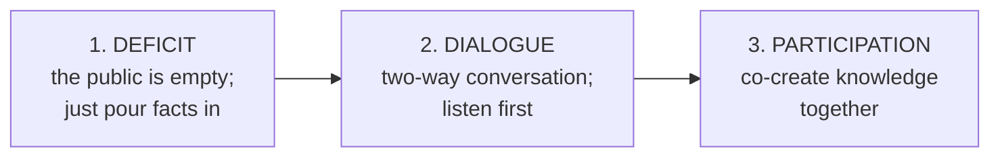

# Knowledge Communication: The Professions That Turn Hard Knowledge into Easy Words

> **Created:** 2026-09-21
> **Grew out of:** [[how-to-read-a-research-paper]] (how to consume knowledge) and [[root-of-all-knowledge]] (what knowledge is). This note closes the loop: who moves knowledge from the people who make it to the people who need it.
> **The question:** "Science communication" is one thing I have heard of. Are there other kinds of knowledge communication? What is this process called?

## TL;DR

The process has many names because it splits by audience: science communication (science -> public), knowledge translation (research -> practice), technical communication (technology -> users), plain language (the writing craft), health and risk communication (health -> public), instructional design (knowledge -> learners), agricultural extension (research -> farmers). The general umbrella terms: **knowledge translation** and **knowledge communication**. The field evolved through three models: deficit -> dialogue -> participation. And all of these are real professions, not just activities.

## 1. One activity, one name per world

The core activity is always the same: take knowledge made by specialists and make it usable for non-specialists. Each world gave this activity its own name:

| Name | Moves knowledge | Where you see it |
|---|---|---|
| **Science communication** (SciComm) | science -> public | museums, science festivals, press releases, science YouTube |
| **Knowledge translation / mobilization** | research -> practice and policy | hospitals adopting evidence, government guidelines |
| **Technical communication** | technology -> users | manuals, product documentation, release notes |
| **Plain language** | complex text -> general readers | laws, insurance letters, government forms |
| **Health communication** | health knowledge -> public | vaccination campaigns, patient education |
| **Risk communication** | crisis facts -> people at risk | pandemics, floods, food recalls |
| **Science journalism** | research -> news readers | science sections and magazines |
| **Explanatory and data journalism** | data -> readers | explainer articles, charts, Our World in Data |
| **Instructional design / education** | knowledge -> learners | courses, textbooks, curricula |
| **Museum education** | science -> visitors | hands-on exhibits, guided tours |
| **Agricultural extension** | research -> farmers | farm advisors, field demonstrations |
| **Developer relations (DevRel)** | products -> software developers | docs, demos, tutorials |
| **UX writing / content design** | product -> users | app interfaces, onboarding flows |
| **Medical writing** | clinical research -> regulators, doctors, patients | drug approval documents, patient leaflets |

## 2. The umbrella names

There is no single official word, but the closest general terms:

- **Knowledge translation**: used in health and medical research for moving evidence into practice. Related: "knowledge mobilization" in social sciences, "knowledge transfer" in industry.
- **Science communication (SciComm)**: the academic field for science <-> public. It has its own journals (Public Understanding of Science, Science Communication, JCOM) and a global community (the PCST Network).
- **Plain language**: the writing craft of understandable text. It has an international standard, ISO 24495-1:2023, and some countries made it law (the US Plain Writing Act of 2010).

Science communication, technical communication, and health communication are the branches. Plain language is the shared craft they all draw on.

## 3. The three models: deficit -> dialogue -> participation

How the field itself thinks about doing this well:

- **Deficit model** (old): experts know, the public does not. Communication = simplify and pour. Also called "dumbing down".
- **Dialogue model** (modern): the public is not empty. It has its own knowledge, questions, and values. Communication = conversation, and listening is half the job.
- **Participation model** (current): people help make knowledge, not just receive it (citizen science, co-designed projects).

The lesson: good knowledge communication is not easy words alone. It is knowing your audience. (Exactly the same principle as teaching.)

## 4. The teacher's version: PCK

Education has its own name for this skill, from Lee Shulman (1980s): **PCK, pedagogical content knowledge**. It is the special knowledge good teachers have: not just the subject, not just general teaching methods, but knowing how to transform THIS subject into forms THIS learner can understand. Teaching is knowledge communication with a learning goal.

## 5. Thai corner

- **การสื่อสารวิทยาศาสตร์** is the Thai term for science communication. The big national event is **Thailand Science Communication Day**, run by **อพวช. / NSM** (Thailand's National Science Museum).
- **สสวท. / IPST** (Institute for the Promotion of Teaching Science and Technology): turns research in science education into textbooks and curricula. This is knowledge translation at national scale: research -> classroom.
- **กรมส่งเสริมการเกษตร / DOAE** (Department of Agricultural Extension): officers bring research findings to farmers through field visits and demonstrations. This is one of the oldest forms of institutionalized knowledge communication.

## 6. Careers: real professions in this space

- Science communicator, science writer, science journalist
- Technical writer / technical communicator / documentation engineer
- Medical writer
- Instructional designer / learning designer / developer educator
- Knowledge mobilization specialist / knowledge broker
- Museum educator / exhibit developer
- Plain language editor / content strategist
- Developer advocate (DevRel)
- UX writer / content designer
- Data journalist / explainer journalist

For a software engineer, the most reachable doors: technical writing and documentation engineering, developer relations, instructional design for edtech, and UX writing.

## 7. Where this fits the series

- [[how-to-read-a-research-paper]]: how to CONSUME knowledge (three-pass reading, trust checks).
- [[root-of-all-knowledge]]: what knowledge IS (a process kept alive by sharing and error-correction).
- This note: who MOVES knowledge. In the reading note's Section 12 we mapped seven kinds of knowledge holders. Every step between those layers (paper -> textbook, research -> policy, technology -> user) is a translation, and each translation has a profession.

## Sources and further reading

- PCST Network, "What is science communication?": https://www.pcst.network/what-is-science-communication/
- PCST Network, "Six journals on science communication": https://www.pcst.network/six-journals-on-science-communication/
- ISO 24495-1:2023, Plain language, Part 1: the international plain-language standard
- NSM Thailand: https://www.nsm.or.th/nsm/en
- DOAE Thailand: https://www.doae.go.th/en/

## Knowledge connections

- [[how-to-read-a-research-paper]]: the consuming side of the same topic
- [[root-of-all-knowledge]]: the philosophical base (knowledge as a process kept alive by sharing)

## Key takeaways

- One activity, many names: science communication, knowledge translation, technical communication, plain language, health and risk communication, instructional design, extension.
- Umbrella terms: knowledge translation (research world) and science communication (science world). The shared craft is plain language.
- The field's own quality ladder: deficit -> dialogue -> participation.
- Teaching has the same skill under the name PCK: transforming subject matter for a specific learner.
- Yes, these are careers: science communicator, technical writer, medical writer, instructional designer, knowledge broker, developer advocate, and more.
