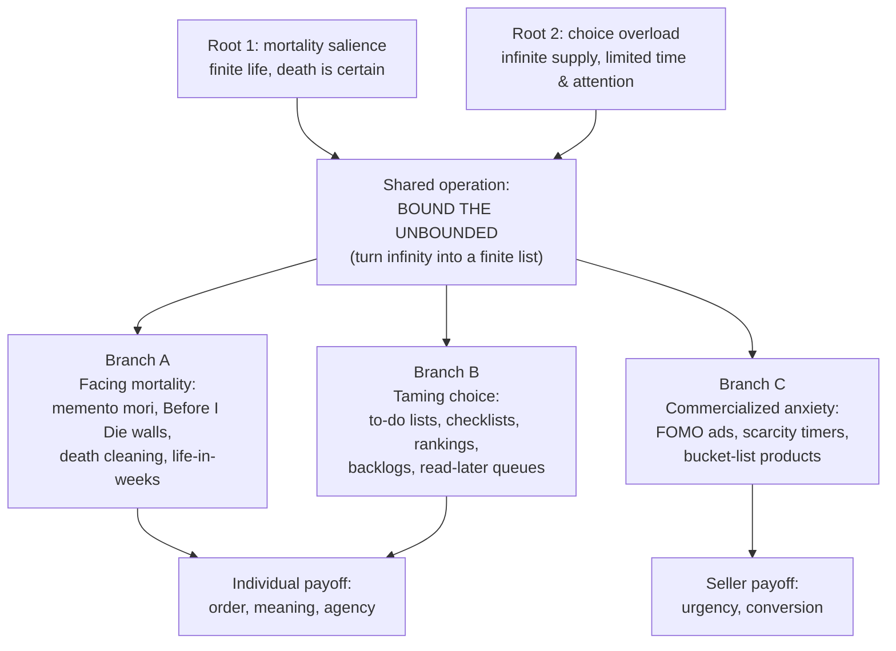
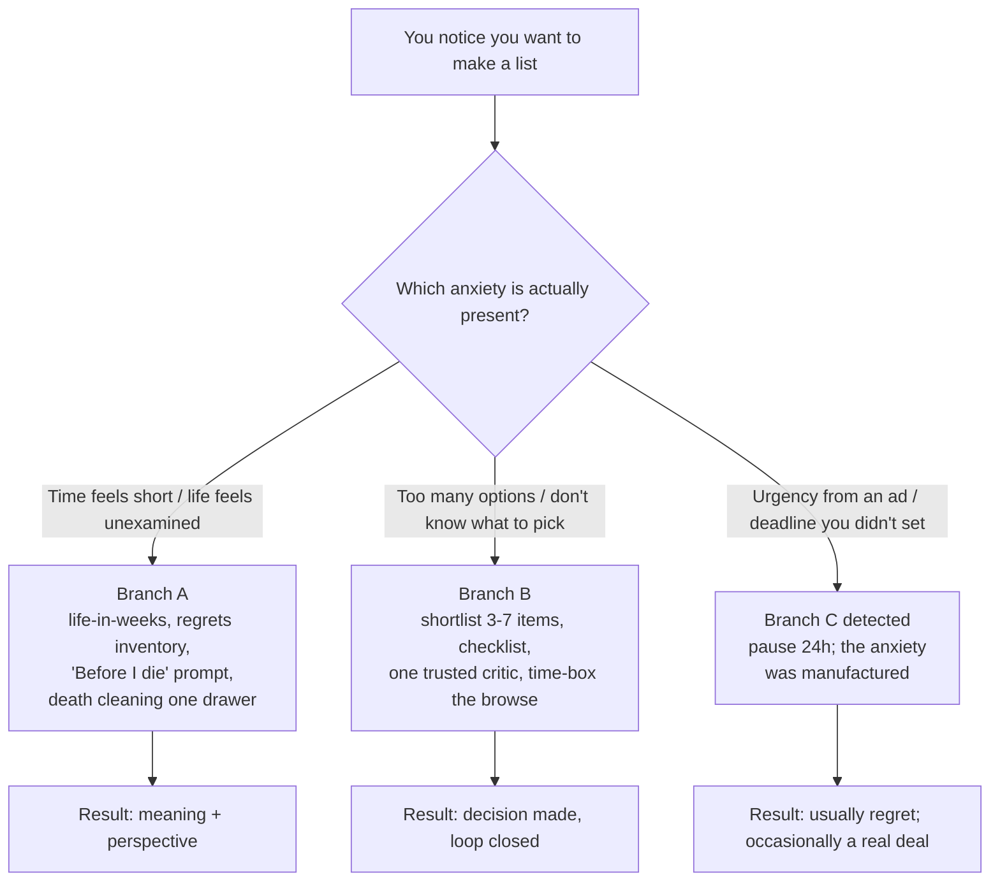

# List Coping Artifacts: What Else Is Like "Before You Die" Lists?

> **Created:** 2026-09-24
> **Why this note exists:** Follow-up to [[why-100-before-you-die-lists-exist]]. That note explains *why* the genre exists (death anxiety + choice overload). This note maps **what else shares the same roots**: a family of artifacts, from ancient to digital, that all do one job: turn something unbounded (life, infinity of options) into something bounded (a list you can hold).
> **Sources:** Research via web search (2026-09-24); references at the bottom.

## TL;DR

The insight from note 1 generalizes: **two root anxieties** (mortality salience, choice overload) produce **one shared coping operation**: bounded enumeration. This family has three branches:

- **Branch A, facing mortality:** memento mori art, "Before I Die" walls, Swedish death cleaning, life-in-weeks calendars, regrets of the dying, life review therapy.
- **Branch B, taming choice:** to-do lists / GTD, checklists, streaming paralysis cures, gaming backlogs, tsundoku, read-later apps, rankings, gamified reading challenges.
- **Branch C, commercialized anxiety:** FOMO marketing, scarcity countdown timers, bucket-list travel: the same psychology *sold back to you as urgency*.

Plus two inversions: minimalism/KonMari (shrinking the list) and vision boards/Oettingen's critique (the list that lies to you).

---

## 1. The shared formula

Every artifact in this family runs the same three-step program:

Eco's formulation from note 1 covers both roots at once: *"What does culture want? To make infinity comprehensible"* — infinity of **time** (root 1) and infinity of **things** (root 2).

| | Branch A (mortality) | Branch B (choice) | Branch C (commercial) |
|---|---|---|---|
| Anxiety | "My time is finite" | "I don't know what to pick" | "I'm missing out, act now" |
| The list's job | Give death a shape; make meaning | Offload judgment; cut search cost | Manufacture urgency; force a click |
| Who benefits | You (eventually) | You | The seller |
| Failure mode | Procrastinated indefinitely ("someday") | The list becomes the backlog itself | Anxiety sold as product |

---

## 2. Master taxonomy table

| Artifact | Root | What it bounds | Mechanism | Key source |
|---|---|---|---|---|
| Memento mori / vanitas art | A | Mortality itself | Skull/hourglass imagery as reminder of death's inevitability | ArtStory; Wikipedia |
| "Before I Die" walls (Candy Chang) | A | Unlived aspirations | Public chalk prompt: "Before I die I want to ___" | candychang.com |
| Swedish death cleaning (döstädning) | A | Possessions + unfinished legacy | Clear out belongings *before* death, for others' sake | Magnusson 2018; The Conversation |
| Life-in-weeks calendar | A | A whole lifetime | Grid of ~4,000 boxes: finite, visible, draining | Urban 2014; TheYearBar |
| Regrets of the dying | A | A life's choices, in reverse | Palliative patients' final "top 5" list | Ware (n.d.) |
| Life review therapy | A | The life narrative | Structured reminiscence; Butler 1963 | ScienceDirect review |
| To-do lists / GTD | B | Today's obligations | Externalize tasks; release the open loop | Allen (GTD); Zeigarnik |
| Checklists (aviation, surgery) | B | Expert blind spots | Fixed sequence beats memory under complexity | Gawande 2009 |
| Shortlists / rankings (IMDb Top 250, "100 X") | B | A whole domain | Outsourced judgment: someone already ranked it | see [[why-100-before-you-die-lists-exist]] |
| Streaming watchlist / queue | B | Tonight's choice | Pre-saved queue ends 10+ minutes of browsing | Nielsen/Gracenote |
| Gaming backlog | B | Future leisure | Buying = insurance against boredom; often guilt instead | ADVFN 2025; r/GameDeals threads |
| Tsundoku (積読) | B | Unread knowledge | Pile of bought-but-unread books | Engoo; Toppa |
| Read-later apps (Pocket, Instapaper) | B | The whole internet | Save now, read never: the "bookmark graveyard" | Instapaper; AppsRethink |
| Gamified reading challenge (Goodreads) | B | A year of reading | Annual goal + progress bar + social streak | Deterding et al. 2011 |
| New Year's resolutions | A + B | The coming year | Time-bounded intention list; success rate 6-50% | compCHC; Lally et al. |
| FOMO marketing / countdown timers | C | Your attention | Loss-framed urgency: "only 2 left", fake clocks | WiserNotify; Admetrics |
| Scratch-off "100 places" posters | A + B | Experiences + status | Gamified coverage: scratch = done | see note 1 |

---

## 3. Branch A: artifacts that face mortality

These are the *deliberate* ones: they look at death on purpose.

- **Memento mori / vanitas** (Wikipedia; ArtStory): an artistic genre whose entire function is reminding the viewer of death's inevitability. Vanitas still lifes encode it in objects: skulls, rotting fruit, hourglasses, snuffed candles. Roman tradition, Renaissance and Baroque painting, modern tattoos. Eco's observation applies: a vanitas painting is *"a cutout of infinity"*; so is a bucket list.
- **"Before I Die" walls** (candychang.com): Candy Chang, New Orleans 2011, after the death of someone she loved, stenciled *"Before I die I want to ___"* on an abandoned house. **Over 5,000 walls in over 75 countries, over 35 languages.** Her own summary of the mechanism: *"Contemplating death is the quickest way to crush the trivial, restore perspective, and redefine what's meaningful to you at every age."* Compare note 1: this is the bucket list **de-privatized** — same function, no consumer product, no ranking, no score.
- **Swedish death cleaning / döstädning** (Magnusson, 2018; The Conversation): *dö* = death, *städning* = cleaning. Proactively clearing your possessions before you die, as a gift to the people who would otherwise inherit the mess. Mortality anxiety → **finite object** (your stuff) → bounded task list (category by category).
- **Life-in-weeks calendars** (Urban, "Your Life in Weeks", Wait But Why 2014; TheYearBar): your whole life as ~4,000 grid boxes, most already used. TheYearBar explicitly roots it in Stoic memento mori; commercial descendants: "4K Weeks" poster, Stoic Reflections calendar. This is note 1's paradox inverted: instead of pretending the list is infinite to escape death, you **make time visibly finite to escape procrastination**.
- **Regrets of the dying** (Ware, n.d.): palliative-care nurse Bronnie Ware recorded her patients' final regrets; the list went viral because it is *already sorted by importance at the end*: not working so hard, not staying in touch with friends, not having courage to express feelings, not letting themselves be happier. The list exists because **you can't interview the dead**; it borrows their ranking to save you the experiment.
- **Life review therapy** (Butler, 1963): psychiatry's formalized version. Reminiscence and evaluation of one's life narrative, originally for older adults; 50 years of research since (Westerhof & Bohlmeijer review). The clinical claim: narrating the finite life into chapters is itself therapeutic, i.e., **the list heals**.

---

## 4. Branch B: artifacts that tame choice

These never mention death. They exist because choosing is expensive.

- **To-do lists and GTD** (Zeigarnik; allen.com/GTD): the Zeigarnik effect says unfinished tasks nag the mind better than completed ones; writing the list *externalizes* the open loop so your brain stops rehearsing it. David Allen's Getting Things Done is this principle industrialized: a "trusted system" that "alleviates overwhelm" so attention is freed for thinking, not remembering. The line between tool and pathology: a to-do list that only ever grows **is** a bucket list of obligations.
- **Checklists** (Gawande, *The Checklist Manifesto*): the same bounded enumeration applied to *expertise*. Pilots, surgeons, and builders can't hold every step in working memory; the checklist converts infinite failure modes into a short fixed sequence. Note the family resemblance to "100 movies": a curated list of the few things that matter, run by people who already did the ranking.
- **Streaming paralysis** (Nielsen/Gracenote, 2025): the average viewer spends **~10.5 minutes** searching before watching (Nielsen study via CBS); Gracenote found **~14 minutes** globally in 2025. The famous r/cordcutters complaint: *"I open Netflix, Prime, Hulu, etc., scroll forever, then either rewatch something or just turn the TV off."* Root 2 in one number: abundance turned leisure into labor.
- **Gaming backlogs** (ADVFN, 2025): a named condition now: **"backlog anxiety"** (guilt, pressure, paralysis when choosing what to play). The article's diagnosis is note 1's psychology restated: purchases are driven by FOMO and anticipation dopamine; *"having a large gaming backlog feels like insurance against boredom."* The cure is the cure for the bucket list too: **"options, not obligations."** The five-tier system (currently playing / next up / someday-maybe / archive / let go) is a *ranked* list, deliberately finite.
- **Tsundoku** (積読): the Japanese word for the pile of bought-but-unread books. Acquisition and consumption split: owning the list *feels like* completing the list. Same mechanism as the 1001-movies poster hanging on your wall: possession as simulated achievement.
- **Read-later apps** (Pocket, Instapaper): the "bookmark graveyard" is now a recognized failure mode. Saving an article triggers the same completion itch as Zeigarnik's list, but the loop never closes.
- **Gamified reading challenges** (Goodreads; Deterding et al., 2011): an annual count goal with a progress bar. The 2022 r/books debate "Against the Gamification of Reading" captures the tradeoff: **the number optimizes for logging, not for reading.** Bounded enumeration applied to a year of your life.
- **New Year's resolutions**: the most universal list of all. Success rates run **6-50%** (comphc review); Lally et al. found habit automaticity takes a median of **66 days** (range 18-254), not the mythical 21 (Scientific American). Resolution failure = choosing badly under a deadline you didn't negotiate.

---

## 5. Branch C: anxiety as a business model

Here the family turns dark: the *same* mechanism (root 1 + root 2 → urgency) is deployed **against** you.

- **FOMO marketing** (WiserNotify; Admetrics; CXL): countdown timers are "the single most measured FOMO tactic"; fake "*only 2 left*" warnings and artificial clocks are textbook dark patterns: *"Fake countdown timers and false 'only 2 left' warnings are everywhere... they exploit fear of missing out to pressure quick [purchases]."* CXL's framing: scarcity makes availability itself part of your evaluation, whether or not the scarcity is real.
- **Bucket-list travel products**: note 1 flagged this (Schultz's bestseller, "100 places" posters); the twist here is the feedback loop: Branch A creates the aspiration, Branch C sells the flight, then marketing re-inflates the aspiration. The list never closes **because closing it is unprofitable**.

**Diagnostic:** if a list makes you feel *rushed* rather than *oriented*, you are probably looking at Branch C.

---

## 6. The two inversions

- **Shrink the list: minimalism / KonMari.** Not every bounded-enumeration artifact adds items; Marie Kondo's *"does it spark joy?"* is a **filter algorithm for an infinite pile of possessions**. Still the same operation: convert unbounded stuff into a bounded, decidable sequence.
- **The list that lies: vision boards and positive fantasy.** Vision boards promise that imaging the future pulls you toward it. Oettingen's 25-year program of research says the opposite: **positive fantasy predicts *less* effort and worse outcomes** across studied domains; what works is *mental contrasting* (WOOP: Wish, Outcome, Obstacle, Plan: picture the goal, then the obstacle, then the if-then plan) (Simply Psychology; goalsandprogress). A bucket list consumed as pure daydream is the same trap: the fantasy of completion substitutes for the work.

---

## 7. Choosing the right tool for the felt anxiety

Rules of thumb:

1. **Name the root first.** Death anxiety and choice overload feel different: one is a quiet ache ("what's the point"), the other is a hum ("I should be choosing better"). Different branches, different tools.
2. **Cap the list.** Every Branch B artifact works at 3-20 items and rots at 100+. A backlog of 500 is a branch B tool that has *become* root 2.
3. **Prefer Branch A's honesty to Branch C's urgency.** A calendar of your remaining weeks is uncomfortable but yours; a countdown timer is comfortable but borrowed.
4. **Close the loop or delete it.** Zeigarnik only releases when the item is *done or deliberately dropped*. "Someday" without a date is a third state the brain treats as an open loop forever.
5. **Watch for the scorekeeping flip.** The moment the number (books read, countries scratched, games finished) replaces the experience, you are running a Branch C algorithm on yourself.

---

## Knowledge Connections

- [[why-100-before-you-die-lists-exist]]: the parent note; this is its taxonomy extended to sibling artifacts.
- [[root-of-all-knowledge]]: bounded enumeration is one of the deep answers to "what is worth knowing/doing", the same move as canon-formation.
- [[knowledge-communication]]: every list is a compression protocol for expert judgment; Branch C is that protocol weaponized.

## Key Takeaways

- The "100 X before you die" genre is one instance of a general operation: **turn the unbounded (life, options) into a bounded list**.
- Two roots produce the family: **mortality salience** (Branch A: art, walls, death cleaning, life-in-weeks, regrets) and **choice overload** (Branch B: to-dos, checklists, queues, backlogs, tsundoku, challenges).
- **Branch C** is the same psychology sold back as urgency (FOMO timers, scarcity): recognize it and pause.
- The tool matches the root: name whether you feel *time pressure* or *choice pressure* before you make the list.
- Lists work when loops close (done or deliberately dropped) and rot when they grow without bound or flip into scorekeeping.

---

## References (APA)

- Admetrics. (2025, November 5). *Dark psychology in e-commerce: Ethical influence guide*. https://www.admetrics.io/post/dark-psychology-in-ecommerce-ethical-guide
- Allen, D. (n.d.). *Getting Things Done methodology*. Retrieved 2026-09-24, from https://gettingthingsdone.com/
- Allen, D. (2001). *Getting things done: The art of stress-free productivity*. Viking.
- ADVFN News. (2025, June 12). *The endless queue: Why we keep buying games we never play*. https://uk.advfn.com/newspaper/advfnnews/81108/the-endless-queue-why-we-keep-buying-games-we-never-play
- Butler, R. N. (1963). The life review: An interpretation of reminiscence in the aged. *Psychiatry, 26*(1), 65-76.
- Chang, C. (n.d.). *Before I Die*. Retrieved 2026-09-24, from https://www.candychang.com/beforeidie/
- CBS News Los Angeles. (2026). *Too much of a good thing? Nielsen study finds streaming audiences overwhelmed*. https://www.cbsnews.com/losangeles/news/study-finds-the-many-streaming-choices-overwhelm-audiences-steering-some-to-turn-the-tv-off/
- Deterding, S., Dixon, D., Khaled, R., & Nacke, L. (2011). From game design elements to gamefulness: Defining "gamification." *Proceedings of MindTrek 2011*, 9-15. https://dl.acm.org/doi/10.1145/1979742.1979575
- Engoo. (n.d.). *Tsundoku: Buying more books than you can read*. Retrieved 2026-09-24, from https://engoo.com/app/daily-news/article/tsundoku-buying-more-books-than-you-can-read/
- Gawande, A. (2009). *The checklist manifesto: How to get things right*. Metropolitan Books.
- Iyengar, S. S., & Lepper, M. R. (2000). When choice is demotivating: Can one desire too much of a good thing? *Journal of Personality and Social Psychology, 79*(6), 995-1006.
- Lally, P., van Jaarsveld, C. H. M., Potts, H. W. W., & Wardle, J. (2010). How are habits formed: Modelling habit formation in the real world. *European Journal of Social Psychology, 40*(6), 998-1009.
- Magnusson, M. (2018). *The gentle art of Swedish death cleaning: How to free yourself and your family from a lifetime of clutter*. Scribner.
- ScienceDirect. (2014). Celebrating fifty years of research and applications in reminiscence and life review. *Aging & Mental Health*. https://www.sciencedirect.com/science/article/abs/pii/S0890406514000115
- Simply Psychology. (n.d.). *Manifestation and lucky girl syndrome: The psychology behind*. Retrieved 2026-09-24, from https://www.simplypsychology.com/articles/manifestation-lucky-girl-psychology
- The Conversation. (2018, February 5). *Swedish death cleaning: How to declutter your home and life*. https://theconversation.com/swedish-death-cleaning-how-to-declutter-your-home-and-life-90253
- The Year Bar. (n.d.). *Mortality calendar: Visualize your life in weeks*. Retrieved 2026-09-24, from https://www.theyearbar.com/tools/mortality-calendar
- Urban, T. (2014, May 7). *Your life in weeks*. Wait But Why. https://waitbutwhy.com/2014/05/life-weeks.html
- Ware, B. (n.d.). *Regrets of the dying*. Retrieved 2026-09-24, from https://bronnieware.com/blog/regrets-of-the-dying/
- WiserNotify. (2026). *40 FOMO statistics for 2026: Scarcity & urgency data*. https://wisernotify.com/blog/fomo-stats/
