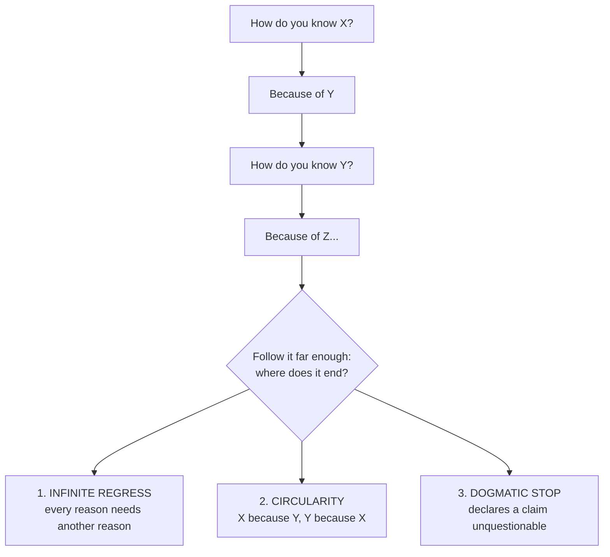
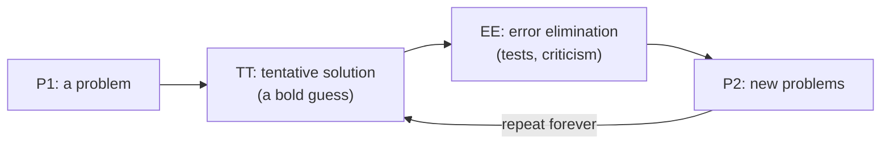

# The Root of All Knowledge

> **Created:** 2026-09-21
> **Grew out of:** [[how-to-read-a-research-paper]], Section 13 (tracing citation chains back to the root).
> **The question:** If every paper rests on earlier papers, and every claim on earlier claims, where does it all end? Is there a single root of all knowledge, a thing at the bottom? Or does knowledge float in the air, complete, just waiting for a human to grasp it?

## TL;DR

Neither buried treasure nor thin air. The most defensible answer is **a process**: knowledge grows out of contact between living beings and a world that pushes back. It is not found complete (no bedrock object sits at the bottom), and it is not invented freely (reality constrains what survives). It is *grown*, the way a path is worn into the ground by walking.

Two hard truths to sit with:

1. The "dig until bedrock" hope dies at the **Münchhausen trilemma**: every chain of "how do you know?" ends in infinite regress, a circle, or an arbitrary stop. There is no foundation of the classic kind.
2. The escape is a reframe, not a rescue: knowledge does not need a foundation underneath it. It survives by criticism from the side. What keeps knowledge alive is **error-correction**, not bedrock.

## 1. The question, taken seriously

Start with the fact that raised it: a citation chain. CURRANTE cites TGen and LLM4TDD; those cite Beck's TDD book; the book rests on practice and experience from the 1990s; those rest on earlier practice, earlier tools, earlier ideas. And the same move applies to any claim at all:

- "How do you know the sky is blue?" Because I see it.
- "How do you know your eyes tell the truth?" Because they usually track the world.
- "How do you know that?" Because evolution shaped them to.
- "And how do you know that?" Because biology says so, and biology rests on chemistry, and chemistry on physics, and physics on...

Every chain of justification, followed far enough, hits the same wall. This is the oldest problem in epistemology (from Greek *episteme*, "knowledge"), and it has a precise name: **the regress problem** (the problem of epistemic justification). Your question, "is there a root?", is this problem asked in plain language.

Philosophers have not managed to remove the wall. But they have mapped exactly what the wall is made of. That map is the rest of this note.

## 2. The skeptic's answer: the Münchhausen trilemma

Follow any chain of "how do you know?" far enough and it can only end in one of three ways:

Each exit looks like a failure:

1. **Infinite regress**: you never finish justifying; knowledge is never secured.
2. **Circularity**: the chain supports itself by its own bootstraps; no new ground is gained.
3. **Arbitrary stop**: you declare some claim unquestionable, which is not an argument but a decision. Philosophers call this the dogmatic move.

The pattern is ancient. It was recorded by **Sextus Empiricus** (c. 160-210 CE) among the skeptical modes attributed to **Agrippa**, designed to show that certainty is never reached, so the wise response is suspension of judgment. In 1968 the philosopher **Hans Albert** renamed it the **Münchhausen trilemma**, after Baron Münchhausen, the tall-tale baron who (in the stories) pulled himself out of a swamp by his own hair: every foundationalist is attempting exactly that.

This looks like a refutation of knowledge itself. Read it again, carefully: it is a refutation of one specific *shape* of knowledge, the building shape, in which everything rests on a bottom layer. The wall is real; the building metaphor is what breaks.

## 3. The three classical answers, and a game-changer

A trilemma has three horns. Philosophy has grabbed each in turn:

| Answer | Core idea | Champions | Its catch |
|---|---|---|---|
| **Foundationalism** | Some beliefs are basic: they justify others without needing justification themselves. Build on them. | Aristotle (first principles), Descartes ("I think, therefore I am"), the empiricists (direct experience) | Which beliefs qualify? The best candidates keep collapsing under scrutiny. Critics like Sellars (the "Myth of the Given") argue that no belief is truly self-justifying, so the stop remains arbitrary. |
| **Coherentism** | No foundation. Beliefs justify each other holistically, as one web. | Quine (the "web of belief") | A perfectly coherent story can still be fiction. The web needs at least one strand touching experience, or it floats. |
| **Infinitism** | The regress is not vicious. Reasons honestly go on forever, and that is acceptable. | Peter Klein | Finite minds cannot complete an infinite chain; a minority view for that reason. |

Then the game-changer, Hans Albert's own answer, following **Karl Popper**:

| Game-changer | Core idea |
|---|---|
| **Fallibilism / critical rationalism** | Stop demanding justification; demand *criticizability*. Knowledge is conjecture; it grows when bold guesses survive serious attempts at refutation. No foundation exists, and none is needed: what matters is that claims can be criticized, tested, and corrected. |

This is the move the vault has already met twice: in the parent note (peer review as error-correction machinery, not a truth-machine) and in Philosophy note 19 (Popper's "Conjectures and Refutations": knowledge grows when bold guesses survive serious attempts to refute them). It is also the answer the rest of this note builds on: **the root is not below, it is in the loop.**

## 4. The turn: knowledge grew

If there is no bedrock, where does knowledge actually come from? The 20th century's best answer: it **evolved**, and it evolved long before humans.

This loop is Popper's schema (P1 -> TT -> EE -> P2), and it runs at every scale of life:

- A bacterium swimming up a sugar gradient is solving a problem. Its "knowledge" is real, though not thought.
- Immune systems learn which shapes are enemies.
- Evolution itself is a knowledge process: genes are guesses about the world, tested by survival. (The view is called **evolutionary epistemology**: Lorenz, Campbell, Popper.)
- Children build knowledge by acting on the world (**Piaget**), not by quietly contemplating it.
- Science is the same loop with criticism institutionalized: conjecture, test, refute, repeat.

The motto for this is **"In the beginning was the deed"** (Goethe's Faust, transforming the opening line of the Gospel of John; Popper used it often). Knowing grows out of acting, not acting out of knowing. In **Wittgenstein**'s later formulation, when you push "how do you know?" to its end, "it is our acting, which lies at the bottom of the language-game" (On Certainty, 1969).

And here is the right image for what knowledge is once you accept there is no dry dock: **Neurath's boat**. "We are like sailors who must rebuild their ship on the open sea, never able to start afresh from the bottom." No foundation, no final version: rebuilt plank by plank, while afloat, because afloat is the only place there is.

## 5. An Eastern echo: roots, plural

The Western debate asked "what is the ultimate justification?" Indian epistemology asked a subtly different question: "**what are the valid means of knowledge?**" (*pramana*). And its answers were plural by design:

- The **Nyaya** school counts four: perception, inference, comparison, testimony.
- The **Buddhist logicians** Dignaga and Dharmakirti count two: perception and inference, and nothing else (your Philosophy note 20 covers them; link at the end).

Multiple roots, each with a defined scope, no single master root. This resolves the same worry differently: instead of a foundation, a toolkit, each tool valid in its domain.

The deepest echo comes from **Nagarjuna** (c. 150-250 CE), founder of Madhyamaka. His move is to dissolve the question. To demand that things rest on some ultimate ground is already the error: everything is *dependently originated* (nothing stands alone, nothing is its own root), and that interdependence, not a ground, is what makes the world work. Emptiness (*shunyata*) does not mean "nothing exists"; it means "nothing exists as its own independent root." Your vault's note flags this exact subtlety: it is not Democritus' empty space.

Notice the convergence. The West: no bottom, but a loop of correction. Nagarjuna: no bottom, but a web of dependence. Both refuse the buried-treasure picture.

## 6. So which is it: buried treasure, thin air, or grown?

Back to your two candidates, plus the one that wins:

| Picture | Claim | Verdict |
|---|---|---|
| **Buried treasure** (the classic "root") | Knowledge sits at the bottom; dig far enough and you find it | Dies at the trilemma. No bottom layer justifies itself. |
| **Thin air** (knowledge waiting, complete) | Knowledge hangs finished in the air; a human grasps it | Fails too: nothing floats that cannot be checked against anything, and what would make a floating fact "knowledge" rather than decoration? |
| **Grown** (the honest answer) | Knowledge is produced by contact: living beings acting on a world that pushes back | Holds. It explains why knowledge changes (growth), why it can be wrong (paths can fall away), and why it is not arbitrary (the terrain constrains where paths can go). |

Two consequences worth keeping:

**A. It settles the discovery vs invention debate.** Is knowledge discovered (mathematics feels discovered: 2+2=4 whether or not anyone thinks it) or invented (frameworks and cultures vary wildly)? "Grown" says both descriptions are partial. A path is not in the ground waiting (no blueprint, so not pure discovery), and it is not free (the terrain limits where paths can go, so not pure invention). Knowledge is what survives when knowing beings interact with a world.

**B. Stopping points are forks, not failures.** The clearest example: for some 2,000 years, geometers tried to *prove* Euclid's fifth postulate (the parallel postulate) from the other four. In the 1800s, Bolyai, Lobachevsky (and Gauss privately) concluded that it cannot be proved: it is a *choice*. So they chose the opposite, and an entire new mathematics, non-Euclidean geometry, appeared, which later turned out to be the natural language of general relativity. The "root" that everyone wanted as a fact was actually a fork, and refusing to stop there created knowledge. The same move runs through mathematics today (axioms are chosen, not proven) and through every field where a stop hides a choice.

## 7. What this changes when you read papers

The practically useful output of all this, for someone who reads research papers:

1. **Find where the chain stops.** Every paper's argument bottoms out somewhere: an assumption, a definition, a dataset, a convention. That stopping point is where the real content lives. In the CURRANTE paper, the chain "why does pass-rate measure success?" stops at "passing the tests is what correct code means." Below that: what makes a test suite complete? An entire research field (the test oracle problem) lives at that stop.
2. **Classify the stop: fact, choice, or convention.** A stop that is a *choice presented as a fact* is the most interesting thing you can find in a paper: either an unexamined assumption (criticize it) or an open door (walk through it). Non-Euclidean geometry was born from exactly this move.
3. **Judge knowledge by how it handles error, not by how certain it sounds.** The trilemma says certainty is never available. So the right question about a claim is not "is this absolutely justified?" but "how would we find out if it is wrong, and has anyone tried?" This is why threats-to-validity sections and peer review matter more than they look: they are the error-correction loop made visible.
4. **Build like a boat, not a temple.** Your vault is Neurath's boat: no final version, rebuilt while afloat. That is not a flaw of your notes; it is the honest shape of knowledge itself.

## 8. Further reading (start here)

Ordered from lightest to heaviest:

- [Münchhausen trilemma](https://en.wikipedia.org/wiki/M%C3%BCnchhausen_trilemma) (Wikipedia): the whole problem in one page.
- [Foundationalist Theories of Epistemic Justification](https://plato.stanford.edu/entries/justep-foundational/) (Stanford Encyclopedia of Philosophy): the regress argument in full academic dress.
- [Coherentist Theories of Epistemic Justification](https://plato.stanford.edu/entries/justep-coherence/) (Stanford Encyclopedia of Philosophy): the web alternative.
- **Karl Popper, Conjectures and Refutations** (1963), especially the title essay, "Science: Conjectures and Refutations": the fallibilist turn in Popper's own voice.
- **Ludwig Wittgenstein, On Certainty** (1969): short numbered fragments on why doubt itself needs ground to stand on; the hinges that make inquiry possible are held by action, not proof.
- **Sextus Empiricus, Outlines of Pyrrhonism**: the ancient source of the trilemma, surprisingly readable.
- **Bertrand Russell, The Problems of Philosophy** (1912): free on Project Gutenberg; the classic introduction, including "knowledge by acquaintance," the contact point where chains stop.

## 9. Where this thread continues in your other vault

These notes, in `general-knowledge/Philosophy` and synced to GitHub, are the adjacent pieces of the same question:

- [06 Hellenistic Philosophy](https://github.com/oat431/general-knowledge/tree/main/Philosophy/06_Hellenistic_Philosophy.md): the Skeptics (Pyrrho, Sextus) and the ancient version of the trilemma.
- [10 Rationalism](https://github.com/oat431/general-knowledge/tree/main/Philosophy/10_Rationalism.md): Descartes' most famous foundationalist rescue attempt.
- [11 Empiricism](https://github.com/oat431/general-knowledge/tree/main/Philosophy/11_Empiricism.md): Hume follows the chain back to experience and finds the ground shaking (the induction problem).
- [16 Pragmatism](https://github.com/oat431/general-knowledge/tree/main/Philosophy/16_Pragmatism.md): Peirce's fallibilism; inquiry as the fixation of belief.
- [19 Philosophy of Science](https://github.com/oat431/general-knowledge/tree/main/Philosophy/19_Philosophy_of_Science.md): Popper, falsification, and why "proven" almost always means "supported."
- [20 Eastern Philosophy Beyond Thailand](https://github.com/oat431/general-knowledge/tree/main/Philosophy/20_Eastern_Philosophy_Beyond_Thailand.md): Dignaga, Dharmakirti, Nagarjuna, and the plural-roots approach.

## Knowledge connections

- [[how-to-read-a-research-paper]]: this note is its philosophical continuation; Section 13 (citation tracing) is the regress problem in miniature.
- [[CURRANTE]]: the example paper whose chain of "why does this measure matter?" stops at "tests are the specification."
- [[knowledge-communication]]: the third note in the series: the professions that turn hard knowledge into easy words (science communicators, technical writers, knowledge brokers).

## Key takeaways

- There is no single root of the classic kind: the Münchhausen trilemma shows that every chain of justification ends in infinite regress, circularity, or an arbitrary stop.
- The classical escapes: foundationalism (a bottom layer), coherentism (a web), infinitism (forever), and fallibilism (stop justifying, start criticizing).
- Knowledge is neither found as treasure nor floating in thin air. It is grown by contact between living beings and a world, and kept honest by error-correction.
- Where a chain stops is the most interesting place to look. A stop that hides a choice is exactly where new knowledge can be made (non-Euclidean geometry, the oracle problem).
- The honest shape of knowledge is Neurath's boat: rebuilt plank by plank, while afloat, forever.
