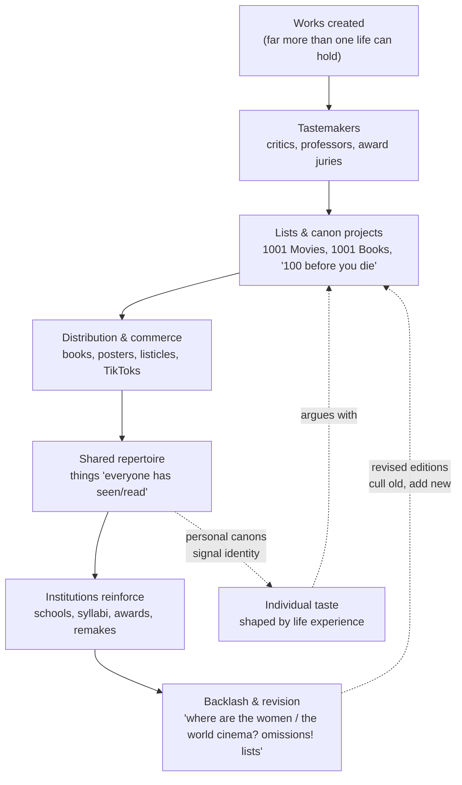

# Why "100 X Before You Die" Lists Exist

> **Created:** 2026-09-24
> **Why this note exists:** Favorite things are subjective and shaped by life experience, so why do authoritative "100 movies/books/places you must experience before you die" lists exist at all, and why do they work? This note researches the psychology, history, economics, and sociology behind the genre.
> **Sources:** Research via web search (2026-09-24); references at the bottom.

## TL;DR

"Before you die" lists are **not really about taste**. Taste is subjective, and the list-makers know it. The lists exist because they perform five jobs at once: they **manage death anxiety** (finite life, infinite works), **impose order on infinity** (a canon, a map), **reduce choice** (paradox of choice), **signal and trade cultural capital** (gatekeeping + identity), and **generate engagement** (agreement, completionism, and profitable disagreement). The word "must" is doing rhetorical work, not epistemic work: the list is a **map drawn by a tastemaker**, not a law of nature. Use maps as entry points, not as checklists.

---

## 1. The paradox in the question

The observation is correct: favorites are subjective. But notice the two claims in tension:

| Claim | Status |
|---|---|
| "Taste is subjective and biographical" | True in aesthetics and psychology |
| "100 X you MUST experience before you die" exists as a genre | Undeniable: books, posters, TikToks, scratch-off posters, entire publishing series |

A personal list is unattackable; an imperative list invites attack. As one critic put it: *"a list of personal 100 favourite movies is something specific to that person, but 100 movies YOU must see before YOU die will always raise certain eyebrows"* (WhatCulture). So the genre is **built on an authority claim it cannot strictly justify**. That is not a bug: the authority claim is precisely the product.

The real question is not "which 100 are objectively best?" but **"what work does the list do for the reader, the maker, and the market?"** Five answers below.

---

## 2. A brief timeline of "before you die"

| Year | What happened |
|---|---|
| ~3200 BC | Oldest known sequential signs: lists etched into rock (The Independent) |
| Ancient world | Lists of saints, ships, plants, treasures; Homer's Catalogue of Ships |
| 1592 | Thomas Nashe's "The Eight Kindes of Drunkennes": essentially Elizabethan Buzzfeed |
| 1895 | First best-seller list, *The Bookman* |
| 1930 | *Billboard* charts popular music |
| 1979/1984 | Bourdieu's *Distinction*: taste as cultural capital |
| 1989 | *Sunday Times Rich List* |
| 2003 | **Two explosions:** Patricia Schultz's *1,000 Places to See Before You Die* (instant bestseller) and Schneider's *1001 Movies You Must See Before You Die* (Quintessence Editions' "The 1001 Before You Die series") |
| 2004 | Barry Schwartz names *The Paradox of Choice* |
| 2006 | Screenwriter Justin Zackham coins "bucket list" (Merriam-Webster first use) |
| 2007 | The film *The Bucket List* (dir. Rob Reiner) drives the phrase into wide use |
| 2009 | Umberto Eco's Louvre exhibition "The Infinity in Lists" + *The Vertigo of Lists* |
| 2010s- | The listicle era, then "check off what you've seen" trackers (List Challenges), then TikTok "Top 100" personal canons |

Key publishing detail: *1001 Movies You Must See Before You Die* (ed. Steven Jay Schneider, Cassell Illustrated, 13 Nov 2003) is a **reference book of original essays by 70+ film critics**, presented chronologically (14th edition: *A Trip to the Moon*, 1902 to *Nomadland*, 2020). It is a canon project disguised as a checklist.

---

## 3. Why the genre exists: five forces

### 3.1 Death anxiety: lists against the finite (Eco)

Umberto Eco's answer is the most famous and the most fundamental:

> "We have a limit, a very discouraging, humiliating limit: death. That's why we like all the things that we assume have no limits and, therefore, no end. It's a way of escaping thoughts about death. **We like lists because we don't want to die.**" (Der Spiegel, 2009)

For Eco, culture itself is a list-making machine: *"The list is the origin of culture... What does culture want? To make infinity comprehensible."* A still life is *"a cutout of infinity"*, and so is a top-100 list. Paradoxically, the phrase **"before you die"** is what makes the list sell: it names the deadline that the list promises to beat. Terror Management Theory in psychology makes the same claim experimentally: mortality salience makes people cling harder to cultural worldviews and shared meaning.

### 3.2 Order against infinity: the map function

There are more films than any life can hold. A list converts an **unbounded problem** (infinity of works) into a **bounded project** (100 items). Eco again: *"The list doesn't destroy culture; it creates it."* Schools, awards, and museums do this institutionally ("the Western canon"); the "before you die" book does it commercially. The 1001 series gives every entry a short essay, so the map includes *why* each item matters, not just its name.

### 3.3 The paradox of choice: curation as a service

When everything is available (streaming, Kindle, torrents), choosing becomes work. Schwartz's paradox: more options produce paralysis and dissatisfaction. The "before you die" list is **outsourced judgment**: authoritative tone, digestible chunks, precise remit. As The Independent observes, such articles are *"accessible, bullet-pointed magazine articles, precise in their remit, authoritative in tone and broken down into digestible chunks"* that dovetail with the F-shaped way eyes scan pages. The listicle is, in editor Jack Marshall's phrase, *"as much about psychology as editorial"*.

### 3.4 Cultural capital: the gatekeeping function

Bourdieu (*Distinction*) and canon scholar John Guillory (*Cultural Capital*) argue that taste is not just preference: knowing "the great works" is a **convertible asset** (education, conversation, status, in-group membership). "100 X before you die" lists package that asset for mass distribution. Two effects follow:

- **Good:** democratizes access to the canon once locked inside elite institutions.
- **Bad:** re-inscribes a specific (usually Anglo-American, male, 20th-century) taste as universal "musts". Omission becomes politics.

### 3.5 Media economics: disagreement is the feature

Ranked lists are engineered engagement. Every "100 Best Albums Ever" spawns *"scoffing at 'that ridiculous list'"*; *"our list, we reckon, would be way better than their list, but it doesn't make their list any less compelling"* (The Independent). Add three psychological mechanics and you have a perfect viral object:

| Mechanic | Effect |
|---|---|
| **FOMO** ("before you die") | Loss-framed urgency; the missing item is a hole in your life |
| **Zeigarnik effect** | Incomplete lists nag the mind; trackers and checkboxes exploit this |
| **Completionism / gamification** | "You've seen 62/100" is a score; scores invite sharing and ranking |

---

## 4. How a canon is actually built

Two loops worth noticing: the **revision loop** (the 1001 series culls entries each edition to admit new releases: the canon is a living document) and the **identity loop** (your disagreements with the list are themselves cultural signaling: "my list would be better").

---

## 5. The subjectivity problem, resolved

Eco, asked to list his own loves and hates (like Barthes did), refused: *"I would be a fool to answer that; it would mean pinning myself down... If you interact with things in your life, everything is constantly changing. And if nothing changes, you're an idiot."*

That is the mature resolution of the paradox:

1. **Taste is biographical** (your point). A work lands differently at 16 vs 40; culture is not a ranking but a relationship.
2. **The list is authored, not discovered.** "You must" honestly reads "a qualified panel of critics believes these 100 maximize the chance of a transformative encounter across many kinds of people."
3. **Disagreement is productive.** The list's value is not its exact membership; it is the **conversation and self-knowledge** generated by arguing with it.
4. **The real failure mode** is not liking different things. It is confusing completion of someone else's checklist with having a cultivated inner life.

---

## 6. How to use such lists wisely

1. **Treat them as maps, not checklists.** Sample 5-10 entries across eras and genres; let curiosity route the rest.
2. **Read the accompanying essays** (the 1001 series's best feature): the *why* transfers even when the pick is not yours.
3. **Triangulate canons.** Cross a Western list with Thai, Japanese, Nigerian lists; omission maps are as instructive as inclusion maps (see [[root-of-all-knowledge]]).
4. **Build your own list.** Producing your "100 that shaped me" (generation effect) teaches more than consuming theirs; the title should be "before you die" only if you accept it will keep changing (Eco's point).
5. **Watch the emotional readout.** If a list produces anxiety (FOMO, score-chasing), it is being consumed as a product. If it produces curiosity, it is being consumed as a map.

---

## Knowledge Connections

- [[root-of-all-knowledge]]: canon lists are one answer to "what is worth knowing", and every answer encodes a worldview.
- [[knowledge-communication]]: the list is a compression format for expert judgment: gains reach, loses nuance; the essays win nuance back.
- Related theories: [[../philosophy/|philosophy vault]] (aesthetics of taste), Terror Management Theory (mortality salience), Bourdieu's cultural capital.

## Key Takeaways

- "Before you die" lists exist to **manage death, infinity, and choice overload**, not to settle taste.
- "Must" is a **rhetorical device**: it converts a personal canon into a shared challenge and a product.
- Subjectivity is not the enemy of the list: **disagreement drives its cultural and commercial life**.
- Use lists as **maps and conversation partners**, never as obligations; build your own as a living document.

---

## References (APA)

- Beyer, S., & Gorris, L. (2009, November 11). SPIEGEL interview with Umberto Eco: "We like lists because we don't want to die." *Der Spiegel*. https://www.spiegel.de/international/zeitgeist/spiegel-interview-with-umberto-eco-we-like-lists-because-we-don-t-want-to-die-a-659577.html
- Bourdieu, P. (1984). *Distinction: A social critique of the judgement of taste*. Harvard University Press. (Original work published 1979)
- Boxall, P. (Ed.). (2006). *1001 books you must read before you die*. Quintessence Editions. [Analysis in: "more than 1001 Books you must read before you die," *BID*, 56, 2026. https://bid.ub.edu/wp-content/uploads/2026/07/10.1344-bid2026.56.01.pdf]
- Guillory, J. (1993). *Cultural capital: The problem of literary canon formation*. University of Chicago Press.
- Marsden, R. (2014, October 1). Why do we like making lists? *The Independent*. https://www.independent.co.uk/arts-entertainment/books/features/why-do-we-like-making-lists-9765922.html
- *Mortality salience*. (n.d.). Wikipedia. https://en.wikipedia.org/wiki/Mortality_salience
- Phrases.org.uk. (n.d.). *Bucket list: Meaning & origin of the phrase*. https://www.phrases.org.uk/meanings/bucket-list.html
- Przybylski, A. K., Murayama, K., DeHaan, C. R., & Gladwell, V. (2013). Motivational, emotional, and behavioral correlates of fear of missing out. *Computers in Human Behavior, 29*(4).
- Schneider, S. J. (Ed.). (2003). *1001 movies you must see before you die*. Cassell Illustrated / Quintessence Editions. [Consulted: https://en.wikipedia.org/wiki/1001_Movies_You_Must_See_Before_You_Die]
- Schwartz, B. (2004). *The paradox of choice: Why more is less*. Ecco.
- Schultz, P. (2003). *1,000 places to see before you die: A traveler's life list*. Workman. [Consulted: https://www.silversea.com/blog/to-finding-more/slow-travel/in-conversation-with-patricia-schultz-sharing-1000-things-to-know-before-you-die]
- WhatCulture. (n.d.). *Hate the omissions, but love the picks*. https://whatculture.com/film/hate-the-omissions-but-love-the-picks
- Young, L. C. (2017). *List cultures: Knowledge and poetics from Mesopotamia to BuzzFeed*. Amsterdam University Press. https://library.oapen.org/bitstream/id/2619f122-a5e3-4c72-b9bd-ddf4f6daca4c/9789048530670.pdf
