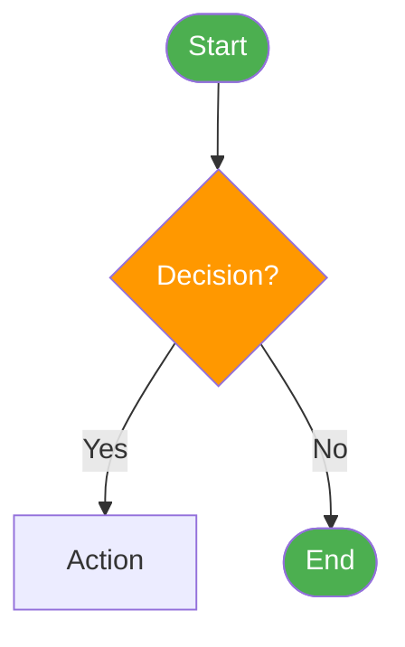
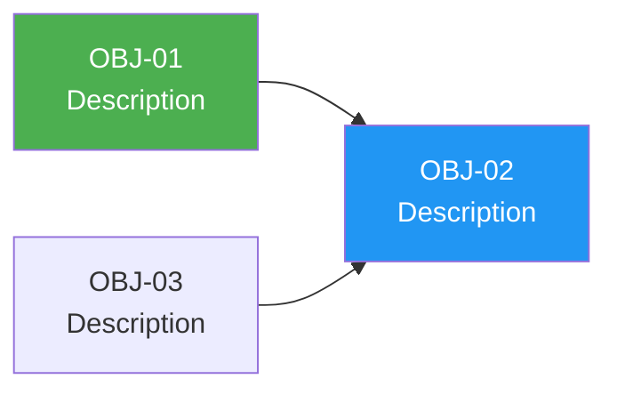
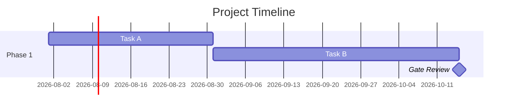
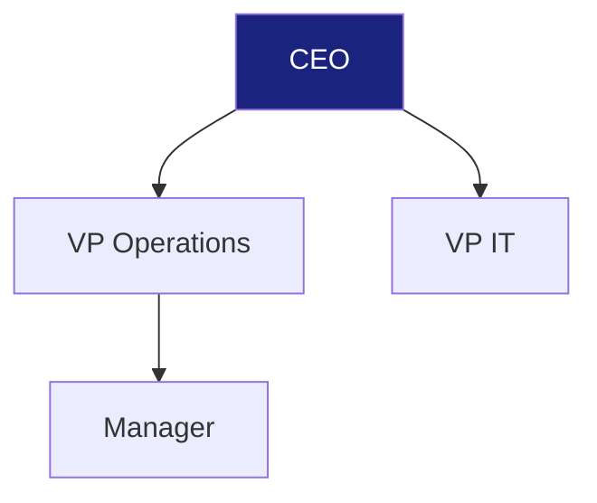
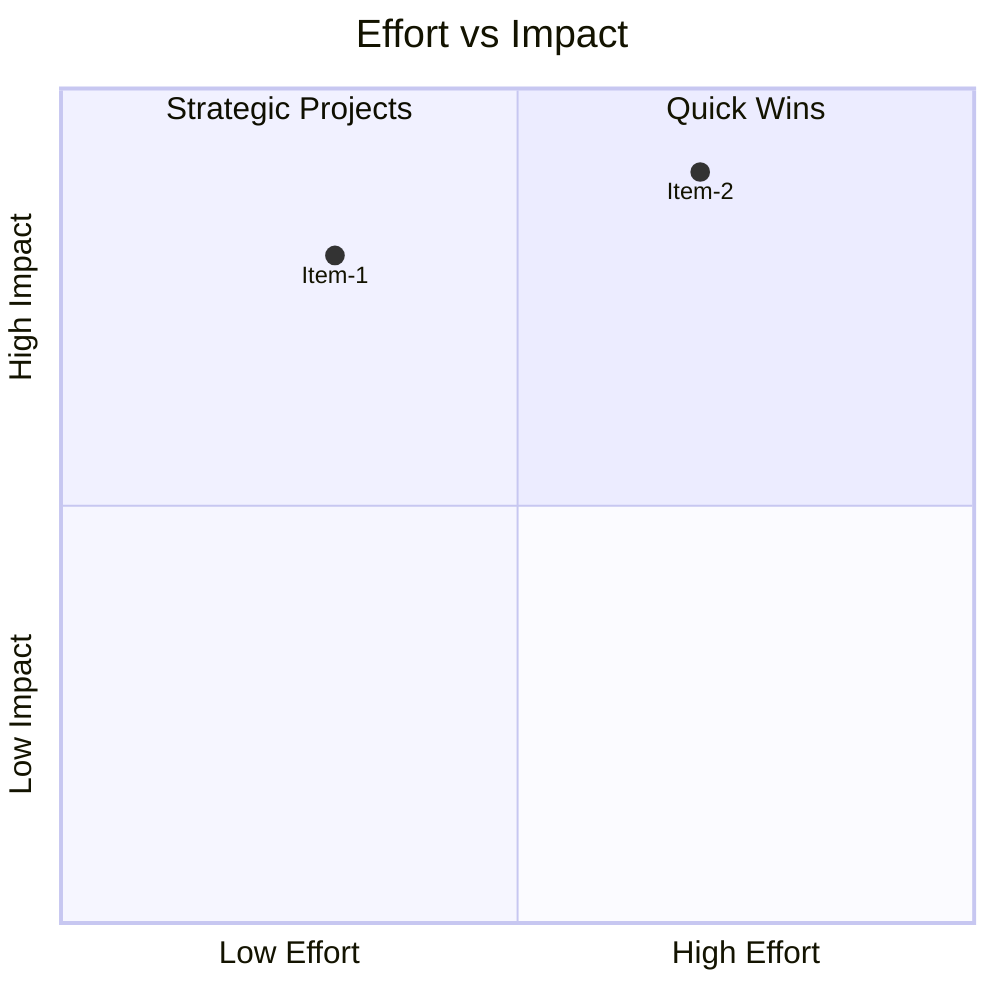
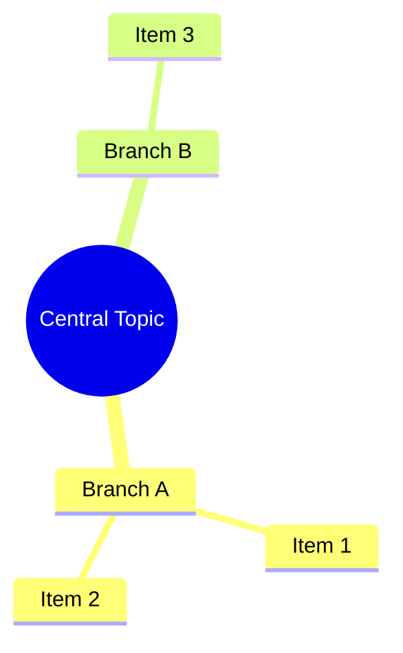
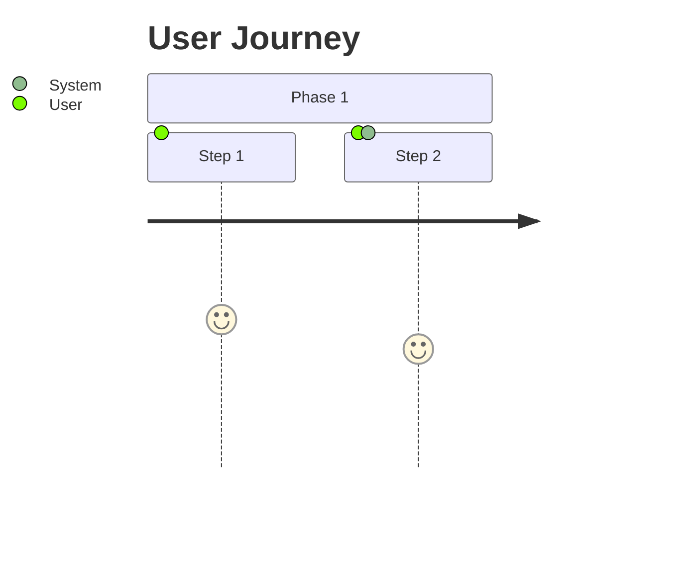
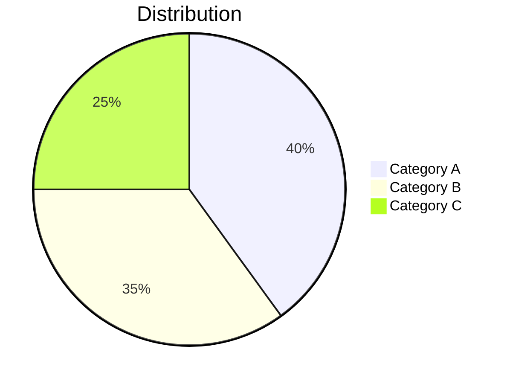

# Diagram Patterns — Established Conventions

## Emoji Heat Map (Risk, Priority, Impact)

```markdown
| Impact \ Probability | Low | Medium | High |
|---------------------|-----|--------|------|
| **High** | 🟡 | 🟠 | 🔴 |
| **Medium** | 🟢 | 🟡 | 🟠 |
| **Low** | 🟢 | 🟢 | 🟡 |

> **Legend:** 🔴 Critical — Immediate action required | 🟠 High — Mitigation plan required | 🟡 Medium — Monitor and manage | 🟢 Low — Accept and monitor
```

Place risk IDs directly in cells: `🔴 CR-01`, `🟠 BR-01`

## Mermaid: Process Flow



## Mermaid: Dependency Diagram



## Mermaid: Gantt Timeline



## Mermaid: Org Chart



## Mermaid: Quadrant Chart (Effort vs Impact)



## Mermaid: Mind Map



## Mermaid: Journey Map



## Mermaid: Pie Chart



## Color Conventions

| Element | Color | Hex |
|---------|-------|-----|
| Start/End nodes | Green | `#4CAF50` |
| Decision nodes | Orange | `#FF9800` |
| Error/Reject nodes | Red | `#f44336` |
| Process nodes | Blue | `#2196F3` |
| Data/Storage nodes | Orange | `#FF9800` |
| Integration nodes | Purple | `#9C27B0` |
| Observability nodes | Grey | `#607D8B` |
| Executive/Strategic | Dark Blue | `#1a237e` / `#283593` |
| Phases | Vary per phase | Green → Blue → Purple |
