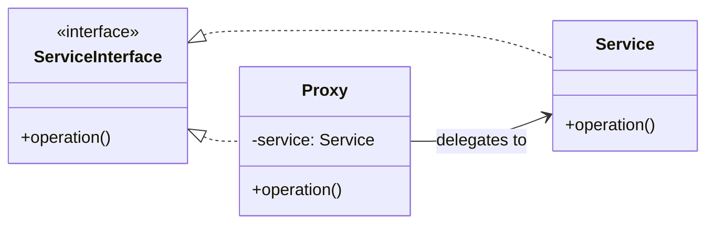

# Mermaid Class Diagram — Relationship Syntax

Quick reference for adding UML class diagrams to Obsidian notes. Obsidian renders Mermaid natively inside ````mermaid` code blocks.

## Syntax Table

| Relationship | Mermaid Syntax | UML Arrow | Example |
|-------------|---------------|-----------|---------|
| Inheritance (extends) | `<\|--` | Solid hollow triangle | `Animal <\|-- Cat` |
| Implementation (implements) | `<\|..` | Dashed hollow triangle | `Flyable <\|.. Airplane` |
| Composition (owns, lifecycle) | `*--` | Filled diamond | `University *-- Department` |
| Aggregation (has, independent) | `o--` | Empty diamond | `Department o-- Professor` |
| Association (knows, permanent) | `-->` | Solid arrow | `Professor --> Student` |
| Dependency (uses, temporary) | `..>` | Dashed arrow | `Professor ..> Course` |
| Bidirectional association | `<-->` | Solid arrow both ways | `Person <--> Address` |

## Annotation Syntax

| Feature | Syntax | Example |
|---------|--------|---------|
| Interface | `<<interface>>` inside class | `class Flyable { <<interface>> }` |
| Abstract class | `<<abstract>>` inside class | `class Animal { <<abstract>> }` |
| Field/Method visibility | `+` public, `-` private, `#` protected | `+getName()`, `-internalState` |
| Generics | `~Type~` | `List~Component~` |
| Abstract method | `*` suffix | `+makeSound()*` |
| Relationship label | `: label` after relation | `Professor --> Student : teaches` |

## Direction

Use `direction LR` for left-to-right layout (better for wide diagrams). Default is top-to-bottom.

## Full Example


