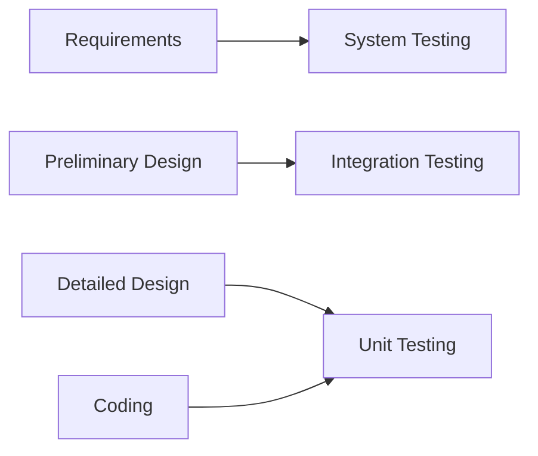
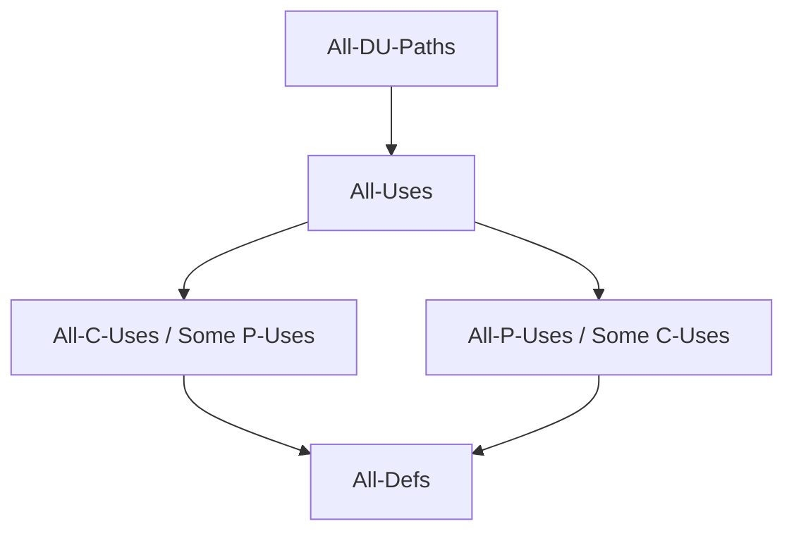
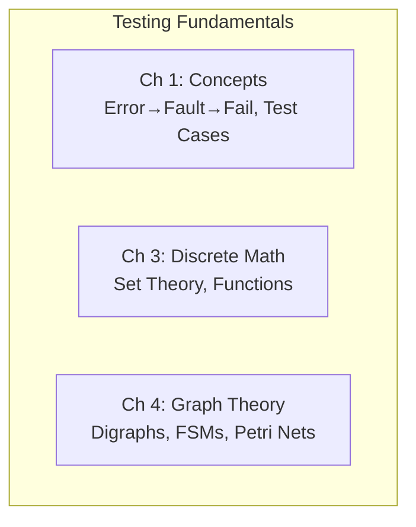

# ASCII to Mermaid Conversion Pattern

## When to Use

After sub-agents create files with ASCII diagrams (box-drawing characters like ┌ └ ├ ─ │), replace them with Mermaid diagrams. Obsidian renders Mermaid natively. The user has explicitly preferred Mermaid over ASCII.

## Pattern

For each file with ASCII diagrams:

1. Search for ASCII art: `search_files` pattern `┌|└|├|─|│|┬|┴|├|┐|┘` across the target directory
2. For each match, determine the intent (flowchart, hierarchy, state diagram, matrix)
3. Replace with equivalent Mermaid code

## Common Conversions

### V-Model (ASCII → Mermaid)

**Before (ASCII):**
```
Requirements ──────────── System Testing
    │                          ▲
Preliminary Design ─── Integration Testing
    │                          ▲
Detailed Design ──────── Unit Testing
    │                          ▲
   Coding ─────────────────────┘
```

**After (Mermaid):**


### Coverage Hierarchy (ASCII → Mermaid)

**Before (ASCII):**
```
All-Paths
  └── All-DU-Paths
        └── All-Uses
              ├── All-C-Uses/Some P-Uses
              └── All-P-Uses/Some C-Uses
                    └── All-Defs
```

**After (Mermaid):**


### Box Diagram → Mermaid Flowchart

**Before (ASCII):**
```
┌─────────────────────────────────────────────────────────┐
│                   TESTING FUNDAMENTALS                   │
├─────────────────────────────────────────────────────────┤
│  Ch 1: Concepts     Ch 3: Discrete Math   Ch 4: Graphs  │
│  Error→Fault→Fail   Set Theory            Undirected    │
│  Test Cases         Functions             Digraphs      │
└─────────────────────────────────────────────────────────┘
```

**After (Mermaid):**


### 2×2 Grid → Markdown Table

**Before (ASCII):**
```
                 ┌─────────────────┐    ┌──────────────────┐
   Valid only     │ Normal BVA      │    │ Worst-Case BVA    │
                  │ (4n + 1 cases)  │    │ (5ⁿ cases)        │
                  ├─────────────────┤    ├──────────────────┤
   Valid + Invalid│ Robust BVA      │    │ Robust Worst-Case │
                  │ (6n + 1 cases)  │    │ (7ⁿ cases)        │
```

**After (Markdown Table):**
```
| | Single Fault | Multiple Faults |
|---|---|---|
| **Valid only** | Normal BVA (4n+1 cases) | Worst-Case BVA (5ⁿ cases) |
| **Valid + Invalid** | Robust BVA (6n+1 cases) | Robust Worst-Case (7ⁿ cases) |
```

## Verification

After conversion, verify no box-drawing characters remain:
```python
import os
box_chars = set('┌└├─│┬┴├┐┘')
content = open(path, encoding='utf-8').read()
remaining = [ch for ch in content if ch in box_chars]
```

## Proven on

- Software Testing vault (Jorgensen): 2 V-Models, 1 summary box, 1 coverage hierarchy, 1 BVA 2×2 grid → 5 diagrams replaced across 4 files
