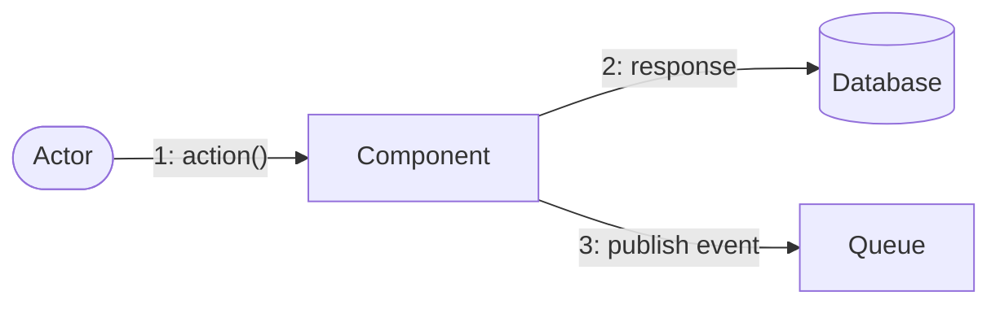

# Project Document Templates

## Overview

Create production-ready `.md` templates for standard project documents. Each template is a fill-in-the-blank file that teams copy and complete — replacing `.docx`/`.xlsx` with version-controllable, searchable, CI/CD-friendly markdown.

**Companion skill:** `bok-essential-documents` extracts the *list* of documents from BOKs. This skill creates the *actual template* for each document.

**Total documents:** 357 templates across 22 sections + 3 profile checklists (Small/Medium/Large).

## When to Use

- User asks to create a project document template in markdown
- User says "build a template for [document name]"
- User wants to convert existing `.docx`/`.xlsx` project documents to `.md`
- User asks for a "docs-as-code" approach to project documentation
- User wants a master checklist of project documents across multiple BOKs

**Don't use for:** Obsidian vault note creation (use `obsidian`), BOK document list extraction (use `bok-essential-documents`), general writing (use `humanizer`).

## Output Location

Default base path:
```
F:\projects\orlita_md\Project Document Template\
```

Folder structure:
```
Project Document Template/
├── TEMPLATE-CHECKLIST.md              ← Master tracker
├── 01_Business_Analysis_and_strategy/
├── 02_Elicitation_and_Collaboration/
├── 03_Concept_and_Mission_Definition/
├── 04_Requirements_Engineering/
├── 05_Project_Management_Planning/
├── 06_Project_Management_Executing_and_MC/
├── 07_Project_Management_Closing/
├── ... (22 sections total)
```

Folder names use `##_Snake_Case` with leading zero for sort order. Document file names use `Title-Case-Hyphenated.md`.

## Template Structure Convention

Every template follows this skeleton:

### YAML Frontmatter

```yaml
---
document_type: [Document Type Name]
version: "1.0"
status: Draft
author: "[Author Name]"
created: "[YYYY-MM-DD]"
last_updated: "[YYYY-MM-DD]"
project_name: "[Project Name]"
project_id: "[Project-ID]"
[role]_owner: "[Name / Role]"
classification: "Internal / Confidential"
tags: [relevant, tags, here]
standard_ref:
  - [Standard] — [Reference]
---
```

### Document Control Block

Always include immediately after frontmatter:

```markdown
## Document Control

| Field | Value |
|-------|-------|
| Document Owner | [Name / Role] |
...

### Revision History
### Approvals
```

### Body Sections

- Use `## N. Section Name` headings (numbered)
- Use tables extensively — markdown tables render well everywhere
- Use `[brackets]` for all fill-in placeholder values
- Use `[[Hyphenated-Name]]` for cross-references to related documents (NEVER spaces)
- Include a `## Related Documents` section at the end

## Diagram Conventions — ALWAYS Mermaid

**Never use ASCII art for diagrams.** Always use Mermaid syntax. It renders in GitHub, Obsidian, VS Code, and most markdown viewers.

### Diagram Types by Document Need

| Need | Mermaid Type | Example |
|------|-------------|---------|
| Process flow | `flowchart TD/LR` | Request submission flow |
| Org chart | `flowchart TD` with styled nodes | Team structure |
| Timeline/Gantt | `gantt` | Project schedule, milestones |
| Dependency/flow | `flowchart LR` | Objective dependencies, capability dependencies |
| Quadrant/matrix | `quadrantChart` | Stakeholder power/interest |
| Mind map | `mindmap` | Quality model, value framework |
| Pie chart | `pie` | Budget distribution |
| Radar | `radar-beta` | Readiness assessment |
| Journey | `journey` | Customer journey |

See `references/gantt-chart-patterns.md` for 7 reusable Gantt chart patterns.
See `references/gantt-chart-document-pattern.md` for standalone Gantt Chart document template.
See `references/checklist-management-patterns.md` for checklist pitfalls and fix patterns.
See `references/architecture-document-patterns.md` for architecture diagram types, ADR templates, trade study patterns.
See `references/profile-checklist-patterns.md` for project-size profile checklists with backlinks.

### Mermaid Node Color Semantics

- Green (#4CAF50) — Start/End/Success/Positive
- Blue (#2196F3) — Process/System/Neutral
- Orange (#FF9800) — Warning/Review/Decision
- Red (#f44336) — Error/Rejection/Critical
- Purple (#9C27B0) — Integration/External/Management
- Gray (#607D8B) — Users/External entities

## Emoji Conventions

### Risk Heat Map (5x5 table, NEVER ASCII)

```markdown
| Impact \ Probability | Low | Medium | High |
|---------------------|-----|--------|------|
| **High** | 🟡 | 🟠 | 🔴 TR-01 |
| **Medium** | 🟢 | 🟡 FR-01 | 🟠 BR-01 |
| **Low** | 🟢 | 🟢 | 🟡 |

> **Legend:** 🔴 Critical | 🟠 High | 🟡 Medium | 🟢 Low
```

### Status Indicators

| Emoji | Meaning |
|-------|---------|
| ✅ | Done / Complete / Pass / Approved |
| ☐ | Pending / Not started |
| 🔴 | Critical / Must Have |
| 🟠 | High / At Risk |
| 🟡 | Medium / Should Have / Conditional |
| 🟢 | Low / Could Have / On Track |
| ⚠️ | Warning / Partial |
| ❌ | Failed / Rejected / Blocked |
| ⏸️ | Deferred / Paused |

## Checklist-Driven Batch Workflow

When creating multiple templates from a master checklist:

1. **Create the master checklist first** — deduplicate across all sources
2. **Scale batch size with user comfort** — Start with 1 for first review, then 3, then 7, then 10. User explicitly requested this progression: "let do it one by one, because it easier to me to review one by one" → later "let do 3 doc at a time" → later "let do 7 at a time" → later "let do 10 doc at a time". Let the user set the pace.
3. **Update checklist after each batch** — mark items ✅ as completed
4. **Use execute_code with patch for batch updates** — more reliable than single patch calls
5. **Check for duplicates** — watch for duplicate item numbers
6. **Never skip items in current batch** — user will catch it

### Checklist Update Pattern

```python
from hermes_tools import patch
old = "| XX | Doc Name | 🔴 | Source | ☐ |"
new = "| XX | Doc Name | 🔴 | Source | ✅ |"
result = patch("path/to/TEMPLATE-CHECKLIST.md", old, new)
```

## Template Patterns by Document Type

See `references/template-patterns-by-type.md` for detailed section patterns by document category.

| Category | Key Pattern |
|----------|------------|
| Strategy/Analysis | Weighted scoring matrix, gap analysis, before/after |
| Approach/Plan | RACI matrix, governance model, communication matrix |
| Assessment | Radar chart, weighted scores, go/no-go criteria |
| Requirements | Requirements register, traceability, context diagram |
| Elicitation | Activity cards, technique matrix, power/interest grid |
| Concept/Definition | Sequence diagrams, capability gaps, MOE table |
| PM Monitoring | EVM tracking, forecast scenarios, variance analysis |
| Reports | Performance dashboard, trend analysis, recommendations |

## Consolidation from Multiple BOKs

When same document appears in multiple BOKs:
- Create ONE template (not duplicates)
- List ALL sources in standard_ref frontmatter
- Use the most comprehensive version as base
- Track consolidation in checklist source column

See `references/testing-construction-patterns.md` for testing pyramid, defect lifecycle, build pipeline, TDD cycle, and conventional commits patterns.
See `references/security-document-patterns.md` for STRIDE analysis, OWASP Top 10, risk heat map, SSDLC gates, and defense-in-depth patterns.
See `references/data-management-patterns.md` for DMBOK patterns: governance, data modeling (CDM→LDM→PDM), database operations, data quality (6 dimensions), integration, MDM, analytics, and metadata.

## Section Patterns: Testing & Verification (#184-193)

| Document | Key Sections | Unique Patterns |
|----------|-------------|----------------|
| Test Plan | Scope, Schedule, Resources, Entry/Exit Criteria | Gantt schedule, defect SLAs |
| Test Strategy | Testing pyramid, test types, automation strategy | Mermaid pyramid diagram |
| Test Cases | Template, examples, execution summary | Step/Expected/Actual/Status table |
| Test Suite | Suite hierarchy, execution matrix | Mermaid suite tree |
| Test Data | Factories, fixtures, seed scripts | TypeScript factory examples |
| Test Scripts | Stack, structure, examples | Jest/Playwright code samples |
| Defect Report | Lifecycle, template, register, metrics | Mermaid state diagram |
| Regression Test Suite | Strategy, composition, triggers | Mermaid execution flow |
| Traceability Matrix | Bidirectional traceability, coverage | Matrix table, gap analysis |
| Test Report | Execution summary, results, quality assessment | Module/type breakdown |

## Section Patterns: Construction (#173-183)

| Document | Key Sections | Unique Patterns |
|----------|-------------|----------------|
| README / Developer Guide | Quick Start, Architecture, Contributing | Full README template with badges |
| Coding Standards | Style rules, linting, file structure | ESLint/Prettier config examples |
| API Documentation | OpenAPI spec, generation, versioning | YAML spec template |
| Dependency Manifest | Dependencies, policy, update process | Mermaid update flow |
| SBOM | Standards, generation, license compliance | SBOM pipeline (Mermaid) |
| Code Review Records | Process, checklist, metrics | Mermaid review flow |
| Commit Messages / Changelog | Conventional Commits, changelog format | Commit type table |
| Static Analysis Reports | Tools, quality gates, CI/CD integration | GitHub Actions YAML |
| Build Scripts | Pipeline, scripts, artifacts | Mermaid build pipeline |
| Mock/Stub/Driver Specs | Test doubles, implementations | TypeScript mock examples |
| TDD Test Cases | Red-Green-Refactor, examples | Mermaid TDD cycle, code samples |

## UX/UI Document Patterns

UX/UI documents differ from BOK documents — they're more visual, reference design tools, and focus on user behavior rather than process compliance.

### Key Differences

| Aspect | BOK Documents | UX/UI Documents |
|--------|--------------|-----------------|
| [Primary content] | [Tables, registers, traceability] | [User flows, personas, wireframes] |
| [Diagrams] | [Flowcharts, Gantt, ERD] | [Journey maps, sitemaps, empathy maps] |
| [External tools] | [None — self-contained] | [Figma, Sketch, Adobe XD] |
| [Audience] | [PMs, architects, developers] | [Designers, researchers, developers] |
| [Metrics] | [EVM, defect density, SLA] | [SUS score, task completion, NPS] |

### Design Tool Linking Convention

When a document references visual designs that live in external tools:

```markdown
> ⚠️ **Note:** UI mockups are pixel-perfect visual designs created in Figma/Sketch. 
> This document *specifies and links* the mockups — the actual designs live in the design tool.

## Design Tool Links

| Resource | URL | Version |
|---------|-----|---------|
| [Figma Project] | [https://figma.com/file/xxx] | [v1.0] |
| [Design System] | [https://figma.com/file/xxx] | [v1.0] |
| [Prototype] | [https://figma.com/proto/xxx] | [v1.0] |
```

Documents that link to design tools: UI Mockups, Interactive Prototype, Component Library, Design System, Style Guide, Asset Export Package.

### UX/UI Template Categories

| Category | Documents | Key Patterns |
|----------|----------|-------------|
| [Research] | [Personas, Interview Script, Research Report, Empathy Map, Survey] | [Quotes, affinity maps, SUS scores] |
| [Architecture] | [IA, Sitemap, User Flows, Journey Maps] | [Mermaid flowcharts, journey diagrams] |
| [Design] | [Wireframes, Mockups, Prototype, Component Library] | [ASCII layouts, Figma links, state specs] |
| [Standards] | [Design System, Style Guide, Design Tokens, Brand Guidelines] | [CSS variables, color tables, type scales] |
| [Testing] | [Usability Test Plan/Report, A/B Test, Heatmap, Accessibility] | [Task results, SUS scores, WCAG criteria] |

### Communication Diagram Pattern (Mermaid)

UML communication diagrams don't exist in Mermaid. Use `flowchart LR` with numbered edge labels:



**Critical:** Quote ALL edge labels containing `()`, `/`, `:`, or `,`.

## Wikilink Convention (CRITICAL)

**Always use hyphens in wikilinks, never spaces.**

```markdown
✅ [[Business-Case]]
✅ [[Test-Plan]]
✅ [[Software-Requirements-Specification]]

❌ [[Business Case]]
❌ [[Test Plan]]
❌ [[Software Requirements Specification]]
```

The user explicitly fixed broken backlinks across 172+ documents because space-separated wikilinks broke in their Obsidian vault. This is a hard rule — every `[[wikilink]]` must use hyphenated names matching the file name (without `.md`).

## Section Patterns: Deployment & Operations (#288-301)

| Document | Key Sections | Unique Patterns |
|----------|-------------|----------------|
| CI/CD Pipeline Config | Pipeline stages, YAML config, environments | Full GitHub Actions YAML, Mermaid pipeline |
| Deployment Plan | Pre-checklist, steps, verification, communication | Mermaid deployment flow, step-by-step commands |
| Rollback Plan | Triggers, decision matrix, steps, time estimates | Mermaid decision flow, communication templates |
| SLA | Uptime targets, response times, escalation | Uptime calculation table, 4-level escalation |
| Operations Manual / Runbook | Daily/weekly checks, scaling, troubleshooting | Command tables, troubleshooting matrix |
| Release Notes | Features, improvements, fixes, known issues | Release template, migration notes |
| Incident Management | Lifecycle, severity, escalation, post-mortem | Mermaid lifecycle, communication templates |
| Disaster Recovery | Scenarios, RTO/RPO, backup strategy, testing | DR procedures per scenario |
| Capacity Plan | Current utilization, growth projections, scaling | Projection tables, auto-scaling config |
| Container Configurations | Dockerfile, K8s deployment/service/HPA | Full YAML examples |
| Infrastructure-as-Code | Terraform config, modules, state management | HCL examples, directory structure |
| SLO/SLI Definitions | SLI metrics, SLO targets, error budget | Error budget policy, Mermaid SLI→SLO→SLA |
| Operational KPIs Report | Monthly KPIs, incidents, achievements | Monthly report template |
| Monitoring Dashboard Spec | Dashboard layouts, alert config | ASCII dashboard mockups, alert table |

## Section Patterns: Verification & Validation (#194-202)

| Document | Key Sections | Unique Patterns |
|----------|-------------|----------------|
| Test Completion Report | Exit criteria assessment, statistics, sign-off | 10 exit criteria checklist |
| UAT Sign-off | Scenarios, business acceptance, formal sign-off | 4-role sign-off table |
| Coverage Report | Code/requirements/branch/function coverage | Coverage by module, trends |
| Performance Test Report | Load/stress results, resource utilization | p50/p95/p99 tables, bottleneck analysis |
| Security Test Report | OWASP Top 10, findings, pen test results | OWASP assessment table |
| Verification Plan | Methods, criteria, schedule | Mermaid Gantt, verification matrix |
| Verification Reports | Multi-level verification summary | Level-by-level results |
| Validation Plan | Methods, UAT scenarios, exit criteria | Mermaid Gantt, UAT scenario table |
| Validation Reports | UAT results, usability metrics, operational checks | SUS scores, formal acceptance |

## User Workflow Preferences

The user (Panomete) has specific preferences for this workflow:

1. **Review cadence:** Start with 1 doc for first review, then scale to 3, 7, 10 per batch. Let user set pace.
2. **Section jumping:** User may skip sections (e.g., skipped Security + Data Management, jumped to Deployment). Don't question — just do what they ask.
3. **Checklist accuracy:** User catches duplicate entries and skipped items. Verify before presenting.
4. **Backlink correction:** User fixed broken backlinks mid-session across 172+ docs. Always use `[[Hyphenated-Name]]`.
5. **Progress tracking:** User appreciates progress tables showing sections complete.
6. **Communication style:** Direct, no fluff. User says "reviewed, let do next" — don't over-explain, just proceed.
7. **Batch size preference:** User prefers 7-10 docs per batch for efficiency, but will do all at once for smaller sections (≤10 docs). User said "let all at one" for 9-doc sections.
8. **UX/UI design tools:** User acknowledges some MD templates need linking to design tools (Figma) later — include Figma link placeholders in UX/UI docs.
9. **Profile checklists:** User requested project-size-based checklists (Small/Medium/Large) with backlinks to templates. Create these after all templates are done.
10. **Checklist section integrity:** User catches when documents get merged across section boundaries. Always verify section headers are intact after batch updates.

## Section Patterns: Maintenance & Support (#302-310)

| Document | Key Sections | Unique Patterns |
|----------|-------------|----------------|
| Maintenance Plan | 4 types (corrective/adaptive/perfective/preventive), support levels L1-L4, maintenance windows | Mermaid classification flow, SLA targets |
| Impact Analysis Report | 9-dimension impact assessment, effort estimation, risk assessment | Register with 3 example analyses |
| Modification Request | MR template, lifecycle (Mermaid state diagram), register, metrics | Every change gets an MR |
| Maintenance Log / Change History | Change log, release history, maintenance statistics | Trend tracking |
| Technical Debt Register | 7 categories, debt metrics, reduction plan, trend | Debt = intentional shortcuts tracked |
| SLA Compliance Report | Monthly uptime/performance/support, SLA breaches, error budget | Trend tables |
| Maintenance Metrics Dashboard | 7 KPIs (MTTR, density, backlog, resolution rate, reopen rate, SLA compliance, tech debt) | Dashboard layout |
| Logistics Plan | Licenses, vendor management, EOL planning, spare capacity | Long-term planning |
| Incident / Problem Reports | Incident vs Problem distinction, templates, registers, metrics | ITIL incident/problem separation |

## Section Patterns: Quality Assurance (#311-321)

| Document | Key Sections | Unique Patterns |
|----------|-------------|----------------|
| SQAP | Quality objectives, standards (ISO 9001/WCAG/OWASP), 10 QA activities, non-compliance process | Mermaid non-compliance flow |
| V&V Plan | Verification vs Validation comparison, activities, matrix, schedule | Mermaid Gantt |
| Review Records | 3 review types (walkthrough/technical/inspection), register, statistics | Checklist template |
| Defect Log / Metrics | Log, 5 metrics (density/removal efficiency/leakage/MTTR/reopen), trends by phase/module | Trend tables |
| QMS Documentation | QMS structure (Mermaid), quality policy, 6 procedures, records retention | Document control rules |
| Audit Reports | 4 audit types, report template (findings/recommendations/conclusion), register | Audit metrics |
| Quality Metrics Dashboard | 8 KPIs, quality trends, quality alerts | Dashboard layout |
| RCA Reports | 4 methods (5 Whys/Fishbone/FTA/Pareto), template with 5 Whys example, fishbone (Mermaid) | Corrective actions + prevention |
| FMEA / FTA Reports | FMEA worksheet (RPN = Severity × Probability × Detection), FTA fault tree (Mermaid), cut sets | Bottom-up (FMEA) + top-down (FTA) |
| Integrity Level Assignments | 4 levels (IL-1 to IL-4), component assignments, testing requirements per level | Quadrant chart (Mermaid) |
| Process Assessment Report | CMMI 5 levels + SPICE 6 levels, assessment results, strengths, improvement roadmap | Gap analysis, improvement phases |

## Section Patterns: Configuration Management (#322-330)

| Document | Key Sections | Unique Patterns |
|----------|-------------|----------------|
| SCMP | CI identification, control, status accounting, audits | Mermaid control flow, branch strategy table |
| Configuration Management Plan | CM process, CCB, change authority, tools | Mermaid CM cycle |
| Baseline Records | 4 baseline types, register, contents, comparison | Detailed CI lists per baseline |
| Change Request (CR/SCR) | CR template, lifecycle, register, metrics | Mermaid state diagram |
| FCA Report | Functional requirements checklist, verification evidence | Req × Spec × Implementation × Test matrix |
| PCA Report | Physical CI checklist, version comparison | Baseline vs As-Built verification |
| Version Description Document | Version contents, changes, install/upgrade, rollback | Checksums, compatibility matrix |
| Configuration Status Accounting Reports | CI status summary, version status, change status, trends | Monthly report template |
| Deviation / Waiver Records | Deviation vs Waiver distinction, template, register, expiration tracking | DW lifecycle, conditions monitoring |

## Section Patterns: Solution Evaluation (#349-353)

| Document | Key Sections | Unique Patterns |
|----------|-------------|----------------|
| Solution Performance Measures | 8 measures across financial/customer/operational | Definition/formula/baseline/target/current per measure |
| Solution Performance Analysis | Trends, gap analysis, variance analysis, recommendations | Mermaid performance scorecard |
| Solution Limitation | Limitation register, root causes, comparison with expectations | Impact/workaround/mitigation per limitation |
| Enterprise Limitation | Organizational/technical/regulatory/environmental constraints | Mitigation per category |
| Recommended Actions | Recommendation cards, implementation roadmap, investment summary | Mermaid Gantt, ROI table |

## Section Patterns: Domain-Specific (#354-357)

| Document | Key Sections | Unique Patterns |
|----------|-------------|----------------|
| Software Development Plan | Lifecycle, standards, environments, team, risks | Mermaid Gantt lifecycle |
| Software Assurance Plan | SIL levels (1-4), assurance activities, independence requirements | SIL assignment table, safety analysis |
| Medical Device File | IEC 62304/FDA framework, safety classification, 12 required docs, traceability | IEC clause mapping, risk management summary |
| Security Accreditation Package | NIST RMF/FedRAMP, security controls, POA&M, accreditation timeline | Control family table, Mermaid accreditation Gantt |

## Section Patterns: SE Cross-Cutting (#331-348)

| Document | Key Sections | Unique Patterns |
|----------|-------------|----------------|
| SEMP | SE lifecycle (Mermaid), activities, technical reviews, team structure | V-Model lifecycle diagram |
| Implementation Plan | Build order, sequence (Mermaid Gantt), resources, acceptance criteria | Infrastructure→Backend→Frontend order |
| Integration Plan + Reports | 4 strategies, sequence (Mermaid), tests, report, issues | Sandwich integration pattern |
| Transition Plan | Phases (Mermaid Gantt), data migration, training, handover checklist, hypercare | Blue-green deployment, phased handover |
| Technical Review Records | Lifecycle (Mermaid), register, template (entry criteria/findings/disposition) | SRR→PDR→CDR→TRR→FCA→PCA sequence |
| Technical Performance Measures | 6 TPMs with margins, trends, quadrant chart (Mermaid), shortfall analysis | Margin tracking, TPM health |
| System Safety Plan | Safety lifecycle (Mermaid), safety requirements, arguments, residual risk | ISO 61508, safety case structure |
| Hazard Analysis (PHA, SHA, SSHA) | 3 analysis types, 5×5 risk matrix, hazard summary | MIL-STD-882, bottom-up + top-down |
| Standards Compliance Matrix | 7 standards, clause-by-clause compliance, summary | ISO 15288, ISO 29148 mapping |
| System Disposal / Retirement Plan | Triggers, phases (Mermaid Gantt), data/infra disposal, checklist | Secure deletion, stakeholder notification |
| Capability Upgrade Plan | 8 capabilities across 5 phases (Mermaid Gantt), investment & ROI | Post-deployment enhancement roadmap |
| As-Built Documentation | Design vs as-built comparison, final config, deviation log | Reality vs design documentation |
| Decision Records | Register, template (context/options/rationale/consequences), details | ADR-style decision documentation |
| Risk Burn-Down Chart | Burn-down (Mermaid xychart), trend, remaining risks, velocity | Visual risk reduction tracking |
| Measurement Plan | 5 objectives, process/product measures, collection, reporting | ISO 15939 measurement process |
| SE Performance Dashboard | 8 KPIs, dashboard layout, health score | Requirements/quality/risk/performance |
| Tailoring Justification | 4 principles, 5 tailored processes, impact assessment | Process adaptation documentation |
| Security Plan | Architecture (Mermaid), controls, responsibilities, metrics, review | ISO 27001 alignment |

## Profile Checklists (Project Size)

When the user asks for project-size-based checklists (Small/Medium/Large), create a `23_Project_Size/` folder with profile checklists that backlink to the templates.

### Profile Checklist Structure

Each profile file contains:
- Project characteristics (team size, timeline, methodology, regulatory)
- Documents organized by phase/category
- Each document has: `[[Hyphenated-Name]]` backlink, priority (🔴🟡🟢), template folder reference, status checkbox
- Summary table with counts by category
- Quick-Start checklist (🔴 Must Have only, for Small profiles)

### Profile Document Counts (Reference)

| Profile | 🔴 Must Have | 🟡 Nice to Have | Total |
|---------|-------------|----------------|-------|
| Small / Startup | 17 | 14 | 31 |
| Medium / Enterprise | 72 | 18 | 90 |
| Large / Safety-Critical | 127 | 19 | 146 |

### Backlink Pattern in Profiles

```markdown
| Document | Priority | Template | Status |
|----------|---------|---------|--------|
| [[Business-Case]] | 🔴 | [01_Business_Analysis_and_strategy] | ☐ |
| [[Test-Plan]] | 🔴 | [13_Testing_and_Verification] | ☐ |
```

The `Template` column references the folder name, not the file path. The `[[Hyphenated-Name]]` backlink references the document file name without `.md`.

### Empty Backlinks for Skipped Sections

When sections are skipped and templates don't exist yet, use `—` (em dash) in the Template column instead of a folder reference. This signals "no template yet" without breaking the checklist structure:

```markdown
| Threat Model | 🔴 | — | ☐ |
| Secure Coding Guidelines | 🔴 | — | ☐ |
```

When templates are later created, update the backlink to reference the actual folder:
```markdown
| [[Threat-Model]] | 🔴 | [14_Security] | ☐ |
```

This pattern was used when user skipped Sections 14/15/20 and returned later to fill them in.

### Backlink Update Workflow

When sections are skipped and filled in later, follow this workflow to update profile checklists:

1. **Count empty backlinks** — `grep -c '| — |' Profile-Name.md`
2. **Create a mapping** — Document name → `[[Hyphenated-Name]]` + folder reference
3. **Update in batches** — Use `execute_code` with `patch()` for each backlink
4. **Verify** — Confirm 0 empty backlinks remain after update
5. **Count total backlinks** — `grep -c '\[\[' Profile-Name.md` to verify completeness

**Batch update pattern:**
```python
from hermes_tools import patch

fixes = [
    ("| Threat Model | 🔴 | — | ☐ |", "| [[Threat-Model]] | 🔴 | [14_Security] | ☐ |"),
    ("| SAST Report | 🔴 | — | ☐ |", "| [[SAST-Report]] | 🔴 | [14_Security] | ☐ |"),
    # ... more entries
]

count = 0
for old, new in fixes:
    result = patch("path/to/Profile.md", old, new)
    if result.get("success"):
        count += 1

print(f"Updated {count} backlinks")
```

**Verification pattern:**
```python
from hermes_tools import terminal

# Check remaining empty backlinks
result = terminal("grep -c '| — |' 'path/to/Profile.md'")
print(f"Remaining empty: {result.get('output', '').strip()}")
```

**Real example from session:**
- User skipped Sections 14 (Security), 15 (Data Management), 20 (SE Cross-Cutting)
- Profile checklists had 106 empty backlinks in Large profile
- After creating all templates, updated 73 backlinks across 3 profiles
- Final verification: 0 empty backlinks in all profiles

## Section Patterns: Security (#203-228)

| Document | Key Sections | Unique Patterns |
|----------|-------------|----------------|
| ISMS Documentation | ISMS scope, structure (Mermaid), 14 ISO 27001 control domains | Control domain table, continuous improvement cycles |
| Security Policy | 6 principles, 4 policy areas (access/data/operations/development), enforcement | Policy violation → consequence table |
| Risk Assessment Report | Asset inventory, threat landscape, risk register, 5×5 heat map | Emoji heat map, risk summary |
| Risk Treatment Plan | 4 treatment options, residual risk assessment, control implementation | Treatment + controls per risk |
| Threat Model | STRIDE analysis, attack surface, attack trees (Mermaid) | Attack tree diagrams, mitigation mapping |
| Security Requirements Specification | 26 requirements across 6 categories, traceability, compliance mapping | OWASP/ISO/PCI compliance table |
| Secure Design Review Report | 8 security principles assessment, architecture diagram | Principle-by-principle checklist |
| Secure Coding Guidelines | OWASP Top 10 mitigations, coding rules, code review checklist | Language-specific rules (TypeScript examples) |
| SAST Report | Findings by severity, trend analysis, CI/CD integration | GitHub Actions YAML, remediation plan |
| SCA Report | Dependency vulnerabilities, license analysis, health metrics | Package × version × CVE table |
| DAST Report | Runtime findings, OWASP Top 10 coverage | URL × severity × description table |
| Penetration Test Report | Engagement summary, findings, attack narrative, retest | CVSS scores, attack phase narrative |
| SSDLC Process Documentation | Security activities by phase, 6 security gates, training | Mermaid lifecycle flow, gate criteria table |
| Access Control Policy | 4 principles, 5 roles, permission matrix, access review | RBAC matrix, Mermaid access request flow |
| Authentication Standard | Password policy, MFA, session management, token security | Enforcement tables per requirement |
| Incident Response Plan | IR lifecycle (Mermaid), 4 severity levels, 5-phase procedures | Communication templates, evidence preservation |
| Business Continuity Plan (BCP) | BIA (RTO/RPO), 6 continuity strategies, recovery procedures | Recovery step-by-step, testing schedule |
| Vulnerability Management Report | 5 scanning tools, SLA compliance, trends | Open vulns register, remediation plan |
| Compliance Assessment Report | ISO 27001 controls, OWASP Top 10, GDPR compliance | Control × implementation × evidence table |
| Network Security Architecture | 5-zone architecture (Mermaid), firewall rules, encryption | Zone × components × trust level table |
| DevSecOps Pipeline | 8 tools across 5 stages, pipeline config | Full GitHub Actions YAML, security gates |
| Security Metrics Dashboard | 8 KPIs, vulnerability trends, compliance scorecard | Dashboard layout, alert configuration |
| Digital Forensics Report | Forensic readiness, evidence collection, chain of custody | Evidence × hash × custody table |
| Adversary Emulation Plan | 4 threat actors, 3 emulation scenarios, MITRE ATT&CK | TTP × detection × response table |
| Abuse / Misuse Cases | 6 abuse cases with attack steps/mitigation/security req | Abuse case template, security req derivation |
| Security Architecture | 5-layer defense in depth (Mermaid), security zones | Layer × controls × purpose table |

## Common Pitfalls

1. **Mermaid edge labels with special characters** — Labels containing `()`, `/`, `:`, `,`, `;` MUST be wrapped in double quotes or Mermaid will fail to parse. Example: `A -->|"1: submit()"| B` not `A -->|1: submit()| B`. This bit the communication diagrams hard — all 3 diagrams had parse errors.
2. **ASCII art in diagrams** — User explicitly rejected this. Always Mermaid + emoji tables.
3. **Skipping items in batch** — User will catch it. ("Why do you skip basis of estimates?")
4. **Duplicate checklist entries** — Scan for duplicates before writing. Real examples from session:
   - #90 appeared twice (Variance Analysis Reports + Gantt Chart / Schedule)
   - #91-93 appeared in both Section 7 AND Section 8 (copy-paste error)
   - #63 Basis of Estimates appeared in two places
   - **Fix:** After each batch update, run a duplicate check: `grep -c "| XX |"` for each item number
5. **Missing items** — User will catch skipped items ("why do you skip basis of estimates?"). Before moving to next batch, verify ALL items in current batch are created. Don't assume — check.
6. **Forgetting checklist update** — Mark ✅ IMMEDIATELY after creating each template.
7. **Too generic** — Include domain-specific guidance in blockquotes.
8. **Missing cross-references** — `## Related Documents` with `[[Hyphenated-Name]]` is mandatory.
9. **No placeholder values** — Every cell that needs filling should have `[placeholder text]`.
10. **Inconsistent frontmatter** — Every template must have the base frontmatter fields.
12. **Broken wikilinks** — Always use hyphens, never spaces. See Wikilink Convention above.
13. **Missing items in batch** — User will catch skipped items even if you don't notice. Real examples: "you forgot 2 document Configuration Status Accounting Reports and Deviation/Waiver Records" and "why do you skip basis of estimates?". After creating a batch, verify EVERY item number in the checklist matches what you created. Don't assume the checklist is sequential — check the actual numbers.
13. **Merged sections in checklist** — When updating checklist items across section boundaries, documents from one section can accidentally get merged into another. Real example: Section 22 (#354-357) documents were added to Section 21 AND still existed as ☐ in Section 22. **Fix:** After batch updates, verify section headers are intact: `grep -n '## [0-9]' TEMPLATE-CHECKLIST.md` and check that items only appear once.
14. **Duplicate skill exists** — `md-project-document-templates` in productivity category overlaps with this skill. This skill (`project-document-templates`) is the primary — it has richer patterns, references, and pitfall documentation. If the other skill is used, it should be consolidated into this one.
15. **"All at once" for small sections** — When a section has ≤10 documents, user prefers creating all at once rather than batching. User said "let all at one" for sections with 9 docs. Only batch when section has 15+ docs.
