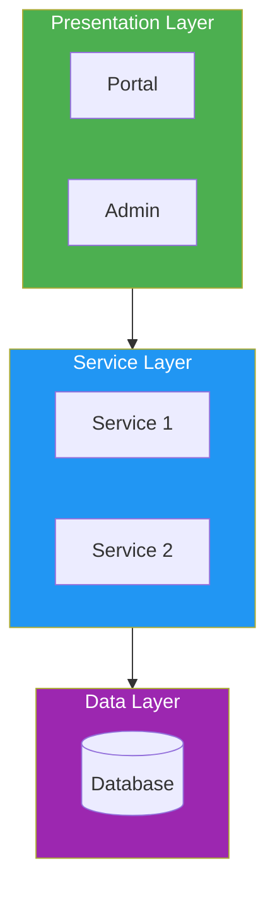
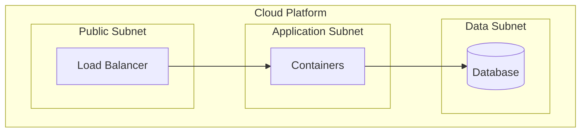
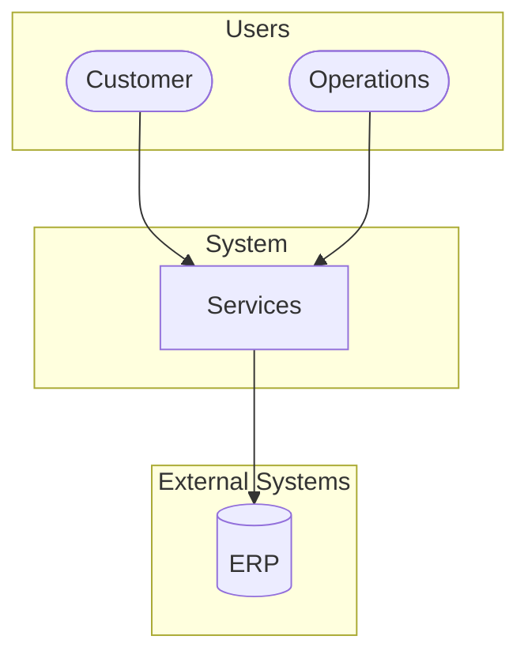

# Architecture Document Patterns

Patterns discovered while creating 20 architecture templates (Section 9: Systems Architecture & Design).

## Diagram Types Used

| Document | Diagram Type | Mermaid Keyword |
|----------|-------------|----------------|
| Functional Architecture | Decomposition tree | `flowchart TD` |
| Logical Architecture | Layered component diagram | `flowchart TB` with subgraphs |
| Physical Architecture | Deployment diagram | `flowchart TB` with nested subgraphs |
| System Architecture | Multiple views | `sequenceDiagram`, `flowchart` |
| ICD | Interface register | Tables (not diagrams) |
| Trade Study | Weighted scoring matrix | Tables |
| SAD | Architecture overview + sequence | `flowchart TB` + `sequenceDiagram` |
| ADR | No diagrams needed | Structured text |
| Architecture Views (4+1) | 5 different views | Mixed — `flowchart`, `sequenceDiagram` |
| ASR Catalog | Traceability matrix | Tables |
| ATAM Evaluation | Utility tree | `flowchart TD` |
| C&C Views | Runtime component diagrams | `flowchart TB` with subgraphs |
| Module Views | Layered package diagram | `flowchart TB` with subgraphs |
| MBSE Models | 8 SysML diagram types | Mixed — `flowchart`, `sequenceDiagram`, `stateDiagram-v2`, `classDiagram`, `erDiagram` |
| BOM | Dependency graph | `flowchart TD` |

## Mermaid Patterns for Architecture

### Layered Architecture (most common)



### Deployment Architecture



### C4-Style Context Diagram



## Template Sections Common to Architecture Docs

Every architecture template should include:

1. **Purpose** — What this document defines
2. **Overview/Diagram** — Visual representation (Mermaid)
3. **Component/Element Catalog** — Table with ID, name, description, status
4. **Relationships/Interfaces** — How elements connect
5. **Design Decisions** — Why this structure was chosen
6. **Quality Attributes** — How the design addresses NFRs
7. **Related Documents** — Cross-references with `[[wikilinks]]`

## ADR Template Pattern

```markdown
# ADR-XXX: Title

## Status
[Proposed | Accepted | Deprecated | Superseded]

## Context
[What forces are at play?]

## Decision
[What are we deciding?]

## Consequences
### Positive
- [What becomes easier?]
### Negative
- [What becomes harder?]

## Alternatives Considered
| Alternative | Why Not |
|-----------|---------|
```

## Trade Study Pattern

Always use weighted scoring matrix:

| Criterion | Weight | Option A | Option B | Option C |
|-----------|--------|---------|---------|---------|
| C1 | X% | Score × W | Score × W | Score × W |
| **Total** | 100% | **Sum** | **Sum** | **Sum** |

## Key User Preferences for Architecture Docs

- Mermaid diagrams for ALL visual representations
- Emoji heat maps (not ASCII) for risk matrices
- Tables for structured data (registers, catalogs, matrices)
- `[[wikilinks]]` for cross-references
- YAML frontmatter with `standard_ref` pointing to source BOK
- Color semantics consistent across all diagrams
