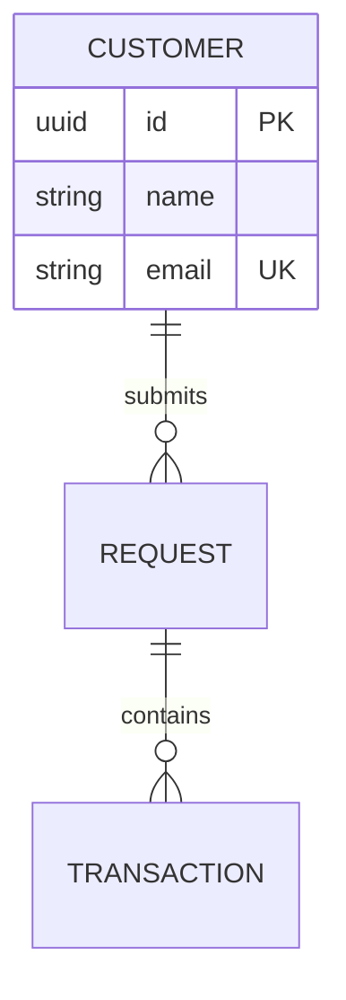
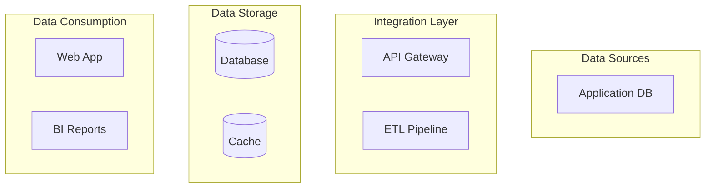
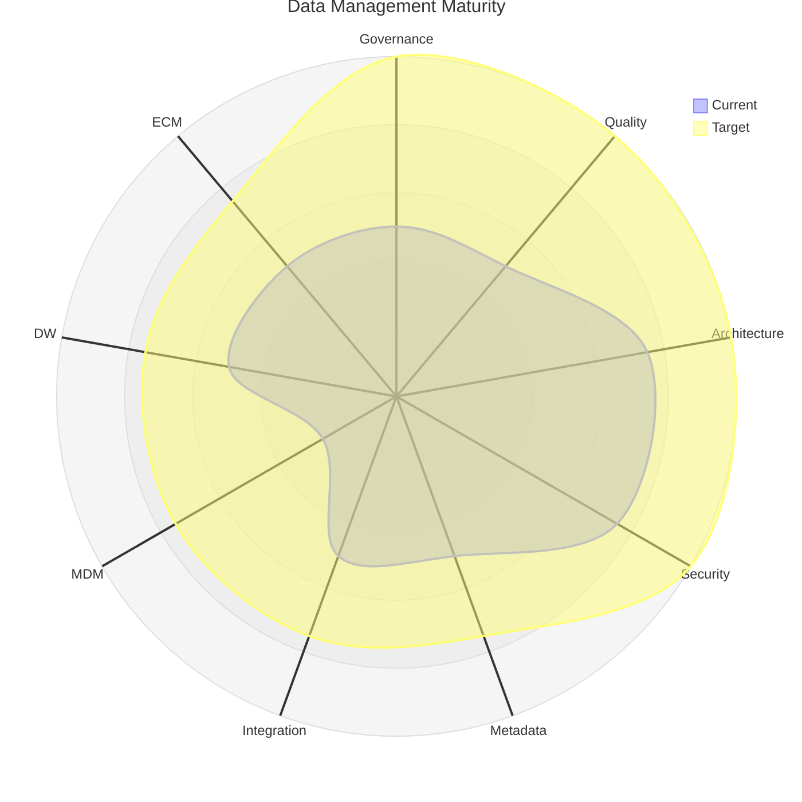
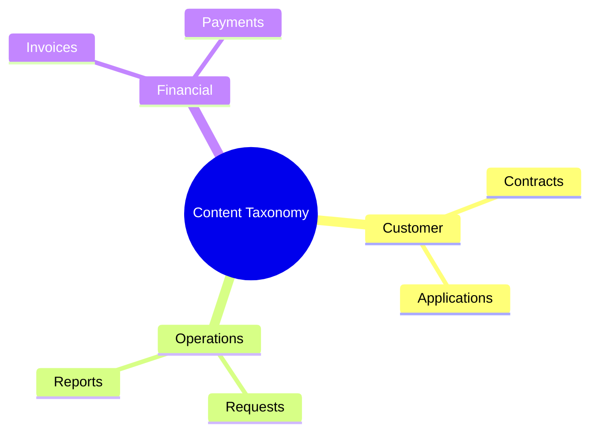
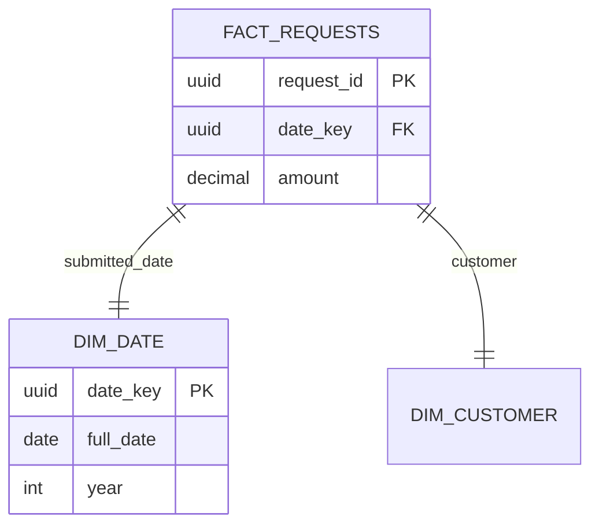

# Data Management Section Patterns (#229-287)

The largest section (59 documents) covering the full DMBOK scope. Organized into 8 sub-categories.

## Sub-category Breakdown

| Sub-category | Range | Count | Key Patterns |
|-------------|-------|-------|-------------|
| Governance Foundation | #229-236 | 8 | Charter, strategy, operating framework, policy, standards, glossary, stewardship, compliance |
| Data Architecture | #237-240 | 4 | EDM (Mermaid ER), architecture blueprint (4-layer Mermaid), data flow diagrams (context + L1), lineage |
| Data Modeling | #241-246 | 6 | CDM → LDM → PDM progression (each with Mermaid ER), dimensional model (star schema), modeling standards, review records |
| Database Operations | #247-252 | 6 | Runbook (daily/weekly/monthly tasks, SQL commands), backup/recovery (PITR procedures), capacity planning (24-month projections), HA/DR (Mermaid failover architecture), retention schedule, classification schema |
| Data Security | #253-258 | 6 | Access control (classification-driven), encryption (at rest/in transit/key mgmt), masking/anonymization (TypeScript examples), PIA (GDPR Art.35), breach response (72h deadline), security audit |
| Data Integration | #259-264 | 6 | Integration architecture (Mermaid), ETL/ELT (pipeline Mermaid + dbt), DIA (interface contracts), API data contract (JSON schemas), replication/sync (4 strategies), quality strategy (6 dimensions) |
| Data Quality | #265-269 | 5 | Profiling report (column-level stats), quality rules (18 rules across 3 entities), quality scorecard (6 dimensions), cleansing specification (pipeline Mermaid), issue log |
| Content & Master Data | #270-276 | 7 | ECM strategy (Mermaid mindmap), records retention, content taxonomy (Mermaid mindmap), MDM strategy (Mermaid architecture), reference data catalog, golden record (match/merge/survivorship rules), DW architecture (Mermaid) |
| Analytics & Metadata | #277-287 | 11 | BI semantic layer, report/dashboard catalog, metadata repository (Mermaid), data catalog (9 assets), metadata standards, maturity assessment (radar-beta Mermaid), asset valuation (ROI calculation), technology roadmap (Gantt), model scorecard, data virtualization, analytics governance |

## Key Diagram Patterns

### ER Diagrams — Data Models (CDM, LDM, PDM, EDM)

Progression: CDM (business entities, no tech details) → LDM (attributes, types, constraints) → PDM (PostgreSQL DDL, indexes, triggers)

### 4-Layer Architecture — Data Architecture Blueprint

### Radar Chart — Maturity Assessment

### Mindmap — Content Taxonomy & ECM

### Star Schema — Dimensional Model

## Template Conventions

- **SQL examples** — Include CREATE TABLE, indexes, triggers in PDM and database operations docs
- **TypeScript examples** — Include validation schemas (Zod), masking functions, factory patterns
- **JSON schemas** — Include full JSON Schema definitions for API data contracts
- **Mermaid ER diagrams** — Use for all data models (CDM, LDM, PDM, EDM, star schema)
- **Quality scorecards** — Include dimension × entity matrices with percentage scores
- **Retention tables** — Always include legal basis column for compliance
- **GDPR references** — Include Article numbers for privacy-related documents

## Document-by-Document Key Sections

| Document | Key Sections | Unique Element |
|---------|-------------|---------------|
| Data Governance Charter | Vision, objectives, scope, org chart | Mermaid org chart |
| Data Governance Strategy | 5 pillars, roadmap, metrics | Mermaid Gantt |
| Data Governance Operating Framework | RACI, processes, escalation | Decision rights matrix |
| Data Policy | 21 policy statements in 6 areas | Compliance violations table |
| Data Standards | Naming conventions, formats, classification, quality | ISO format standards |
| Business Glossary | Alphabetical terms | Domain ownership |
| Data Stewardship Assignment | Domain assignments, responsibilities | Mermaid stewardship model |
| Regulatory Compliance Register | GDPR requirements, compliance gaps | Article-by-article mapping |
| Enterprise Data Model | Full ER diagram (8+ entities) | Mermaid ER |
| Data Architecture Blueprint | 4-layer architecture | Mermaid flowchart |
| Data Flow Diagram | Context (L0) + L1 diagrams | Two Mermaid diagrams |
| Data Lineage Documentation | Entity lineage, transformations | Mermaid lineage flow |
| Conceptual Data Model | Business-level ER | No tech details |
| Logical Data Model | Attributes, types, constraints | Normalization verification |
| Physical Data Model | PostgreSQL DDL | CREATE TABLE SQL |
| Dimensional Model | Star schema | Fact + dimension tables |
| Data Modeling Standards | Naming, rules, types, checklist | Enforcement table |
| Data Model Review Records | Review process, register | Mermaid review flow |
| Database Operational Runbook | Daily ops, maintenance, troubleshooting | SQL commands |
| Backup & Recovery Plan | Strategy, PITR, verification | Bash backup scripts |
| Capacity Plan (Data) | Growth projections, scaling | 24-month projection table |
| HA/DR Configuration | Architecture, failover procedures | Mermaid HA architecture |
| Data Retention & Archival Policy | Retention schedule, disposal | Legal basis per type |
| Data Classification Schema | 4 levels (L1-L4), controls | Mermaid classification flow |
| Data Access Control Policy | Access by classification | Mermaid access request flow |
| Data Encryption Standards | At rest, in transit, key mgmt | Algorithm approval table |
| Data Masking/Anonymization Rules | 7 techniques, rules by element | TypeScript examples |
| Privacy Impact Assessment | Processing description, risks, rights | GDPR Article references |
| Data Breach Response Plan | 72h timeline, notification templates | GDPR Art.33/34 compliance |
| Data Security Audit Report | 5 control categories | Findings + recommendations |
| Data Integration Architecture | 5 patterns, integration points | Mermaid architecture |
| ETL/ELT Specification | Pipeline definitions, transformations | Mermaid pipeline + dbt |
| Data Interface Agreement | Interface register, DIAs | Responsibility matrix |
| API Data Contract | JSON schemas, validation | Full JSON Schema examples |
| Data Replication & Synchronization | 4 strategies, conflict resolution | Consistency check schedule |
| Data Quality Strategy | 6 dimensions, rules, scorecard | Mermaid quality flow |
| Data Profiling Report | Column-level statistics | Per-table profiling |
| Data Quality Rules | 18 rules across 3 entities | Implementation by layer |
| Data Quality Scorecard | 6 dimensions × 3 entities | Trend tables |
| Data Cleansing Specification | Cleansing rules, pipeline | Mermaid cleansing flow |
| Data Quality Issue Log | Issue register, metrics | Issue template |
| ECM Strategy | Content types, lifecycle, storage | Mermaid mindmap |
| Records Retention Schedule | 10 record types, disposal | Legal hold override |
| Content Classification & Taxonomy | Categories, metadata schema | Mermaid mindmap |
| MDM Strategy | 5 domains, match/merge rules | Mermaid MDM architecture |
| Reference Data Catalog | 8 reference data items | Detailed value tables |
| Golden Record Definition | Match/merge/survivorship rules | Confidence-based matching |
| Data Warehouse Architecture | 5 layers, ETL schedule | Mermaid DW architecture |
| BI Semantic Layer Definition | 8 metrics, 5 dimensions | Business-friendly names |
| Report & Dashboard Catalog | 6 reports + 4 dashboards | Access control by role |
| Metadata Repository | 3 metadata types | Mermaid metadata flow |
| Data Catalog | 9 data assets | Column-level details |
| Metadata Standards | 12 required elements | Naming conventions |
| Maturity Assessment | 9 domains scored | Mermaid radar chart |
| Data Asset Valuation | 4 methods, ROI calculation | Cost/benefit/risk values |
| Data Technology Roadmap | Current → target state | Mermaid Gantt |
| Data Model Scorecard | 4 quality dimensions × 4 models | Scoring criteria |
| Data Virtualization Specification | Virtual views, query routing | Mermaid architecture |
| Analytics Governance Policy | Metric governance, self-service | Access control by role |
