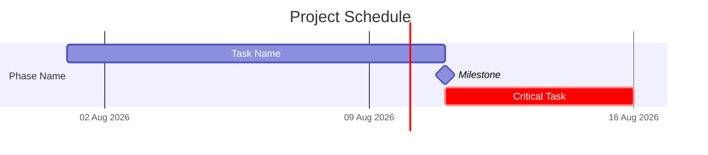

# Gantt Chart / Schedule Document Pattern

When user requests a dedicated Gantt Chart / Schedule document (not just Gantt embedded in other docs), create a standalone template with 7 Mermaid Gantt chart views.

## Required Gantt Views

1. **Full Project Gantt** — All activities with dependencies, milestones, critical path marked
2. **Phase Summary** — Executive view — phases at a glance
3. **Sprint-Level** — Team planning — planning/dev/review per sprint
4. **Resource Gantt** — Capacity management — who's allocated when
5. **Milestone Gantt** — Decision points — all milestones with critical path
6. **Critical Path** — Focus view — only critical path activities highlighted
7. **Legend + Export** — How to render + export to PNG/PDF/SVG

## Mermaid Gantt Syntax



Key syntax:
- `crit,` before task ID marks it as critical path
- `milestone,` creates zero-duration milestone
- `after task_id` creates dependency
- `tickInterval 1week` sets axis grid

## Export Instructions

Include in every Gantt document:

```bash
# Install Mermaid CLI
npm install -g @mermaid-js/mermaid-cli

# Export to PNG
mmdc -i schedule.mmd -o schedule.png

# Export to PDF
mmdc -i schedule.mmd -o schedule.pdf
```

## Compatibility Table

Always include:

| Viewer | Renders Mermaid? | Notes |
|--------|-----------------|-------|
| GitHub | ✅ Yes | Renders in markdown preview |
| Obsidian | ✅ Yes | Mermaid plugin built-in |
| VS Code | ✅ Yes | Mermaid extension required |
| GitLab | ✅ Yes | Renders in markdown |
| Confluence | ⚠️ Plugin | Mermaid plugin required |
