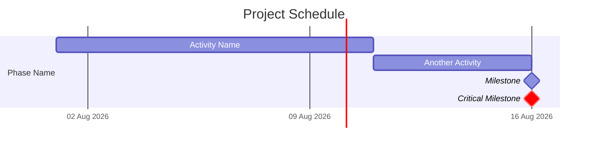
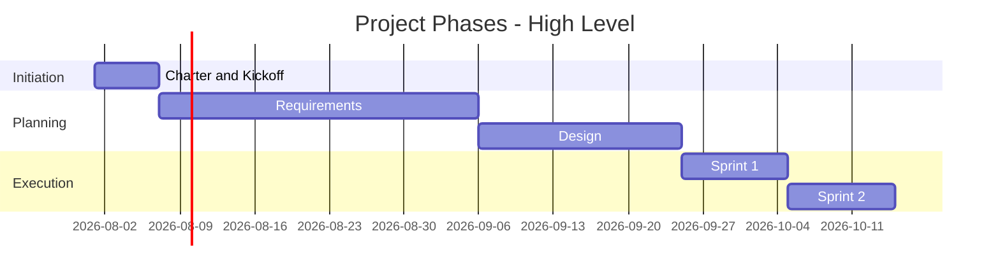
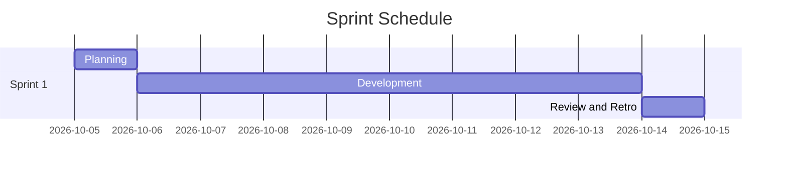
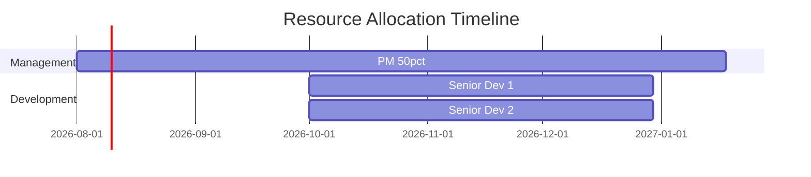
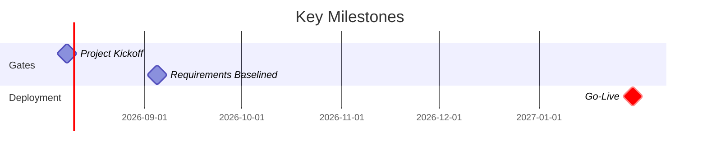
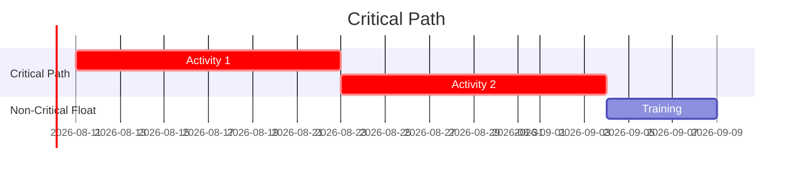
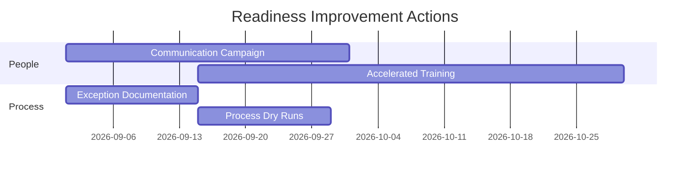

# Gantt Chart Patterns — Mermaid Reference

7 reusable Gantt chart patterns for project documents. All use Mermaid `gantt` syntax.

## 1. Full Project Gantt (All Activities)



Key patterns:
- `after task_id` for dependencies
- `milestone` for zero-duration events
- `crit` for critical path highlighting
- `tickInterval 1week` for weekly grid

## 2. Phase Summary (Executive View)



## 3. Sprint-Level Gantt



Pattern: Plan (1d) - Dev (8d) - Review (1d) per sprint

## 4. Resource Allocation Gantt



Pattern: Group by role category, show allocation in label

## 5. Milestone Gantt



Pattern: Group milestones by phase, crit on key decision points

## 6. Critical Path Gantt



Pattern: crit on all critical path activities, separate section for non-critical

## 7. Readiness Improvement Gantt



Pattern: Group by improvement category, show dependencies

## Export Commands

```bash
npm install -g @mermaid-js/mermaid-cli
mmdc -i diagram.mmd -o diagram.png
mmdc -i diagram.mmd -o diagram.svg
mmdc -i diagram.mmd -o diagram.pdf
```
