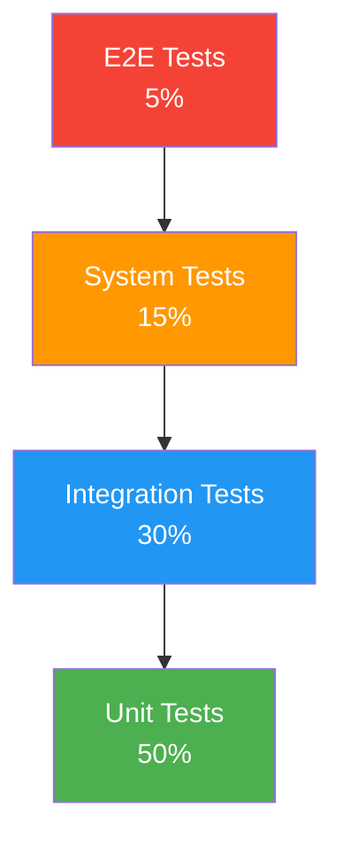
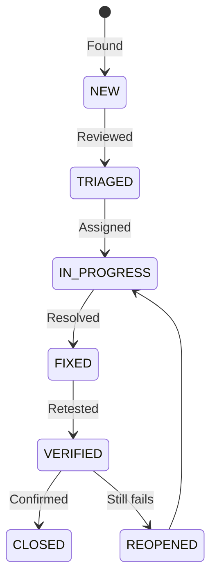
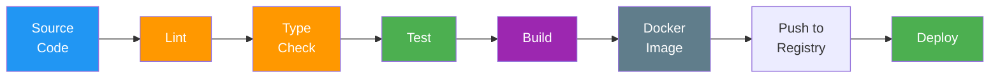
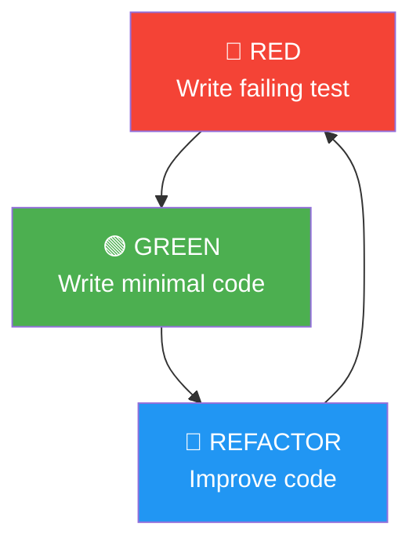

# Testing & Verification + Construction Section Patterns

## Testing & Verification (#184-193)

### Document Map

| # | Document | Level | Automation | Key Diagram |
|---|----------|-------|-----------|-------------|
| 184 | Test Plan | Planning | N/A | Gantt schedule |
| 185 | Test Strategy | Planning | N/A | Testing pyramid |
| 186 | Test Cases | Execution | 80% | Step tables |
| 187 | Test Suite | Organization | 100% | Suite hierarchy |
| 188 | Test Data | Support | N/A | Factory code |
| 189 | Test Scripts | Execution | 100% | Code samples |
| 190 | Defect Tracking | Tracking | N/A | State diagram |
| 191 | Regression Suite | Execution | 100% | Execution flow |
| 192 | Traceability | Verification | N/A | Matrix table |
| 193 | Test Report | Reporting | N/A | Results dashboard |

### Testing Pyramid Pattern

### Defect Lifecycle Pattern

### Test Case Table Pattern

| Step | Action | Expected Result | Actual Result | Status |
|------|--------|----------------|--------------|--------|
| 1 | [Action] | [Expected] | | ☐ |

### Severity/SLA Pattern

| Severity | Response Time | Resolution Time | Escalation |
|---------|-------------|----------------|-----------|
| 🔴 Critical | 1 hour | 4 hours | PM + Tech Lead |
| 🟡 High | 4 hours | 1 day | Tech Lead |
| 🟢 Medium | 1 day | 3 days | — |
| ⚪ Low | 3 days | Next sprint | — |

---

## Construction (#173-183)

### Document Map

| # | Document | Audience | Key Content |
|---|----------|---------|-------------|
| 173 | README | Developers | Setup, architecture, contributing |
| 174 | Coding Standards | Developers | Style, linting, naming |
| 175 | API Documentation | Developers + Consumers | OpenAPI spec, examples |
| 176 | Dependency Manifest | Security + DevOps | Versions, licenses, vulnerabilities |
| 177 | SBOM | Security + Compliance | Supply chain transparency |
| 178 | Code Review Records | Team | Findings, metrics, patterns |
| 179 | Commit Messages | Developers | Conventional Commits format |
| 180 | Static Analysis | CI/CD | Quality gates, thresholds |
| 181 | Build Scripts | DevOps | Pipeline, artifacts |
| 182 | Mock/Stub/Driver Specs | Developers | Test doubles |
| 183 | TDD Test Cases | Developers | Red-Green-Refactor |

### Build Pipeline Pattern

### TDD Cycle Pattern

### Conventional Commits Pattern

| Type | Description | Example |
|------|-----------|---------|
| feat | New feature | feat(request): add document upload |
| fix | Bug fix | fix(auth): resolve token refresh issue |
| docs | Documentation | docs(api): update endpoint descriptions |
| refactor | Code restructuring | refactor(service): extract validation logic |
| test | Add/update tests | test(request): add unit tests for approval |
| chore | Build, tooling | chore(deps): update dependencies |

### Quality Gates Pattern

| Gate | Tool | Threshold | Action on Fail |
|------|------|----------|---------------|
| Linting | ESLint | 0 errors | Block merge |
| Type Check | TypeScript | 0 errors | Block merge |
| Test Coverage | Jest | ≥ 80% | Block merge |
| Security | npm audit | 0 critical/high | Block merge |
