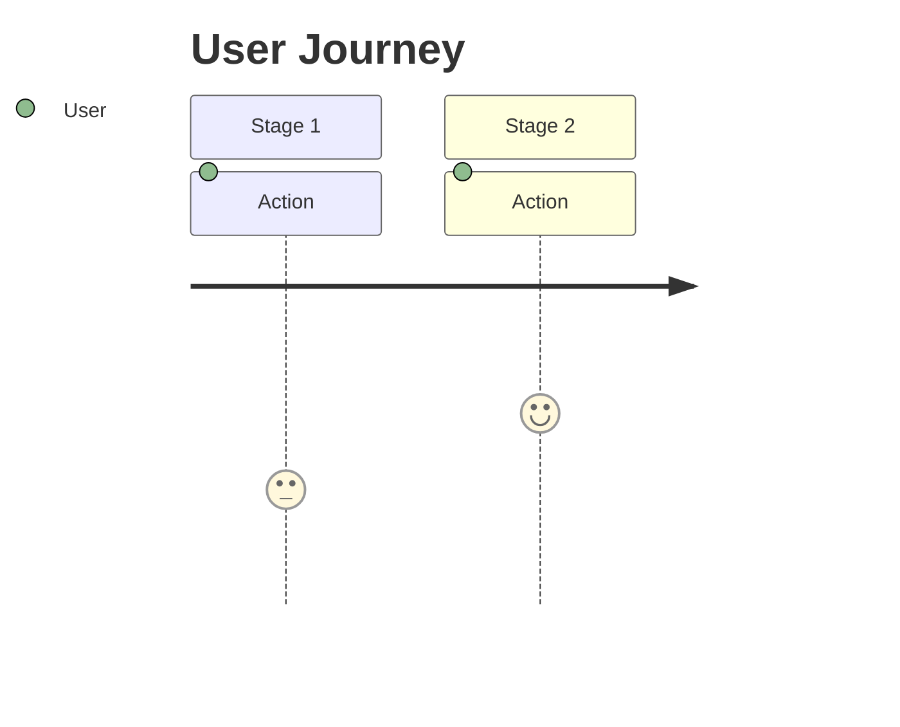
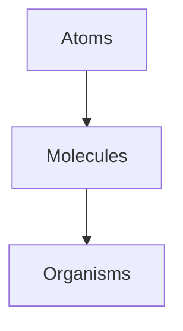

# UX/UI Template Patterns

## Template Structure Patterns by UX/UI Category

### Research Documents

**Pattern:** Data → Analysis → Insights → Recommendations

```
## 1. Research Summary (who, when, how many)
## 2. Research Objectives (what we wanted to learn)
## 3. Methodology (how we collected data)
## 4. Key Findings (what we learned — with quotes)
## 5. Analysis (affinity maps, SUS scores, heatmaps)
## 6. Recommendations (what to do about it)
## 7. Next Steps (iteration plan)
```

**Key elements:**
- Direct participant quotes in blockquotes
- Frequency counts ("10/12 participants mentioned")
- Severity ratings (🔴🟡🟢)
- Affinity maps using Mermaid flowcharts

### Persona Pattern

```
┌─────────────────────────────────────────┐
│  NAME                                    │
│  Age: XX | Role | Tech Savvy: Level     │
├─────────────────────────────────────────┤
│  📋 Bio                                  │
│  🎯 Goals (3-4)                          │
│  😤 Frustrations (3-4)                   │
│  💡 Needs (3-4)                          │
│  🔧 Tech Stack                           │
│  📊 Behavior Pattern                     │
└─────────────────────────────────────────┘
```

### Journey Map Pattern

Use Mermaid `journey` diagram:


Plus detailed table with: Stage | Touchpoint | Action | Emotion | Pain Point | Opportunity

### Wireframe Pattern (ASCII)

```
┌─────────────────────────────────────────┐
│  HEADER                                  │
├─────────────────────────────────────────┤
│  [Content area with box drawings]        │
│  ┌─────────┐ ┌─────────┐                │
│  │ Card 1  │ │ Card 2  │                │
│  └─────────┘ └─────────┘                │
├─────────────────────────────────────────┤
│  FOOTER                                  │
└─────────────────────────────────────────┘
```

Include both desktop and mobile variants.

### Design Token Pattern

```json
{
  "color": {
    "primary": { "value": "#2196F3" },
    "semantic": {
      "success": { "value": "#4CAF50" },
      "warning": { "value": "#FF9800" },
      "error": { "value": "#f44336" }
    }
  }
}
```

Plus CSS output example and token pipeline diagram (Mermaid flowchart).

### Component Library Pattern (Atomic Design)



Each component needs: Variant table, States table, Usage guidelines.

### Accessibility Audit Pattern

WCAG criteria in tables:
```
| # | WCAG Criterion | Level | Requirement | Status | Notes |
```

Categories: Perceivable, Operable, Understandable, Robust.

## Mermaid Diagram Types for UX/UI

| UX Need | Mermaid Type | Example |
|---------|-------------|---------|
| [User journey] | `journey` | Sarah's submission journey |
| [Sitemap] | `flowchart TD` | Page hierarchy |
| [User flow] | `flowchart TD` | Task completion flow |
| [IA structure] | `flowchart TD` | Information architecture |
| [Empathy map] | ASCII table | Says/Thinks/Does/Feels |
| [Component hierarchy] | `flowchart TD` | Atomic design levels |
| [Token pipeline] | `flowchart LR` | Figma → Style Dictionary → CSS |
| [Competitive analysis] | `quadrantChart` | Feature comparison |

## Design Tool Reference Convention

When a template references external design tools:

1. Add a prominent note at the top:
   ```
   > ⚠️ **Note:** [Visual type] are created in [Tool]. This document *specifies* — the actual [artifacts] live in the design tool.
   ```

2. Include a Design Tool Links table with URL and Version columns

3. For wireframes: provide ASCII layout + note "For pixel-perfect version, see Figma"

4. For prototypes: specify screens, interactions, and link to Figma prototype

5. For mockups: inventory all screens with status and Figma links
