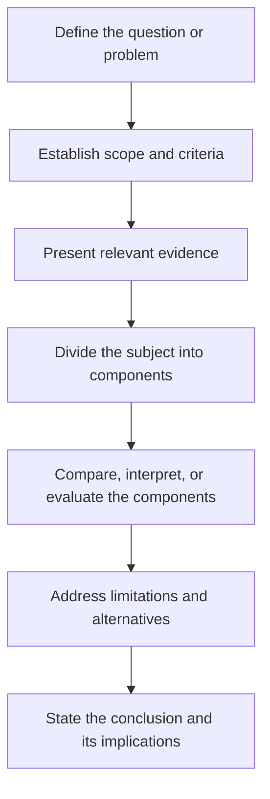

# Analytical Mode

> **Purpose:** to examine a subject by separating it into components and interpreting the relationships among them.

Analysis goes beyond presenting information. It identifies patterns, applies criteria, compares alternatives, evaluates causes, and explains significance. It is the "why does this work / why does this matter?" mode.

## When to Use It

- Interpret a text, work, or dataset
- Find the root cause of a problem
- Compare alternatives against explicit criteria
- Explain the significance of an observation

## Analysis vs. Summary

The single most common confusion in analytical writing is mistaking summary for analysis:

| Summary | Analysis |
|---|---|
| Retells what happened or what the text says | Explains what it means and why |
| Descriptive, chronological | Interpretive, causal |
| "The plot: X, then Y, then Z" | "The pacing reveals that X..." |
| Answers "what?" | Answers "how?" and "why?" |

## Core Characteristics

- A focused analytical question
- Explicit criteria or a conceptual framework
- Separation of evidence from interpretation
- Identification of patterns and relationships
- Consideration of alternative explanations
- A conclusion derived from the analysis

## Structure

A reliable analytical sequence:



## Key Techniques

### State the Analytical Question

Without a focused question, analysis becomes wandering description. Frame it first: "What explains the gap between X and Y?"

### Separate Evidence from Interpretation

Keep the reader able to distinguish *what you observed* from *what you infer from it*. Both are needed; neither should masquerade as the other.

### Name the Criteria

When evaluating, make the criteria explicit. "Strong" only means something against a stated standard.

### Consider Alternatives

Strong analysis tests its own conclusion against at least one rival explanation and explains why it survives.

## Example

> Although response time improved after caching was introduced, the error rate remained unchanged. This pattern suggests that processing capacity was a secondary constraint rather than the primary cause of failure.

## Common Pitfalls

- **Summarizing instead of analyzing:** retelling the data without interpreting it
- **Conclusion-first reasoning:** announcing the answer, then cherry-picking evidence
- **Hidden criteria:** evaluating without stating the standard
- **Ignoring counter-evidence:** not testing alternative explanations

## Quality Criterion

> The conclusion must follow logically from the evidence and stated criteria.

## Related

- [[Expository-Mode]]: analysis interprets what exposition presents
- [[Argumentative-Mode]]: analysis supplies the evidence argument needs
- [[01-Review-Writing-Guide]]: evaluation against criteria
- [[00-Writing-Types-Reference]]: the multidimensional model
- [[writing/00_knowledge/advance/tier-1-modes/00_overview|Tier 1 overview]]

## Template

> Copy this skeleton into a new note; name live files `YYYYMMDD-<slug>.md`. For evaluation of a work against criteria (a specific form of analysis), use [[review]].

```markdown
---
date: YYYY-MM-DD
tags: [writing, analytical]
---

# <The analytical question — the "why/how" being answered>

**Criteria / framework:** <the standard or lens applied>

## What I observed (evidence)
- <facts, quotes, data — keep interpretation OUT of this list>

## What it means (interpretation)
- <patterns, relationships, significance>

## Alternative explanation (steelman)
<the strongest rival reading, and why it doesn't hold>

## Conclusion
<what follows logically from the evidence and the criteria>
```

## Sources

- SUNY Potsdam, "Analytic Writing" (https://www.potsdam.edu/sites/default/files/AnalyticWriting.pdf)
- EssayPro, "How to Write an Analytical Essay" (https://essaypro.com/blog/how-to-write-analytical-essay)
