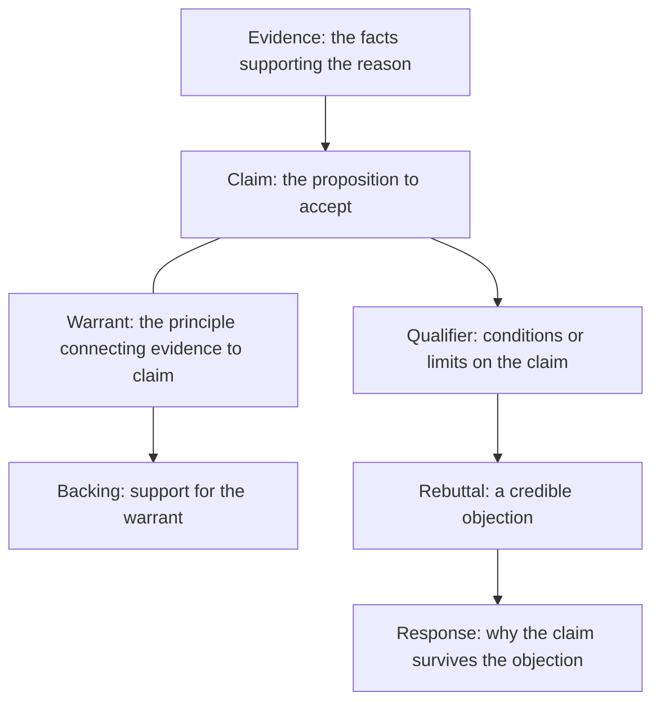

# Argumentative Mode

> **Purpose:** to establish that a claim is reasonable or preferable by using evidence and logical reasoning.

An argument is not a disagreement. It is a structured relationship among claims, reasons, evidence, assumptions, and responses to alternative positions. It is the "why should I accept this?" mode.

## When to Use It

- Establish a position on a debatable question
- Justify a recommendation with reasoning
- Respond to a counter-position fairly and completely

## The Toulmin Model

Stephen Toulmin's framework decomposes an argument into its moves:



| Component | Function | Example |
|---|---|---|
| Claim | The proposition to accept | "We should adopt automated accessibility testing." |
| Reason | Explanation supporting the claim | "Early detection reduces remediation costs." |
| Evidence | Information substantiating the reason | "Defect-fix cost rises ~10x after release." |
| Warrant | Principle linking evidence to claim | "Cheaper early fixes are preferable." |
| Qualifier | Limits under which the claim applies | "Where teams already have a CI pipeline..." |
| Counterargument | A credible alternative or objection | "Automation misses experiential issues." |
| Rebuttal | Response to that objection | "So pair automation with manual review." |

## Core Components

- **Claim:** the proposition the writer wants readers to accept
- **Reason:** the explanation supporting the claim
- **Evidence:** the information used to substantiate the reason
- **Warrant:** the principle connecting the evidence to the claim
- **Qualification:** the conditions or limits under which the claim applies
- **Counterargument:** a credible alternative or objection
- **Rebuttal:** the response to that counterargument

## Basic Structure

1. Introduce the issue
2. State a clear and qualified thesis
3. Define important terms and assumptions
4. Present reasons and supporting evidence
5. Address credible counterarguments
6. Explain why the evidence supports the conclusion
7. State the implications or recommended position

## Key Techniques

### Qualify the Claim

Absolute claims are easier to attack and usually false. A qualified claim ("under these conditions...") is both stronger and more honest.

### Steelman the Counterargument

Present the strongest version of the opposing view before rebutting it. A weak caricature of the opposition weakens your own credibility.

### Distinguish Evidence from Assumption

Make visible which of your premises are *supported* and which are *assumed*. Hidden assumptions are the most common site of a weak argument.

## Example

> The organization should introduce automated accessibility testing because early detection reduces remediation costs and prevents recurring interface defects. Automated testing cannot replace manual evaluation, but it can identify common violations during development.

## Common Pitfalls

- **Unqualified absolutes:** "always," "never," "clearly" without limits
- **Strawman counterarguments:** attacking a weakened version of the opposition
- **Hidden warrants:** reasoning that assumes an unstated and disputable principle
- **Confidence as evidence:** asserting strongly instead of supporting well

## Quality Criterion

> The strength of an argument depends on the quality of its evidence and reasoning, not the confidence of its language.

## Related

- [[Persuasive-Mode]]: argumentation's close but distinct cousin
- [[Analytical-Mode]]: analysis supplies the evidence
- [[07-Persuasive-Writing-Guide]]: argumentative essays and proposals
- [[00-Writing-Types-Reference]]: the multidimensional model
- [[writing/00_knowledge/advance/tier-1-modes/00_overview|Tier 1 overview]]

## Template

> Copy this skeleton into a new note; name live files `YYYYMMDD-<slug>.md`. Full fill-in master for the essay form (thesis -> evidence -> counterargument -> conclusion): [[persuasive]].

```markdown
---
date: YYYY-MM-DD
tags: [writing, argumentative]
---

# <Title — may state the thesis directly>

**Claim:** <the proposition to accept, qualified — someone could reasonably disagree>
**Reason:** <the explanation supporting the claim>
**Evidence:** <what substantiates the reason>
**Warrant:** <the principle connecting evidence to claim>
**Qualifier:** <conditions or limits under which the claim holds>

## Counterargument (steelman)
<the strongest opposing view, stated fairly>

## Rebuttal
<why the claim survives the objection>

## Implications
<what follows if the claim is accepted>
```

## Sources

- Purdue OWL, "Toulmin Argument" (https://owl.purdue.edu/owl/general_writing/academic_writing/historical_perspectives_on_argumentation/toulmin_argument.html)
- Writing Commons, "Guide to Toulmin Argument" (https://writingcommons.org/section/genre/argument-argumentation/toulmin-argument/)
