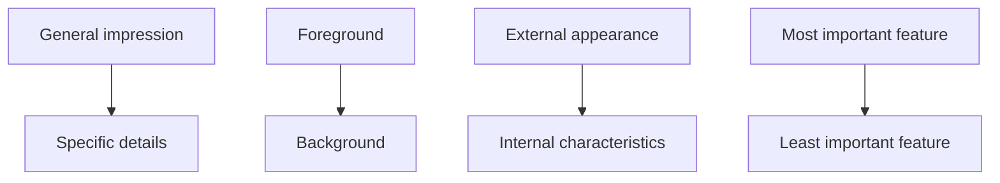

# Descriptive Mode

> **Purpose:** to represent a person, place, object, event, process, or condition through precise, well-chosen details.

Descriptive writing helps the reader *perceive* a subject: to see, hear, feel, taste, or smell it, or to understand its technical attributes. It is the "what is it like?" mode.

## When to Use It

Use description whenever the reader needs a concrete mental image before any other move can land. It rarely stands alone as a whole document; it usually *supports* a dominant mode:

- Set the scene for a narrative or review
- Define what a product or system looks like for a technical reader
- Establish a subject's qualities before analyzing or judging it
- Capture an observation, condition, or incident precisely

## Core Characteristics

- Precise nouns and verbs over vague ones
- Relevant sensory or technical details
- Clear spatial or logical organization
- Consistent point of view
- Selective detail: the details that matter, not every detail
- Figurative language only when it clarifies

## Structure

The ordering follows the reader's eye or the subject's logic:



## Key Techniques

### Show, Don't Tell

Actions and physical details reveal an inner state more vividly than naming it:

> **Tell:** She was nervous.
> **Show:** She gripped the table edge until her knuckles whitened.

The physical detail lets the reader *feel* the nervousness instead of being told about it.

### Appeal to Multiple Senses

Sight is the default, but layered senses make description immersive:

| Sense | Example |
|---|---|
| Sight | The amber indicator flashed at five-second intervals |
| Sound | The eastern rack emitted a continuous high-frequency tone |
| Touch | The server room held at a dry 24°C |
| Smell / taste | Rare in technical writing; common in food or travel description |

### Concrete Nouns and Precise Verbs

Replace category words with specific ones: "a sedan" beats "a car"; "the cable snapped" beats "the cable broke."

### Figurative Language, Sparingly

Metaphor, simile, and personification clarify by analogy but should *explain*, not decorate. A metaphor that only sounds nice adds nothing.

## Examples Across the Focus Areas

**Review:** "The keyboard's travel is shallow but crisp; each keystroke lands with a muted, tactile thock that makes long typing sessions feel effortless."

**Storytelling:** "The kitchen smelled of burnt sugar and rain. A single bulb swayed over the table, casting the room in slow, swinging light."

**Media script (AV two-column):**

| VIDEO | AUDIO |
|---|---|
| Close-up: hands opening the laptop, screen glow reflecting off the desk | The latch clicks, then a low fan whir rises |

## Common Pitfalls

- **Decorating instead of informing:** details chosen because they sound good, not because they help the reader understand
- **Exhaustive lists:** cataloging everything with no hierarchy of importance
- **Adjective stacking:** "a big, beautiful, amazing, wonderful room" says less than one concrete image
- **Mixed point of view:** jumping spatial or sensory positions without signal

## Quality Criterion

> The details should contribute to the reader's understanding rather than merely decorate the text.

## Related

- [[Narrative-Mode]]: description is narrative's texture
- [[Expository-Mode]]: descriptive detail supports technical explanation
- [[01-Review-Writing-Guide]]: sensory criteria in reviews
- [[02-Storytelling-Guide]]: setting and scene
- [[00-Writing-Types-Reference]]: the multidimensional model
- [[writing/00_knowledge/advance/tier-1-modes/00_overview|Tier 1 overview]]

## Template

> Copy this skeleton into a new note; name live files `YYYYMMDD-<slug>.md`. Description is a *supporting* mode, so it usually lives inside another form — full fill-in masters: [[review]] (evaluation detail), [[short-story]] (setting), [[media]] (shot description).

```markdown
---
date: YYYY-MM-DD
tags: [writing, descriptive]
---

# <Subject> — Description

**Dominant impression:** <the ONE quality this description must land>
**Vantage / point of view:** <where the observer stands — close, distant, moving>
**Audience & prior knowledge:** <who reads it, and what they already know>

## Sensory layers
- Sight: 
- Sound: 
- Touch / texture: 
- Smell / taste (only if relevant): 

## Order
<general -> specific | foreground -> background | left -> right | exterior -> interior | most -> least important>

## The telling detail
<the ONE concrete detail that carries the impression — the show-don't-tell anchor>

## Cut list
- <details that decorate but don't clarify — remove them>
```

## Sources

- Fiveable, "Descriptive Writing Techniques" (https://fiveable.me/lists/descriptive-writing-techniques)
- Reading Rockets, "Descriptive Writing" (https://www.readingrockets.org/classroom/classroom-strategies/descriptive-writing)
- Reedsy, "Show, Don't Tell" (https://reedsy.com/blog/show-dont-tell/)
