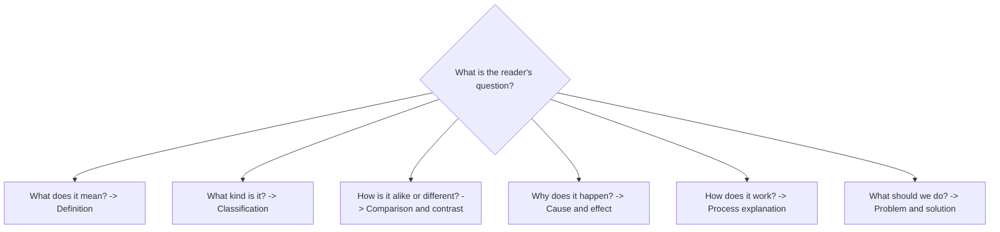

# Expository Mode

> **Purpose:** to inform, define, clarify, or explain a subject.

Expository writing is the "what does this mean?" mode. It emphasizes accuracy, organization, and comprehension. It relies on definitions, examples, classifications, comparisons, and causal explanations, and it keeps the author's opinion out.

## When to Use It

- Explain a concept, system, or process
- Define a term and its boundaries
- Document how something works or why something happens
- Provide background before an argument or evaluation

## Core Characteristics

- A clearly defined topic
- Logical organization
- Accurate terminology
- Relevant facts and examples
- Explicit relationships between ideas
- Limited unsupported opinion
- A tone suited to the audience

## Organizational Patterns

The strongest expository choice is the pattern that matches the reader's question:



| Pattern | Function |
|---|---|
| Definition | Explain the meaning and boundaries of a concept |
| Classification | Group items by shared characteristics |
| Comparison and contrast | Examine similarities and differences |
| Cause and effect | Explain why something occurs and what follows |
| Process explanation | Explain how something works |
| Problem and solution | Define a problem and evaluate responses |
| General to specific | Introduce a concept before presenting details |
| Known to unknown | Connect unfamiliar ideas to existing knowledge |

## Key Techniques

### Anchor the Unfamiliar to the Familiar

Explanations land fastest when a new idea is tied to something the reader already knows. Analogies and examples do this work.

### Define Terms Explicitly

A term must be defined the first time it appears, then used consistently thereafter. One term, one meaning.

### Sequence Known to Unknown

Lead with what the audience already understands, then move toward the new. Jumping straight to the abstract loses the reader.

## Example

> Version control is a system for recording changes to files over time. It allows contributors to examine previous versions, compare modifications, and coordinate work without manually maintaining multiple copies.

## Common Pitfalls

- **Losing the topic:** drifting into tangents that do not serve the explanation
- **Undefined jargon:** technical terms introduced without definition
- **Assumed knowledge:** skipping the known-to-unknown bridge
- **Opinion sneaking in:** evaluation disguised as explanation

## Quality Criterion

> Readers should understand the subject more accurately after reading than they did before.

## Related

- [[Analytical-Mode]]: exposition presents, analysis interprets
- [[Descriptive-Mode]]: concrete detail that supports explanation
- [[06-Expository-Writing-Guide]]: tech docs, journalism, explainers, academic writing
- [[00-Writing-Types-Reference]]: the multidimensional model
- [[writing/00_knowledge/advance/tier-1-modes/00_overview|Tier 1 overview]]

## Template

> Copy this skeleton into a new note; name live files `YYYYMMDD-<slug>.md`. Full fill-in masters (Technical Doc/Runbook, Inverted Pyramid, Explainer/Blog, Academic): [[expository]].

```markdown
---
date: YYYY-MM-DD
tags: [writing, expository]
---

# <The reader's actual question, as the title>

**Audience & prior knowledge:** <what they already know — the known-to-unknown bridge>
**Pattern:** definition | classification | compare/contrast | cause/effect | process | problem/solution

## Short answer
<the answer in 1–3 sentences, for skimmers>

## Explanation
<analogy first, then mechanism — sequence known to unknown>

## Example
<one concrete worked example>

## Gotchas
<nuance that would mislead if stated first>
```

## Sources

- LibreTexts, "Recognizing Patterns of Organization" (https://human.libretexts.org/)
- Quizgecko, "Expository Writing Patterns" (https://quizgecko.com/learn/expository-writing-patterns-causeeffect-sonpcd)
