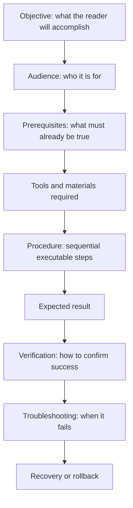

# Instructional Mode

> **Purpose:** to enable readers to complete a task safely and successfully.

Instructional writing is action-oriented. Its effectiveness is measured by whether the intended user can produce the expected result. It is the "how do I do this?" mode.

## When to Use It

- Teach a procedure, workflow, or operation
- Document a setup, installation, or configuration
- Guide a reader through a task with clear verification

## Core Characteristics

- A clearly stated outcome
- Defined prerequisites
- Sequential, executable steps
- Imperative verbs
- One primary action per step
- Necessary warnings before risky actions
- Expected results and verification criteria
- Troubleshooting guidance when appropriate

## Structure

A complete instructional document follows a task-based pattern:



## Key Techniques

### One Primary Action per Step

Each step should contain a single action the reader can execute and confirm. Bundling several actions into one step invites error.

### Imperative Verbs

Begin steps with a command: "Open," "Create," "Run," "Verify." This keeps instructions direct and executable.

### Warn Before, Not After

Place warnings *before* the risky action, so the reader sees the hazard before they reach it.

### Give Verification Criteria

Tell the reader what success looks like, so they can confirm they did it right rather than guess.

## Example

1. Open the repository directory.
2. Create a new branch from the latest `main` branch.
3. Edit the required Markdown file.
4. Run the documentation checks.
5. Review the generated output before committing the change.

## Common Pitfalls

- **Hidden assumptions:** the reader lacks a prerequisite the text never states
- **Multi-action steps:** several operations jammed into one step
- **Missing verification:** no way to know the task succeeded
- **No recovery path:** failure states with no rollback or troubleshooting

## Quality Criterion

> A qualified reader should be able to complete the task without relying on undocumented assumptions.

## Related

- [[Expository-Mode]]: instructional writing is exposition aimed at action
- [[06-Expository-Writing-Guide]]: technical documentation patterns
- [[03-Media-Script-Guide]]: scripts as time-based instruction
- [[00-Writing-Types-Reference]]: the multidimensional model
- [[writing/00_knowledge/advance/tier-1-modes/00_overview|Tier 1 overview]]

## Template

> Copy this skeleton into a new note; name live files `YYYYMMDD-<slug>.md`. Full fill-in master for the technical-doc/runbook form: [[expository]].

```markdown
---
date: YYYY-MM-DD
tags: [writing, instructional]
---

# <Task title>

**Objective:** <what the reader will accomplish>
**Audience & prerequisites:** <access, tools, versions needed before starting>
**Time:** ~X min

## Steps
1. <imperative verb + action — ONE primary action per step>
   Expected: <what success looks like>
2. ...

## Verification
<how to confirm the task succeeded>

## Troubleshooting
| Symptom | Cause | Fix |
|---|---|---|

## Recovery / rollback
<how to undo it if something fails>
```

## Sources

- Pressbooks, "Intro to Instructive Writing" (https://pressbooks.pub/hayleyinhighered/chapter/intro-to-instructive-writing/)
- Dargslan Publishing, "English for Technical Writing and Documentation" (https://www.dargslanpublishing.com/english-for-technical-writing-and-documentation/)
