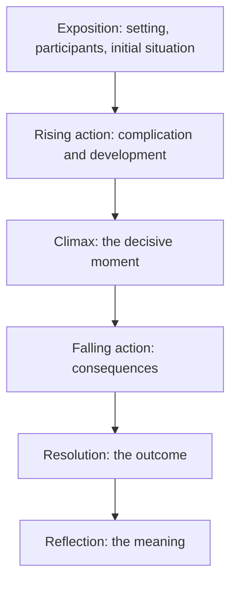

# Narrative Mode

> **Purpose:** to present events or experiences as a meaningful sequence.

Narrative writing connects events through time, causality, conflict, and change. It is the "then what happened?" mode. It may be factual (memoir, case study, incident timeline) or fictional (short story, novel, script).

## When to Use It

- Recount an experience, incident, or campaign
- Shape a true story around a point (case study, anecdote)
- Build a plot for fiction or script
- Give a review or argument a concrete through-line

## Core Characteristics

- A clear sequence of events
- Participants or characters
- A setting
- A point of view
- Conflict, tension, or a central problem
- Change, discovery, or resolution

## Structure

The classic dramatic arc is Freytag's Pyramid:



A six-part functional sequence captures the same movement:

1. **Orientation:** introduce the setting, participants, and initial situation
2. **Complication:** present the problem, conflict, or disruption
3. **Development:** show actions, consequences, and increasing tension
4. **Climax:** reach the decisive moment
5. **Resolution:** explain the outcome
6. **Reflection:** clarify the meaning or significance

## Key Concepts

### Causality, Not Just Chronology

A narrative is a chain of cause and effect, not a list of "and then." Each event should make the next one necessary or probable.

### Point of View

| Viewpoint | Effect |
|---|---|
| First person | Intimacy, limited knowledge, subjective |
| Second person | Direct address, instructional or immersive |
| Third limited | Follows one character's perspective closely |
| Third omniscient | Access to multiple minds and the whole scene |

### Conflict Drives Tension

Conflict is what the protagonist wants versus what obstructs it. Without a central problem there is no story, only a report.

## Examples Across the Focus Areas

**Incident timeline (technical narrative):**

> At 09:15, the monitoring system reported a sudden increase in failed requests. The operations team suspected a network fault, but the failure continued after traffic was rerouted. At 09:42, an engineer identified an incompatible database migration as the cause.

**Storytelling (memoir fragment):** "I had planned to spend the summer reading. Instead I spent it learning that a phone can go days without ringing and still matter."

## Common Pitfalls

- **Chronological list, not a story:** events with no causal thread
- **No central conflict:** a sequence that goes nowhere
- **Flat characters:** participants with no want, fear, or change
- **Telling instead of dramatizing:** summarizing the important moment rather than staging it

## Quality Criterion

> Events should form a meaningful causal sequence, not merely a chronological list.

## Related

- [[Descriptive-Mode]]: setting and texture
- [[Analytical-Mode]]: making sense of a narrative's parts
- [[02-Storytelling-Guide]]: eight story structures
- [[03-Media-Script-Guide]]: narrative poured into production formats
- [[00-Writing-Types-Reference]]: the multidimensional model
- [[writing/00_knowledge/advance/tier-1-modes/00_overview|Tier 1 overview]]

## Template

> Copy this skeleton into a new note; name live files `YYYYMMDD-<slug>.md`. Full fill-in masters (Standard Short Story, Flash Fiction, kishōtenketsu note): [[short-story]].

```markdown
---
date: YYYY-MM-DD
tags: [writing, narrative]
status: draft
---

# <Working title>

**Logline:** When <inciting incident>, <protagonist — one defining trait> must <goal>, or else <stakes>.
**POV / Tense:** first / third · past / present

## Arc beats
1. Orientation — setting, participants, the normal:
2. Complication — the problem or disruption:
3. Development — actions and rising tension, cause -> effect:
4. Climax — the decisive moment:
5. Resolution — the outcome:
6. Reflection — the meaning:

## Causality check
- [ ] Each event makes the next necessary or probable — not a list of "and then"
- [ ] A clear conflict drives the sequence
```

## Sources

- Writers.com, "Freytag's Pyramid" (https://writers.com/freytags-pyramid)
- Reedsy, "Story Structure: 7 Types" (https://reedsy.com/blog/guide/story-structure/)
